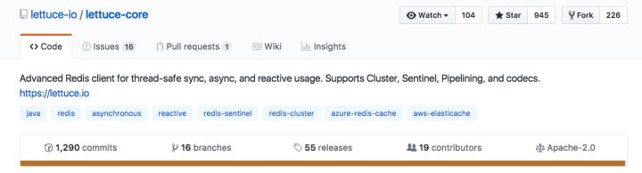
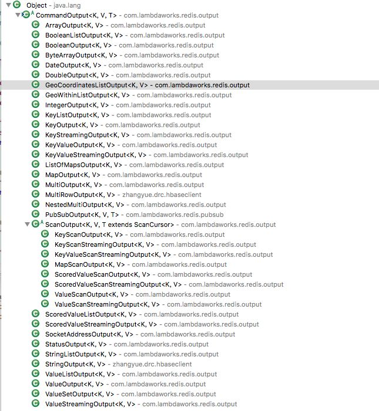

# redis lettuce 详解

最近在开发一个使用Redis协议包装HBase的Proxy服务器，一路写的很顺，客户端使用redis-py提供的execute_command方法也轻松搞定。但是在编写Java客户端的时候却遇到了难题，我们常用的Jedis不提供自定义指令，连反射这条路子都给堵死了，感觉陷入了僵局。难道需要自己改造Jedis的源代码么，代价有点大。

转念一想，Redis4.0插件化都出来了，有那么多的自定义指令，官方肯定有客户端的解决方案，果然，Lettuce【莴笋】冒出来了，945个Star，看来很受欢迎。



看Lettuce项目介绍，它是基于Netty开发的，提供了同步异步两种调用方法，支持Pipeline，也支持Redis Sentinel和Cluster，最重要的是它支持自定义指令。还在使用Java7以下的小伙伴们就要叹息了，Lettuce只支持Java8+，赶快升级吧。

好，我们来试试Lettuce，看看它好不好用，首先引入依赖

```xml
<dependency>
    <groupId>io.lettuce</groupId>
    <artifactId>lettuce-core</artifactId>
    <version>5.0.0.RELEASE</version>
</dependency>
```

再看看它的基本用法

```java
public class LettuceTest {

	public static void main(String[] args) {
		RedisClient client = RedisClient.create("redis://localhost:6379/0");
		StatefulRedisConnection<String, String> connection = client.connect(); // 获取一个连接
		RedisCommands<String, String> commands = connection.sync(); // 获取同步指令集
		commands.set("dream-codehole", "Yui Aragaki");
		System.out.println(commands.get("dream-codehole"));
		commands.zadd("dreams-codehole", 10, "Yui Aragaki");
		commands.zadd("dreams-codehole", 8, "Elane Zhong");
		System.out.println(commands.zcard("dreams-codehole"));
		connection.close(); // 关闭连接
		client.shutdown(); // 关闭所有连接
	}

}
```

好像和Jedis用法一样简单。Lettuce还支持异步用法，我们来看看异步怎么用。

```java
public class LettuceTest {

	public static void main(String[] args) {
		RedisClient client = RedisClient.create("redis://localhost:6379/0");
		StatefulRedisConnection<String, String> connection = client.connect(); // 获取一个连接
		RedisAsyncCommands<String, String> commands = connection.async(); // 获取异步指令集
		RedisFuture<String> future1 = commands.get("dream-codehole");
		future1.whenComplete((value, e) -> {
			System.out.println(value);
		});
		RedisFuture<Long> future2 = commands.zcard("dreams-codehole");
		future2.whenComplete((value, e) -> {
			System.out.println(value);
		});
		try {
			Thread.sleep(1000); // 等一会，保证结果在连接关闭之前都拿到了
		} catch (InterruptedException e1) {
		}
                connection.close();
		client.shutdown();
	}

}
```

使用也很简单，异步的结果都使用RedisFuture对象进行包装。RedisFuture对象提供了大量的回调方法，任君选择。注意关闭连接之前一定要等待一段时间，确保所有的指令都异步执行完了，否则你的回调方法会统一收到NULL。

在使用Redis一般不会只使用一个连接的，我们一般会使用连接池。Jedis提供了内置的JedisPool封装，拿来即用，内部使用的是Apache Commons提供的对象池来实现。Lettuce的连接池用起来也差不多。

```java
public class LettuceTest {

	public static void main(String[] args) throws Exception {
		RedisClient client = RedisClient.create("redis://localhost:6379/0");
		GenericObjectPool<StatefulRedisConnection<String, String>> pool = ConnectionPoolSupport
				.createGenericObjectPool(() -> client.connect(), new GenericObjectPoolConfig());
		try (StatefulRedisConnection<String, String> connection = pool.borrowObject()) {
			RedisCommands<String, String> commands = connection.sync();
			commands.set("dream-codehole", "Yui Aragaki");
			System.out.println(commands.get("dream-codehole"));
			commands.zadd("dreams-codehole", 10, "Yui Aragaki");
			commands.zadd("dreams-codehole", 8, "Elane Zhong");
			System.out.println(commands.zcard("dreams-codehole"));
		}
		pool.close();
		client.shutdown();
	}

}
```

接下来我们进入最精彩的部分，也是Lettuce区别于Jedis最大的部分，Lettuce提供了自定义指令接口。实现自定义指令需要提供3个东西。

1. 指令名称
2. 参数
3. 结果解码器

```java
public class HBaseClient {

	private RedisCommands<String, String> commands;
	private StringCodec codec = new StringCodec();

	public boolean create(String table, List<String> families) {
		CommandArgs<String, String> args = new CommandArgs<>(codec);
		args.add(table);
		args.addKeys(families);
		return commands.dispatch(HBaseCommand.CREATE, new BooleanOutput<String, String>(codec), args);
	}
}
```

create指令的的参数是一个字符串列表，表名和列簇的字符串定义，返回结果就是一个bool值。在redis协议中，客户端指令参数就是一个字符串列表，没有复杂的结构，但是返回结果却是可以任意嵌套的，可以具有无限的深度。对于大部分指令，Lettuce内置提供的很多Output解码器足以应付，不能应付的部分，Lettuce提供了扩展的接口可以自定义。



内置丰富的解码器

我们看到所有的解码器都是继承了CommandOutput接口，当我们想要自定义指令时，继承这个接口就可以了，然后在子类里实现你想要的任意复杂的解码逻辑。

继续阅读更多相关文章，请关注知乎专栏【码洞】


https://zhuanlan.zhihu.com/p/32348602