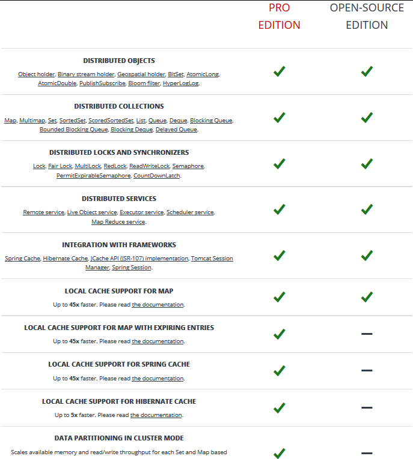
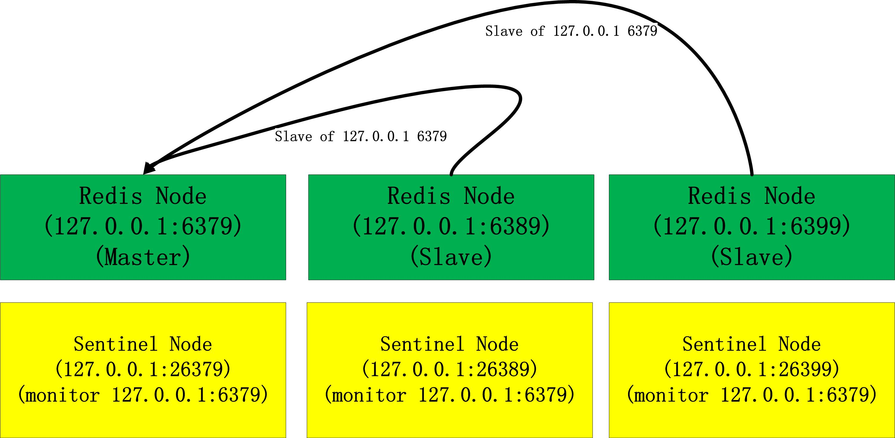
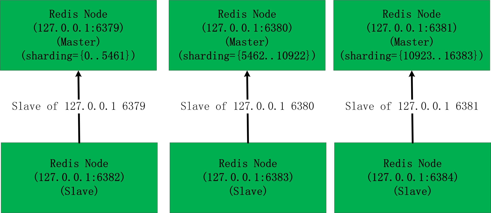
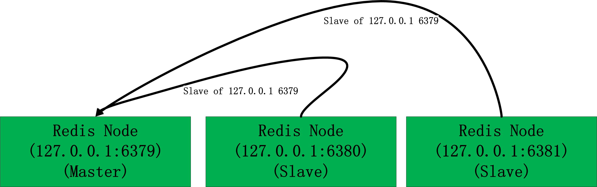
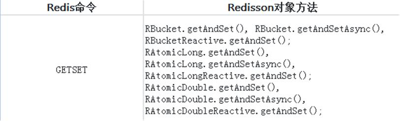
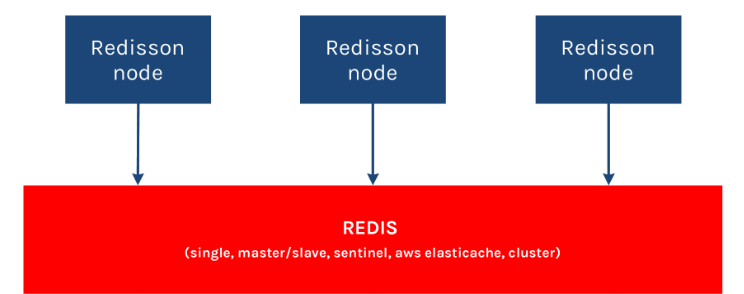

[TOC]


# redis客户端redisson实战

# 1.前言

​    Redisson是一个基于**java**编程框架**netty**进行扩展了的**redis**，想了解Redisson源码**首先你必须熟悉netty网络编程框架**。

​    Redisson目前分**开源版本**和**商业版(Redisson PRO)**,所以**选择的时候请谨慎**。**（Map）和集（Set）数据分片功能**仅限于Redisson PRO版本才有，另外**Redis部署工具和集群管理工具功能**仅限于Redisson PRO版本才有。关于商业版和开源版本的区别和商业版收费标准详见官网(<https://redisson.pro/>)  



 

# 2.maven项目集成redisson

​    根据自己JDK环境，JDK 1.8+以上请选择3.5.4版本，JDK 1.6+以上请选择2.10.4版本 

```xml
<!-- JDK 1.8+ compatible -->  
<dependency>  
   <groupId>org.redisson</groupId>  
   <artifactId>redisson</artifactId>  
   <version>3.5.4</version>  
</dependency>    
  
<!-- JDK 1.6+ compatible -->  
<dependency>  
   <groupId>org.redisson</groupId>  
   <artifactId>redisson</artifactId>  
   <version>2.10.4</version>  
</dependency>  
```

 

# 3.利用redisson API操作各种redis部署的服务端

​    redis的部署方式有单节点部署、哨兵方式部署、集群方式部署3种方式，这3中方式都使用的是原生的redis；

​    基于单节点部署为了保证数据的备份，一般会添加一个节点作为slave来备份master节点上的数据，这里就衍生出了主从部署方式；

​    云服务商像阿里云、微软云和亚马逊云都基于原生redis做了高可用部署，为了能连接云服务商的redis服务，这里redisson也提供了API操作方式。

​    下面以向redis服务端进行操作set key value为例进行说明如何使用redisson的API

 

##     3.1 单节点部署方式(standalone)


    (1)纯java操作

```java
//创建配置  
Config config = new Config();  
//指定使用单节点部署方式  
config.useSingleServer().setAddress("redis://127.0.0.1:6379");  
//创建客户端(发现这一非常耗时，基本在2秒-4秒左右)  
RedissonClient redisson = Redisson.create(config);  
  
//首先获取redis中的key-value对象，key不存在没关系  
RBucket<String> keyObject = redisson.getBucket("key");  
//如果key存在，就设置key的值为新值value  
//如果key不存在，就设置key的值为value  
keyObject.set("value");  
  
//最后关闭RedissonClient  
redisson.shutdown();  
```

​    (2)spring集成操作  

​    pom.xml

```xml
<!--redisson-->  
<dependency>  
    <groupId>org.redisson</groupId>  
    <artifactId>redisson</artifactId>  
    <version>2.10.4</version>  
</dependency>  
<!--spring-->  
<dependency>  
    <groupId>org.springframework</groupId>  
    <artifactId>spring-core</artifactId>  
    <version>4.2.8.RELEASE</version>  
</dependency>  
<dependency>  
    <groupId>org.springframework</groupId>  
    <artifactId>spring-beans</artifactId>  
    <version>4.2.8.RELEASE</version>  
</dependency>  
<dependency>  
    <groupId>org.springframework</groupId>  
    <artifactId>spring-context</artifactId>  
    <version>4.2.8.RELEASE</version>  
</dependency>  
```

​    spring-redisson.xml

```xml
<beans xmlns="http://www.springframework.org/schema/beans"  
    xmlns:xsi="http://www.w3.org/2001/XMLSchema-instance"   
    xmlns:context="http://www.springframework.org/schema/context"  
    xmlns:redisson="http://redisson.org/schema/redisson"  
    xsi:schemaLocation="  
       http://www.springframework.org/schema/beans  
       http://www.springframework.org/schema/beans/spring-beans.xsd  
       http://www.springframework.org/schema/context  
       http://www.springframework.org/schema/context/spring-context.xsd  
       http://redisson.org/schema/redisson  
       http://redisson.org/schema/redisson/redisson.xsd">  
    <redisson:client id="standalone" name="aliasName1,aliasName2">  
        <redisson:single-server address="redis://127.0.0.1:6379" />  
    </redisson:client>  
</beans>  
```

​    SpringRedissonTest.java

```java
import org.redisson.api.RBucket;  
import org.redisson.api.RedissonClient;  
import org.springframework.context.ApplicationContext;  
import org.springframework.context.support.ClassPathXmlApplicationContext;  
public class SpringRedissonTest {  
    public static void main(String[] args) {  
        ApplicationContext applicationContext = new ClassPathXmlApplicationContext("classpath:spring-redisson.xml");  
        RedissonClient redisson = (RedissonClient) applicationContext.getBean("standalone");  
        // 首先获取redis中的key-value对象，key不存在没关系  
        RBucket<String> keyObject = redisson.getBucket("key");  
        // 如果key存在，就设置key的值为新值value  
        // 如果key不存在，就设置key的值为value  
        keyObject.set("value");  
    }  
}  
```

 

## 3.2 哨兵部署方式(sentinel)


    (1)纯java操作

```java
//创建配置  
Config config = new Config();  
//指定使用哨兵部署方式  
config.useSentinelServers()  
    //设置sentinel.conf配置里的sentinel别名  
    //比如sentinel.conf里配置为sentinel monitor my-sentinel-name 127.0.0.1 6379 2,那么这里就配置my-sentinel-name  
    .setMasterName("my-sentinel-name")  
    //这里设置sentinel节点的服务IP和端口，sentinel是采用Paxos拜占庭协议，一般sentinel至少3个节点  
    //记住这里不是配置redis节点的服务端口和IP，sentinel会自己把请求转发给后面monitor的redis节点  
    .addSentinelAddress("redis://127.0.0.1:26379")  
    .addSentinelAddress("redis://127.0.0.1:26389")  
    .addSentinelAddress("redis://127.0.0.1:26399");  
  
//创建客户端(发现这一非常耗时，基本在2秒-4秒左右)  
RedissonClient redisson = Redisson.create(config);  
//首先获取redis中的key-value对象，key不存在没关系  
RBucket<String> keyObject = redisson.getBucket("key");  
//如果key存在，就设置key的值为新值value  
//如果key不存在，就设置key的值为value  
keyObject.set("value");  
  
//最后关闭RedissonClient  
redisson.shutdown();  
```

​    (2)spring集成操作

​    pom.xml

```
<!--redisson-->  
<dependency>  
    <groupId>org.redisson</groupId>  
    <artifactId>redisson</artifactId>  
    <version>2.10.4</version>  
</dependency>  
<!--spring-->  
<dependency>  
    <groupId>org.springframework</groupId>  
    <artifactId>spring-core</artifactId>  
    <version>4.2.8.RELEASE</version>  
</dependency>  
<dependency>  
    <groupId>org.springframework</groupId>  
    <artifactId>spring-beans</artifactId>  
    <version>4.2.8.RELEASE</version>  
</dependency>  
<dependency>  
    <groupId>org.springframework</groupId>  
    <artifactId>spring-context</artifactId>  
    <version>4.2.8.RELEASE</version>  
</dependency>  
```

​    spring-redisson.xml

```
<beans xmlns="http://www.springframework.org/schema/beans"  
    xmlns:xsi="http://www.w3.org/2001/XMLSchema-instance"   
    xmlns:context="http://www.springframework.org/schema/context"  
    xmlns:redisson="http://redisson.org/schema/redisson"  
    xsi:schemaLocation="  
       http://www.springframework.org/schema/beans  
       http://www.springframework.org/schema/beans/spring-beans.xsd  
       http://www.springframework.org/schema/context  
       http://www.springframework.org/schema/context/spring-context.xsd  
       http://redisson.org/schema/redisson  
       http://redisson.org/schema/redisson/redisson.xsd">  
<redisson:client id="sentinel">  
    <redisson:sentinel-servers master-name="my-sentinel-name">  
        <redisson:sentinel-address value="redis://127.0.0.1:26379" />  
        <redisson:sentinel-address value="redis://127.0.0.1:26389" />  
        <redisson:sentinel-address value="redis://127.0.0.1:26399" />  
    </redisson:sentinel-servers>  
</redisson:client>  
</beans>  
```

​    SpringRedissonTest.java

```
import org.redisson.api.RBucket;  
import org.redisson.api.RedissonClient;  
import org.springframework.context.ApplicationContext;  
import org.springframework.context.support.ClassPathXmlApplicationContext;  
public class SpringRedissonTest {  
    public static void main(String[] args) {  
        ApplicationContext applicationContext = new ClassPathXmlApplicationContext("classpath:spring-redisson.xml");  
        RedissonClient redisson = (RedissonClient) applicationContext.getBean("sentinel");  
        // 首先获取redis中的key-value对象，key不存在没关系  
        RBucket<String> keyObject = redisson.getBucket("key");  
        // 如果key存在，就设置key的值为新值value  
        // 如果key不存在，就设置key的值为value  
        keyObject.set("value");  
    }  
}  
```

 

##     3.3 集群方式(cluster)


    (1)纯java操作

```java
//创建配置  
Config config = new Config();  
//指定使用集群部署方式  
config.useClusterServers()  
    // 集群状态扫描间隔时间，单位是毫秒  
    .setScanInterval(2000)   
    //cluster方式至少6个节点(3主3从，3主做sharding，3从用来保证主宕机后可以高可用)  
    .addNodeAddress("redis://127.0.0.1:6379" )  
    .addNodeAddress("redis://127.0.0.1:6380")  
    .addNodeAddress("redis://127.0.0.1:6381")  
    .addNodeAddress("redis://127.0.0.1:6382")  
    .addNodeAddress("redis://127.0.0.1:6383")  
    .addNodeAddress("redis://127.0.0.1:6384");  
//创建客户端(发现这一非常耗时，基本在2秒-4秒左右)  
RedissonClient redisson = Redisson.create(config);  
  
//首先获取redis中的key-value对象，key不存在没关系  
RBucket<String> keyObject = redisson.getBucket("key");  
//如果key存在，就设置key的值为新值value  
//如果key不存在，就设置key的值为value  
keyObject.set("value");  
  
//最后关闭RedissonClient  
redisson.shutdown();  
```

​    (2)spring集成操作

​    pom.xml

```
<!--redisson-->  
<dependency>  
    <groupId>org.redisson</groupId>  
    <artifactId>redisson</artifactId>  
    <version>2.10.4</version>  
</dependency>  
<!--spring-->  
<dependency>  
    <groupId>org.springframework</groupId>  
    <artifactId>spring-core</artifactId>  
    <version>4.2.8.RELEASE</version>  
</dependency>  
<dependency>  
    <groupId>org.springframework</groupId>  
    <artifactId>spring-beans</artifactId>  
    <version>4.2.8.RELEASE</version>  
</dependency>  
<dependency>  
    <groupId>org.springframework</groupId>  
    <artifactId>spring-context</artifactId>  
    <version>4.2.8.RELEASE</version>  
</dependency>  
```

​    spring-redisson.xml

```
<beans xmlns="http://www.springframework.org/schema/beans"  
    xmlns:xsi="http://www.w3.org/2001/XMLSchema-instance"   
    xmlns:context="http://www.springframework.org/schema/context"  
    xmlns:redisson="http://redisson.org/schema/redisson"  
    xsi:schemaLocation="  
       http://www.springframework.org/schema/beans  
       http://www.springframework.org/schema/beans/spring-beans.xsd  
       http://www.springframework.org/schema/context  
       http://www.springframework.org/schema/context/spring-context.xsd  
       http://redisson.org/schema/redisson  
       http://redisson.org/schema/redisson/redisson.xsd">  
    <redisson:client id="cluster">  
        <redisson:cluster-servers>  
            <redisson:node-address value="redis://127.0.0.1:6379" />  
            <redisson:node-address value="redis://127.0.0.1:6380" />  
            <redisson:node-address value="redis://127.0.0.1:6381" />  
            <redisson:node-address value="redis://127.0.0.1:6382" />  
            <redisson:node-address value="redis://127.0.0.1:6383" />  
            <redisson:node-address value="redis://127.0.0.1:6384" />  
        </redisson:cluster-servers>  
    </redisson:client>  
</beans>  
```

​    SpringRedissonTest.java

```java
import org.redisson.api.RBucket;  
import org.redisson.api.RedissonClient;  
import org.springframework.context.ApplicationContext;  
import org.springframework.context.support.ClassPathXmlApplicationContext;  
public class SpringRedissonTest {  
    public static void main(String[] args) {  
        ApplicationContext applicationContext = new ClassPathXmlApplicationContext("classpath:spring-redisson.xml");  
        RedissonClient redisson = (RedissonClient) applicationContext.getBean("cluster");  
        // 首先获取redis中的key-value对象，key不存在没关系  
        RBucket<String> keyObject = redisson.getBucket("key");  
        // 如果key存在，就设置key的值为新值value  
        // 如果key不存在，就设置key的值为value  
        keyObject.set("value");  
    }  
}  
```

 

##     3.4 主从部署方式(master/slave)


    (1)纯java操作

```
//创建配置  
Config config = new Config();  
//指定使用主从部署方式  
config.useMasterSlaveServers()  
    //设置redis主节点  
    .setMasterAddress("redis://127.0.0.1:6379")  
    //设置redis从节点  
    .addSlaveAddress("redis://127.0.0.1:6380", "redis://127.0.0.1:6381");  
//创建客户端(发现这一非常耗时，基本在2秒-4秒左右)  
RedissonClient redisson = Redisson.create(config);  
  
//首先获取redis中的key-value对象，key不存在没关系  
RBucket<String> keyObject = redisson.getBucket("key");  
//如果key存在，就设置key的值为新值value  
//如果key不存在，就设置key的值为value  
keyObject.set("value");  
  
//最后关闭RedissonClient  
redisson.shutdown();  
```

​    (2)spring集成操作

​    pom.xml

```
<!--redisson-->  
<dependency>  
    <groupId>org.redisson</groupId>  
    <artifactId>redisson</artifactId>  
    <version>2.10.4</version>  
</dependency>  
<!--spring-->  
<dependency>  
    <groupId>org.springframework</groupId>  
    <artifactId>spring-core</artifactId>  
    <version>4.2.8.RELEASE</version>  
</dependency>  
<dependency>  
    <groupId>org.springframework</groupId>  
    <artifactId>spring-beans</artifactId>  
    <version>4.2.8.RELEASE</version>  
</dependency>  
<dependency>  
    <groupId>org.springframework</groupId>  
    <artifactId>spring-context</artifactId>  
    <version>4.2.8.RELEASE</version>  
</dependency>  
```

​    spring-redisson.xml

```
<beans xmlns="http://www.springframework.org/schema/beans"  
    xmlns:xsi="http://www.w3.org/2001/XMLSchema-instance"   
    xmlns:context="http://www.springframework.org/schema/context"  
    xmlns:redisson="http://redisson.org/schema/redisson"  
    xsi:schemaLocation="  
       http://www.springframework.org/schema/beans  
       http://www.springframework.org/schema/beans/spring-beans.xsd  
       http://www.springframework.org/schema/context  
       http://www.springframework.org/schema/context/spring-context.xsd  
       http://redisson.org/schema/redisson  
       http://redisson.org/schema/redisson/redisson.xsd">  
    <redisson:client id="masterSlave">  
        <redisson:master-slave-servers master-address="redis://127.0.0.1:6379">  
            <redisson:slave-address value="redis://127.0.0.1:6380" />  
            <redisson:slave-address value="redis://127.0.0.1:6381" />  
        </redisson:master-slave-servers>  
    </redisson:client>  
</beans>  
```

​    SpringRedissonTest.java

```
import org.redisson.api.RBucket;  
import org.redisson.api.RedissonClient;  
import org.springframework.context.ApplicationContext;  
import org.springframework.context.support.ClassPathXmlApplicationContext;  
public class SpringRedissonTest {  
    public static void main(String[] args) {  
        ApplicationContext applicationContext = new ClassPathXmlApplicationContext("classpath:spring-redisson.xml");  
        RedissonClient redisson = (RedissonClient) applicationContext.getBean("masterSlave");  
        // 首先获取redis中的key-value对象，key不存在没关系  
        RBucket<String> keyObject = redisson.getBucket("key");  
        // 如果key存在，就设置key的值为新值value  
        // 如果key不存在，就设置key的值为value  
        keyObject.set("value");  
    }  
}  
```

 

## 3.5 云托管部署方式

​    这种方式主要解决redis提供商为云服务的提供商的redis连接，比如亚马逊云的[AWS ElastiCache](http://docs.aws.amazon.com/AmazonElastiCache/latest/UserGuide/Replication.html)和微软云的[Azure Redis 缓存](https://azure.microsoft.com/zh-cn/services/cache/)

​    (1)纯java操作

```
Config config = new Config();  
config.useReplicatedServers()  
    // 主节点变化扫描间隔时间  
    .setScanInterval(2000)   
    //设置云服务商的redis服务IP和端口，目前支持亚马逊云的AWS ElastiCache和微软云的Azure Redis 缓存  
    .addNodeAddress("redis://123.57.221.104.1:6379")  
    .addNodeAddress("redis://123.57.221.105:6380")  
    .addNodeAddress("redis://123.57.221.106:6382");  
//创建客户端(发现这一非常耗时，基本在2秒-4秒左右)  
RedissonClient redisson = Redisson.create(config);  
  
//首先获取redis中的key-value对象，key不存在没关系  
RBucket<String> keyObject = redisson.getBucket("key");  
//如果key存在，就设置key的值为新值value  
//如果key不存在，就设置key的值为value  
keyObject.set("value");  
  
//最后关闭RedissonClient  
redisson.shutdown();  
```

​    (2)spring集成操作

​    pom.xml

```
<!--redisson-->  
<dependency>  
    <groupId>org.redisson</groupId>  
    <artifactId>redisson</artifactId>  
    <version>2.10.4</version>  
</dependency>  
<!--spring-->  
<dependency>  
    <groupId>org.springframework</groupId>  
    <artifactId>spring-core</artifactId>  
    <version>4.2.8.RELEASE</version>  
</dependency>  
<dependency>  
    <groupId>org.springframework</groupId>  
    <artifactId>spring-beans</artifactId>  
    <version>4.2.8.RELEASE</version>  
</dependency>  
<dependency>  
    <groupId>org.springframework</groupId>  
    <artifactId>spring-context</artifactId>  
    <version>4.2.8.RELEASE</version>  
</dependency>  
```

​    spring-redisson.xml

```
<beans xmlns="http://www.springframework.org/schema/beans"  
    xmlns:xsi="http://www.w3.org/2001/XMLSchema-instance"   
    xmlns:context="http://www.springframework.org/schema/context"  
    xmlns:redisson="http://redisson.org/schema/redisson"  
    xsi:schemaLocation="  
       http://www.springframework.org/schema/beans  
       http://www.springframework.org/schema/beans/spring-beans.xsd  
       http://www.springframework.org/schema/context  
       http://www.springframework.org/schema/context/spring-context.xsd  
       http://redisson.org/schema/redisson  
       http://redisson.org/schema/redisson/redisson.xsd">  
    <redisson:client id="cloud">  
        <redisson:replicated-servers>  
            <redisson:node-address value="redis://123.57.221.104:6379" />  
            <redisson:node-address value="redis://123.57.221.105:6380" />  
            <redisson:node-address value="redis://123.57.221.106:6381" />  
        </redisson:replicated-servers>  
    </redisson:client>  
</beans>  
```

​    SpringRedissonTest.java

```java
import org.redisson.api.RBucket;  
import org.redisson.api.RedissonClient;  
import org.springframework.context.ApplicationContext;  
import org.springframework.context.support.ClassPathXmlApplicationContext;  
public class SpringRedissonTest {  
    public static void main(String[] args) {  
        ApplicationContext applicationContext = new ClassPathXmlApplicationContext("classpath:spring-redisson.xml");  
        RedissonClient redisson = (RedissonClient) applicationContext.getBean("cloud");  
        // 首先获取redis中的key-value对象，key不存在没关系  
        RBucket<String> keyObject = redisson.getBucket("key");  
        // 如果key存在，就设置key的值为新值value  
        // 如果key不存在，就设置key的值为value  
        keyObject.set("value");  
    }  
}  
```

 

# 4.Redisson API与原生redis操作命令映射关系

​    redisson的客户端API操作和以前的jedis稍微不一样的是你首先得获取到某个操作的key-value对象，然后再对其进行操作，比如我想设置key=time，value=20171013这个string的key-value对象，那么从下表首先查询到SET对应的对象为：
    那么从API操作上你就需要首先获取到**RBucket**对象，然后调用其3个方法来分别执行set操作,以单节点部署方式举例如下：

```java
//创建配置  
Config config = new Config();  
//指定使用单节点部署方式  
config.useSingleServer().setAddress("redis://127.0.0.1:6379");  
//创建客户端(发现这一非常耗时，基本在2秒-4秒左右)  
RedissonClient redisson = Redisson.create(config);  
  
//首先获取redis中的key-value对象，key=time不存在没关系  
RBucket<String> keyObject = redisson.getBucket("time");  
//如果key=time存在，就设置key=time的值为新值20171013  
//如果key=time不存在，就设置key的值为20171013  
keyObject.set("20171013");  
  
//最后关闭RedissonClient  
redisson.shutdown();  
```

​    **至于其他的redis命令操作通过哪个对象去操作，你可以通过如下表格查询：**

| **Redis命令**     | **Redisson对象方法**                                         |
| ----------------- | ------------------------------------------------------------ |
| AUTH              | Config.setPassword();                                        |
| BITCOUNT          | RBitSet.cardinality(), RBitSet.cardinalityAsync(), RBitSetReactive.cardinality() |
| BITOP             | RBitSet.or(), RBitSet.orAsync(), RBitSetReactive.or(); RBitSet.and(), RBitSet.andAsync(), RBitSetReactive.and(); RBitSet.not(); RBitSet.xor(), RBitSet.xorAsync(), RBitSetReactive.xor() |
| BITPOS            | RBitSet.length(), RBitSet.lengthAsync(), RBitSetReactive.length() |
| BLPOP             | RBlockingQueue.take(), RBlockingQueue.takeAsync(), RBlockingQueueReactive.take(); RBlockingQueue.poll(), RBlockingQueue.pollAsync(), RBlockingQueueReactive.poll(); RBlockingQueue.pollFromAny(), RBlockingQueue.pollFromAnyAsync(), RBlockingQueueReactive.pollFromAny(); |
| BRPOP             | RBlockingDeque.takeLast(), RBlockingDeque.takeLastAsync(), RBlockingDequeReactive.takeLast(); |
| BRPOPLPUSH        | RBlockingQueue.pollLastAndOfferFirstTo(), RBlockingQueue.pollLastAndOfferFirstToAsync(), RBlockingQueueReactive.pollLastAndOfferFirstTo(); |
| CLIENT SETNAME    | Config.setClientName();                                      |
| CLUSTER INFO      | ClusterNode.info();                                          |
| CLUSTER KEYSLOT   | RKeys.getSlot(), RKeys.getSlotAsync(), RKeysReactive.getSlot(); |
| CLUSTER NODES     | Used in ClusterConnectionManager                             |
| DBSIZE            | RKeys.count(), RKeys.countAsync(), RKeysReactive.count();    |
| DECR              | RAtomicLong.decrementAndGet(), RAtomicLong.decrementAndGetAsync(), RAtomicLongReactive.decrementAndGetAsync(); |
| DEL               | RObject.delete(), RObject.deleteAsync(), RObjectReactive.delete(); RKeys.delete(), RKeys.deleteAsync(); |
| STRLEN            | RBucket.size(), RBucket.sizeAsync(), RBucketReactive.size(); |
| EVAL              | RScript.eval(), RScript.evalAsync(), RScriptReactive.eval(); |
| CLIENT REPLY      | RBatch.executeSkipResult();                                  |
| EVALSHA           | RScript.evalSha(), RScript.evalShaAsync(), RScriptReactive.evalSha(); |
| EXISTS            | RObject.isExists(), RObject.isExistsAsync(), RObjectReactive.isExists(); |
| FLUSHALL          | RKeys.flushall(), RKeys.flushallAsync(), RKeysReactive.flushall(); |
| FLUSHDB           | RKeys.flushdb(), RKeys.flushdbAsync(), RKeysReactive.flushdb(); |
| GEOADD            | RGeo.add(), RGeo.addAsync(), RGeoReactive.add();             |
| GEODIST           | RGeo.dist(), RGeo.distAsync(), RGeoReactive.dist();          |
| GEOHASH           | RGeo.hash(), RGeo.hashAsync(), RGeoReactive.hash();          |
| GEOPOS            | RGeo.pos(), RGeo.posAsync(), RGeoReactive.pos();             |
| GEORADIUS         | RGeo.radius(), RGeo.radiusAsync(), RGeoReactive.radius(); RGeo.radiusWithDistance(), RGeo.radiusWithDistanceAsync(), RGeoReactive.radiusWithDistance(); RGeo.radiusWithPosition(), RGeo.radiusWithPositionAsync(), RGeoReactive.radiusWithPosition(); |
| GEORADIUSBYMEMBER | RGeo.radius(), RGeo.radiusAsync(), RGeoReactive.radius(); RGeo.radiusWithDistance(), RGeo.radiusWithDistanceAsync(), RGeoReactive.radiusWithDistance(); RGeo.radiusWithPosition(), RGeo.radiusWithPositionAsync(), RGeoReactive.radiusWithPosition(); |
| GET               | RBucket.get(), RBucket.getAsync(), RBucketReactive.get();    |
| GETBIT            | RBitSet.get(), RBitSet.getAsync(), RBitSetReactive.get();    |
| GETSET            | RBucket.getAndSet(), RBucket.getAndSetAsync(), RBucketReactive.getAndSet(); RAtomicLong.getAndSet(), RAtomicLong.getAndSetAsync(), RAtomicLongReactive.getAndSet(); RAtomicDouble.getAndSet(), RAtomicDouble.getAndSetAsync(), RAtomicDoubleReactive.getAndSet(); |
| HDEL              | RMap.fastRemove(), RMap.fastRemoveAsync(), RMapReactive.fastRemove(); |
| HEXISTS           | RMap.containsKey(), RMap.containsKeyAsync(), RMapReactive.containsKey(); |
| HGET              | RMap.get(), RMap.getAsync(), RMapReactive.get();             |
| HSTRLEN           | RMap.valueSize(), RMap.valueSizeAsync(), RMapReactive.valueSize(); |
| HGETALL           | RMap.readAllEntrySet(), RMap.readAllEntrySetAsync(), RMapReactive.readAllEntrySet(); |
| HINCRBY           | RMap.addAndGet(), RMap.addAndGetAsync(), RMapReactive.addAndGet(); |
| HINCRBYFLOAT      | RMap.addAndGet(), RMap.addAndGetAsync(), RMapReactive.addAndGet(); |
| HKEYS             | RMap.readAllKeySet(), RMap.readAllKeySetAsync(), RMapReactive.readAllKeySet(); |
| HLEN              | RMap.size(), RMap.sizeAsync(), RMapReactive.size();          |
| HMGET             | RMap.getAll(), RMap.getAllAsync(), RMapReactive.getAll();    |
| HMSET             | RMap.putAll(), RMap.putAllAsync(), RMapReactive.putAll();    |
| HSET              | RMap.put(), RMap.putAsync(), RMapReactive.put();             |
| HSETNX            | RMap.fastPutIfAbsent(), RMap.fastPutIfAbsentAsync, RMapReactive.fastPutIfAbsent(); |
| HVALS             | RMap.readAllValues(), RMap.readAllValuesAsync(), RMapReactive.readAllValues(); |
| INCR              | RAtomicLong.incrementAndGet(), RAtomicLong.incrementAndGetAsync(), RAtomicLongReactive.incrementAndGet(); |
| INCRBY            | RAtomicLong.addAndGet(), RAtomicLong.addAndGetAsync(), RAtomicLongReactive.addAndGet(); |
| KEYS              | RKeys.findKeysByPattern(), RKeys.findKeysByPatternAsync(), RKeysReactive.findKeysByPattern(); RedissonClient.findBuckets(); |
| LINDEX            | RList.get(), RList.getAsync(), RListReactive.get();          |
| LLEN              | RList.size(), RList.sizeAsync(), RListReactive.Size();       |
| LPOP              | RQueue.poll(), RQueue.pollAsync(), RQueueReactive.poll();    |
| LPUSH             | RDeque.addFirst(), RDeque.addFirstAsync(); RDequeReactive.addFirst(), RDeque.offerFirst(), RDeque.offerFirstAsync(), RDequeReactive.offerFirst(); |
| LRANGE            | RList.readAll(), RList.readAllAsync(), RListReactive.readAll(); |
| LREM              | RList.fastRemove(), RList.fastRemoveAsync(), RList.remove(), RList.removeAsync(), RListReactive.remove(); RDeque.removeFirstOccurrence(), RDeque.removeFirstOccurrenceAsync(), RDequeReactive.removeFirstOccurrence(); RDeque.removeLastOccurrence(), RDeque.removeLastOccurrenceAsync(), RDequeReactive.removeLastOccurrence(); |
| LSET              | RList.fastSet(), RList.fastSetAsync(), RListReactive.fastSet(); |
| LTRIM             | RList.trim(), RList.trimAsync(), RListReactive.trim();       |
| LINSERT           | RList.addBefore(), RList.addBeforeAsync(), RList.addAfter(), RList.addAfterAsync(), RListReactive.addBefore(), RListReactive.addAfter(); |
| MGET              | RedissonClient.loadBucketValues();                           |
| MIGRATE           | RObject.migrate(), RObject.migrateAsync();                   |
| MOVE              | RObject.move(), RObject.moveAsync();                         |
| MSET              | RedissonClient.saveBuckets();                                |
| PERSIST           | RExpirable.clearExpire(), RExpirable.clearExpireAsync(), RExpirableReactive.clearExpire(); |
| PEXPIRE           | RExpirable.expire(), RExpirable.expireAsync(), RExpirableReactive.expire(); |
| PEXPIREAT         | RExpirable.expireAt(), RExpirable.expireAtAsync(), RExpirableReactive.expireAt(); |
| PFADD             | RHyperLogLog.add(), RHyperLogLog.addAsync(), RHyperLogLogReactive.add(); RHyperLogLog.addAll(), RHyperLogLog.addAllAsync(), RHyperLogLogReactive.addAll(); |
| PFCOUNT           | RHyperLogLog.count(), RHyperLogLog.countAsync(), RHyperLogLogReactive.count(); RHyperLogLog.countWith(), RHyperLogLog.countWithAsync(), RHyperLogLogReactive.countWith(); |
| PFMERGE           | RHyperLogLog.mergeWith(), RHyperLogLog.mergeWithAsync(), RHyperLogLogReactive.mergeWith(); |
| PING              | Node.ping(); NodesGroup.pingAll();                           |
| PSUBSCRIBE        | RPatternTopic.addListener();                                 |
| PTTL              | RExpirable.remainTimeToLive(), RExpirable.remainTimeToLiveAsync(), RExpirableReactive.remainTimeToLive(); |
| PUBLISH           | RTopic.publish                                               |
| PUNSUBSCRIBE      | RPatternTopic.removeListener();                              |
| RANDOMKEY         | RKeys.randomKey(), RKeys.randomKeyAsync(), RKeysReactive.randomKey(); |
| RENAME            | RObject.rename(), RObject.renameAsync(), RObjectReactive.rename(); |
| RENAMENX          | RObject.renamenx(), RObject.renamenxAsync(), RObjectReactive.renamenx(); |
| RPOP              | RDeque.pollLast(), RDeque.pollLastAsync(), RDequeReactive.pollLast(); RDeque.removeLast(), RDeque.removeLastAsync(), RDequeReactive.removeLast(); |
| RPOPLPUSH         | RDeque.pollLastAndOfferFirstTo(), RDeque.pollLastAndOfferFirstToAsync(); |
| RPUSH             | RList.add(), RList.addAsync(), RListReactive.add();          |
| SADD              | RSet.add(), RSet.addAsync(), RSetReactive.add();             |
| SCARD             | RSet.size(), RSet.sizeAsync(), RSetReactive.size();          |
| SCRIPT EXISTS     | RScript.scriptExists(), RScript.scriptExistsAsync(), RScriptReactive.scriptExists(); |
| SCRIPT FLUSH      | RScript.scriptFlush(), RScript.scriptFlushAsync(), RScriptReactive.scriptFlush(); |
| SCRIPT KILL       | RScript.scriptKill(), RScript.scriptKillAsync(), RScriptReactive.scriptKill(); |
| SCRIPT LOAD       | RScript.scriptLoad(), RScript.scriptLoadAsync(), RScriptReactive.scriptLoad(); |
| SDIFFSTORE        | RSet.diff(), RSet.diffAsync(), RSetReactive.diff();          |
| SELECT            | Config.setDatabase();                                        |
| SET               | RBucket.set(); RBucket.setAsync(); RBucketReactive.set();    |
| SETBIT            | RBitSet.set(); RBitSet.setAsync(); RBitSet.clear(); RBitSet.clearAsync(); |
| SETEX             | RBucket.set(); RBucket.setAsync(); RBucketReactive.set();    |
| SETNX             | RBucket.trySet(); RBucket.trySetAsync(); RBucketReactive.trySet(); |
| SISMEMBER         | RSet.contains(), RSet.containsAsync(), RSetReactive.contains(); |
| SINTERSTORE       | RSet.intersection(), RSet.intersectionAsync(), RSetReactive.intersection(); |
| SINTER            | RSet.readIntersection(), RSet.readIntersectionAsync(), RSetReactive.readIntersection(); |
| SMEMBERS          | RSet.readAll(), RSet.readAllAsync(), RSetReactive.readAll(); |
| SMOVE             | RSet.move(), RSet.moveAsync(), RSetReactive.move();          |
| SPOP              | RSet.removeRandom(), RSet.removeRandomAsync(), RSetReactive.removeRandom(); |
| SREM              | RSet.remove(), RSet.removeAsync(), RSetReactive.remove();    |
| SUBSCRIBE         | RTopic.addListener(), RTopicReactive.addListener();          |
| SUNION            | RSet.readUnion(), RSet.readUnionAsync(), RSetReactive.readUnion(); |
| SUNIONSTORE       | RSet.union(), RSet.unionAsync(), RSetReactive.union();       |
| TTL               | RExpirable.remainTimeToLive(), RExpirable.remainTimeToLiveAsync(), RExpirableReactive.remainTimeToLive(); |
| UNSUBSCRIBE       | RTopic.removeListener(), RTopicReactive.removeListener();    |
| ZADD              | RScoredSortedSet.add(), RScoredSortedSet.addAsync(), RScoredSortedSetReactive.add(); |
| ZCARD             | RScoredSortedSet.size(), RScoredSortedSet.sizeAsync(), RScoredSortedSetReactive.size(); |
| ZINCRBY           | RScoredSortedSet.addScore(), RScoredSortedSet.addScoreAsync(), RScoredSortedSetReactive.addScore(); |
| ZLEXCOUNT         | RLexSortedSet.lexCount(), RLexSortedSet.lexCountAsync(), RLexSortedSetReactive.lexCount();  RLexSortedSet.lexCountHead(), RLexSortedSet.lexCountHeadAsync(), RLexSortedSetReactive.lexCountHead(); RLexSortedSet.lexCountTail(), RLexSortedSet.lexCountTailAsync(), RLexSortedSetReactive.lexCountTail(); |
| ZRANGE            | RScoredSortedSet.valueRange(), RScoredSortedSet.valueRangeAsync(), RScoredSortedSetReactive.valueRange(); |
| ZREVRANGE         | RScoredSortedSet.valueRangeReversed(), RScoredSortedSet.valueRangeReversedAsync(), RScoredSortedSetReactive.valueRangeReversed(); |
| ZUNIONSTORE       | RScoredSortedSet.union(), RScoredSortedSet.unionAsync(), RScoredSortedSetReactive.union(); |
| ZINTERSTORE       | RScoredSortedSet.intersection(), RScoredSortedSet.intersectionAsync(), RScoredSortedSetReactive.intersection(); |
| ZRANGEBYLEX       | RLexSortedSet.lexRange(), RLexSortedSet.lexRangeAsync(), RLexSortedSetReactive.lexRange();  RLexSortedSet.lexRangeHead(), RLexSortedSet.lexRangeHeadAsync(), RLexSortedSetReactive.lexRangeHead(); RLexSortedSet.lexRangeTail(), RLexSortedSet.lexRangeTailAsync(), RLexSortedSetReactive.lexRangeTail(); |
| ZRANGEBYSCORE     | RScoredSortedSet.valueRange(), RScoredSortedSet.valueRangeAsync(), RScoredSortedSetReactive.valueRange();  RScoredSortedSet.entryRange(), RScoredSortedSet.entryRangeAsync(), RScoredSortedSetReactive.entryRange(); |
| TIME              | Node.time();                                                 |
| ZRANK             | RScoredSortedSet.rank(), RScoredSortedSet.rankAsync(), RScoredSortedSetReactive.rank(); |
| ZREM              | RScoredSortedSet.remove(), RScoredSortedSet.removeAsync(), RScoredSortedSetReactive.remove(); RScoredSortedSet.removeAll(), RScoredSortedSet.removeAllAsync(), RScoredSortedSetReactive.removeAll(); |
| ZREMRANGEBYLEX    | RLexSortedSet.removeRangeByLex(), RLexSortedSet.removeRangeByLexAsync(), RLexSortedSetReactive.removeRangeByLex();  RLexSortedSet.removeRangeHeadByLex(), RLexSortedSet.removeRangeHeadByLexAsync(), RLexSortedSetReactive.removeRangeHeadByLex(); RLexSortedSet.removeRangeTailByLex(), RLexSortedSet.removeRangeTailByLexAsync(), RLexSortedSetReactive.removeRangeTailByLex(); |
| ZREMRANGEBYLEX    | RScoredSortedSet.removeRangeByRank(), RScoredSortedSet.removeRangeByRankAsync(), RScoredSortedSetReactive.removeRangeByRank(); |
| ZREMRANGEBYSCORE  | RScoredSortedSet.removeRangeByScore(), RScoredSortedSet.removeRangeByScoreAsync(), RScoredSortedSetReactive.removeRangeByScore(); |
| ZREVRANGEBYSCORE  | RScoredSortedSet.entryRangeReversed(), RScoredSortedSet.entryRangeReversedAsync(), RScoredSortedSetReactive.entryRangeReversed(), RScoredSortedSet.valueRangeReversed(), RScoredSortedSet.valueRangeReversedAsync(), RScoredSortedSetReactive.valueRangeReversed(); |
| ZREVRANK          | RScoredSortedSet.revRank(), RScoredSortedSet.revRankAsync(), RScoredSortedSetReactive.revRank(); |
| ZSCORE            | RScoredSortedSet.getScore(), RScoredSortedSet.getScoreAsync(), RScoredSortedSetReactive.getScore(); |
| SCAN              | RKeys.getKeys(), RKeysReactive.getKeys();                    |
| SSCAN             | RSet.iterator(), RSetReactive.iterator();                    |
| HSCAN             | RMap.keySet().iterator(), RMap.values().iterator(), RMap.entrySet().iterator(), RMapReactive.keyIterator(), RMapReactive.valueIterator(), RMapReactive.entryIterator(); |
| ZSCAN             | RScoredSortedSet.iterator(), RScoredSortedSetReactive.iterator(); |

 

# 5.Redisson的同步和异步操作API

​    **Redisson框架提供的几乎所有对象都包含了同步和异步相互匹配的方法。这些对象都可以通过RedissonClient接口获取。同时还为大部分Redisson对象提供了满足异步流处理标准的程序接口RedissonReactiveClient。**

##     5.1 同步执行方式

```
// 同步执行方式  
RedissonClient client = Redisson.create(config);  
RAtomicLong longObject = client.getAtomicLong('myLong');  
longObject.compareAndSet(3, 401);  
```

 

##     5.2 异步执行方式

```
// 异步执行方式  
RedissonClient client = Redisson.create(config);  
RAtomicLong longObject = client.getAtomicLong('myLong');  
longObject.compareAndSetAsync(3, 401);  
```

 

##     5.3 异步流执行方式

```
// 异步流执行方式  
RedissonReactiveClient client = Redisson.createReactive(config);  
RAtomicLongReactive longObject = client.getAtomicLong('myLong');  
longObject.compareAndSet(3, 401);  
```

 

# 6.redisson支持的配置方式

##     6.1 直接操作程序API

​        Redisson程序化的配置方法是通过构建Config对象实例来实现的。例如：

```
Config config = new Config();  
config.setUseLinuxNativeEpoll(true);  
config.useClusterServers()  
      //可以用"rediss://"来启用SSL连接  
      .addNodeAddress("redis://127.0.0.1:7181");  
```

 

##     6.2 通过JSON文件配置

​        Redisson的配置文件可以是JSON格式。 可以通过调用Config.fromJSON方法并指定一个File实例来实现读取JSON格式的配置：

```
Config config = Config.fromJSON(new File("config-file.json"));  
RedissonClient redisson = Redisson.create(config);  
```

 

##     6.3 通过YAML文件配置

​        Redisson的配置文件可以是YAML格式。 可以通过调用config.fromYAML方法并指定一个File实例来实现读取YAML格式的配置：

```
Config config = Config.fromYAML(new File("config-file.yaml"));  
RedissonClient redisson = Redisson.create(config);  
```

 

##     6.4 通过Spring XML配置

​        Redisson为Spring框架提供了一套通过命名空间来配置实例的方式。一个Redisson的实例可以通过这样的方式来配置： 

```
<beans xmlns="http://www.springframework.org/schema/beans"  
    xmlns:xsi="http://www.w3.org/2001/XMLSchema-instance"   
    xmlns:context="http://www.springframework.org/schema/context"  
    xmlns:redisson="http://redisson.org/schema/redisson"  
    xsi:schemaLocation="  
       http://www.springframework.org/schema/beans  
       http://www.springframework.org/schema/beans/spring-beans.xsd  
       http://www.springframework.org/schema/context  
       http://www.springframework.org/schema/context/spring-context.xsd  
       http://redisson.org/schema/redisson  
       http://redisson.org/schema/redisson/redisson.xsd">  
<!-- 配置分类1：netty相关-->  
<!-- 配置分类2：redis服务端IP和端口-->  
<!-- 配置分类3：redisson客户端负载均衡-->  
<!-- 配置分类4：发布和订阅连接池配置-->  
<!-- 配置分类5：连接池配置-->  
<!-- 配置分类6：超时设置-->  
<!-- 配置分类7：失败重试配置-->  
<!-- 配置分类8：redis库和密码设置-->  
<!-- 配置分类9：SSL相关设置-->  
<!-- 配置分类10：特有的配置 -->  
<redisson:client>  
    <!-- 单节点部署方式  -->  
    <redisson:single-server ... />  
    <!-- 主从部署方式  -->  
    <redisson:master-slave-servers ... />  
    <!-- 哨兵部署方式 -->  
    <redisson:sentinel-servers ... />  
    <!-- 集群部署方式 -->  
    <redisson:cluster-servers ... />  
    <!-- 云部署方式 -->  
    <redisson:replicated-servers ... />  
</redisson:client>  
</beans>  
```

 

​    更多的使用方法请前往[第三方框架整合文档](https://github.com/redisson/redisson/wiki/14.-%E7%AC%AC%E4%B8%89%E6%96%B9%E6%A1%86%E6%9E%B6%E6%95%B4%E5%90%88/#141-spring%E6%A1%86%E6%9E%B6%E6%95%B4%E5%90%88)了解。 举例单节点redis的详细配置如下：

```
<beans xmlns="http://www.springframework.org/schema/beans"  
       xmlns:xsi="http://www.w3.org/2001/XMLSchema-instance"  
       xmlns:context="http://www.springframework.org/schema/context"  
       xmlns:redisson="http://redisson.org/schema/redisson"  
       xsi:schemaLocation="  
       http://www.springframework.org/schema/beans  
       http://www.springframework.org/schema/beans/spring-beans.xsd  
       http://www.springframework.org/schema/context  
       http://www.springframework.org/schema/context/spring-context.xsd  
       http://redisson.org/schema/redisson  
       http://redisson.org/schema/redisson/redisson.xsd">  
         
    <!-- 单Redis节点模式的配置 -->  
    <bean id="jsonJacksonCodec" class="org.redisson.codec.JsonJacksonCodec"></bean>  
    <bean id="defaultCodecProvider" class="org.redisson.codec.DefaultCodecProvider"></bean>  
    <bean id="defaultResolverProvider" class="org.redisson.liveobject.provider.DefaultResolverProvider"></bean>  
    <bean id="nioEventLoopGroup" class="io.netty.channel.nio.NioEventLoopGroup"></bean>  
      
    <bean id="defaultThreadFactory" class="io.netty.util.concurrent.DefaultThreadFactory">  
        <constructor-arg name="poolName" value="redisson"></constructor-arg>  
    </bean>  
    <bean id="executors" factory-method="newFixedThreadPool" class="java.util.concurrent.Executors">  
        <constructor-arg name="nThreads" value="50"></constructor-arg>  
        <constructor-arg ref="defaultThreadFactory"></constructor-arg>  
    </bean>  
      
    <redisson:client   
        id="standalone"  
        name="aliasName1,aliasName2"   
        threads="8"   
        netty-threads="8"   
        codec-ref="jsonJacksonCodec"  
        codec-provider-ref="defaultCodecProvider"   
        use-linux-native-epoll="false"  
        redisson-reference-enabled="true"  
        resolver-provider-ref="defaultResolverProvider"   
        executor-ref="executors"   
        event-loop-group-ref="nioEventLoopGroup" >  
    <redisson:single-server   
        address="redis://192.168.29.24:6379"     
        subscription-connection-minimum-idle-size="1"  
        subscriptions-per-connection="50"  
        subscription-connection-pool-size="50"  
        connection-minimum-idle-size="10"  
        connection-pool-size="64"  
        idle-connection-timeout="10000"  
        connect-timeout="10000"  
        timeout="3000"  
        ping-timeout="3000"  
        retry-attempts="3"  
        retry-interval="1500"  
        reconnection-timeout="3000"  
        failed-attempts="3"  
        database="0"  
        password=""  
        client-name=""  
        ssl-enable-endpoint-identification="true"  
        ssl-keystore=""  
        ssl-keystore-password=""  
        ssl-provider="JDK"  
        ssl-truststore=""  
        ssl-truststore-password=""  
        dns-monitoring="false"  
        dns-monitoring-interval="5000"/>  
    </redisson:client>  
</beans>  
```

 

 

# 7.redisson如何配置参数

​    redisson的配置参数很多，容易让人感觉疲乏，更恐怖的是针对每种部署方式，相关参数也不尽相同，但不管怎么变化，配置参数的归类就那么几个，初学者可以先记住配置参数的大致分类，然后针对每个分类下的不同参数有无进行对比总结，这样能方便理解，总结归类redisson的配置参数分类如下：

- **配置分类1：netty相关**
- **配置分类2：redis服务端IP和端口**
- **配置分类3：redisson客户端负载均衡**
- **配置分类4：发布和订阅连接池配置**
- **配置分类5：连接池配置**
- **配置分类6：超时设置**
- **配置分类7：失败重试配置**
- **配置分类8：redis库和密码设置**
- **配置分类9：SSL相关设置**
- **配置分类10：特有的配置**

​    前面已经知道如何简单的去操作redisson客户端来调用redis服务端，默认值设置了服务端相关的redis IP地址和端口，没有做过多设置，那么redisson有哪些方面设置，如何设置呢？

- ​    **因为redisson是基于java的网络编程框架netty实现，所以首先提供了暴露了netty相关配置参数；**
- ​    **redis服务端要么是单机要么是多机，那么这里必然存在主从相关设置；**
- ​    **redisson作为客户端，如果频繁去创建和关闭连接，那么性能必然大幅下降，那么这里必然有连接池相关配置；**
- ​    **考虑到安全相关，所以redis还需要有SSL相关设置；**
- ​    **后面还有客户端操作失败重试相关设置参数和根据不同部署的特殊配置；**

​    这里将各种部署方式的配置列表如下：

| 配置分类                   | 配置介绍                                                     |
| -------------------------- | ------------------------------------------------------------ |
| **netty相关**              | **以下参数主要影响redisson里面的netty网络编程框架，如果想了解更多建议去实际使用以下netty框架，在redisson里在常用配置参数环节有介绍：**配置参数配置介绍单节点主从哨兵集群云托管codec默认值: org.redisson.codec.JsonJacksonCodec√√√√√threads默认值: 当前处理核数量 * 2,这个线程池数量被所有RTopic对象监听器，RRemoteService调用者和RExecutorService任务共同共享。√√√√√nettyThreads默认值: 当前处理核数量 * 2,这个线程池数量是在一个Redisson实例内，被其创建的所有分布式数据类型和服务，以及底层客户端所一同共享的线程池里保存的线程数量。√√√√√executor单独提供一个用来执行所有RTopic对象监听器，RRemoteService调用者和RExecutorService任务的线程池(ExecutorService)实例。√√√√√eventLoopGroup用于特别指定一个EventLoopGroup. EventLoopGroup是用来处理所有通过Netty与Redis服务之间的连接发送和接受的消息。每一个Redisson都会在默认情况下自己创建管理一个EventLoopGroup实例。因此，如果在同一个JVM里面可能存在多个Redisson实例的情况下，采取这个配置实现多个Redisson实例共享一个EventLoopGroup的目的。只有io.netty.channel.epoll.EpollEventLoopGroup或io.netty.channel.nio.NioEventLoopGroup才是允许的类型。√√√√√useLinuxNativeEpoll默认值: false,如果服务器的绑定地址是本地回路网络接口(loopback interface)则自动激活一个UNIX域套接字。并同时采用epoll作为传输方式。请自行添加 netty-transport-native-epoll 依赖库。√√√√√ |
| **redis服务端IP和端口**    | 配置参数配置介绍单节点主从哨兵集群云托管address通过host:port的格式来指定节点地址。√　　　　masterAddress通过host:port的格式来指定主节点地址。　√　　　addSlaveAddress通过host:port的格式来指定从节点的地址。多个节点可以一次性批量添加。　√　　　addSentinelAddress通过host:port的格式来指定哨兵节点的地址。多个节点可以一次性批量添加。　　√　　addNodeAddress通过host:port的格式来添加Redis集群节点的地址。多个节点可以一次性批量添加。　　　√　nodeAddresses通过host:port的格式来指定云托管模式的多个Redis集群节点的地址。多个节点可以一次性批量添加。所有的主从节点必须在配置阶段全部体现出来。　　　　√ |
| **redisson客户端负载均衡** | 配置参数配置介绍单节点主从哨兵集群云托管scanInterval对主节点变化节点状态扫描的时间间隔。单位是毫秒。　　　√√readMode默认值： SLAVE（只在从服务节点里读取）  注：在从服务节点里读取的数据说明已经至少有两个节点保存了该数据，确保了数据的高可用性。  设置读取操作选择节点的模式。 可用值为： SLAVE - 只在从服务节点里读取。 MASTER - 只在主服务节点里读取。 MASTER_SLAVE - 在主从服务节点里都可以读取。　√√√√subscriptionMode　　√√√√loadBalancer默认值： org.redisson.connection.balancer.RoundRobinLoadBalancer  在使用多个Elasticache Redis服务节点的环境里，可以选用以下几种负载均衡方式选择一个节点： org.redisson.connection.balancer.WeightedRoundRobinBalancer - 权重轮询调度算法 org.redisson.connection.balancer.RoundRobinLoadBalancer - 轮询调度算法 org.redisson.connection.balancer.RandomLoadBalancer - 随机调度算法　√√√√ |
| **发布和订阅连接池配置**   | 配置参数配置介绍单节点主从哨兵集群云托管subscriptionConnectionMinimumIdleSize默认值：1  用于发布和订阅连接的最小保持连接数（长连接）。Redisson内部经常通过发布和订阅来实现许多功能。长期保持一定数量的发布订阅连接是必须的。√√√√√subscriptionsPerConnection默认值：50  用于发布和订阅连接的连接池最大容量。连接池的连接数量自动弹性伸缩。√√√√√subscriptionConnectionPoolSize默认值：50  多从节点的环境里，每个 从服务节点里用于发布和订阅连接的连接池最大容量。连接池的连接数量自动弹性伸缩。√√√√√ |
| **连接池配置**             | 配置参数配置介绍单节点主从哨兵集群云托管slaveConnectionMinimumIdleSize默认值：10  多从节点的环境里，每个 从服务节点里用于普通操作（非 发布和订阅）的最小保持连接数（长连接）。长期保持一定数量的连接有利于提高瞬时读取反映速度。　√√√√slaveConnectionPoolSize默认值：64  多从节点的环境里，每个 从服务节点里用于普通操作（非 发布和订阅）连接的连接池最大容量。连接池的连接数量自动弹性伸缩。　√√√√connectionMinimumIdleSize默认值：10  最小保持连接数（长连接）。长期保持一定数量的连接有利于提高瞬时写入反应速度。√　　　　connectionPoolSize默认值：64  连接池最大容量。连接池的连接数量自动弹性伸缩。√　　　　masterConnectionMinimumIdleSizemasterConnectionMinimumIdleSize（主节点最小空闲连接数）  默认值：10  多从节点的环境里，每个 主节点的最小保持连接数（长连接）。长期保持一定数量的连接有利于提高瞬时写入反应速度。　√√√√masterConnectionPoolSize默认值：64  主节点的连接池最大容量。连接池的连接数量自动弹性伸缩。　√√√√idleConnectionTimeout默认值：10000  如果当前连接池里的连接数量超过了最小空闲连接数，而同时有连接空闲时间超过了该数值，那么这些连接将会自动被关闭，并从连接池里去掉。时间单位是毫秒。√√√√√ |
| **超时设置**               | 配置参数配置介绍单节点主从哨兵集群云托管connectTimeout默认值：10000  同节点建立连接时的等待超时。时间单位是毫秒。√√√√√timeout默认值：3000  等待节点回复命令的时间。该时间从命令发送成功时开始计时。√√√√√ |
| **失败重试配置**           | 配置参数配置介绍单节点主从哨兵集群云托管retryAttempts默认值：3  如果尝试达到 retryAttempts（命令失败重试次数） 仍然不能将命令发送至某个指定的节点时，将抛出错误。如果尝试在此限制之内发送成功，则开始启用 timeout（命令等待超时） 计时。√√√√√retryInterval默认值：1500  在一条命令发送失败以后，等待重试发送的时间间隔。时间单位是毫秒。√√√√√reconnectionTimeout默认值：3000  当与某个节点的连接断开时，等待与其重新建立连接的时间间隔。时间单位是毫秒。√√√√√failedAttempts默认值：3  在某个节点执行相同或不同命令时，连续 失败 failedAttempts（执行失败最大次数） 时，该节点将被从可用节点列表里清除，直到 reconnectionTimeout（重新连接时间间隔） 超时以后再次尝试。√√√√√ |
| **redis库和密码设置**      | 配置参数配置介绍单节点主从哨兵集群云托管database默认值：0  尝试连接的数据库编号。√√√√√password默认值：null  用于节点身份验证的密码。√√√√√clientName默认值：null  在Redis节点里显示的客户端名称。√√√√√ |
| **SSL相关设置**            | 配置参数配置介绍单节点主从哨兵集群云托管sslEnableEndpointIdentification默认值：true  开启SSL终端识别能力。√√√√√sslProvider默认值：JDK  确定采用哪种方式（JDK或OPENSSL）来实现SSL连接。√√√√√sslTruststore默认值：null  指定SSL信任证书库的路径。√√√√√sslTruststorePassword默认值：null  指定SSL信任证书库的密码。√√√√√sslKeystore默认值：null  指定SSL钥匙库的路径。√√√√√sslKeystorePassword默认值：null  指定SSL钥匙库的密码。√√√√√ |
| **特有的配置**             | 配置参数配置介绍单节点主从哨兵集群云托管dnsMonitoring默认值：false  在启用该功能以后，Redisson将会监测DNS的变化情况。√　　　　dnsMonitoringInterval默认值：5000  监测DNS的变化情况的时间间隔。√　　　　masterName主服务器的名称是哨兵进程中用来监测主从服务切换情况的。　　√ |

 

# 8. 单个集合数据分片(有Redisson PRO版本限制)

​    目前支持的数据结构类型包括**Set和Map**.**该功能仅限于Redisson PRO版本**。

​    参见<https://github.com/redisson/redisson/wiki>。

 

# 9.分布式对象

​    包含通用对象桶（Object Bucket）、二进制流（Binary Stream）、地理空间对象桶（Geospatial Bucket）、BitSet、原子整长形（AtomicLong）、原子双精度浮点数（AtomicDouble）、话题（订阅分发）、模糊话题、布隆过滤器（Bloom Filter）、基数估计算法（HyperLogLog）。

​    参见<https://github.com/redisson/redisson/wiki>。

 

# 10.分布式集合(有Redisson PRO版本限制)

​    包含映射（Map）、映射（Map）、多值映射（Multimap）、集（Set）、有序集（SortedSet）、计分排序集（ScoredSortedSet）、字典排序集（LexSortedSet）、列表（List）、列队（Queue）、双端队列（Deque）、阻塞队列（Blocking Queue）、有界阻塞列队（Bounded Blocking Queue）、阻塞双端列队（Blocking Deque）、阻塞公平列队（Blocking Fair Queue）、延迟列队（Delayed Queue）、优先队列（Priority Queue）、优先双端队列（Priority Deque）。

​    **其中映射（Map）和集（Set）功能仅限于Redisson PRO版本**。

​    参见<https://github.com/redisson/redisson/wiki>。

 

# 11.分布式锁（Lock）和同步器（Synchronizer）

​    包含可重入锁（Reentrant Lock）公平锁（Fair Lock）联锁（MultiLock）红锁（RedLock）读写锁（ReadWriteLock）信号量（Semaphore）可过期性信号量（PermitExpirableSemaphore）闭锁（CountDownLatch）。

​    参见<https://github.com/redisson/redisson/wiki>。

 

# 12.分布式服务

​    包含分布式远程服务（Remote Service）、分布式实时对象（Live Object）服务、分布式执行服务（Executor Service）、分布式调度任务服务（Scheduler Service）、分布式映射归纳服务（MapReduce）。

​    参见<https://github.com/redisson/redisson/wiki>。

 

# 13.额外功能

​    包含对Redis节点的操作、复杂多维对象结构和对象引用的支持、命令的批量执行、脚本执行、底层Redis客户端。

​    参见<https://github.com/redisson/redisson/wiki>。

 

# 14.独立节点模式




​    Redisson Node指的是Redisson在分布式运算环境中作为独立节点运行的一种模式。Redisson Node的功能可以用来执行通过[分布式执行服务](https://github.com/redisson/redisson/wiki/9.-%E5%88%86%E5%B8%83%E5%BC%8F%E6%9C%8D%E5%8A%A1#93-%E5%88%86%E5%B8%83%E5%BC%8F%E6%89%A7%E8%A1%8C%E6%9C%8D%E5%8A%A1executor-service)或[分布式调度执行服务](https://github.com/redisson/redisson/wiki/9.-%E5%88%86%E5%B8%83%E5%BC%8F%E6%9C%8D%E5%8A%A1#94-%E5%88%86%E5%B8%83%E5%BC%8F%E8%B0%83%E5%BA%A6%E4%BB%BB%E5%8A%A1%E6%9C%8D%E5%8A%A1scheduler-service)发送的远程任务，也可以用来为[分布式远程服务](https://github.com/redisson/redisson/wiki/9.-%E5%88%86%E5%B8%83%E5%BC%8F%E6%9C%8D%E5%8A%A1#91-%E5%88%86%E5%B8%83%E5%BC%8F%E8%BF%9C%E7%A8%8B%E6%9C%8D%E5%8A%A1remote-service)提供远端服务。 所有这些功能全部包含在一个JAR包里，您可以从[这里](https://repository.sonatype.org/service/local/artifact/maven/redirect?r=central-proxy&g=org.redisson&a=redisson-all&v=2.3.0&e=jar)下载.。

​    参见<https://github.com/redisson/redisson/wiki>。

 

# 15.工具(**有Redisson PRO版本限制**)

​    包含Redis部署工具、集群管理工具。

​    **其中Redis部署工具和集群管理工具功能仅限于Redisson PRO版本**。

​    参见<https://github.com/redisson/redisson/wiki>。

 

# 16.第三方框架整合

​    包含Spring框架整合、Spring Cache整合、Hibernate整合、Java缓存标准规范JCache API (JSR-107）、Tomcat会话管理器（Tomcat Session Manager）、Spring Session会话管理器。

​    参见<https://github.com/redisson/redisson/wiki>。

 

# 17.问题记录

##     17.1 maven jar冲突问题

​        **redisson本身依赖一些第三方jar，比如netty，如果在项目中其他maven依赖已经存在这些jar，那么可能导致redisson假死或者卡死现象，比如hbase就依赖netty，如果hbase和redisson同时在项目中出现，并且hbase的maven配置在redisson之前，那么hbase依赖的netty会生效，这样redisson依赖的netty会被抛弃，解决的办法是设置hbase不要依赖netty**，设置如下：

```
<!-- hbase -->  
<dependency>  
    <groupId>org.apache.hbase</groupId>  
    <artifactId>hbase-client</artifactId>  
    <version>1.2.1</version>  
    <exclusions>  
        <exclusion>  
            <artifactId>netty-all</artifactId>  
            <groupId>io.netty</groupId>  
        </exclusion>  
        <exclusion>  
            <artifactId>netty</artifactId>  
            <groupId>io.netty</groupId>  
        </exclusion>  
    </exclusions>  
</dependency>  
  
<!-- redisson -->  
<!-- JDK 1.8+ compatible -->  
<!--           
<dependency>  
    <groupId>org.redisson</groupId>  
    <artifactId>redisson</artifactId>  
    <version>3.5.4</version>  
</dependency> -->  
<!-- JDK 1.6+ compatible -->  
<dependency>  
    <groupId>org.redisson</groupId>  
    <artifactId>redisson</artifactId>  
    <version>2.10.4</version>  
</dependency>  
```

​    **redisson的依赖jar如下：**

Group id Artifact Id Version Dependency

|                                  |                         |       |                                              |
| -------------------------------- | ----------------------- | ----- | -------------------------------------------- |
| io.netty                         | netty-common            | 4.1+  | required                                     |
| io.netty                         | netty-codec             | 4.1+  | required                                     |
| io.netty                         | netty-buffer            | 4.1+  | required                                     |
| io.netty                         | netty-transport         | 4.1+  | required                                     |
| io.netty                         | netty-handler           | 4.1+  | required                                     |
| net.openhft                      | zero-allocation-hashing | 0.8+  | required                                     |
| com.fasterxml.jackson.dataformat | jackson-core            | 2.7+  | required                                     |
| com.fasterxml.jackson.dataformat | jackson-databind        | 2.7+  | required                                     |
| com.fasterxml.jackson.dataformat | jackson-databind        | 2.7+  | required                                     |
| com.fasterxml.jackson.dataformat | jackson-dataformat-yaml | 2.7+  | *optional (used for yaml configuration)*     |
| net.bytebuddy                    | byte-buddy              | 1.6+  | *optional (used for LiveObject service)*     |
| org.jodd                         | jodd-bean               | 3.7+  | *optional (used for LiveObject service)*     |
| javax.cache                      | cache-api               | 1.0.0 | *optional (used for JCache implementation)*  |
| io.projectreactor                | reactor-stream          | 2.0.8 | *optional (used for RedissonReactiveClient)* |

 

##     17.2 redisson操作完后客户端一直处于运行状态，类似于后台进程一直运行

​        **这个主要是因为redisson使用netty将redis引入java后，本身就是一个常驻后台执行的程序，如果要强制关闭，请加上以下代码即可：**

```
redisson.shutdown();  
```


https://aperise.iteye.com/blog/2396196