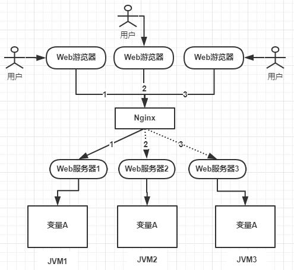
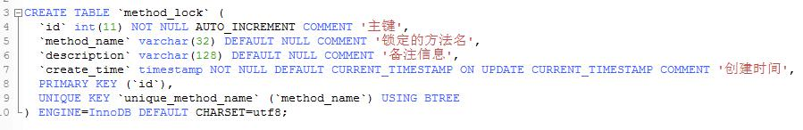
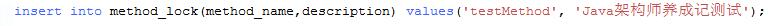
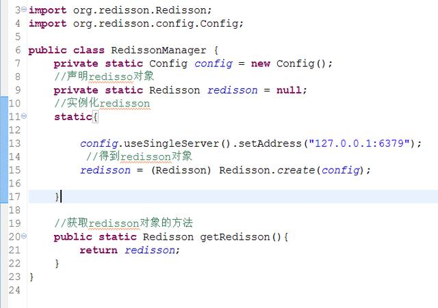
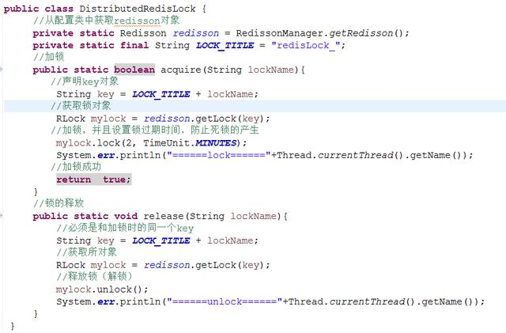
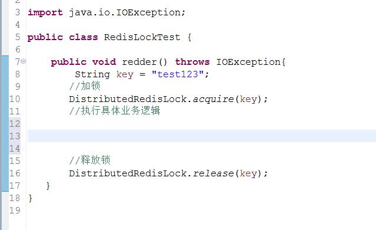

[TOC]

# 基于数据库、redis、zk实现分布式锁的原理与优缺点你都知道吗？

Java架构师养成记 2019-06-19 18:58:01

## 分布式锁的背景，基于数据库、redis、zookeeper实现分布式锁的原理与优缺点你都知道吗？

  为什么要分布式锁、分布式锁的实现方式有哪几种、这几种分布式锁实现方式的优缺点有哪些？阅读完本文后你你应该掌握：

- 基于数据库实现分布式锁具体步骤是什么，优缺点是什么；
- 基于Redis实现分布式锁具体步骤是什么，优缺点是什么；
- 基于Zookeeper实现分布式锁具体步骤是什么，优缺点是什么；

------

## 为什么要使用分布式锁

  我们在开发应用的时候，如果需要对某一个共享变量进行多线程同步访问的时候，可以使用我们学到的Java多线程的18般武艺进行处理，并且可以完美的运行，毫无Bug！

  注意这是**单机应用**，也就是所有的请求都会分配到当前服务器的JVM内部，然后映射为操作系统的线程进行处理！而这个共享变量只是在这个JVM内部的一块内存空间！

  后来业务发展，需要做集群，一个应用需要部署到几台机器上然后做负载均衡，大致如下图：

  上图可以看到，变量A存在JVM1、JVM2、JVM3三个JVM内存中（这个变量A主要体现是在一个类中的一个成员变量，是一个有状态的对象，例如：UserController控制器中的一个整形类型的成员变量），如果不加任何控制的话，变量A同时都会在JVM分配一块内存，三个请求发过来同时对这个变量操作，显然结果是不对的！即使不是同时发过来，三个请求分别操作三个不同JVM内存区域的数据，变量A之间不存在共享，也不具有可见性，处理的结果也是不对的！

  如果我们业务中确实存在这个场景的话，我们就需要一种方法解决这个问题！

  为了保证一个方法或属性在高并发情况下的同一时间只能被同一个线程执行，在传统单体应用单机部署的情况下，可以使用Java并发处理相关的API(如ReentrantLock或Synchronized)进行互斥控制。在单机环境中，Java中提供了很多并发处理相关的API。但是，随着业务发展的需要，原单体单机部署的系统被演化成分布式集群系统后，由于分布式系统多线程、多进程并且分布在不同机器上，这将使原单机部署情况下的并发控制锁策略失效，单纯的Java API并不能提供分布式锁的能力。为了解决这个问题就需要一种跨JVM的互斥机制来控制共享资源的访问，这就是分布式锁要解决的问题！

------

## 分布式锁应该具备的条件

  在分析分布式锁的三种实现方式之前，先了解一下分布式锁应该具备哪些条件：

- 在分布式系统环境下，一个方法在同一时间只能被一个机器的一个线程执行；
- 高可用的获取锁与释放锁；
- 高性能的获取锁与释放锁；
- 具备可重入特性；
- 具备锁失效机制，防止死锁；
- 具备非阻塞锁特性，即没有获取到锁将直接返回获取锁失败。

------

## 基于数据库实现的分布式锁

  基于数据库的实现方式的核心思想是：在数据库中创建一个表，表中包含方法名等字段，并在方法名字段上创建唯一索引，想要执行某个方法，就使用这个方法名向表中插入数据，成功插入则获取锁，执行完成后删除对应的行数据释放锁。

**创建一个表**

**向表中插入数据**

  因为我们对**method_name**做了唯一性约束，这里如果有多个请求同时提交到数据库的话，数据库会保证只有一个操作可以成功，那么我们就可以认为操作成功的那个线程获得了该方法的锁，可以执行方法体内容。

成功插入则获取锁，执行完成后删除对应的行数据释放锁

  **PS:这只是使用基于数据库的一种方法，使用数据库实现分布式锁还有很多其他的玩法！**

  使用基于数据库的这种实现方式很简单，但是对于分布式锁应该具备的条件来说，它有一些问题需要解决及优化，也就是他的优缺点：

- 因为是基于数据库实现的，数据库的**可用性**和**性能**将直接影响分布式锁的可用性及性能，所以，数据库需要双机部署、数据同步、主备切换；
- **不具备可重入**的特性，因为同一个线程在释放锁之前，行数据一直存在，无法再次成功插入数据，所以，需要在表中新增一列，用于记录当前获取到锁的机器和线程信息，在再次获取锁的时候，先查询表中机器和线程信息是否和当前机器和线程相同，若相同则直接获取锁。
- **没有锁失效机制**，因为有可能出现成功插入数据后，服务器宕机了，对应的数据没有被删除，当服务恢复后一直获取不到锁，所以，需要在表中新增一列，用于记录失效时间，并且需要有定时任务清除这些失效的数据。
- 不具备**阻塞锁**特性，获取不到锁直接返回失败，所以需要优化获取逻辑，循环多次去获取。
- 在实施的过程中会遇到各种不同的问题，为了解决这些问题，实现方式将会越来越复杂。
- 依赖数据库需要一定的资源开销，性能问题需要考虑。

------

## 基于Redis的实现方式

**选用Redis实现分布式锁原因**

- Redis有很高的性能；
- Redis命令对此支持较好，实现起来比较方便

**实现思想**

- 获取锁的时候，使用setnx加锁，并使用expire命令为锁添加一个超时时间，超过该时间则自动释放锁，锁的value值为一个随机生成的UUID，通过此在释放锁的时候进行判断。
- 获取锁的时候还设置一个获取的超时时间，若超过这个时间则放弃获取锁。
- 释放锁的时候，若是该锁，则执行delete进行锁释放

**配置Redisson**

**锁的获取和释放工具类编写**

**业务中使用分布式锁**

------

**基于ZooKeeper的实现方式**

  ZooKeeper是一个为分布式应用提供一致性服务的开源组件，它内部是一个分层的文件系统目录树结构，规定同一个目录下只能有一个唯一文件名。基于ZooKeeper实现分布式锁的步骤如下：

- 创建一个目录mylock；
- 线程A想获取锁就在mylock目录下创建临时顺序节点；
- 获取mylock目录下所有的子节点，然后获取比自己小的兄弟节点，如果不存在，则说明当前线程顺序号最小，获得锁；
- 线程B获取所有节点，判断自己不是最小节点，设置监听比自己次小的节点；
- 线程A处理完，删除自己的节点，线程B监听到变更事件，判断自己是不是最小的节点，如果是则获得锁。

**使用方式**

  这里推荐一个Apache的开源库Curator，它是一个ZooKeeper客户端，Curator提供的InterProcessMutex是分布式锁的实现，acquire方法用于获取锁，release方法用于释放锁。

**优点**

  具备高可用、可重入、阻塞锁特性，可解决失效死锁问题。

**缺点**

  因为需要频繁的创建和删除节点，性能上不如Redis方式。

------

## **Redis 分布式锁和Zookeeper分布式锁的对比**

  Redis 分布式锁，其实需要自己不断去尝试获取锁，比较消耗性能。

  Zookeeper分布式锁，获取不到锁，注册个监听器即可，不需要不断主动尝试获取锁，性能开销较小。

  另外一点就是，如果是 Redis 获取锁的那个客户端 出现 bug 挂了，那么只能等待超时时间之后才能释放锁；而 Zookeeper的话，因为创建的是临时 znode，只要客户端挂了，znode 就没了，此时就自动释放锁。

所以基于这点redis适合快速锁时间短的性能要求高;zk适合性能要求低,锁住时间长的场景

------

  欢迎大家关注“**Java架构师养成记**”，不定期分享各类面试题、踩坑笔记、学习方式。

<https://www.toutiao.com/a6704194275770368526/?tt_from=android_share&utm_campaign=client_share×tamp=1561116691&app=news_article&utm_medium=toutiao_android&req_id=2019062119313101015202122504728FC&group_id=6704194275770368526>