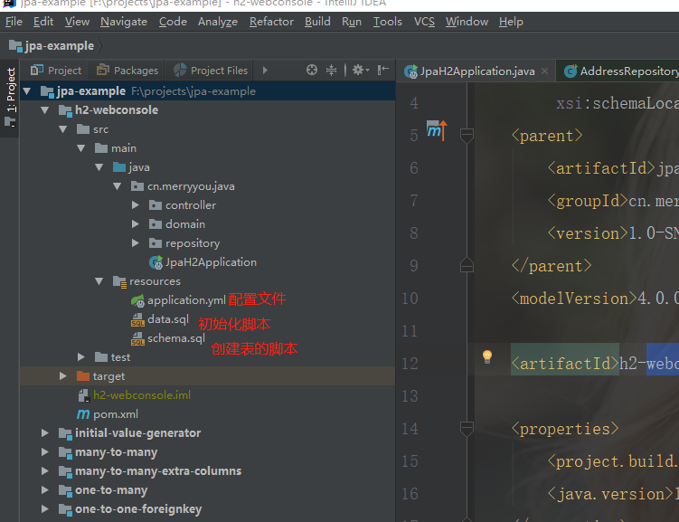
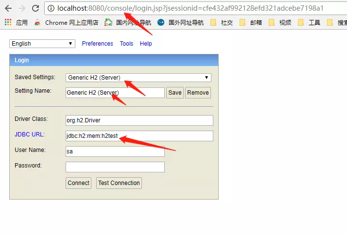
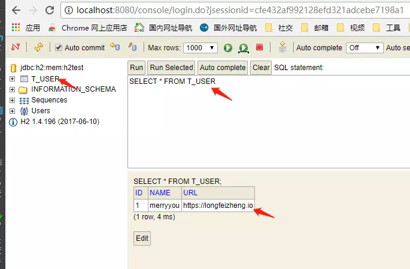

[TOC]


# Spring Data JPA(二)：SpringBoot集成H2

/Users/jerryye/backup/studio/AvailableCode/database/SQL/h2/springboot-h2-webconsole-demo

> H2是Thomas Mueller提供的一个开源的、纯java实现的关系数据库。

## 前言

本篇文章引导你使用`Spring Boot`，`Spring Data JPA`集成`H2`内存数据库。更多关于`H2`数据参考：[www.h2database.com/html/tutori…](https://link.juejin.im/?target=http%3A%2F%2Fwww.h2database.com%2Fhtml%2Ftutorial.html)

### 准备

- JDK 1.8 或更高版本
- Maven 3 或更高版本

### 技术栈

- Spring Data JPA
- Spring Boot

### 目录结构




#### pom.xml

```xml
<?xml version="1.0" encoding="UTF-8"?>
<project xmlns="http://maven.apache.org/POM/4.0.0"
         xmlns:xsi="http://www.w3.org/2001/XMLSchema-instance"
         xsi:schemaLocation="http://maven.apache.org/POM/4.0.0 http://maven.apache.org/xsd/maven-4.0.0.xsd">
    <parent>
        <artifactId>jpa-example</artifactId>
        <groupId>cn.merryyou</groupId>
        <version>1.0-SNAPSHOT</version>
    </parent>
    <modelVersion>4.0.0</modelVersion>

    <artifactId>h2-webconsole</artifactId>

    <properties>
        <project.build.sourceEncoding>UTF-8</project.build.sourceEncoding>
        <java.version>1.8</java.version>
    </properties>

    <dependencies>
        <dependency>
            <groupId>org.springframework.boot</groupId>
            <artifactId>spring-boot-starter-data-jpa</artifactId>
        </dependency>

        <dependency>
            <groupId>com.h2database</groupId>
            <artifactId>h2</artifactId>
            <version>1.4.196</version>
        </dependency>

        <dependency>
            <groupId>org.projectlombok</groupId>
            <artifactId>lombok</artifactId>
        </dependency>

        <dependency>
            <groupId>org.springframework.boot</groupId>
            <artifactId>spring-boot-starter-test</artifactId>
            <scope>test</scope>
        </dependency>
        <dependency>
            <groupId>org.springframework.boot</groupId>
            <artifactId>spring-boot-starter-web</artifactId>
        </dependency>
    </dependencies>

    <build>
        <plugins>
            <plugin>
                <groupId>org.springframework.boot</groupId>
                <artifactId>spring-boot-maven-plugin</artifactId>
            </plugin>
            <plugin>
                <groupId>org.apache.maven.plugins</groupId>
                <artifactId>maven-compiler-plugin</artifactId>
                <version>3.6.1</version>
                <configuration>
                    <source>1.8</source>
                    <target>1.8</target>
                </configuration>
            </plugin>
        </plugins>
    </build>

</project>
复制代码
```

#### 实体类

##### User

```java
@Entity
@Table(name = "t_user")
@Data
public class User {

    @Id
    @GeneratedValue(strategy = GenerationType.IDENTITY)
    private Long id;

    private String name;

    private String url;

    @Override
    public String toString() {
        return "User{" +
                "id=" + id +
                ", name='" + name + '\'' +
                ", url='" + url + '\'' +
                '}';
    }
}
复制代码
```

- `@Table`声明此对象映射到数据库的数据表，通过它可以为实体指定表(talbe),目录(Catalog)和schema的名字。该注释不是必须的，如果没有则系统使用默认值(实体的短类名)。
- `@Id` 声明此属性为主键。该属性值可以通过应该自身创建，但是Hibernate推荐通过Hibernate生成
- `@GeneratedValue` 指定主键的生成策略。
  1. TABLE：使用表保存id值
  2. IDENTITY：identitycolumn
  3. SEQUENCR ：sequence
  4. AUTO：根据数据库的不同使用上面三个
- `@Column` 声明该属性与数据库字段的映射关系。

##### AddressRepository

```
public interface UserRepository extends JpaRepository<User, Integer> {
}
 
```

`Spring Data JPA`包含了一些内置的`Repository`，实现了一些常用的方法：`findone`，`findall`，`save`等。

##### application.yml

```yaml
spring:
  datasource:
    url: jdbc:h2:mem:h2test;DB_CLOSE_DELAY=-1;DB_CLOSE_ON_EXIT=FALSE
    platform: h2
    username: sa
    password:
    driverClassName: org.h2.Driver
  jpa:
    database-platform: org.hibernate.dialect.H2Dialect
    hibernate:
      ddl-auto: update
    properties:
      hibernate:
        show_sql: true
        use_sql_comments: true
        format_sql: true
  h2:
    console:
      enabled: true
      path: /console
      settings:
        trace: false
        web-allow-others: false
logging:
  level: debug
 
```

###### 连接配置

在`application.yml`文件中对数据库进行连接配置

- `spring.datasource.url=jdbc:h2:mem:h2test`，配置h2数据库的连接地址
- `spring.datasource.driver-class-name=org.h2.Driver`，配置JDBC Driver
- `spring.datasource.username=sa`，配置数据库用户名
- `spring.datasource.password=`，配置数据库密码

当你完成依赖和连接配置这两步之后，你就可以在程序种使用`h2`了。spring会自动帮你完成`DataSource`的注入。

###### 数据初始化配置

如果你需要在程序启动时对数据库进行初始化操作，则在`application.properties`文件中对数据库进接配置

- `spring.datasource.schema=classpath:db/schema.sql`，进行该配置后，每次启动程序，程序都会运行`resources/db/schema.sql`文件，对数据库的结构进行操作。
- `spring.datasource.data=classpath:db/data.sql`,进行该配置后，每次启动程序，程序都会运行`resources/db/data.sql`文件，对数据库的数据操作。

该配置非常适合开发环境，我会把数据库的结构构建`sql`放在`resources/db/schema.sql`，数据`sql`放在`resources/db/data.sql`中。这样每次运行程序我都可以得到一个新的数据库。这样就不需要我每次为了测试而修改数据中的内容了。

###### h2 web consloe配置

`h2 web consloe`是一个数据库`GUI`管理应用，就和`phpMyAdmin`类似。程序运行时，会自动启动`h2 web consloe`。当然你也可以进行如下的配置。

- `spring.h2.console.settings.web-allow-others=true`，进行该配置后，`h2 web consloe`就可以在远程访问了。否则只能在本机访问。
- `spring.h2.console.path=/h2-console`，进行该配置，你就可以通过`YOUR_URL/h2-console`访问`h2 web consloe`。`YOUR_URL`是你程序的访问`URl`。
- `spring.h2.console.enabled=true`，进行该配置，程序开启时就会启动`h2 web consloe`。当然这是默认的，如果你不想在启动程序时启动`h2 web consloe`，那么就设置为false。

##### UserRepositoryTest

```
@SpringBootTest
@RunWith(SpringRunner.class)
@Slf4j
public class UserRepositoryTest {

    @Autowired
    private UserRepository userRepository;

    @Test
    public void saveTest() throws Exception {
        User user = new User();
        user.setName("郑龙飞");
        user.setUrl("http://merryyou.cn");
        User result = userRepository.save(user);
        log.info(result.toString());
        Assert.assertNotNull(user.getId());
    }

    @Test
    public void findOneTest() throws Exception{
        User user = userRepository.findOne(1l);
        log.info(user.toString());
        Assert.assertNotNull(user);
        Assert.assertTrue(1l==user.getId());
    }
}
复制代码
```

##### h2 web consloe






## 代码下载

从我的 github 中下载，[github.com/longfeizhen…](https://link.juejin.im/?target=https%3A%2F%2Fgithub.com%2Flongfeizheng%2Fjpa-example%2Ftree%2Fmaster%2Fh2-webconsole)


https://juejin.im/post/5ab4b339f265da238c3a9d0a