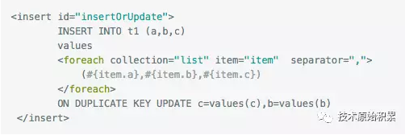
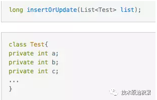
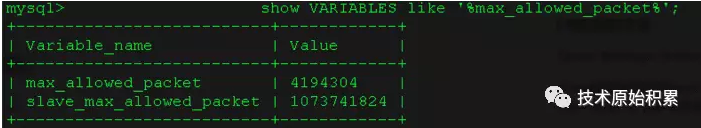

[TOC]


# mysql中INSERT ... ON DUPLICATE KEY UPDATE的实践

## 一、前言

在日常业务开发中经常有这样一个场景，首先创建一条记录，然后插入到数据库；如果数据库已经存在同一主键的记录，则执行update操作，如果不存在，则执行insert操作；

这个操作可以在业务层做，也可以在数据库层面做；

业务层一般做法是先查询，如果不存在在插入，如果存在则更新，但是查询和插入不是原子性操作，在并发量比较高的时候，可能两个线程都查询某个记录不存在，所以会执行两次插入，然后其中一条必然会因为主键（这里说的主键不是递增主键）冲突而失败。

数据库层mysql中INSERT … ON DUPLICATE KEY UPDATE就可以做这个事情，并且是原子性操作，本文就来讲解的使用。

## 二、INSERT … ON DUPLICATE KEY UPDATE命令

ddl语句

```sql
-- auto-generated definition
CREATE TABLE duplicate_test
(
  a INT NOT NULL
    PRIMARY KEY,
  b INT NULL,
  c INT NULL
)
  ENGINE = InnoDB;
```

### 2.1单条记录下使用

```sql
INSERT INTO duplicate_test (a, b, c) VALUES (1, 2, 3)
ON DUPLICATE KEY UPDATE c = c + 1
```

如上sql假如t1表的主键或者UNIQUE 索引是a，那么当执行上面sql时候，如果数据库里面已经存在a=1的记录则更新这条记录的c字段的值为原来值+1，然后返回值为2。如果不存在则插入a=1,b=2,c=3到数据库，然后返回值为1。

### 2.2多记录下使用

```sql
INSERT INTO duplicate_test (a, b, c) VALUES (1, 2, 3),(4, 5, 6)
ON DUPLICATE KEY UPDATE c = VALUES(c)
```

## 三、MyBatis下使用

Mybatis作为经典的数据库持久层框架，自然要介绍下它下的使用

- 在mapper.xml里面配置如下：
  假设a为主键



- 对应的mapper接口可以定义为：

  

注：mysql中sql字符串大小有限制，所以要合理设置插入记录数，我本机的mysql上执行show VARIABLES like '%max_allowed_packet%';结果为max_allowed_packet为4M：



## 四、参考

https://dev.mysql.com/doc/refman/5.7/en/insert-on-duplicate.html


https://mp.weixin.qq.com/s/T2fvz2POCZ1kuYqlweydMA