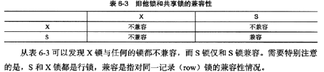
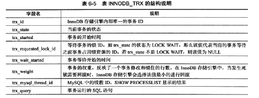
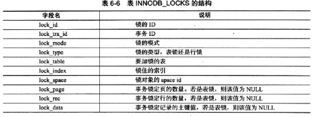
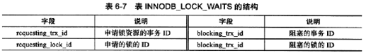
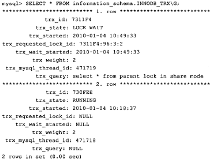
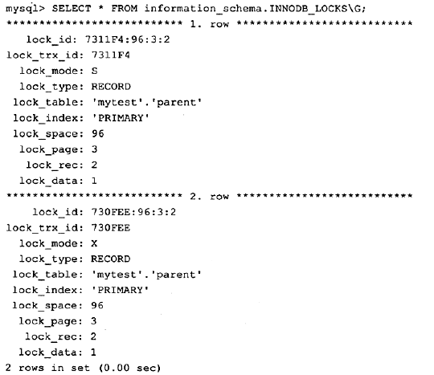
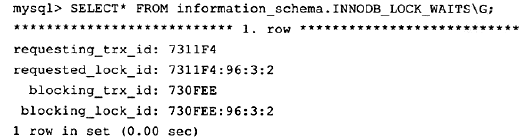
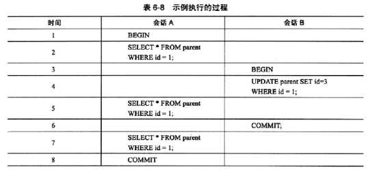

[TOC]

# mysql锁机制简介

# 一、什么是锁

锁是数据库系统区别于文件系统的一个关键特性。

锁机制用于管理对共享资源的并发访问，提供数据的完整性和一致性。

InnoDB存储引擎不仅会在行级别上对表数据上锁，还会在数据库内部其他多个地方使用锁，从而允许对多种不同资源提供并发访问。如：操作缓冲池中LRU列表，删除、添加、移动LRU列表中的元素，为了保证数据的完整性，必须有锁的介入。

InnoDB存储引擎锁的实现与Oracle类似，提供一致性的非锁定读、行级锁支持。

有多少种数据库，就可能有多少种锁的实现方法。

# 二、InnoDB存储引擎中的锁

## 2.1 锁的类型

### 2.1.1 InnoDB存储引擎实现了如下两种标准的行级锁：

共享锁（S Lock），允许事务读一行数据。

排他锁（X Lock），允许事务删除或者更新一行数据。



### 2.1.2 用户可以通过以下方式查看当前锁请求的信息

```
show engine innodb status;
information_schame下的表innodb_trx、innodb_locks、innodb_lock_waits
(
mysql> select * from innodb_trx\G          ### 只显示了当前运行的innodb事务
mysql> select * from innodb_locks\G        ### 直接反映了锁的一些情况
mysql> select * from innodb_lock_waits\G    ### 事务量大时，直观反映当前事务的等待
)
```







例子：


只显示了当前运行的innodb事务，并不能直接判断锁的一些情况。


事务trx_id=730FEE向表parent加了一个X的行锁，
事务trx_id=7311F4向表parent申请了一个S的行锁，
lock_date=1表示都申请表parent中主键=1这一行


事务量大时，直观反映当前事务的等待。

## 2.2 一致性非锁定读

InnoDB存储引擎下，这是默认的读取方式。即：读取不会占用和等待表上的锁。
定义：如果读取的行正在执行update或delete操作，这时读取的操作不会因此去等待行上锁的释放，而是去读取行的快照数据（该行之前的数据，通过undo段来实现；一个行记录可能不止一个快照数据，一般称这种技术为多版本并发控制MVCC）。
使用：事务隔离级别read committed和repeatable read（innodb默认存储引擎）。
RC下，对于快照数据，非一致性读总是读取被‘锁定行的最新一份快照数据’。
RR下，对于快照数据，非一致性读总是读取‘事务开始是的行数据版本’。

例子：

时间5：RC、RR下结果id=1 ；
时间6：RC下结果为空，RR下结果id=1。

## 2.3 一致性锁定读

定义：某些情况下，用户需要对数据库读取操作进行加锁以保证数据逻辑的一致性。
加锁语句：
 select ... for update; ### 对读取的行记录加一个X锁
 select ... lock in share mode; ### 对读取的行记录加一个S锁

```
说明：以上加锁语句必须在一个事务中，当事务提交，锁就释放了（在使用锁定语句时，务必加上begin，start transaction, set autocommit=0）
```

# 三、锁问题

锁机制会造成如下问题：

## 3.1 脏读

脏页 : 在缓冲池中已经被修改的页，但是还没有刷新到磁盘中，即：数据库实例内存中的页和磁盘中的页的数据是不一致的，当然在刷新到磁盘之前，日志已经备写入到了重做日志（redo log）中。
说明：对于脏页的读取，是很正常的。它是由于数据库实例内存和磁盘的异步造成的，最终脏页会刷回磁盘，并不影响数据的一致性。

脏数据：指事务对缓冲池中行记录的修改，并且还没有被commit。
说明：如果读取到了脏数据，即一个事务可以读到另外一个事务未提交的数据，这显然违背了数据库的隔离性。

脏读：就是早不同的事务下，当前事务可以读到另外事务未提交的数据（read uncommited事务隔离级别下）。

## 3.2 不可重复读

不可重复读：在同一事务中，两次读取同一数据，得到内容不同

```
        事务1：查询一条记录
                        -------------->事务2：更新事务1查询的记录
                        -------------->事务2：调用commit进行提交
        事务1：再次查询上次的记录
        
        ***此时事务1对同一数据查询了两次，可得到的内容不同，称为不可重复读
```

**不可重复读与脏读的区别**：脏读是读到未提交的数据，而不可重复读读到的却是已经提交的数据，但是违反了一致性的要求。

## 3.3 幻读

幻读：同一事务中，用同样的操作读取两次，得到的记录数不相同

```
        事务1：查询表中所有记录
                          -------------->事务2：插入一条记录
                          -------------->事务2：调用commit进行提交
        事务1：再次查询表中所有记录
        
        ***此时事务1两次查询到的记录是不一样的，称为幻读
```

**详细解释**：幻读是指当事务不是独立执行时发生的一种现象，例如第一个事务对一个表中的数据进行了修改，这种修改涉及到表中的全部数据行。同时，第二个事务也修改这个表中的数据，这种修改是向表中插入一行新数据。那么，以后就会发生操作第一个事务的用户发现表中还有没有修改的数据行，就好象发生了幻觉一样。

**不可重复读与幻读的区别**
不可重复读的重点是修改：同样的条件, 你读取过的数据,再次读取出来发现值不一样了
幻读的重点在于新增或者删除：同样的条件, 第 1 次和第 2 次读出来的记录数不一样


https://segmentfault.com/a/1190000009463422#articleHeader6