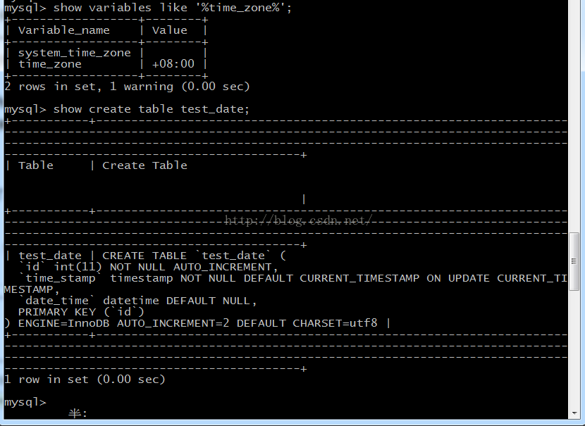
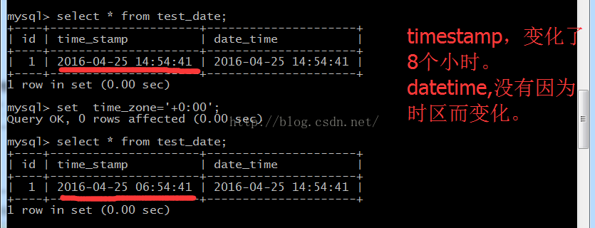

[TOC]

# mysql datetime与timestamp区别

 

## **datetime：** 

**1、保存格式为YYYYMMDDHHMMSS（年月日时分秒）的整数，所以，它与时区无关，存入的是什么值就是什么值，不会根据当前时区进行转换。**

2、从mysql 5.6.4中，可以存储小数片段，最多到小数点后6位，显示时格式为 yyyy-MM-dd HH:mm:ss[.222222]

​      mysql5.5中，没有小数片段，精确到秒。所以，我再从5.6版本迁移到5.5版本时，因为生成的sql中datetime(6),所以无法导入数据库。

3、存储范围：从1000-01-01 00:00:00 到'9999-12-31 23:59:59'

4、长度，8个字节，datetime(n),**n不是存储长度，而是显示的小数位数，即使小数位数是0，存储是也是存储的6位小数，仅仅显示0位而已**

5、显示时，显示日期和时间

## **timestamp：**

**1、存入的是自1970-01-01午夜(格林尼治标准时间)以来的秒数，它和unix时间戳相同。所以它与时区有关，查询时转为相应的时区时间。比如，存储的是1970-01-01 00:00:00，客户端是北京，那么就加8个时区的小时1970-01-01 08:00:00。**

2、有小数片段，至少从5.5就开始有

3、存储范围：'1970-01-01 00:00:01' UTC to '2038-01-19 03:14:07'

4、可以当做时间戳使用，在更新时，自动更新，这一列只能由系统自动更新，不能由sql更新，这个在乐观锁时有广泛的应用

6、长度，4字节，因为存储长度的原因，决定了它支持的范围的比datetime的要小

7、显示时，显示日期和时间

## **date**

**date，时分秒都存储了，但只显示日期。对应Java中的java.sql.Date**

## timestamp和datetime的区别

1. datetime的默认值为null，timestamp默认值为当前系统时间
2. datetime占用8个字节，timestamp占用4个字节
3. datetime存的什么读出来就是什么，timestamp存储的时候会转为utc存储，读出的时候也会转换成当前时区
4. timestamp所能存储的时间范围为：'1970-01-01 00:00:01.000000' 到 '2038-01-19 03:14:07.999999'。datetime所能存储的时间范围为：'1000-01-01 00:00:00.000000' 到 '9999-12-31 23:59:59.999999'。

## **总结**

### **datetime与时区无关、timestamp与时区有关**

1、查看当前时区，并创建表test_date,一个是timestamp列，一个是datetime列

****

2、插入两条数据，相同的时间。修改时区为0时区（格林尼治时区）后，查看时间，发现timestamp改变了，datetime没变。

****

### 结论

datetime、timestamp精确度都是秒，datetime与时区无关，存储的范围广(1001-9999)，timestamp与时区有关，存储的范围小(1970-2038)。

### 如何选择

- 如果时间范围超过2038年，那自然选择datetime
- 如果希望跨时区存储不同地区时间，也选择datetime
- timestamp适合用于记录字段最后更新时间(老版本mysql，新版本datetime也可以支持)

https://blog.csdn.net/wangjun5159/article/details/48010563