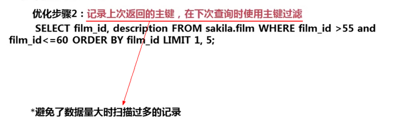

# [MySQL的limit用法和分页查询的性能分析及优化](https://segmentfault.com/a/1190000008859706)


## 一、limit用法

在我们使用查询语句的时候，经常要返回前几条或者中间某几行数据，这个时候怎么办呢？不用担心，mysql已经为我们提供了这样一个功能。

```
SELECT * FROM table LIMIT [offset,] rows | `rows OFFSET offset ` 
(LIMIT offset, `length`)
SELECT
*
FROM table
where condition1 = 0
and condition2 = 0
and condition3 = -1
and condition4 = -1
order by id asc
LIMIT 2000 OFFSET 50000

```

LIMIT 子句可以被用于强制 SELECT 语句返回指定的记录数。**LIMIT 接受一个或两个数字参数**。参数必须是一个整数常量。如果给定两个参数，**第一个参数**指定第一个返回记录行的**偏移量**，**第二个参数**指定**返回记录行的最大数目**。`初始记录行的偏移量是 0(而不是 1)`： 为了与 PostgreSQL 兼容，MySQL 也支持句法： LIMIT # OFFSET #。

```
mysql> SELECT * FROM table LIMIT 5,10; // 检索记录行 6-15 

```

//为了检索从某一个偏移量到记录集的结束所有的记录行，可以指定第二个参数为 -1：

```
mysql> SELECT * FROM table LIMIT 95,-1; // 检索记录行 96-last. 

```

//如果只给定一个参数，它表示返回最大的记录行数目： 
`mysql> SELECT * FROM table LIMIT 5;` //检索前 5 个记录行 
//换句话说，**LIMIT n 等价于 LIMIT 0,n**。

## 二、Mysql的分页查询语句的性能分析

MySql分页sql语句，如果和MSSQL的TOP语法相比，那么MySQL的LIMIT语法要显得优雅了许多。使用它来分页是再自然不过的事情了。

### 原理分析

limit 10000,20的意思扫描满足条件的10020行，扔掉前面的10000行，返回最后的20行，问题就在这里，如果是limit 100000,100，需要扫描100100行，在一个高并发的应用里，每次查询需要扫描超过10W行，性能肯定大打折扣。提到limit n性能是没问题的，因为只扫描n行。

### 最基本的分页方式：

```
SELECT ... FROM ... WHERE ... ORDER BY ... LIMIT ... 
```

在中小数据量的情况下，这样的SQL足够用了，唯一需要注意的问题就是确保使用了索引：
举例来说，如果实际SQL类似下面语句，那么在category_id, id两列上建立复合索引比较好：

```
SELECT * FROM articles WHERE category_id = 123 ORDER BY id LIMIT 50, 10
```

### **子查询的分页方式：**

随着数据量的增加，页数会越来越多，查看后几页的SQL就可能类似：
**SELECT \* FROM articles WHERE category_id = 123 ORDER BY id LIMIT 10000, 10**

一言以蔽之，就是越往后分页，`LIMIT语句的偏移量就会越大，速度也会明显变慢`。
此时，我们可以通过子查询的方式来提高分页效率，大致如下：

```Sql
SELECT * FROM articles WHERE  id >=  
(
    SELECT id FROM articles  WHERE category_id = 123 ORDER BY id LIMIT 10000, 1
) LIMIT 10 
```

### **JOIN分页方式**

```sql
SELECT * FROM `content` AS t1   
JOIN (SELECT id FROM `content` ORDER BY id desc LIMIT ".($page-1)*$pagesize.", 1) AS t2   
WHERE t1.id <= t2.id ORDER BY t1.id desc LIMIT $pagesize; 
```

经过我的测试，join分页和子查询分页的效率基本在一个等级上，消耗的时间也基本一致。 
explain SQL语句：

```
id select_type table type possible_keys key key_len ref rows Extra
1 PRIMARY <derived2> system NULL NULL NULL NULL 1  
1 PRIMARY t1 range PRIMARY PRIMARY 4 NULL 6264 Using where
2 DERIVED content index NULL PRIMARY 4 NULL 27085 Using index

```

------

为什么会这样呢？因为子查询是在索引上完成的，而普通的查询时在数据文件上完成的，通常来说，索引文件要比数据文件小得多，所以操作起来也会更有效率。

实际可以利用类似策略模式的方式去处理分页，比如判断如果是一百页以内，就使用最基本的分页方式，大于一百页，则使用子查询的分页方式。

## 三、对于有大数据量的mysql表来说，使用LIMIT分页存在很严重的性能问题。

查询从第1000000之后的30条记录：

```mysql
SQL代码1：平均用时6.6秒 SELECT * FROM `cdb_posts` ORDER BY pid LIMIT 1000000 , 30

SQL代码2：平均用时0.6秒 SELECT * FROM `cdb_posts` WHERE pid >= (SELECT pid FROM  
`cdb_posts` ORDER BY pid LIMIT 1000000 , 1) LIMIT 30

```

因为要**取出所有字段内容**，第一种需要跨越大量数据块并取出，而第二种基本通过直接**根据索引字段定位后，才取出相应内容**，效率自然大大提升。对limit的优化，不是直接使用limit，而是首先获取到offset的id，然后直接使用limit size来获取数据。

可以看出，越往后分页，LIMIT语句的偏移量就会越大，两者速度差距也会越明显。

实际应用中，可以利用类似策略模式的方式去处理分页，比如判断如果是一百页以内，就使用最基本的分页方式，大于一百页，则使用子查询的分页方式。

### 优化思想：避免数据量大时扫描过多的记录





**为了保证index索引列连续，可以为每个表加一个自增字段，并且加上索引**

[参考：mysql分页offset过大，Sql优化经验](https://segmentfault.com/a/1190000005007706)


https://segmentfault.com/a/1190000008859706