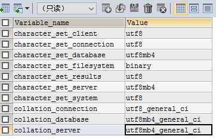

[TOC]


# 全面了解mysql中utf8和utf8mb4的区别

### 一.简介

​        MySQL在5.5.3之后增加了这个**utf8mb4**的编码，mb4就是**most bytes 4**的意思，专门用来**兼容四字节的unicode**。好在utf8mb4是utf8的超集，除了将编码改为utf8mb4外不需要做其他转换。当然，为了节省空间，一般情况下使用utf8也就够了。

### 二.内容描述

​        那上面说了既然utf8能够存下大部分中文汉字,那为什么还要使用utf8mb4呢? 原来mysql支持的 utf8 编码最大字符长度为 3 字节，如果遇到 4 字节的宽字符就会插入异常了。三个字节的 UTF-8 最大能编码的 Unicode 字符是 0xffff，也就是 Unicode 中的基本多文种平面（BMP）。也就是说，任何不在基本多文本平面的 Unicode字符，都无法使用 Mysql 的 utf8 字符集存储。包括 Emoji 表情（Emoji 是一种特殊的 Unicode 编码，常见于 ios 和 android 手机上），和很多不常用的汉字，以及任何新增的 Unicode 字符等等。

### 三.问题根源

​        最初的 UTF-8 格式使用一至六个字节，最大能编码 31 位字符。最新的 UTF-8 规范只使用一到四个字节，最大能编码21位，正好能够表示所有的 17个 Unicode 平面。
        utf8 是 Mysql 中的一种字符集，只支持最长三个字节的 UTF-8字符，也就是 Unicode 中的基本多文本平面。
        Mysql 中的 utf8 为什么只支持持最长三个字节的 UTF-8字符呢？可能是因为 Mysql 刚开始开发那会，Unicode 还没有辅助平面这一说呢。那时候，Unicode 委员会还做着 “65535 个字符足够全世界用了”的美梦。Mysql 中的字符串长度算的是字符数而非字节数，对于 CHAR 数据类型来说，需要为字符串保留足够的长。当使用 utf8 字符集时，需要保留的长度就是 utf8 最长字符长度**乘以**字符串长度，所以这里理所当然的限制了 utf8 最大长度为 3，比**如 CHAR(100) Mysql 会保留 300字节长度**。至于后续的版本为什么不对 4 字节长度的 UTF-8 字符提供支持，我想一个是为了向后兼容性的考虑，还有就是基本多文种平面之外的字符确实很少用到。
        要在 Mysql 中保存 4 字节长度的 UTF-8 字符，需要使用 utf8mb4 字符集，但只有 5.5.3 版本以后的才支持（查看版本： select version();）。我觉得，为了获取更好的兼容性，应该总是使用 utf8mb4 而非 utf8. **对于 CHAR 类型数据，utf8mb4 会多消耗一些空间**，根据 Mysql 官方**建议，使用 VARCHAR 替代 CHAR**。

### 四.utf8升级utf8mb4问题

**utf8mb4 字符集(4字节 UTF-8 Unicode 编码)**
        UTF-8字符集每个字符最多使用三个字节，并且只包含基本多语言面 (Basic Multilingual Plane,BMP)字符。
        utf8mb4 字符集使用最多每字符四个字节支持补充字符：
        对于 BMP字符 UTF8 和 utf8mb4 具有相同的存储特性：相同的代码值，相同的编码，相同的长度。
        对于补充字符，UTF8不能储存所有的字符，而utf8mb4需要四个字节来存储它。因为UTF8不能存储所有的字符，你的 utf8 列中都没有补充字符，**因此从旧版本的MySQL UTF8 升级数据时 不用担心字符转换或丢失数据。**
        utf8mb4 是 utf8 的超集，所以像下面的连接字符串操作，其结果字符集是 utf8mb4  排序规则（一组规则，定义如何对字符串进行比较和排序）是 utf8mb4_col：

```
SELECT CONCAT(utf8_col, utf8mb4_col);  
```

同样，下面的 WHERE 子句中的内容比较根据 utf8mb4_col 规则：

```
SELECT * FROM utf8_tbl, utf8mb4_tbl  
WHERE utf8_tbl.utf8_col = utf8mb4_tbl.utf8mb4_col;  
```

​        如上面所说到的： **要使用 utf8mb4 节省空间，使用 VARCHAR 替换 CHAR**。否则，MySQL必须为使用 utf8mb4字符集的列的每一个字符保留四字节的空间，因为其最大长度可能是四字节。例如，MySQL必须为一个使用 utf8mb4 字符集的  char（10）的列保留40字节空间。

### 五.utf8升级utf8mb4具体步骤

​        首先将我们数据库默认字符集由utf8 更改为utf8mb4，对应的表默认字符集也更改为utf8mb4  已经存储表情的字段默认字符集也做了相应的调整。

SQL 语句

```
1 # 修改数据库:  
2 ALTER DATABASE database_name CHARACTER SET = utf8mb4 COLLATE = utf8mb4_unicode_ci;  
3 # 修改表:  
4 ALTER TABLE table_name CONVERT TO CHARACTER SET utf8mb4 COLLATE utf8mb4_unicode_ci;  
5 # 修改表字段:  
6 ALTER TABLE table_name CHANGE column_name column_name VARCHAR(191) CHARACTER SET utf8mb4 COLLATE utf8mb4_unicode_ci;  
```

修改MySQL配置文件

新增如下参数：

```
default-character-set = utf8mb4 
default-character-set = utf8mb4    
character-set-client-handshake = FALSE  
character-set-server = utf8mb4  
collation-server = utf8mb4_unicode_ci  
init_connect='SET NAMES utf8mb4'
```

 

检查环境变量 和测试 SQL 如下：

```
SHOW VARIABLES WHERE Variable_name LIKE 'character\_set\_%' OR Variable_name LIKE 'collation%';  
```


 注意：MySQL版本必须为5.5.3以上版本，否则不支持字符集utf8mb4

### 六.建议

​        建议普通表使用utf8， 如果这个表需要支持emoji就使用utf8mb4
        新建mysql库或者表的时候还有一个排序规则
        utf8_unicode_ci比较准确，utf8_general_ci速度比较快。通常情况下 utf8_general_ci的准确性就够我们用的了，在我看过很多程序源码后，发现它们大多数也用的是utf8_general_ci，所以新建数据 库时一般选用utf8_general_ci就可以了
        如果是utf8mb4那么对应的就是 utf8mb4_general_ci utf8mb4_unicode_ci

### 七.utf8_unicode_ci与utf8_general_ci的区别

​        当前，utf8_unicode_ci校对规则仅部分支持Unicode校对规则算法。一些字符还是不能支持。并且，不能完全支持组合的记号。这主要影响越南和俄罗斯的一些少数民族语言，如：Udmurt 、Tatar、Bashkir和Mari。

​        utf8_unicode_ci的最主要的特色是支持扩展，即当把一个字母看作与其它字母组合相等时。例如，在德语和一些其它语言中‘ß’等于‘ss’。

​        utf8_general_ci是一个遗留的 校对规则，不支持扩展。它仅能够在字符之间进行逐个比较。这意味着utf8_general_ci校对规则进行的比较速度很快，但是与使用utf8_unicode_ci的校对规则相比，比较正确性较差）。

​        例如，使用utf8_general_ci和utf8_unicode_ci两种 校对规则下面的比较相等：

Ä = A

Ö = O

Ü = U

​        两种校对规则之间的区别是，对于utf8_general_ci下面的等式成立：

ß = s

​        但是，对于utf8_unicode_ci下面等式成立：

ß = ss

​        对于一种语言仅当使用utf8_unicode_ci排序做的不好时，才执行与具体语言相关的utf8字符集 校对规则。例如，对于德语和法语，utf8_unicode_ci工作的很好，因此不再需要为这两种语言创建特殊的utf8校对规则。

​        utf8_general_ci也适用与德语和法语，除了‘ß’等于‘s’，而不是‘ss’之外。如果你的应用能够接受这些，那么应该使用utf8_general_ci，因为它速度快。否则，使用utf8_unicode_ci，因为它比较准确。 

### 八.案例

```
查询：CREATE TABLE test_session ( sessionId varchar(255) NOT NULL, userId int(10) unsigned DEFAULT NULL, createAt datetime DEFAULT NULL,...

错误代码： 1071
Specified key was too long; max key length is 767 bytes
```

如上，报错,当使用utf8mb4编码后，主键id的长度设置255，太长，只能设置小于191的

其中：

```
max key length is 767 bytes
utf8:  767/3=255.6666666666667
utf8mb4: 767/4=191.75
```

### 九.深入Mysql字符集设置

**基本概念**

• 字符(Character)是指人类语言中最小的表义符号。例如’A'、’B'等；

• 给定一系列字符，对每个字符赋予一个数值，用数值来代表对应的字符，这一数值就是字符的编码(Encoding)。例如，我们给字符’A'赋予数值0，给字符’B'赋予数值1，则0就是字符’A'的编码；

• 给定一系列字符并赋予对应的编码后，所有这些字符和编码对组成的集合就是字符集(Character Set)。例如，给定字符列表为{‘A’,'B’}时，{‘A’=>0, ‘B’=>1}就是一个字符集；

• 字符序(Collation)是指在同一字符集内字符之间的比较规则；

• 确定字符序后，才能在一个字符集上定义什么是等价的字符，以及字符之间的大小关系；

• 每个字符序唯一对应一种字符集，但一个字符集可以对应多种字符序，其中有一个是默认字符序(Default Collation)；

• MySQL中的字符序名称遵从命名惯例：以字符序对应的字符集名称开头；以_ci(表示大小写不敏感)、_cs(表示大小写敏感)或_bin(表示按编码值比较)结尾。例如：在字符序“utf8_general_ci”下，字符“a”和“A”是等价的；

**MySQL字符集设置**

• 系统变量：

– character_set_server：默认的内部操作字符集

– character_set_client：客户端来源数据使用的字符集

– character_set_connection：连接层字符集

– character_set_results：查询结果字符集

– character_set_database：当前选中数据库的默认字符集

– character_set_system：系统元数据(字段名等)字符集

– 还有以collation_开头的同上面对应的变量，用来描述字符序。

• 用introducer指定文本字符串的字符集：

– 格式为：[_charset] ‘string’ [COLLATE collation]

– 例如：

• SELECT _latin1 ‘string’;

• SELECT _utf8 ‘你好’ COLLATE utf8_general_ci;

– 由introducer修饰的文本字符串在请求过程中不经过多余的转码，直接转换为内部字符集处理。

**MySQL中的字符集转换过程**

\1. MySQL Server收到请求时将请求数据从character_set_client转换为character_set_connection；

\2. 进行内部操作前将请求数据从character_set_connection转换为内部操作字符集，其确定方法如下：

• 使用每个数据字段的CHARACTER SET设定值；

• 若上述值不存在，则使用对应数据表的DEFAULT CHARACTER SET设定值(MySQL扩展，非SQL标准)；

• 若上述值不存在，则使用对应数据库的DEFAULT CHARACTER SET设定值；

• 若上述值不存在，则使用character_set_server设定值。

\3. 将操作结果从内部操作字符集转换为character_set_results。

**常见问题解析**

• 向默认字符集为utf8的数据表插入utf8编码的数据前没有设置连接字符集，查询时设置连接字符集为utf8

– 插入时根据MySQL服务器的默认设置，character_set_client、character_set_connection和character_set_results均为latin1；

– 插入操作的数据将经过latin1=>latin1=>utf8的字符集转换过程，这一过程中每个插入的汉字都会从原始的3个字节变成6个字节保存；

– 查询时的结果将经过utf8=>utf8的字符集转换过程，将保存的6个字节原封不动返回，产生乱码……

 

• 向默认字符集为latin1的数据表插入utf8编码的数据前设置了连接字符集为utf8

– 插入时根据连接字符集设置，character_set_client、character_set_connection和character_set_results均为utf8；

– 插入数据将经过utf8=>utf8=>latin1的字符集转换，若原始数据中含有\u0000~\u00ff范围以外的Unicode字 符，会因为无法在latin1字符集中表示而被转换为“?”(0x3F)符号，以后查询时不管连接字符集设置如何都无法恢复其内容了。

 

**检测字符集问题的一些手段**

• SHOW CHARACTER SET;

• SHOW COLLATION;

• SHOW VARIABLES LIKE ‘character%’;

• SHOW VARIABLES LIKE ‘collation%’;

• SQL函数HEX、LENGTH、CHAR_LENGTH

• SQL函数CHARSET、COLLATION

**使用MySQL字符集时的建议**

• 建立数据库/表和进行数据库操作时尽量显式指出使用的字符集，而不是依赖于MySQL的默认设置，否则MySQL升级时可能带来很大困扰；

• 数据库和连接字符集都使用latin1时虽然大部分情况下都可以解决乱码问题，但缺点是无法以字符为单位来进行SQL操作，一般情况下将数据库和连接字符集都置为utf8是较好的选择；

• 使用mysql C API时，初始化数据库句柄后马上用mysql_options设定MYSQL_SET_CHARSET_NAME属性为utf8，这样就不用显式地用 SET NAMES语句指定连接字符集，且用mysql_ping重连断开的长连接时也会把连接字符集重置为utf8；

• 对于mysql PHP API，一般页面级的PHP程序总运行时间较短，在连接到数据库以后显式用SET NAMES语句设置一次连接字符集即可；但当使用长连接时，请注意保持连接通畅并在断开重连后用SET NAMES语句显式重置连接字符集。

**其他注意事项**

• my.cnf中的default_character_set设置只影响mysql命令连接服务器时的连接字符集，不会对使用libmysqlclient库的应用程序产生任何作用！

• 对字段进行的SQL函数操作通常都是以内部操作字符集进行的，不受连接字符集设置的影响。

• SQL语句中的裸字符串会受到连接字符集或introducer设置的影响，对于比较之类的操作可能产生完全不同的结果，需要小心！


https://my.oschina.net/xsh1208/blog/1052781