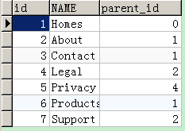
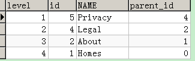
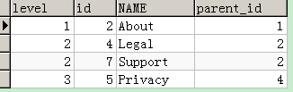
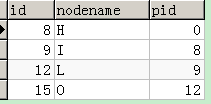

[TOC]


# mysql中的递归层次查询（父子查询） 树查询 层级结构查询

## 一、SQL单条语句实现父子关联查询

在 SQL Server 中，使用 CTE 表达式很容易做到无限层次父子关系查询；在不支持CTE表达式的版本中，借助函数递归也可以轻松实现。 

在 MySQL 中，这个需求的实例稍显复杂， MySQL 中没有支持递归的查询，没有表值函数，函数不支持递归，所以通常都是用循环实现，显得比较别扭。今天看到一个用单条语句实现的递归查询，想法独特，分享一下。

```
CREATE TABLE table1 ( id INT, NAME VARCHAR ( 10 ), parent_id INT );
INSERT table1
VALUES
     ( 1, 'Homes', 0 ),
     ( 2, 'About', 1 ),
     ( 3, 'Contact', 1 ),
     ( 4, 'Legal', 2 ),
     ( 5, 'Privacy', 4 ),
     ( 6, 'Products', 1 ),
     ( 7, 'Support', 2 );
```



**查询 id = 5 的所有父级**

```mysql
SELECT
	ID. LEVEL,
	DATA .*
FROM
	(
		SELECT
			@id AS _id,
			(
				SELECT
					@id := parent_id
				FROM
					table1
				WHERE
					id = @id
			) AS _pid,
			@l := @l + 1 AS LEVEL
		FROM
			table1,
			(SELECT @id := 5, @l := 0) b
		WHERE
			@id > 0
	) ID,
	table1 DATA
WHERE
	ID._id = DATA .id
ORDER BY
	LEVEL;


```



**根据这个父级查询方法，很容易可以写出查所有子级的，下面的查询 id=2 的所有子级**

```sql
SELECT
	ID. LEVEL,
	DATA .*
FROM
	(
		SELECT
			@ids AS _ids,
			(
				SELECT
					@ids := GROUP_CONCAT(id)
				FROM
					table1
				WHERE
					FIND_IN_SET(parent_id, @ids)
			) AS cids,
			@l := @l + 1 AS LEVEL
		FROM
			table1,
			(SELECT @ids := '2', @l := 0) b
		WHERE
			@ids IS NOT NULL
	) id,
	table1 DATA
WHERE
	FIND_IN_SET(DATA .id, ID._ids)
ORDER BY
	LEVEL,
	id
```




## 二、自定义SQL函数实现父子关联查询

最近遇到了一个问题，在mysql中如何完成节点下的所有节点或节点上的所有父节点的查询？

在Oracle中我们知道有一个Hierarchical Queries可以通过CONNECT BY来查询，但是，在MySQL中还没有对应的函数!!!

下面给出一个function来完成的方法

下面是sql脚本，想要运行的直接赋值粘贴进数据库即可。

```
DROP TABLE IF EXISTS `treenodes`;
CREATE TABLE `treenodes` (
  `id` int(11) NOT NULL,
  `nodename` varchar(20) DEFAULT NULL,
  `pid` int(11) DEFAULT NULL,
  PRIMARY KEY (`id`)
) ENGINE=InnoDB DEFAULT CHARSET=latin1;
—————————————————————
INSERT INTO `treenodes` VALUES (‘1’, ‘A’, ‘0’);
INSERT INTO `treenodes` VALUES (‘2’, ‘B’, ‘1’);
INSERT INTO `treenodes` VALUES (‘3’, ‘C’, ‘1’);
INSERT INTO `treenodes` VALUES (‘4’, ‘D’, ‘2’);
INSERT INTO `treenodes` VALUES (‘5’, ‘E’, ‘2’);
INSERT INTO `treenodes` VALUES (‘6’, ‘F’, ‘3’);
INSERT INTO `treenodes` VALUES (‘7’, ‘G’, ‘6’);
INSERT INTO `treenodes` VALUES (‘8’, ‘H’, ‘0’);
INSERT INTO `treenodes` VALUES (‘9’, ‘I’, ‘8’);
INSERT INTO `treenodes` VALUES (’10’, ‘J’, ‘8’);
INSERT INTO `treenodes` VALUES (’11’, ‘K’, ‘8’);
INSERT INTO `treenodes` VALUES (’12’, ‘L’, ‘9’);
INSERT INTO `treenodes` VALUES (’13’, ‘M’, ‘9’);
INSERT INTO `treenodes` VALUES (’14’, ‘N’, ’12’);
INSERT INTO `treenodes` VALUES (’15’, ‘O’, ’12’);
INSERT INTO `treenodes` VALUES (’16’, ‘P’, ’15’);
INSERT INTO `treenodes` VALUES (’17’, ‘Q’, ’15’);
```

**新建函数：（根据传入id查询所有父节点的id）**

```sql
delimiter //
CREATE FUNCTION `getParLst`(rootId INT)
RETURNS varchar(1000)
BEGIN
    DECLARE sTemp VARCHAR(1000);
    DECLARE sTempPar VARCHAR(1000);
    SET sTemp = ”;
    SET sTempPar =rootId;
    
    #循环递归
    WHILE sTempPar is not null DO
        #判断是否是第一个，不加的话第一个会为空
        IF sTemp != ” THEN
            SET sTemp = concat(sTemp,’,’,sTempPar);
        ELSE
            SET sTemp = sTempPar;
        END IF;
        SET sTemp = concat(sTemp,’,’,sTempPar);
        SELECT group_concat(pid) INTO sTempPar FROM treenodes where pid<>id and FIND_IN_SET(id,sTempPar)>0;
    END WHILE;
    
RETURN sTemp;
END
//
```

执行命令：（查询id =15u哦下的）

```sql
SELECT
    *
FROM
    treenodes
WHERE
    FIND_IN_SET( id, test.getParLst ( 15 ) )
```




参考来源：[http://blog.csdn.net/zjcxc/article/details/78819656](http://www.ztloo.com/goto/et3t)   作者：zjcxc–个人微信公共号同名

**参考来源：https://yq.aliyun.com/articles/48885  作者：benjaminwhx** 


http://www.ztloo.com/2017/12/19/mysql%E4%B8%AD%E5%AE%9E%E7%8E%B0%E6%97%A0%E9%99%90%E5%B1%82%E6%AC%A1%E7%88%B6%E5%AD%90%E5%85%B3%E7%B3%BB%E6%9F%A5%E8%AF%A2-2/