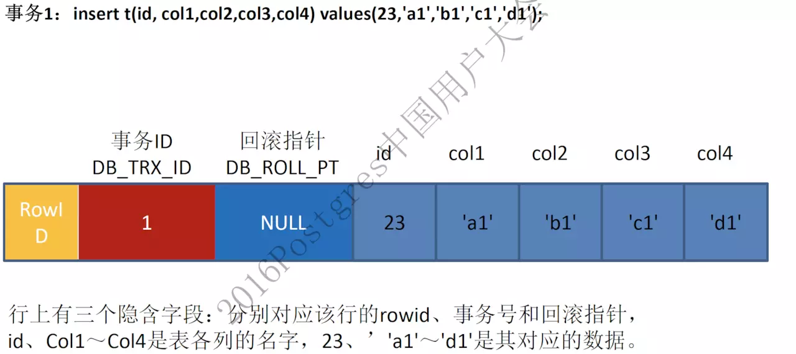
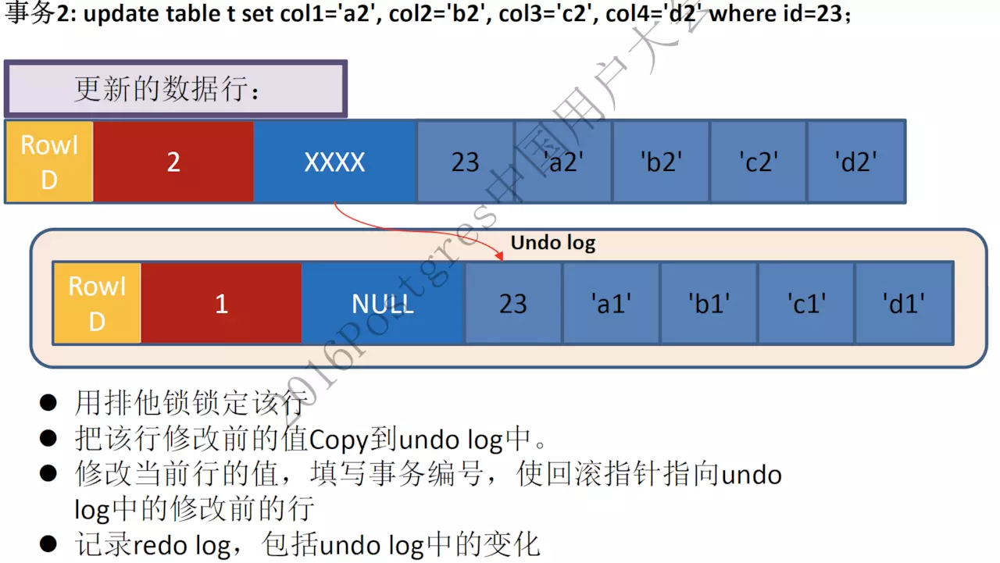
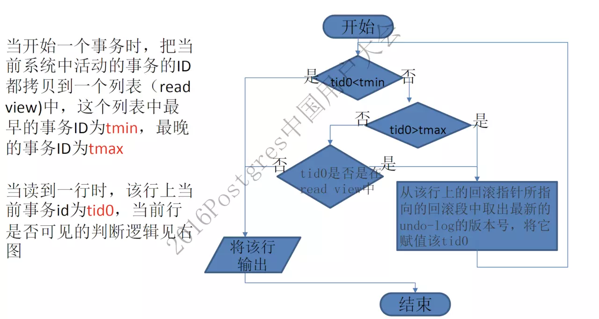

# MVCC 原理探究及 MySQL 源码实现分析

阅读 700

收藏 23

2017-04-20

原文链接：[blog.csdn.net](https://link.juejin.im/?target=http%3A%2F%2Fblog.csdn.net%2Fwoqutechteam%2Farticle%2Fdetails%2F68486652)


[MVCC原理探究及MySQL源码实现分析](https://link.juejin.im/?target=http%3A%2F%2Ffromwiz.com%2Fshare%2Fs%2F12rjMX0nhkh924tMZG3UUkgl2DmtGK0bAkfF2hUHps1eCwKB%23wiz_toc_0)
[数据库多版本读场景](https://link.juejin.im/?target=http%3A%2F%2Ffromwiz.com%2Fshare%2Fs%2F12rjMX0nhkh924tMZG3UUkgl2DmtGK0bAkfF2hUHps1eCwKB%23wiz_toc_1)
[MVCC实现原理](https://link.juejin.im/?target=http%3A%2F%2Ffromwiz.com%2Fshare%2Fs%2F12rjMX0nhkh924tMZG3UUkgl2DmtGK0bAkfF2hUHps1eCwKB%23wiz_toc_2)
[通过DB_ROLL_PT 回溯查找数据历史版本](https://link.juejin.im/?target=http%3A%2F%2Ffromwiz.com%2Fshare%2Fs%2F12rjMX0nhkh924tMZG3UUkgl2DmtGK0bAkfF2hUHps1eCwKB%23wiz_toc_3)
[通过read view判断行记录是否可见](https://link.juejin.im/?target=http%3A%2F%2Ffromwiz.com%2Fshare%2Fs%2F12rjMX0nhkh924tMZG3UUkgl2DmtGK0bAkfF2hUHps1eCwKB%23wiz_toc_4)
[MVCC解决了什么问题](https://link.juejin.im/?target=http%3A%2F%2Ffromwiz.com%2Fshare%2Fs%2F12rjMX0nhkh924tMZG3UUkgl2DmtGK0bAkfF2hUHps1eCwKB%23wiz_toc_5)
[MySQL代码分析](https://link.juejin.im/?target=http%3A%2F%2Ffromwiz.com%2Fshare%2Fs%2F12rjMX0nhkh924tMZG3UUkgl2DmtGK0bAkfF2hUHps1eCwKB%23wiz_toc_6)
[InnoDB隐藏字段源码分析](https://link.juejin.im/?target=http%3A%2F%2Ffromwiz.com%2Fshare%2Fs%2F12rjMX0nhkh924tMZG3UUkgl2DmtGK0bAkfF2hUHps1eCwKB%23wiz_toc_7)
[InnoDB判断事务可见性源码分析](https://link.juejin.im/?target=http%3A%2F%2Ffromwiz.com%2Fshare%2Fs%2F12rjMX0nhkh924tMZG3UUkgl2DmtGK0bAkfF2hUHps1eCwKB%23wiz_toc_8)


# MVCC原理探究及MySQL源码实现分析

## 数据库多版本读场景

| session 1                         | session 2                    |
| --------------------------------- | ---------------------------- |
| select a from test; return a = 10 |                              |
| start transaction;                |                              |
| update test set a = 20;           |                              |
|                                   | start transaction;           |
|                                   | select a from test; return ? |
| commit;                           |                              |
|                                   | select a from test; return ? |

我们看下上面这个数据库日常操作的例子。

- session 1修改了一条记录，没有提交；与此同时，session 2 来查询这条记录，这时候返回记录应该是多少呢？
- session 1 提交之后 session 2 查询出来的又应该是多少呢？

由于MySQL支持多种隔离级别，这个问题是需要看session2的事务隔离级别的，情况如下:

- 隔离级别为 READ-UNCOMMITTED 情况下: 
  session 1 commit前后 session 2 去查看都会看到的是修改后的结果 a = 20
- 隔离级别为 READ-COMMITTED 情况下: 
  session 1 commit 前查看到的还是 a =10 , commit之后看到的是 a = 20
- 隔离级别为 REPEATABLE-READ， SERIALIZABLE 情况下: 
  session 1 commit前后 session 2 去查看都会看到的是修改后的结果 a = 10

其实不管隔离级别，我们也抛开数据库中的ACID，我们思考一个问题：众所周知，InnoDB的数据都是存储在B-tree里面的，修改后的数据到底要不要存储在实际的B-tree叶子节点，session2是怎么做到查询出来的结果还是10，而不是20列？

## MVCC实现原理

上述现象在数据库中大家经常看到，但是数据库到底是怎么实现的，深究的人就不多了。 
其实原理很简单，数据库就是通过UNDO和MVCC来实现的。

#### 通过DB_ROLL_PT 回溯查找数据历史版本

- 首先InnoDB每一行数据还有一个DB_ROLL_PT的回滚指针，用于指向该行修改前的上一个历史版本 
  
  当插入的是一条新数据时，记录上对应的回滚段指针为NULL


更新记录时，原记录将被放入到undo表空间中，并通过DB_ROLL_PT指向该记录。session2查询返回的未修改数据就是从这个undo中返回的。MySQL就是根据记录上的回滚段指针及事务ID判断记录是否可见，如果不可见继续按照DB_ROLL_PT继续回溯查找。

#### 通过read view判断行记录是否可见

具体的判断流程如下:

- RR隔离级别下，在每个事务开始的时候，会将当前系统中的所有的活跃事务拷贝到一个列表中(read view)
- RC隔离级别下，在每个语句开始的时候，会将当前系统中的所有的活跃事务拷贝到一个列表中(read view) 
  并按照以下逻辑判断事务的可见性。 
  

## MVCC解决了什么问题

- MVCC使得数据库读不会对数据加锁，select不会加锁，提高了数据库的并发处理能力
- 借助MVCC，数据库可以实现RC，RR等隔离级别，用户可以查看当前数据的前一个或者前几个历史版本。保证了ACID中的I-隔离性。

## MySQL代码分析

前面我们介绍了什么是MVCC，以及它解决了什么问题。 
下面我们来看一下在MySQL源码中，到底是怎么实现这个逻辑的。

### InnoDB隐藏字段源码分析

InnoDB表中会存有三个隐藏字段，这三个字段是mysql默认帮我们添加的。我们可以通过代码中查看到:

```
dict_table_add_system_columns(
```

- DB_ROW_ID:如果表中没有显示定义主键或者没有唯一索引则MySQL会自动创建一个6字节的row id存在记录中
- DB_TRX_ID:事务ID
- DB_ROLL_PTR:回滚段指针

### InnoDB判断事务可见性源码分析

mysql中并不是根据事务的事务ID进行比较判断记录是否可见，而是根据每一行记录上的事务ID进行比较来判断记录是否可见。

我们可以通过实验验证 ， 创建一张表里面插入一条记录

```
dhy@10.16.70.190:3306  12:25:47 [dhy]>select * from dhytest;
```

手工开启一个事务 更新一条记录 但是并不提交:

```
dhy@10.10.80.199:3306  15:28:24 [dhy]>update dhytest set id = 20;
```

在另外一个会话执行查询

```
dhy@10.16.70.190:3306  12:38:33 [dhy]>select * from dhytest;
```

这时我们可以跟踪调试mysql 查看他是怎么判断记录的看见性，中间函数调用太多列举最重要部分

这里需要介绍一个重要的类 ReadView,Read View是事务开启时当前所有事务的一个集合,这个类中存储了当前Read View中最大事务ID及最小事务ID

```
/** The read should not see any transaction with trx id >= this
```

当我们执行上面的查询语句时,跟踪到主要函数如下:

```
函数row_search_mvcc->lock_clust_rec_cons_read_sees
```

下面是真正判断记录的看见性。

```
bool changes_visible(
```

对于不可见的记录都是通过row_vers_build_for_consistent_read函数查询UNDO构建老版本记录，直到记录可见。

这里需要说明一点 不同的事务隔离级别，可见性的实现也不一样:

- READ-COMMITTED 
  事务内的每个查询语句都会重新创建Read View，这样就会产生不可重复读现象发生
- REPEATABLE-READ 
  事务内开始时创建Read View ， 在事务结束这段时间内 每一次查询都不会重新重建Read View ， 从而实现了可重复读。

参考资料: 
《唐成－2016PG大会-数据库多版本实现内幕.pdf》


https://juejin.im/entry/58f86815ac502e00638e1c97