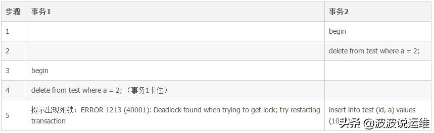
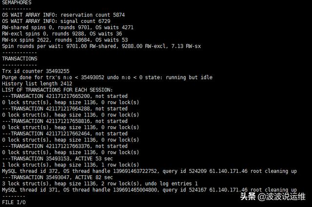
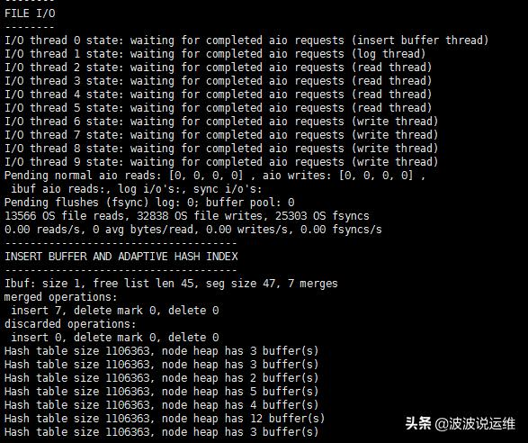
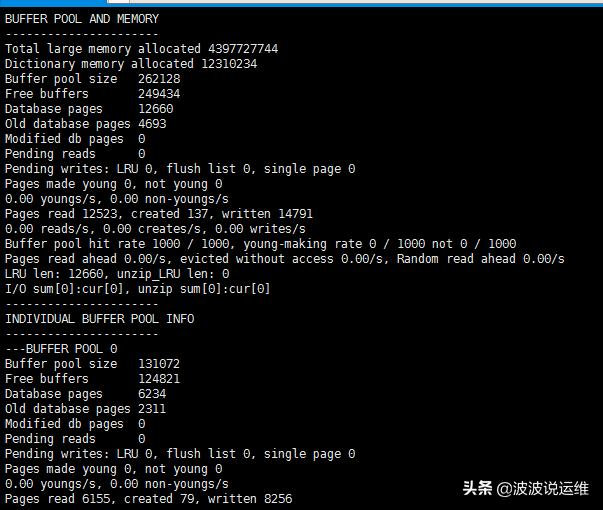
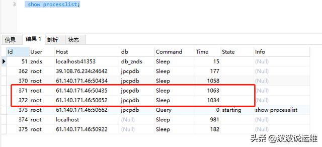
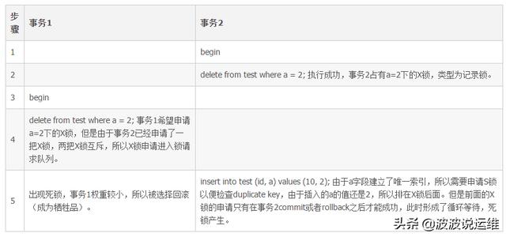

[TOC]


# mysql数据库死锁实验模拟演示

原创 波波说运维 2019-06-14 00:02:00

**概述**

之前接触到的数据库死锁，很多都是批量更新时加锁顺序不一致而导致的死锁，但是上周却遇到了一个很难理解的死锁。借着这个机会又重新学习了一下mysql的死锁知识以及常见的死锁场景。今天不介绍死锁的基本知识和mysql的加锁原理，主要是用实验来帮助大家理解下死锁。

------

## **环境**

环境：采用的是5.7版本的mysql数据库，事务隔离级别是默认的RR（Repeatable-Read），采用innodb引擎。

------

## 环境演示

```mysql
CREATE TABLE `test` ( 
 `id` int(11) unsigned NOT NULL AUTO_INCREMENT, 
 `a` int(11) unsigned DEFAULT NULL, 
 PRIMARY KEY (`id`), 
 UNIQUE KEY `a` (`a`) 
) ENGINE=InnoDB AUTO_INCREMENT=100 DEFAULT CHARSET=utf8; 
```

表的结构很简单，一个主键id，另一个唯一索引a。表里的数据如下：

```mysql
insert into test values(1,1);
insert into test values(2,2);
insert into test values(4,4);
commit;
select * from test; 
```

出现死锁的操作如下：



```mysql
-- 事务1
BEGIN ;
DELETE FROM test where a=2; -- (事务1卡住)

-- 事务2
BEGIN;
DELETE FROM test where a=2;

 

INSERT INTO test(id,a) VALUES (10,2);

```


然后通过SHOW ENGINE INNODB STATUS \G;来查看死锁日志：








**分析**

遇到死锁，第一步就是阅读死锁日志。死锁日志通常分为两部分，上半部分说明了事务1在等待什么锁：

```
---TRANSACTION 35493153, ACTIVE 53 sec
1 lock struct(s), heap size 1136, 1 row lock(s)
MySQL thread id 372, OS thread handle 139691463722752, query id 524209 61.140.171.46 root cleaning up
---TRANSACTION 35493047, ACTIVE 82 sec
3 lock struct(s), heap size 1136, 2 row lock(s), undo log entries 1
MySQL thread id 371, OS thread handle 139691465004800, query id 524167 61.140.171.46 root cleaning up
```

从日志里我们可以看到事务1(MySQL thread id 372)和事务2（MySQL thread id 371）产生了死锁。

**查看thread**




**查看死锁**

```mysql
select trx_id,trx_state,trx_mysql_thread_id,trx_isolation_level
from information_schema.INNODB_TRX;
```

该锁是通过事务2在步骤2执行的delete语句申请的。由于是RR隔离模式下的基于唯一索引的等值查询（Where a = 2），所以会申请一个记录锁，而非next-key锁。

而且事务2正在申请S锁，也就是共享锁。该锁是insert into test (id,a) values (10,2)语句申请的。insert语句在普通情况下是会申请排他锁，也就是X锁，但是这里出现了S锁。这是因为a字段是一个唯一索引，所以insert语句会在插入前进行一次duplicate key的检查，为了使这次检查成功，需要申请S锁防止其他事务对a字段进行修改。

那么为什么该S锁会失败呢？这是对同一个字段的锁的申请是需要排队的。S锁前面还有一个未申请成功的X锁，所以S锁必须等待，所以形成了循环等待，死锁出现了。

------

## **死锁形成流程图**

这里通过表格的形式阐述死锁形成的流程：




<https://www.toutiao.com/a6700335799117808131/?tt_from=android_share&utm_campaign=client_share×tamp=1560527365&app=news_article&utm_medium=toutiao_android&req_id=201906142349250101520210240052105&group_id=6700335799117808131>

