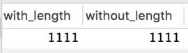
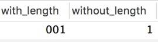
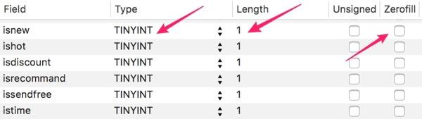

[TOC]

# mysql int 整型长度的含义

 

2017.04.05 03:12* 字数 1320 阅读 2530评论 0喜欢 1

## 缘起

发现公司数据库中很多整型数据限定了长度, 明显不是为了 "Zerofill/补零功能". 推测大家可能是搞错了"整型长度"的含义, **误以为"整型"后面的数字代表的是"允许存储的最大宽度", 比如, 误以为 int(1) 不能存储 10.**

> PS. MySQL的 int 和 tinyint 的默认长度是 `int(11)` 和 `tinyint(4)`, 而`boolean` 型实际存储的是 `tinyint(1)`.

------

## 先说结论

**"浮点型"的长度是用来限制数字存储范围的**. 比如 `float(3,2)` 只能够写入 `0.00~999.99`.

**"整型"的长度并不会限制存储的数字范围**. 比如, `int` 和 `int(3)` 的存储范围都是 `-2147483648 ~ 2147483647`, `int unsigned` 和 `int(3) unsigned` 的存储范围都是`0 ~ 4294967295`.

**"整型"的长度实际上可以理解为"显示长度", 如果该字段开启 "Zerofill/补零"就能很明显地知道它的作用.**

比如, `a` `b` `c` `d` 分别表示 `int(1)` `int(2)` `int(3)` `int(3) zerofill`, 那么实际存入数据库的数据是这样的:

```
| v  | a  |  b  |  c |  d |
+-----+-----+-----+-----+-----+
| 1  | 1  |  1  |  1 | 001 |
| 10  | 10  | 10  |  10 | 010 |
| 100 | 100 | 100 | 100 | 100 |
```

> PS. 如果开启 "Zerofill/补零", 则自动会默认为 "Unsigned/非负数".

------

## 试验

### 试验 1 : 整型长度是否会限制存储范围

创建数据表:

```
CREATE TABLE test01 (
  with_length int(3),
  without_length int
) ENGINE=innodb, CHARSET=utf8
```

写入数据 `1111`:

```
insert into test01 (with_length, without_length) VALUE (1111, 1111);
```

可以发现 `1111` 是可以写入 `int(3)` 字段的:





------

### 试验 2 : 整型长度的补零作用

创建数据表:

```
CREATE TABLE test02 (
  with_length int(3) ZEROFILL,
  without_length int
) ENGINE=innodb, CHARSET=utf8
```

插入数字 `1`:

```
insert into test02 (with_length, without_length) VALUE (1, 1);
```

看看 "Zerofill/补零" 效果:




------

## 参考

### "高性能MySQL" 的说明

"高性能MySQL" 书中在"4.1 选择优化的数据类型"中提到:

> MySQL 可以为整数类型指定宽度, 例如 INT(11), 对大多数应用这是没有意义的: 它不会限制值的合法范围, 只是规定了 MySQL 的一些交互工具(例如 MySQL 命令行客户端)用来显示字符的个数. 对于存储和计算来说, INT(1) 和 INT(20) 是相同的

------

### "MySQL 手册"的说明

MySQL 5.7 手册 "12.2.5 Numeric Type Attributes":

> MySQL supports an extension for optionally specifying the display width of integer data types in parentheses following the base keyword for the type. For example, INT(4) specifies an INT with a display width of four digits. This optional display width may be used by applications to display integer values having a width less than the width specified for the column by left-padding them with spaces. (That is, this width is present in the metadata returned with result sets. Whether it is used or not is up to the application.)

MySQL 支持用括号包含的数字限定整型的显示长度. 比如 `INT(4)` 限定了整型的显示长度为 4 个字符, 对于小于 4 个字符的数字, 有些数据库软件会用"空格"来补齐小于 4 个位数的数字.

> The display width does not constrain the range of values that can be stored in the column. Nor does it prevent values wider than the column display width from being displayed correctly. For example, a column specified as SMALLINT(3) has the usual SMALLINT range of -32768 to 32767, and values outside the range permitted by three digits are displayed in full using more than three digits.

这个显示长度并不会限制该字段的数字存储范围, 同时, 也不会阻止大于指定显示长度的数字写入该字段. 比如, `SMALLINT(3)` 的字段和 `SMALLINT` 的数字存储范围都是 `-32768 to 32767`, 如果存储的数字超过 3 个位数仍然是允许被存入 `SMALLINT(3)` 字段, 而且以其本来的位数显示.

> When used in conjunction with the optional (nonstandard) attribute ZEROFILL, the default padding of spaces is replaced with zeros. For example, for a column declared as INT(4) ZEROFILL, a value of 5 is retrieved as 0005.

如果配合 `ZEROFILL` 属性, 将用 `0` 来补齐. 比如 `INT(4) ZEROFILL` 字段, 数字 `5` 会被存储为 `0005`.

------

### Laravel 迁移文件语法的佐证

在写 Laravel 迁移文件的时候, 大家会发现, 迁移文件的语法中是没有整型长度的:

```
$table->integer('uniacid');
```

之所以没有长度, 是因为整型长度只是用于限定"显示长度"而已, 并不会改变存储范围, 而且这只是 MySQL 的额外特性, 并不是标准的 SQL 语法 (not ANSI SQL standards), 而 Laravel 只支持 ANSI SQL standards.

------

## 参考文章

- MySQL 5.7 官方文档
- Baron Schwartz, Peter Zaitsev, Vadim Tkachenko. 高性能 MySQL(第3版). 北京:电子工业出版社 2013.5
- [StackOverflow - MySql: Tinyint (2) vs tinyint(1) - what is the difference?](https://link.jianshu.com?t=http://stackoverflow.com/questions/12839927/mysql-tinyint-2-vs-tinyint1-what-is-the-difference/23126729#23126729)
- [StackOverflow - Define property zerofill and size on field schema migration with laravel](https://link.jianshu.com?t=http://stackoverflow.com/questions/35108133/define-property-zerofill-and-size-on-field-schema-migration-with-laravel)

------

## 文章历史

- 2017/03/12 (第一次发布)
- 2017/03/14 增加"高性能MySQL"书中关于整型长度的说明
- 2017/03/19 发现之前的配图(如下图所示)是错误的. 我原来以为 `tinyint(1)` 是因为错误理解整型长度的意义导致的错误, 但是今天发现之所以有 `tinyint(1)`是因为如果在 MySQL中设置 `boolean` 类型, 实质存储的就是 `tinyint(1)`! 所以之前配图中的数据类型是没有错误的! 是我搞错了 :-)



- 2017/03/23 修改"缘起"章节的描述, 因为 MySQL 存储的 `int` 默认是 `int(11)`, 存储的 `tinyint` 默认是 `tinyint(4)`, 存储的 `boolean` 型实际存储的是 `tinyint(1)`. 所以之前自己依据数据库中存在的 `tinyint(1)` 而推断大家理解错"整型长度"是错误的!
- 2017/06/13 润色

------

> 如果我的文章对你有用, 希望给些**改进的建议**, 或者打个"喜欢" _


作者：patiencing

链接：https://www.jianshu.com/p/61293b416335

来源：简书

 