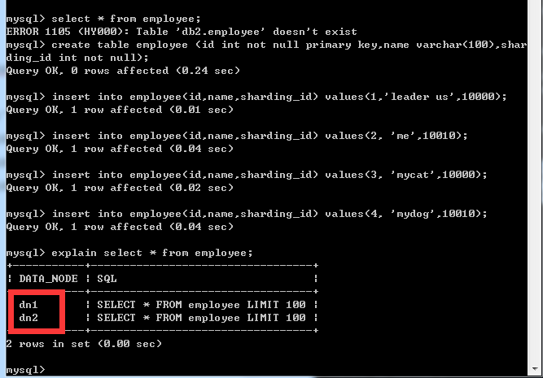

[TOC]


# mycat 入门教程

2016年06月02日 16:48:46

阅读数：7136

### 作用

mycat就是一个数据库中间件，数据库的代理，它屏蔽了物理数据库，应用连接mycat，然后mycat再连接物理数据库 
它支持水平拆分（分库分表，通过分库达到分表)，支持多种分片规则，比如范围切片、自然月分片、hash取模分片等 
它支持mysql、oracle、mongodb、sql server，并且支持数据库集群。

使用网上的两张图片表示mycat解决的问题

#### 没有mycat前


### 有了mycat后


### 入门教程

- 去[github](https://github.com/MyCATApache/Mycat-download)下载，Mycat-server-x.x.x-RELEASE-xxxxxxxxxx-win.tar.gz 
  
- 解压后，修改mycat_home\conf\schema.xml中的url、user、password 
  
- 修改mycat_home\conf\server.xml 
  
- 进入mycat_home\bin，启动mycat 
  
- **登录物理数据库**，创建db1、db2、db3

```
 mysql -u[username] -p -P33061
create database db1;
create database db2;
create database db3; 
```

- 客户端连接mycat，注意**连接的是mycat**而不是物理数据库，mycat默认端口号8066

```
 mysql -u[username] -p -P80661
```


- 查看表，默认显示schema.xml中配置的表，实际上此时物理数据库没有表，所以查询employee会出错 
  登录物理数据库。 
  
- mycat中，创建employee表，插入数据

```
create table employee (id int not null primary key,name varchar(100),sharding_id int not null);
insert into employee(id,name,sharding_id) values(1,'leader us',10000);
insert into employee(id,name,sharding_id) values(2, 'me',10010);
insert into employee(id,name,sharding_id) values(3, 'mycat',10000);
insert into employee(id,name,sharding_id) values(4, 'mydog',10010);
```

- mycat中，执行计划显示来自两个数据节点，与schema.xml中配置的一致 
  
- 物理数据库中，mycat创建了employee表，查看数据，可以发现数据实现了分片 
  

db1中的employee数据，id为1、3两条数据 


db2中的employee数据，id为2、4两条数据  

### 配置文件介绍

- schema.xml 配置schema、datanode、datahost 
  - schema就是逻辑数据库，它包含table（逻辑表）,表中有对应的datanode、分片规则
  - datanode，就是逻辑数据库，含有物理数据库名字
  - datahost，就是物理数据库的ip地址，用户名、密码等
- server.xml 配置连接mycat的用户名、密码、数据库名
- rule.xml 分片规则


### 后记

最初我是想着mycat可以实现同一个库，某个表的切片而研究的mycat(比如db1中某个employee表，拆分为employee1-99,employee100-199,employee299-299….)。经过上述研究，发现**mycat是通过分库而达到的分表**，所以是不支持我最初的需求的。

### 参考

[https://github.com/MyCATApache/Mycat-doc/blob/master/%E5%85%A5%E9%97%A8%E6%8C%87%E5%8D%97/mycat%E5%AE%89%E8%A3%85%E5%85%A5%E9%97%A8(%E4%B8%A4%E8%8A%82%E7%82%B9).md](https://github.com/MyCATApache/Mycat-doc/blob/master/%E5%85%A5%E9%97%A8%E6%8C%87%E5%8D%97/mycat%E5%AE%89%E8%A3%85%E5%85%A5%E9%97%A8%28%E4%B8%A4%E8%8A%82%E7%82%B9%29.md) 


https://blog.csdn.net/wangjun5159/article/details/51568249