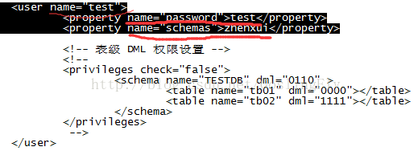
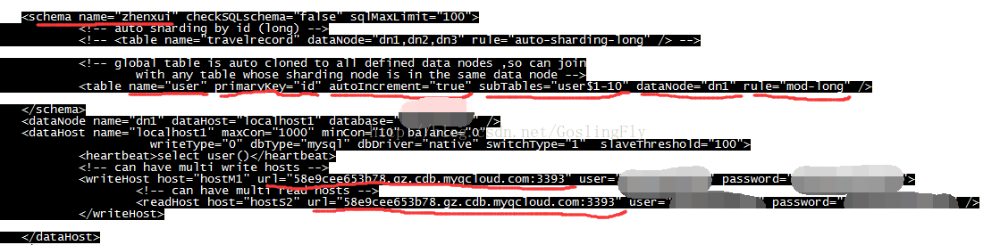
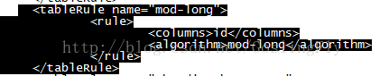
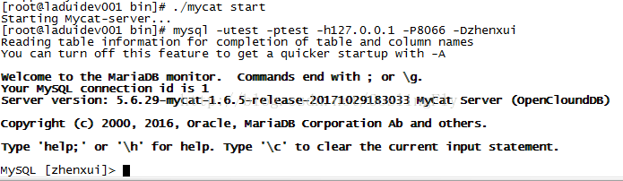
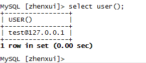
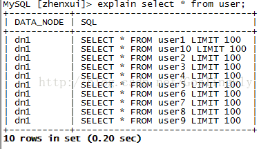
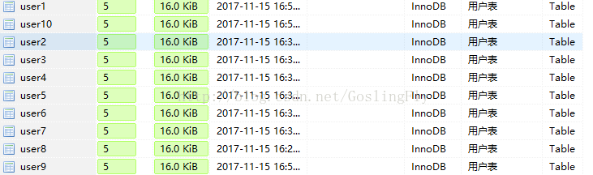
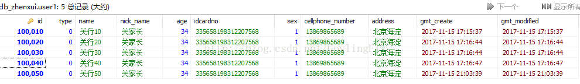

# 使用Mycat做MySQL单库分表

## 一、Mycat安装部署

      安装环境Linux
目前只有1.6.5版本支持单库分表。
下载Mycat 1.6.5     wget http://dl.mycat.io/1.6.5/Mycat-server-1.6.5-release-20171029183033-linux.tar.gz 
解压后，修改配置文件，在mycat/conf下

### 1.修改server.xml

设置user name，password及schemas，  name和password要在Mycat连接MySQL数据库时使用，schemas是逻辑库，要和schema.xml里的schema name对应。

### 2.修改schema.xml

如图，schema name要和server.xml对应上，user表设置分表十张，只能设置一个datanote，rule采用取模模式mod-long。 writeHost和readHost设为同一台数据库。

### 3.修改rule.xml

此次选用默认的mod-long规则，只需修改count数，对应上subTables数即可。

修改property count 等于10。
这样，配置已经完成。

## 二、启动Mycat及连接MySQL

先在MySQL库上，建10张表，user1-user10。

### 1.进入Mycat包下的bin目录，启动Mycat   

./mycat start

### 2.连接MySQL  

 mysql -utest -ptest -h127.0.0.1 -P8066 -Dzhenxui

### 3.查询Mycat用户

### 4.查询分表

10张子表全部查出

### 5.往库中insert数据

之前已经插入40条数据。  由图可以得知，50条数据是均分到10张子表上。
注：插入时要自己写ID。

由此，实现MySQL单库分表及实现数据均分。

https://blog.csdn.net/goslingfly/article/details/78573716

