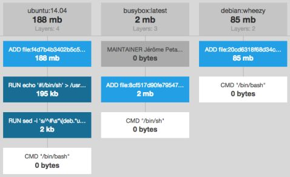

# Dockerfile ENTRYPOINT和CMD的区别

 

*翻译:Dockerfile: ENTRYPOINT vs CMD*

在我们查阅Dockerfile的[官方文档](https://link.zhihu.com/?target=https%3A//docs.docker.com/engine/reference/builder/)时, 有可能发现一些命令的功能重复(至少看起来干的事情差不多), 我已经在[上文](https://link.zhihu.com/?target=https%3A//www.ctl.io/developers/blog/post/dockerfile-add-vs-copy/)分析过ADD和COPY命令的区别(他们功能类似), 现在我们分析另外2个命令, 他们的功能也非常类似, 是CMD和ENTRYPOINT.

尽管ENTRYPOINT和CMD都是在docker image里执行一条命令, 但是他们有一些微妙的区别. 在绝大多数情况下, 你只要在这2者之间选择一个调用就可以. 但他们有更高级的应用, CMD和ENTRYPOINT组合起来使用, 完成更加丰富的功能.

## ENTRYPOINT还是CMD?

从根本上说, ENTRYPOINT和CMD都是让用户指定一个可执行程序, 这个可执行程序在container启动后自动启动. 实际上, 如果你想让自己制作的镜像自动运行程序(不需要在docker run后面添加命令行指定运行的命令), 你必须在Dockerfile里面, 使用ENTRYPOINT或者CMD命令

比如执行运行一个没有调用ENTRYPOINT或者CMD的docker镜像, 一定返回错误

```
$ docker run alpine
FATA[0000] Error response from daemon: No command specified
```

大部分Linu发行版的基础镜像里面调用CMD命令, 指定容器启动后执行/bin/sh或/bin/bash. 这样镜像启动默认进入交互式的shell



*译注: 3个不同的Linux镜像(ubuntu, busybox, debian)都在Dockerfile的最后调用 CMD '/bin/bash'*

启动Linux发行版的基础container后, 默认调用shell程序, 符合大多数人的习惯.

但是, 作为开发者, 你希望在docker镜像启动后, 自动运行其他程序. 所以, 你需要用CMD或者ENTRYPOINT命令显式地指定具体的命令.

## 覆盖(Overrides)

在写Dockerfile时, ENTRYPOINT或者CMD命令会自动覆盖之前的ENTRYPOINT或者CMD命令.

在docker镜像运行时, 用户也可以在命令指定具体命令, 覆盖在Dockerfile里的命令.

比如, 我们写了一个这样的Dockerfile:

```
FROM ubuntu:trusty
CMD ping localhost 
```

如果根据这个Dockerfile构建一个新image, 名字叫demo

```
$ docker run -t demo
PING localhost (127.0.0.1) 56(84) bytes of data.
64 bytes from localhost (127.0.0.1): icmp_seq=1 ttl=64 time=0.051 ms
64 bytes from localhost (127.0.0.1): icmp_seq=2 ttl=64 time=0.038 ms
^C
--- localhost ping statistics ---
2 packets transmitted, 2 received, 0% packet loss, time 999ms
rtt min/avg/max/mdev = 0.026/0.032/0.039/0.008 ms
```

可以看出**ping**命令在docker启动后自己执行, 但是我们可以在命令行启动docker镜像时, 执行其他命令行参数, 覆盖默认的CMD

```
$ docker run demo hostname
6c1573c0d4c0
```

docker启动后, 并没有执行**ping**命令, 而是运行了**hostname**命令

和CMD类似, 默认的ENTRYPOINT也在docker run时, 也可以被覆盖. 在运行时, 用--entrypoint覆盖默认的ENTRYPOINT

```
$ docker run --entrypoint hostname demo
075a2fa95ab7 
```

因为CMD命令很容易被docker run命令的方式覆盖, 所以, 如果你希望你的docker镜像的功能足够灵活, 建议在Dockerfile里调用CMD命令. 比如, 你可能有一个通用的Ruby镜像, 这个镜像启动时默认执行irb (*CMD irb*).

如果你想利用这个Ruby镜像执行任何Ruby脚本, 只需要执行这句话:

```
docker run ruby ruby -e 'puts "Hello"
```

*译注: ruby -e 'puts "Hello" 覆盖了 irb 命令*

相反, ENTRYPOINT的作用不同, 如果你希望你的docker镜像只执行一个具体程序, 不希望用户在执行docker run的时候随意覆盖默认程序. 建议用ENTRYPOINT.

Docker在很多情况下被用来打包一个程序. 想象你有一个用python脚本实现的程序, 你需要发布这个python程序. 如果用docker打包了这个python程序, 你的最终用户就不需要安装python解释器和python的库依赖. 你可以把所有依赖工具打包进docker镜像里, 然后用

ENTRYPOINT指向你的Python脚本本身. 当然你也可以用CMD命令指向Python脚本. 但是通常用ENTRYPOINT可以表明你的docker镜像只是用来执行这个python脚本,也不希望最终用户用这个docker镜像做其他操作.

在后文会介绍如何组合使用ENTRYPOINT和CMD. 他们各自独特作用会表现得更加明显.

## Shell vs. Exec

ENTRYPOINT和CMD指令支持2种不同的写法: shell表示法和exec表示法. 下面的例子使用了shell表示法:

```
CMD executable  param1 param2
```

当使用shell表示法时, 命令行程序作为sh程序的子程序运行, docker用/bin/sh -c的语法调用. 如果我们用docker ps命令查看运行的docker, 就可以看出实际运行的是/bin/sh -c命令

```
$ docker run -d demo
15bfcddb11b5cde0e230246f45ba6eeb1e6f56edb38a91626ab9c478408cb615

$ docker ps -l
CONTAINER ID IMAGE COMMAND CREATED
15bfcddb4312 demo:latest "/bin/sh -c 'ping localhost'" 2 seconds ago 
```

我们再次运行demo镜像, 可以看出来实际运行的命令是/bin/sh -c 'ping localhost'.

虽然shell表示法看起来可以顺利工作, 但是它其实上有一些小问题存在. 如果我们用docker ps命令查看正在运行的命令, 会有下面的输出:

```
$ docker exec 15bfcddb ps -f
UID PID PPID C STIME TTY TIME CMD
root 1 0 0 20:14 ? 00:00:00 /bin/sh -c ping localhost
root 9 1 0 20:14 ? 00:00:00 ping localhost
root 49 0 0 20:15 ? 00:00:00 ps -f 
```

PID为1的进程并不是在Dockerfile里面定义的ping命令, 而是/bin/sh命令. 如果从外部发送任何POSIX信号到docker容器, 由于/bin/sh命令不会转发消息给实际运行的ping命令, 则不能安全得关闭docker容器(参考更详细的文档:[Gracefully Stopping Docker Containers](https://link.zhihu.com/?target=https%3A//www.ctl.io/developers/blog/post/gracefully-stopping-docker-containers/)).

*译注: 在上面的ping的例子中, 如果用了shell形式的CMD, 用户按ctrl-c也不能停止ping命令, 因为ctrl-c的信号没有被转发给ping命令*

除了上面的问题, 如果你想build一个超级小的docker镜像, 这个镜像甚至连shell程序都可以没有. shell的表示法没办法满足这个要求. 如果你的镜像里面没有/bin/sh, docker容器就不能运行.

A better option is to use the *exec form* of the ENTRYPOINT/CMD instructions which looks like this:

一个更好的选择是用exec表示法:

```
CMD ["executable","param1","param2"] 
```

Let's change our Dockerfile from the example above to see this in action:

CMD指令后面用了类似于JSON的语法表示要执行的命令. 这种用法告诉docker不需要调用/bin/sh执行命令.

我们修改一下Dockerfile, 改用exec表示法:

```
FROM ubuntu:trusty
CMD ["/bin/ping","localhost"] 
```

重新build镜像, 用docker ps命令检查效果:

```
$ docker build -t demo .
[truncated]

$ docker run -d demo
90cd472887807467d699b55efaf2ee5c4c79eb74ed7849fc4d2dbfea31dce441

$ docker ps -l
CONTAINER ID IMAGE COMMAND CREATED
90cd47288780 demo:latest "/bin/ping localhost" 4 seconds ago 
```

现在没有启动/bin/sh命令, 而是直接运行/bin/ping命令, ping命令的PID是1. 

**无论你用的是ENTRYPOINT还是CMD命令, 都强烈建议采用exec表示法,**

## ENTRYPOINT 和 CMD组合使用

之前只讨论了用ENTRYPOINT或者CMD之一指定image的默认运行程序, 但是在某种情况下, 组合ENTRYPOINT和CMD能发挥更大的作用.

组合使用ENTRYPOINT和CMD, ENTRYPOINT指定默认的运行命令, CMD指定默认的运行参数. 例子如下:

```dockerfile
FROM ubuntu:trusty
ENTRYPOINT ["/bin/ping","-c","3"]
CMD ["localhost"] 
```

根据上面的Dockerfile构建镜像, 不带任何参数运行docker run命令

```shell
$ docker build -t ping .
[truncated]

$ docker run ping
PING localhost (127.0.0.1) 56(84) bytes of data.
64 bytes from localhost (127.0.0.1): icmp_seq=1 ttl=64 time=0.025 ms
64 bytes from localhost (127.0.0.1): icmp_seq=2 ttl=64 time=0.038 ms
64 bytes from localhost (127.0.0.1): icmp_seq=3 ttl=64 time=0.051 ms

--- localhost ping statistics ---
3 packets transmitted, 3 received, 0% packet loss, time 1999ms
rtt min/avg/max/mdev = 0.025/0.038/0.051/0.010 ms

$ docker ps -l
CONTAINER ID IMAGE COMMAND CREATED
82df66a2a9f1 ping:latest "/bin/ping -c 3 localhost" 6 seconds ago 
```

上面执行的命令是ENTRYPOINT和CMD指令拼接而成. ENTRYPOINT和CMD同时存在时, docker把CMD的命令拼接到ENTRYPOINT命令之后, 拼接后的命令才是最终执行的命令. 但是由于上文说docker run命令行执行时, 可以覆盖CMD指令的值. 如果你希望这个docker镜像启动后不是ping localhost, 而是ping其他服务器,, 可以这样执行docker run:

```shell
$ docker run ping docker.io
PING docker.io (162.242.195.84) 56(84) bytes of data.
64 bytes from 162.242.195.84: icmp_seq=1 ttl=61 time=76.7 ms
64 bytes from 162.242.195.84: icmp_seq=2 ttl=61 time=81.5 ms
64 bytes from 162.242.195.84: icmp_seq=3 ttl=61 time=77.8 ms

--- docker.io ping statistics ---
3 packets transmitted, 3 received, 0% packet loss, time 2003ms
rtt min/avg/max/mdev = 76.722/78.695/81.533/2.057 ms

$ docker ps -l --no-trunc
CONTAINER ID IMAGE COMMAND CREATED
0d739d5ea4e5 ping:latest "/bin/ping -c 3 docker.io" 51 seconds ago
```

运行docker镜像, 感觉上和执行任何其他的程序没有区别 --- 你指定要执行的程序(ping) 和 指定ping命令需要的参数.

注意到参数-c 3, 这个参数表示ping请求只发送3次, 这个参数包括在ENTRYPOINT里面, 相当于硬编码docker镜像中. 每次执行docker镜像都会带上这个参数, 并且也不能被CMD参数覆盖.

## 永远使用Exec表示法

组合使用ENTRYPOINT和CMD命令式, 确保你一定用的是Exec表示法. 如果用其中一个用的是Shell表示法, 或者一个是Shell表示法, 另一个是Exec表示法, 你永远得不到你预期的效果.

下表列出了如果把Shell表示法和Exec表示法混合, 最终得到的命令行, 可以看到如果有Shell表示法存在, 很难得到正确的效果:

```
Dockerfile    Command

ENTRYPOINT /bin/ping -c 3
CMD localhost               /bin/sh -c '/bin/ping -c 3' /bin/sh -c localhost


ENTRYPOINT ["/bin/ping","-c","3"]
CMD localhost               /bin/ping -c 3 /bin/sh -c localhost

ENTRYPOINT /bin/ping -c 3
CMD ["localhost"]"          /bin/sh -c '/bin/ping -c 3' localhost

ENTRYPOINT ["/bin/ping","-c","3"]
CMD ["localhost"]            /bin/ping -c 3 localhost
```

从上面看出, 只有ENTRYPOINT和CMD都用Exec表示法, 才能得到预期的效果

## 结论

如果你想让你的docker image做真正的工作, 一定会在Dockerfile里用到ENTRYPOINT或是CMD. 但是请注意,这2个命令不是互斥的. 在很多情况下, 你可以组合ENTRYPOINT和CMD命令, 提升最终用户的体验.


https://zhuanlan.zhihu.com/p/30555962