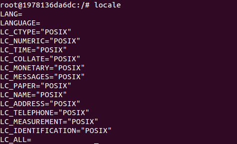
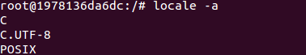

# 解决docker debian 容器中文乱码，修改docker容器编码格式

  前台上传文件到服务器后，服务器返回给前台的文件列表中出现中文乱码，所有的中文文件名全部变成？，英文文件名则正常显示。

  问题经过定位，发现后台代码的multipartfile类在执行transterto的方法时就发生了此异常，然而配置文件集中的multipartResolver以及encodingFilter均已经设置成了UTF-8，排除代码异常。kubectl exec进入到docker容器中进行查看时发现，文件在容器中也是中文文件名显示异常。查看docker容器编码格式：执行locale命令；可以看到当前编码格式为POSIX，而这种编码格式不支持中文

  

  **解决办法**：locale -a查看容器所有语言环境

  

  C.UTF-8可以支持中文，只需要把容器编码设置为C.UTF-8即可

   1.临时修改：

```
locale
locale -a
LANG=C.UTF-8  (有的是zh_CN.UTF-8，不过我在本地没发现这种编码)
source /etc/profile
```

  2.永久修改：修改Dockerfile

​      在Dockerfile中添加一行

```
  ENV LANG C.UTF-8
```

​      重新制作docker镜像，docker run -ti [镜像] 进入容器后执行locale发现编码格式已经被修改为C.UTF-8，之前出现的中文文件名乱码问题也没有了。


https://www.cnblogs.com/z-belief/p/6148463.html