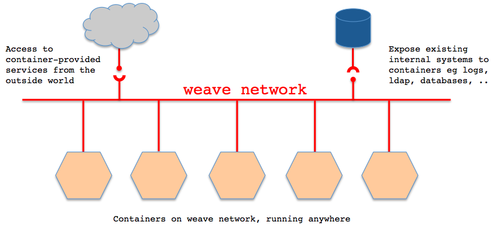
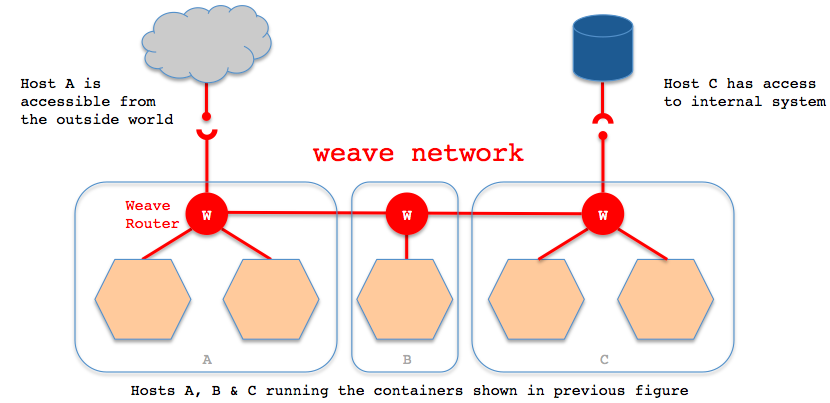
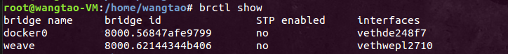
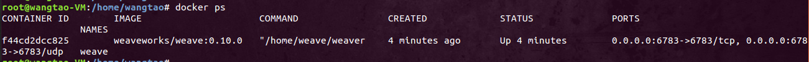

[TOC]


# docker Weave实现跨主机容器互联

Docker的原生网络支持非常有限，且没有跨主机的集群网络方案。目前实现Docker网络的开源方案有Weave、Kubernetes、Flannel、Pipework以及SocketPlane等，其中Weave被评价为目前最靠谱的，那么这里就对Weave的基本原理及使用方法做个总结。


# **简介**

Weave是由Zett.io公司开发的，它能够创建一个虚拟网络，用于连接部署在多台主机上的Docker容器，这样容器就像被接入了同一个网络交换机，那些使用网络的应用程序不必去配置端口映射和链接等信息。外部设备能够访问Weave网络上的应用程序容器所提供的服务，同时已有的内部系统也能够暴露到应用程序容器上。Weave能够穿透防火墙并运行在部分连接的网络上，另外，Weave的通信支持加密，所以用户可以从一个不受信任的网络连接到主机。






# **安装与启动**

直接从github下载二进制文件安装。

```
# sudo wget -O /usr/local/bin/weave https://raw.githubusercontent.com/zettio/weave/master/weave
# sudo chmod a+x /usr/local/bin/weave
```

启动weave路由器，这个路由器其实也是以容器的形式运行的。

```
# weave launch
Unable to find image 'zettio/weave' locally
......
```

此时会发现有两个网桥，一个是Docker默认生成的，另一个是Weave生成的。 



接下来就可以运行应用容器，使用weave提供的网络功能了。

------

# **简单使用**

**准备** 
\1. host1: 10.0.2.6 
\2. host2: 10.0.2.8 
\3. host1上的应用容器1: 192.168.0.2/24 host1上的应用容器2: 192.168.1.2/24 
\4. host2上的应用容器1: 192.168.0.3/24 
两台机上均安装Docker及Weave，并均启动好Weave路由容器。

在两台机上均启动一个应用容器。可以直接使用`weave run`命令，也可以先使用`docker run`启动好容器，然后使用`weave attach`命令给容器绑定IP地址。

```
# weave run 192.168.0.2/24 -itd ubuntu bash
```

或者

```
# docker run -itd ubuntu bash
# weave attach 192.168.0.2/24 $ID
```

此时发现两个容器之间是不通的，需要使用`weave connect`命令在两台weave的路由器之间建立连接。

```
# weave connect 10.0.2.8
```

会发现，此时位于两台不同主机上的容器之间可以相互ping通了。但是处于不同子网的两个容器是不能互联的，这样我们就可以使用不同子网进行容器间的网络隔离了。

我们会发现，如果不使用Docker的原生网络，在容器内部是不能访问宿主机以及外部网络的。此时我们可以使用`weave expose 192.168.0.1/24`来给weave网桥添加IP，以实现容器与宿主机网络连通。但是，此时在容器内部依然不能访问外部网络。 
我们可以同时使用Docker的原生网络和weave网络来实现容器互联及容器访问外网和端口映射。使用外部网络及端口映射的时候就使用docker0网桥，需要容器互联的时候就使用weave网桥。每个容器分配两个网卡。

------

# **其他特性**

- 应用隔离：不同子网容器之间默认隔离的，即便它们位于同一台物理机上也相互不通（使用-icc=false关闭容器互通）；不同物理机之间的容器默认也是隔离的
- 安全性：可以通过weave launch -password wEaVe设置一个密码用于weave peers之间加密通信
- 查看weave路由状态：weave ps

------

# **问题**

1. 容器重启问题 
   如果使用weave，则就不能再使用docker自带的auto-restart feature（如docker run –restart=always redis），因为weave是在docker之外为容器配置的网络，容器重启的时候docker本身不会做这些事情。因而，还需额外的工具来管理容器的状态（比如systemd, upstart等），这些工具要调用weave命令（weave run/start/attach）来启动容器。

------

参考文档 
\1. <http://www.cnblogs.com/feisky/p/4093717.html> 
\2. <http://www.51gocloud.com/?p=1260> 
\3. <http://debugo.com/docker-weave/> 


https://blog.csdn.net/wangtaoking1/article/details/45244525