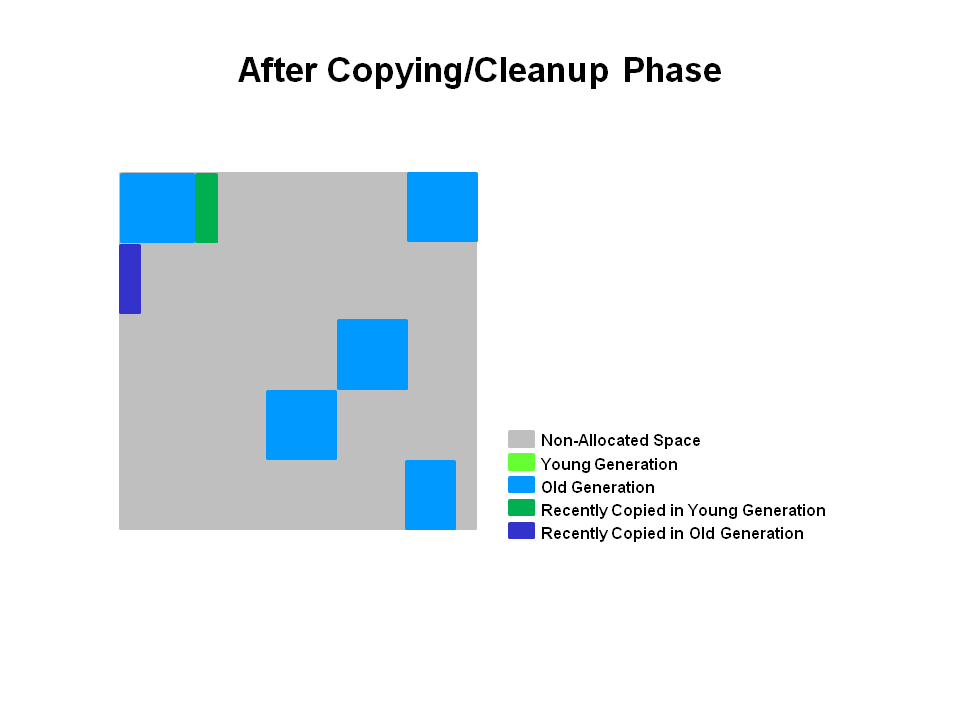

[TOC]

# G1收集器与CMS收集器的对比与实战

## Concurrent Mark and Sweep - CMS垃圾收集器

### 简介

CMS（Concurrent Mark and Sweep）是以牺牲吞吐量为代价来获得最短停顿时间的垃圾回收器，主要适用于对响应时间的侧重性大于吞吐量的场景。**仅针对老年代（Tenured Generation）的回收**。

[](javascript:popUp('/content/images/chap1_9780133796827/elementLinks/01fig03_alt.jpg'))

为求达到该目标主要是因为以下两个原因：

1. 没有采取compact操作，而是简单的mark and sweep，同时维护了一个free list来管理内存空间，所以也产生了大量的内存碎片。
2. mark and sweep分为多个阶段，其中大部分的阶段的GC线程是和用户线程并发执行，默认的GC线程数为物理CPU核心数的1/4。

因为是并发地进行清理，所以必须**预留**部分堆空间给正在运行的应用程序，默认情况下在老年代使用了68%及以上的内存的时候就开始CMS。

### 过程

- 初始标记（initial mark）**Stop The World**

  

  本阶段需要stop the world，一是标记老年代中所有的GC Roots所指的**直接对象**；二是标记被年轻代中存活对象引用的**直接对象**。因为仅标记少量节点，所以很快就能完成。

- 并发标记（concurrent mark）

  

  在初始标记的基础上继续往下遍历其他的对象引用并进行标记，，该过程会和用户线程**并发**地执行，不会发生停顿。这个阶段会从initial mark阶段中所标记的节点往下检索，标记出所有老年代中存活的对象。注意此时会有部分对象的引用被改变，如上图中的current obj原本所引用的节点已经失去了关联。

- 并发预清理（concurrent preclean）

  

  前一个阶段在并行运行的时候，一些对象的引用已经发生了变化，当这些引用发生变化的时候，JVM会标记堆的这个区域为Dirty Card，这就是 Card Marking。

  

  在本阶段，那些能够从dirty card对象到达的对象也会被标记，这个标记做完之后，dirty card标记就会被清除了，如上图所示。

  总的来说，本阶段会**并发地**更新并发标记阶段的引用变化和查找在并发标记阶段新进入老年代的对象，如刚晋升的对象和直接被分配在老年代的对象。通过重新扫描，以减少下一阶段的工作。

- 可中止的并发预清理（concurrent abortable preclean）

  这个阶段尝试着去承担STW的Final Remark阶段足够多的工作。这个阶段持续的时间依赖好多的因素，由于这个阶段是重复的做相同的事情直到发生aboart的条件之一（比如：重复的次数、多少量的工作、持续的时间等等）才会停止。

- 重新标记 / 最终标记（final remark）**Stop The World**

  本阶段需要stop the world，通常来说此次暂时都会比较长，因为并发预清理是并发执行的，对象的引用可能会发生进一步的改变，需要确保在清理之前保持一个正确的对象引用视图，那么就需要stop the world来处理复杂的情况。

- 并发清理（concurrent sweep）

  

  使用标记-清除法回收**老年代**的垃圾对象，与用户线程并发执行。

- 并发标记重置（concurrent reset）

  清空现场，为下一次GC做准备。

### GC参数

`-XX:+UseConcMarkSweepGC` - 启用CMS，同时-XX:+UseParNewGC会被自动打开。

`-XX:CMSInitiatingOccupancyFraction` - 设置第一次启动CMS的阈值，默认是68%。

`-XX:+UseCMSInitiatingOccupancyOnly` - 只是用设定的回收阈值，如果不指定，JVM仅在第一次使用设定值，后续则自动调整。

`-XX:+CMSPermGenSweepingEnabled` - 回收perm区。

`-XX:+CMSClassUnloadingEnabled` - 相对于并行收集器，CMS收集器默认不会对永久代进行垃圾回收（在1.7中是默认关闭，但是在1.8中是默认打开的）。如果希望对永久代进行垃圾回收，则可以打开此标志，同时打开`-XX:+CMSPermGenSweepingEnabled`。

`-XX:+CMSConcurrentMTEnabled` - 并发的CMS阶段将会启动多个GC线程和其他线程并发工作，默认为true。

`-XX:+UseCMSCompactAtFullCollection` - 在full GC的时候进行整理(mark sweep compact)，**默认为true**。

`-XX:+CMSFullGCsBeforeCompaction` - 在上一次CMS并发GC执行过后，到底还要再执行多少次**full GC**（注意不是CMS GC）才会做压缩，默认是0。如果增大这个参数，会使full GC更少做压缩，但也就更容易使CMS的老年代受碎片化问题的困扰。 本来这个参数就是用来配置降低full GC压缩的频率，以期减少某些full GC的暂停时间。CMS回退到full GC时用的算法是mark-sweep-compact，但compaction是可选的，不做的话碎片化会严重些但这次full GC的暂停时间会短些，这是个取舍。

`-XX:+CMSParallelRemarkEnabled` - 并行remark，以减少remark的等待时间，但是会与用户线程进行资源抢夺。默认为true。

`-XX:+CMSScavengeBeforeRemark` - 强制remark之前开始一次minor GC，可以减少remark的等待时间，因为老生代的对象有的会依赖于新生代的对象，当增加了这个命令时会在remark之前执行一次minor GC的操作，从而可以减少老生代到新生代的可到达对象数。默认为false。

### Promotion Failed


由于CMS没有任何的碎片整理机制，所以会产生大量的堆碎片。因此可能会发生即使堆的大小没有耗尽，但是从新生代晋升至老年代却失败的情况。此时会fallback为Serial Old从而引起一次full GC（会进行碎片整理）。可以增加老年代的大小和Survivor区的大小以减少full GC的发生。

### Concurrent Mode Failed

如果对象分配率高于CMS回收的效率，将导致在CMS完成之前老年代就被填满，这种状况成为“并发模式失败”，同样也会引起full GC。可以调节-XX:CMSInitiatingOccupancyFraction和新生代的堆大小。

## Garbage First - G1垃圾收集器

### 简介

G1收集器（或者垃圾优先收集器）的设计初衷是为了尽量缩短处理超大堆时产生的停顿。在回收的时候将对象从一个小堆区复制到另一个小堆区，这意味着G1在回收垃圾的时候同时完成了堆的部分内存压缩，相对于CMS的优势而言就是内存碎片的产生率大大降低。


heap被划分为一系列大小相等的“小堆区”，也称为region。每个小堆区（region）的大小为1~32MB，整个堆**大致**要划分出2048个小堆区。

与上一代的垃圾收集器一样在逻辑上被划分Eden、Survivor和老年代，但是各种角色的region个数都不是固定的。**上图**的绿色代表Eden小堆区、黄色为Survivor小堆区、蓝色则为老年代小堆区、而灰色则会未被使用的区域。

### young GC

young GC主要是对Eden区进行GC，它在Eden空间耗尽时会被触发。在这种情况下，Eden空间存活的对象会被**撤离**（代表复制或者移动）到另外**一个或是多个**Survivor小堆区，如果Survivor空间不够，Eden空间的部分数据会直接晋升到年老代空间。Survivor区的数据移动到新的Survivor区中，也有部分数据晋升到老年代空间中。最终Eden空间的数据为空，GC停止工作，应用线程继续执行。

NOTE：注意上面一段话中有一个用词— 撤离。英语原意为evacuate，为从一个区域复制或移动到其他区域的意思。如果有阅读国内其他关于G1的文章，可以留意到有些博主将其翻译为”疏散“或者”转移“（转移就不是evacuate的本意了），因为译法的不同所以这里特地拿出来说明一下，为免阅读其他文章会对不同译法而感到蒙圈。


本阶段如同老一代的垃圾收集器一般，会有Stop The World暂停。同时计算出Eden的大小和Survivor的大小，为下一次young GC做准备。Accounting信息会被保存用于计算大小。如目标暂停时间的东西会被纳入考虑范围当中。这种方法使得resize小堆区更加容易，使小堆区可以根据需要变得更大或者更小。

最后，存活的对象会被撤离至Survivor小堆区和老年代小堆区，如下图所示。


最近被晋升至老年代的对象用深蓝色表示，Survivor小堆区用绿色表示。

简而言之，G1的young GC规范如下：

- 堆从一个单一的内存空间被划分为众多的小堆区（region）。
- 新生代的内存由一系列不连续的小堆区所组成。这使得在需要的时候更加容易进行resize。
- young GC是一个STW事件，所有应用程序线程都会被暂停。
- young GC会使用多线程并行执行。
- 存活的对象将会复制到新的Survivor小堆区或者老年代小堆区。

### mixed GC

#### 并发标记阶段 - Concurrent Marking Phase

1. 初始标记阶段 - Initial Marking Phase（STW）

   存活对象的初始标记是捎带在新生代垃圾收集里面，在GC日志里被记录为`GC pause (young)(inital-mark)`。

   注：我知道上面说的不太像是人话，英文原意为`Initial marking of live object is piggybacked on a young generation garbage collection.` 可以理解为本阶段与新生代的垃圾回收是密切相关的，另外在本阶段会对GC Roots进行标记。

   

2. 并发标记阶段 - Concurrent Marking Phase

   本阶段会与应用程序并发地查找存活的对象，如果找到了空的小堆区（下图中标记为红叉的），他们会在”重新标记阶段“被马上清除。还有决定了活跃度的”accounting“信息也是在本阶段计算的。

   

3. 重新标记阶段 - Remark Phase（STW）

   对于G1，它短暂地停止应用线程，停止并发更新日志的写入，处理其中的少量信息，并标记所有在并发标记开始时未被标记的存活对象。这一阶段也执行某些额外的清理，如引用处理（参见 Evacuation Pause log）或者类卸载（class unloading）。空的小堆区被清除和回收，并且现在会计算所有小堆区的活跃度。

   

4. 复制/清除阶段 - Copying/Cleanup Phase（部分STW）

   

   - 清除阶段
     - 执行存活对象的accounting和完全释放空的小堆区（STW）；
     - 擦除RSets（RSets全称为Remembered Sets，作用是跟踪从外部指向本小堆区的所有引用。主要是记录老年代到新生代之间的引用的一个集合，至于新生代之间的引用记录会在每次GC时被扫描，所以不用记录新生代到新生代之间的引用）（STW）
     - 重置空的小堆区并将他们归还给free list，也就是空闲表。（Concurrent）
   - 复制阶段
     - 本阶段有STW停顿去撤离存活对象到新的未被使用的区域。在新生代小堆区完成时会被记录为 `[GC pause (young)]`，如果在新生代和老年代的小堆区一起执行时会被记录为`[GC Pause (mixed)]`

   G1会优先选择活跃度最低的小堆区，因为这些区域会被最快地的回收。还有**新生代和老年代**都会在本阶段被回收。

   

5. 复制/清除阶段后 - After Copying/Cleanup Phase

   

   如下图所示，所选择的小堆区都被回收和整理为深蓝色的小堆区和深绿色的小堆区。

   

   总结一下G1收集器对老年代的收集

   - 并发标记阶段
     - 在应用程序运行时并发地计算活跃度信息
     - 活跃度信息甄别出哪个小堆区是在撤离暂停时最适合回收的
   - 重新标记阶段
     - 使用Snapshot-at-the-Beginning (SATB) 算法，这个算法比CMS所使用的要快得多
     - 回收空的小堆区
   - 复制/清除阶段
     - 新生代和老年代同时被回收
     - 老年代的小堆区会根据活跃度而进行部分的选定

### GC参数

`-XX:+UseG1GC` 启用G1垃圾收集器

`-XX:MaxGCPauseMillis=n` 指定期望的最大停顿时间，有大概率保证在该范围内，但并非一定能实现。

`-XX:G1HeapRegionSize=n` 设置的 G1 区域的大小。值是 2 的幂，范围是 1 MB 到 32 MB 之间。目标是根据最小的 Java 堆大小划分出约 2048 个区域。

`-XX:ParallelGCThreads=n` 设置 STW 工作线程数的值。将 n 的值设置为逻辑处理器的数量。n 的值与逻辑处理器的数量相同，最多为 8。如果逻辑处理器不止八个，则将 n 的值设置为逻辑处理器数的 5/8 左右。这适用于大多数情况，除非是较大的 SPARC 系统，其中 n 的值可以是逻辑处理器数的 5/16 左右。

`-XX:ConcGCThreads=n` 设置并行标记的线程数。将 n 设置为并行垃圾回收线程数 (ParallelGCThreads) 的 1/4 左右。

`-XX:InitiatingHeapOccupancyPercent=45` 设置触发标记周期的 Java 堆占用率阈值。默认占用率是整个 Java 堆的 45%。

`-XX:G1ReservePercent=n` 设置堆内存保留为假天花板的总量，以降低提升失败的可能性，默认值是 10。

**NOTE**：避免使用 -Xmn 选项或 -XX:NewRatio 等其他相关选项显式设置年轻代大小。固定年轻代的大小会覆盖暂停时间目标。

## CMS与G1的实战对比

以下所有示例通过[GCViewer](https://github.com/chewiebug/GCViewer)图像化，如有任何概念上的疑惑，请先细心阅读该仓库的README文档。以下我们有针对性地测试两种收集器之间对新生代和老年代的回收效率的影响。

### 测试环境

MacOS 10.12.5（2.9 GHz Intel Core i5, 16 GB 2133 MHz LPDDR3）

java 1.8.0_111

### 新生代测试

#### 测试代码

本代码用于快速产生众多无用的对象，测试minor GC的速度，当执行完指定次数的任务后线程自动结束。

```
public class HighAllocationRate implements Runnable {

    private static volatile Double sensorValue;

    @Override
    public void run() {
        // 这里就是一个专有线程，不停读取传感器的值，由于sensorValue是包装类型，所以会不断产生新的对象
        while (true) {
            sensorValue = Math.random();
        }
    }

    private static void processSensorValue(Double value) {
        // 虽然形参没有真正被赋值给任一引用，但是这里是模拟了外部传入值，这里会进行各种操作
        if (value != null) {
            // Be warned: may take more than one usec on some machines, especially Windows
            LockSupport.parkNanos(1000);
        }
    }

    public static void main(String[] args) {
        int iterations = args.length > 0 ? Integer.parseInt(args[0]) : 30_000_000;

        initSensor();

        for (int i = 0; i < iterations; i++) {
            processSensorValue(sensorValue);
        }
    }

    private static void initSensor() {
        Thread sensorReader = new Thread(new HighAllocationRate());
        // 当主线程结束时守护线程自动结束
        sensorReader.setDaemon(true);
        sensorReader.start();
    }

}
```

#### CMS执行情况

据GCViewer的报告，本程序运行2m27s，吞吐率为99.96%（在新生代上实质上是运行UseParNewGC），共暂停0.06s，最大暂停时间为0.00512s。需要注意的是，我们将新生代的内存设置为了7g。


本示例运行的GC参数如下

```
-XX:HeapDumpPath=/Users/chris/Dump-logs/har-cms-dum.log
-Xloggc:/Users/chris/GC-logs/har-cms-gc.log
-XX:+DisableExplicitGC
-XX:+PrintGCDetails
-XX:+PrintGCTimeStamps
-XX:+PrintGCDateStamps
-XX:+HeapDumpOnOutOfMemoryError
-XX:+UseConcMarkSweepGC
-Xmx8g
-Xms8g
-Xmn7g
```

#### G1执行情况

根据报告，本程序共运行2m18s，吞吐率同样为99.96%。GC暂停时间总和同样为0.06s，最大暂停时间为0.00414s，单纯地从本例中可见G1对新生代的回收性能还是足够的。最重要的是，新生代的大小由G1完全接管了，作为开发者的我们不再需要（也不应该）指定新生代的大小。


本示例运行的GC参数如下

```
-XX:HeapDumpPath=/Users/chris/Dump-logs/har-g1-dum.log
-Xloggc:/Users/chris/GC-logs/har-g1-gc.log
-XX:+DisableExplicitGC
-XX:+PrintGCDetails
-XX:+PrintGCTimeStamps
-XX:+PrintGCDateStamps
-XX:+HeapDumpOnOutOfMemoryError
-XX:+UseG1GC
-XX:MaxGCPauseMillis=200
-Xmx8g
-Xms8g
```

### 老年代测试

#### 测试代码

本代码主要是测试过早晋升至老年代的对象的回收情况，当`accumulatedChunks`收集够7,000,000个byte数组之后就会一次性清空该集合，而每个byte[]数组我设定的大小是1kb，所以总共大小是7Gb。为了测试过早晋升的情况，我将`MaxTenuringThreshold`设为1，申请一个8Gb的超大堆，看看两个GC的情况。

```
public class PrematurePromotion {

    private static final int MAX_CHUNKS = Integer.getInteger("max.chunks", 7_000_000);

    /** * 内存泄漏 */
    private static final Collection<byte[]> accumulatedChunks = new ArrayList<>();

    private static void onNewChunk(byte[] bytes) {
        accumulatedChunks.add(bytes);
        // 如果大于指定的数目
        if (accumulatedChunks.size() > MAX_CHUNKS) {
            // 取出静态成员变量中的所有值，两两异或，最后赋值给sink变量，只是简单地模拟一下业务间的运算
            processBatch(accumulatedChunks);
            // 清空
            accumulatedChunks.clear();
        }
    }

    public static void main(String[] args) {
        long loop = MAX_CHUNKS << 2;
        // 完成有限的工作
        while (loop > 0) {
            onNewChunk(produceChunk());
            loop--;
        }
    }

    private static byte[] produceChunk() {
        // 每次生成1k大小的数组
        byte[] bytes = new byte[(1 << 10)];

        for (int i = 0; i < bytes.length; i++) {
            bytes[i] = (byte) (Math.random() * Byte.MAX_VALUE);
        }

        return bytes;
    }

    /** * 仅是简单地保存两两异或的结果 */
    public static volatile byte SINK;

    public static void processBatch(Collection<byte[]> bytes) {
        byte result = 0;
        for (byte[] chunk : bytes) {
            for (byte b : chunk) {
                result ^= b;
            }
        }
        SINK = result;
    }

}
```

#### CMS运行情况

总耗时11m9s，吞吐率为98.5%，GC总的暂停时间为10.05s，最大暂停时间约为0.34s。


JVM参数如下

```
-XX:HeapDumpPath=/Users/chris/Dump-logs/tp-cms-dum.log
-Xloggc:/Users/chris/GC-logs/tp-cms-gc.log
-XX:+DisableExplicitGC
-XX:+PrintGCDetails
-XX:+PrintGCTimeStamps
-XX:+PrintGCDateStamps
-XX:+HeapDumpOnOutOfMemoryError
-XX:+UseConcMarkSweepGC
-Xmx8g
-Xms8g
-XX:MaxTenuringThreshold=1
```

#### G1运行情况

总耗时11m9s，吞吐率为98.81%，总GC耗时7.93s（在我使用的版本中进行了多次测试，G1在暂停时间上皆比CMS要少），最大暂停时间为0.32s。在图中我们可以清晰地看到，G1也会根据运行情况动态地改变各个分代的大小。


JVM参数如下

```
-XX:HeapDumpPath=/Users/chris/Dump-logs/tp-g1-dum.log
-Xloggc:/Users/chris/GC-logs/tp-g1-gc.log
-XX:+DisableExplicitGC
-XX:+PrintGCDetails
-XX:+PrintGCTimeStamps
-XX:+PrintGCDateStamps
-XX:+HeapDumpOnOutOfMemoryError
-XX:+UseG1GC
-XX:MaxGCPauseMillis=200
-Xmx8g
-Xms8g
-XX:MaxTenuringThreshold=1
```

## 总结

如果是使用旧的老年代收集器，在面临超大堆的时候会显得力不从心，通常一次full GC就会暂停3s以上。CMS的出现真的是救星，如今G1也在蓬勃发展，并据说将会在JDK9中成为默认的垃圾收集器。我们在上面对老年代收集进行测试时，的确发现了G1收集器相对于CMS是有优势的（当然这可能跟我使用的JDK版本有关，如果使用更旧的JDK，例如1.7的话可能会发现G1不如CMS，这不奇怪）。但是如果我们并不是运行超大堆的Java程序，或者线上的CMS收集器已经运行得很好，我们就不必再迁移到G1了。

## 参考

[GC Algorithms: Implementations](https://plumbr.eu/handbook/garbage-collection-algorithms-implementations#evacuation-pause-mixed)

[Getting Started with the G1 Garbage Collector](http://www.oracle.com/webfolder/technetwork/tutorials/obe/java/G1GettingStarted/index.html)

[深入理解 Java G1 垃圾收集器](http://blog.jobbole.com/109170/)

[G1垃圾收集器入门](http://blog.csdn.net/renfufei/article/details/41897113)

[GC 算法(实现篇) - GC参考手册](http://blog.csdn.net/renfufei/article/details/54885190)


http://blog.chriscs.com/2017/06/20/g1-vs-cms/