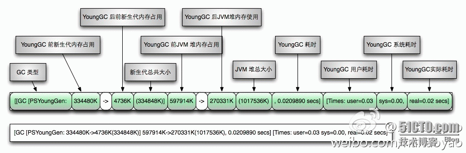

[TOC]


# GC日志查看

可以通过在java命令种加入参数来指定对应的gc类型，打印gc日志信息并输出至文件等策略。

 

GC的日志是以替换的方式(>)写入的，而不是追加(>>)，如果下次写入到同一个文件中的话，以前的GC内容会被清空。

 

对应的参数列表

```
-XX:+PrintGC 输出GC日志
-XX:+PrintGCDetails 输出GC的详细日志
-XX:+PrintGCTimeStamps 输出GC的时间戳（以基准时间的形式）
-XX:+PrintGCDateStamps 输出GC的时间戳（以日期的形式，如 2013-05-04T21:53:59.234+0800）
-XX:+PrintHeapAtGC 在进行GC的前后打印出堆的信息
-Xloggc:../logs/gc.log 日志文件的输出路径
```

  

这里使用如下的参数来进行日志的打印：

```sh
-XX:+PrintGCDateStamps -XX:+PrintGCDetails -Xloggc:../logs/gc.log 

临时查看地址可以用:/tmp/gclog/gc.log
```

阅读GC日志是处理Java虚拟机内存问题的基础技能，它只是一些人为确定的规则，没有太多技术含量。在本书的第1版中没有专门讲解如何阅读分析GC日志，为此作者收到许多读者来信，反映对此感到困惑，因此专门增加本节内容来讲解如何理解GC日志。

每一种收集器的日志形式都是由它们自身的实现所决定的，换而言之，每个收集器的日志格式都可以不一样。但虚拟机设计者为了方便用户阅读，将各个收集器的日志都维持一定的共性，例如以下两段典型的GC日志：

```
33.125: [GC [DefNew: 3324K->152K(3712K), 0.0025925 secs] 3324K->152K(11904K), 0.0031680 secs]  

100.667: [Full GC [Tenured: 0K->210K(10240K), 0.0149142 secs] 4603K->210K(19456K), [Perm : 2999K->2999K(21248K)], 0.0150007 secs] [Times: user=0.01 sys=0.00, real=0.02 secs]  
```

最前面的数字“33.125：”和“100.667：”代表了GC发生的时间，这个数字的含义是从Java虚拟机启动以来经过的秒数。

GC 日志开头的“［GC”和“［Full GC”说明了这次垃圾收集的停顿类型，而不是用来区分新生代GC还是老年代GC的。如果有“Full”，说明这次GC是发生了Stop-The- World的，例如下面这段新生代收集器ParNew的日志也会出现“［Full GC”（这一般是因为出现了分配担保失败之类的问题，所以才导致STW）。如果是调用System.gc()方法所触发的收集，那么在这里将显示 “［Full GC (System)”。

[Full GC 283.736: [ParNew: 261599K->261599K(261952K), 0.0000288 secs] 

接 下来的“［DefNew”、“［Tenured”、“［Perm”表示GC发生的区域，这里显示的区域名称与使用的GC收集器是密切相关的，例如上面样例 所使用的Serial收集器中的**新生代**名为“Default New Generation”，所以显示的是“［DefNew”。如果是ParNew收集器，新生代名称就会变为“［ParNew”，意为“Parallel New Generation”。如果采用Parallel Scavenge收集器，那它配套的新生代称为“PSYoungGen”，**老年代和永久代**同理，名称也是由收集器决定的。

后面方括 号内部的“3324K->152K(3712K)”含义是“GC前该内存区域已使用容量-> GC后该内存区域已使用容量 (该内存区域总容量)”。而在方括号之外的“3324K->152K(11904K)”表示“GC前Java堆已使用容量 -> GC后Java堆已使用容量 (Java堆总容量)”。

再往后，“0.0025925 secs”表示该内存区域GC所占用的时间，单位是秒。有的收集器会给出更具体的时间数据，如“［Times： user=0.01 sys=0.00， real=0.02 secs］”，这里面的user、sys和real与Linux的time命令所输出的时间含义一致，分别代表用户态消耗的CPU时间、内核态消耗的 CPU事件和操作从开始到结束所经过的墙钟时间（Wall Clock Time）。CPU时间与墙钟时间的区别是，墙钟时间包括各种非运算的等待耗时，例如等待磁盘I/O、等待线程阻塞，而CPU时间不包括这些耗时，但当系 统有多CPU或者多核的话，多线程操作会叠加这些CPU时间，所以读者看到user或sys时间超过real时间是完全正常的。

更全一点的参数说明：

```
[GC [<collector>: <starting occupancy1> -> <ending occupancy1>, <pause time1> secs] <starting occupancy3> -> <ending occupancy3>, <pause time3> secs]
<collector>                      GC收集器的名称
<starting occupancy1>    新生代在GC前占用的内存
<ending occupancy1>     新生代在GC后占用的内存
<pause time1>                 新生代局部收集时jvm暂停处理的时间
<starting occupancy3>    JVM Heap 在GC前占用的内存
<ending occupancy3>     JVM Heap 在GC后占用的内存
 <pause time3>                GC过程中jvm暂停处理的总时间
```

Java GC日志可以通过 +PrintGCDetails开启

以ParallelGC为例

YoungGC日志解释如下

[](http://s4.51cto.com/wyfs02/M01/7B/2A/wKiom1bIJ5XhhtFmAAE8uETlE_o462.png)

FullGC

[](http://s4.51cto.com/wyfs02/M02/7B/2A/wKiom1bIJ_DzrqUJAAH8bWZOPT0806.png)

一目了然，一图胜千言


http://blog.51cto.com/6877873/1743686