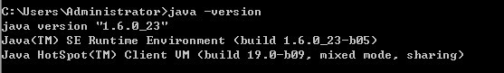
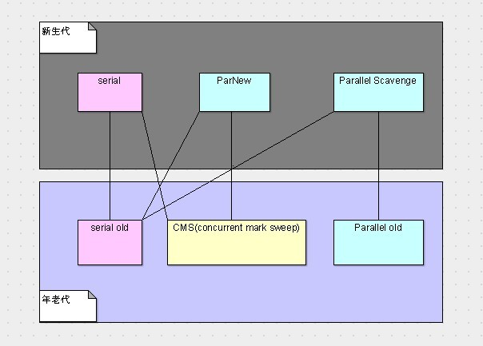

[TOC]

# JVM内存管理------垃圾搜集器简介

## 引言 

​        上一章我们已经探讨过GC的各个算法，那么垃圾搜集器是什么呢？

​        通俗的讲，使用编程语言将算法实现出来，产生的程序就是垃圾搜集器了。既然谈到了编程语言的实现，那么在讨论垃圾搜集器的时候，就已经涉及到具体的虚拟机实现了。

​        或许有不少做JAVA开发的猿友还不知道，我们平时使用的JDK中，默认的JVM是hotspot，换句话说，我们大部分时候使用的JVM都是hotspot的实现版本，因此，本次LZ讨论垃圾搜集器都是基于hotspot版JVM来进行的，请各位猿友要知晓这一点。

​        更直观的，我们可以在我们平时开发的机子上，输入java -version来查看JVM的版本，相信大部分猿友对这个命令都不陌生吧，LZ的机子截图如下。

​         

 

## 垃圾搜集器的分类

​        上面我们已经提到，垃圾搜集器实际就是算法的编程语言实现。既然牵扯到编程语言，那么必然离不开线程，而且我们在前面讲解算法的时候也一直假设是一条GC线程在做着GC的事情。

​        因此，垃圾搜集器大致分为以下三类。

​        **串行搜集器（serial collector）：它只有一条GC线程，且就像前面说的，它在运行的时候需要暂停用户程序（stop the world）。**

​        **并行搜集器（parallel collector）：它有多条GC线程，且它也需要暂停用户程序（stop the world）。**

​        **并发搜集器（concurrent collector）：它有一条或多条GC线程，且它需要在部分阶段暂停用户程序（stop the world），部分阶段与用户程序并发执行。**

​        

## 并发（concurrent）与并行（parallel）解释

​       看完上面的定义，相信有一部分猿友已经蒙了，一会单线程，一会多线程，一会串行，一会并行，一会并发，这都神马玩意？

​       单线程和多线程就不必多说了，这个很好理解，串行与并行也比较好理解，难于分辨的就是并行（parallel）与并发（concurrent）。

​       对于很多有关并发的解释，LZ觉得有一个最贴切。它是这么解释的，**并发就是两个任务A和B需要相互独立的运行，并且A任务先开始后，B任务在A任务结束之前开始了**。

​       并发本身是比较好理解的，那么它与并行的关系与区别是什么呢？

​       事实上，**并行是并发的一种实现方式**。LZ觉得这么说各位可能会更好理解，当然，并行并不是并发的唯一实现方式，还有一种就是我们所熟悉的时间片切换。也就是A任务执行一会，B任务执行一会，交替执行。

​       **并行必须在多核多处理器或者分布式系统（本质还是多核多处理器）的前提下才能发生，而交替执行或者说时间片切换是在单核的处理器上发生的**。

 

## hotspot中的垃圾搜集器

​       我们上面已经简单探讨了垃圾搜集器的分类，在hotspotJVM中，每一个种类的垃圾搜集器都有对应的实现，如下。

​       **串行搜集器的实现：serial（用于新生代，采用复制算法）、serial old（用于年老代，采用标记/整理算法）**

​       **并行搜集器的实现：ParNew（用于新生代，采用复制算法）、Parallel Scavenge（用于新生代，采用复制算法）、Parallel old（用于年老代，采用标记/整理算法）**

​       **并发搜集器的实现：concurrent mark sweep[CMS]（用于年老代，采用标记/清除算法）**

​       可以看到，上面每一种垃圾搜集器都是针对不同内存区域所设计的，因为它们采用的算法不同，凡是用于新生代的都是使用的复制算法，而用于年老代的都是使用的标记/清除或者标记/整理算法。

​       在实际应用中，我们需要给JVM的新生代和年老代分别选择垃圾搜集器，可以看到无论是新生代还是年老代都分别有三种实现，换句话说，我们应该有3*3=9种选择。但是，事实并非如此。

​       事实上，这六种垃圾搜集器只有六种选择，因为有的垃圾搜集器由于具体实现的方式等一系列原因无法在一起工作，如下图。

​         针对上图，红的就是串行搜集器，绿的是并行搜集器，唯一一个黄的是并发搜集器。上面三个是新生代的搜集器，下面三个是年老代的搜集器。两者之间有连线，则表示两者可以配合工作。

​         这六种组合并没有说哪个组合最强，哪个组合最弱，还是那句话，只有最合适的，没有最好的。因此这就需要我们对每一种组合有一定的认识，才能在使用的时候选择更适合的垃圾搜集器。

 

## 结束语

​         本次大致介绍了一下六种垃圾搜集器，以及它们的关系。每一种垃圾搜集器的特点与执行方式，我们在下一章再一起探讨。

http://www.cnblogs.com/zuoxiaolong/p/jvm7.html