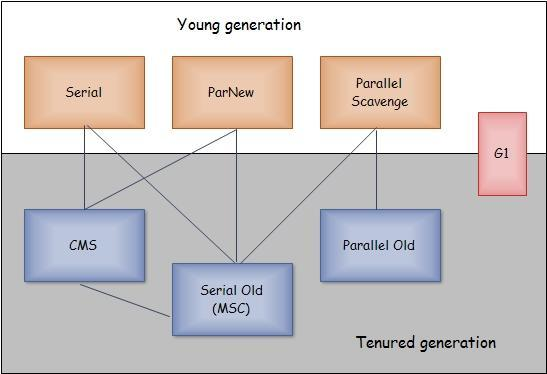

[TOC]

# java 中的垃圾收集器

## 前言

垃圾收集器是内存回收的具体实现，Java 虚拟机规范中对其实现没有具体规定，不同的厂商、不同版本的虚拟机提供的垃圾收集器都会有很大差别。本文主要介绍 HotSpot 虚拟机中的垃圾收集器。

上图展示了不同的垃圾收集器，每个收集器都作用于特定的分代。如果两个收集器直接存在连线，那么说明这两个收集器可以配合使用，例如新生代使用 ParNew，老年代使用 CMS。每个垃圾收集器都有自己的优点与缺点，不存在完美的收集器，我们需要针对自己的场景，选择最合适的收集器。

## Serial 收集器

Serial 是最古老、最基本的收集器，它有以下两大特点：

- Serial 是一个单线程的收集器，它仅仅使用一条线程去完成垃圾收集工作；
- Serial 进行垃圾收集工作的同时，会暂停其他所有的工作线程，直至收集结束。也就是所谓的 Stop The World。

Serial 的优点是简单而高效，因为是单线程，没有其他线程的交叉，所以可以专心做垃圾收集的工作，可以获得最高的收集效率。同时其缺点也十分明显，那就是在垃圾收集过程中会暂停其他所有工作线程，如果这个暂停时间过长，那么对于很多应用来说这一点是完全无法忍受的。

上图是 Serial 收集器的运行示例图。在收集新生代垃圾时，采用的是复制算法；在收集老年代时，采用的是标记-整理算法。

现在 Serial 收集器仍然是 Client 模式下默认的新生代收集器。对于新生代空间不大的场景，垃圾收集停顿时间可以控制在几十至一百毫秒以内，这点停顿是可以接受的。

使用方法：`-XX:+UseSerialGC`。

## Serial Old 收集器

Serial Old 是 Serial 收集器的老年代版本，使用单线程回收老年代的垃圾，使用标记-整理算法，前面的图已经提过了。

Serial Old 收集器可以作为 CMS 收集器的后备预案，当 CMS 收集失败时使用。其使用方式同上面一致：`-XX:+UseSerialGC`。实际上该选项会使用 Serial 收集器来收集新生代，使用 Serial Old 收集器来收集老年代。

## ParNew 收集器

ParNew 收集器是 Serial 收集器的多线程版本。它运行在新生代，使用复制算法，并发的进行垃圾收集工作。只不过这里的并发是指使用多个线程进行垃圾收集工作，而不是和其他工作线程并发执行，所以它仍然需要 Stop The World，暂停其他所有线程。实际上，除了收集时候采用多线程以外，其他行为与 Serial 收集器基本一致。以下是它的工作示意图。

ParNew 收集器在单线程环境下效果不如 Serial。但是随着可以使用的 CPU 数目的增加，使用 ParNew 收集器也是很有好处的。另外一个重要的方面就是，它可以与 CMS 相互配合工作。

可以使用 `-XX:+UseParNewGC` 来指定使用 ParNew 收集器，此时老年代使用 Serial Old 单线程收集器。也可以通过设置 `-XX:+UseConcMarkSweepGC` 使用 CMS 收集器，其默认使用 ParNew 作为新生代的收集器。

## Parallel Scavenge 收集器

Parallel Scavenge 收集器看起来和 ParNew 收集器一样，也是作用于新生代，使用复制算法的多线程收集器。然而其特点是，Parallel Scavenge 收集器的关注点不是如何尽可能的缩短垃圾收集时用户线程的停顿时间，而是达到一个可控制的吞吐量。这里的吞吐量是指 CPU 运行用户代码与 CPU 总耗时的比例，例如虚拟机运行了 100 分钟，其中用户代码运行了 99 分钟，垃圾收集运行了 1 分红，那么吞吐量就是 99%。

垃圾收集停留时间短，适合需要与用户交互的程序，良好的响应速度可以提升用户体验。而高吞吐量则可以高效的利用 CPU 资源，尽快完成运算任务，适合后台运算而不需要太多交互的任务。

Parallel Scavenge 收集器中提供了两个参数用来控制吞吐量，`-XX:MaxGCPauseMillis` 用来控制最大垃圾收集时间，`-XX:GCTimeRatio` 用来直接设置吞吐量大小。其中 MaxGCPauseMillis 参数表示一个大于零的毫秒数，收集器会尽可能保证最大垃圾收集花费时间不超过设定值。GCTimeRatio 是一个大于 0 小于 100 的整数，表示允许的垃圾收集时间占比。如果设置为 19，那么允许的最大垃圾收集时间占比为 1 / (19 + 1) = 5%。默认是 99，也就是允许的最大垃圾收集时间占比为 1 / (99 + 1) = 1%。

除了上面两个参数，Parallel Scavenge 收集器还有一个 `-XX:+UseAdaptiveSizePolicy` 参数，当这个参数打开后，就不需要手动指定新生代的大小、Eden 与 Survivor 的比例、晋升老年代对象年龄邓细节参数了，虚拟机会根据当前系统运行情况进行动态参数调整，以提供最合适的停顿时间与最大吞吐量。自适应调节策略也是其一个重要特点。

可见，Parallel Scavenge 收集器与吞吐量关系密切，因此其也被称为吞吐量优先收集器。使用 `-XX:+UseParallelGC` 参数来开启。

## Parallel Old 收集器

Parallel Old 是 Parallel Scavenge 的老年代版本，使用标记-整理算法。Parallel Old 与 Parallel Scavenge 收集器运行示意图如下：

## CMS 收集器

CMS 收集器全名是 Concurrent Mark Sweep，从名字上角就能看出来，它是基于标记-清除算法，而且是并发运行的收集器。它的运行过程分为四步：

1. 初始标记；
2. 并发标记
3. 重新标记
4. 并发清除

初始标记阶段将 GC Roots 可以直接关联到的对象进行标记，速度很快。并发标记则是进一步对引用进行追踪标记的过程，这是与用户线程并发进行的。重新标记阶段是为了修正并发标记期间，用户程序继续运行而产生变化的那一部分对象的标记记录。最后并发清除就是垃圾清理的过程，也是同用户线程并发执行。

上面的过程中，初始标记与重新标记阶段是需要 Stop The World 的，而并发标记与并发清除则是与用户线程并发执行。不过初始标记与重新标记的耗时，远小于并发标记与并发清除的耗时，因此总体上来说，CMS 收集器是与用户程序并发进行的。下图是其运行示例图：

CMS 的优点就是可以并发进行垃圾收集工作，而且停顿时间短。然而它也有几个缺点：

1. 对 CPU 资源非常敏感。并发垃圾清除的时候，会消耗用户程序的 CPU 资源，当 CPU 数量不高时，会影响用户程序的执行速度。
2. 垃圾清除阶段，由于是与用户程序并发执行的，因此用户程序在这个过程中还会再产生垃圾，这部分垃圾是无法被同时进行的收集器清除掉的，只能等待下一次的垃圾收集，也就是“浮动垃圾”。
3. 标记-清除算法会产生大量空间碎片，这样在分配大对象空间时，有可能无法找到足够大的连续空间来分配，这就会导致触发 Full GC。

通过 `-XX+UseConcMarkSweepGC` 来使用 CMS 收集器，此时可以同时使用 `-XX:+UseParNewGC` ParNew 收集器用于新生代的垃圾收集器。

## G1 收集器

G1 收集器的全称是 Garbage First，其具有如下特点：

- 并发执行，缩短 Stop The World 的时间；
- 分代收集，它不需要与其他收集器配合工作；
- 基于标记-整理算法实现，不会产生内存空间碎片，有利于程序的长期运行；
- 可以建立可预测的停顿时间模型。

G1 收集器不同于其他收集器，其堆内存布局与其他收集器有很大差别。它将整个 Java 堆划分为多个大小相等的区域，不管是新生代还是老年代，都是其中一部分区域的集合，且不需要连续。G1 会计算每个区域中垃圾堆积的回收价值大小，即回收获得的空间与需要花费的时间的一个计算值，并在后台维护一个按回收价值排序的优先级列表，每次根据允许的收集时间，优先回收价值最大的区域。这也是其命名的由来。

G1 收集器的运行大概是如下的步骤：

1. 初始标记
2. 并发标记
3. 最终标记
4. 筛选回收

前几个步骤和 CMS 收集器类似，初始标记阶段只是标记一下 GC Roots 可以直接关联的对象。这阶段需要停顿线程，不过耗时很短。并发标记是继续对堆中对象进行可达性分析，找出存活对象，虽然耗时较长，但是可以与用户线程并发执行。最终标记阶段同样是为了修正。最后筛选回收阶段，对各个区域的回收价值和回收成本进行排序，根据期望的 GC 时间来制定回收计划。以上过程如下图所示：

使用 `－XX:+UseG1GC` 来启用 G1 收集器。

## Java 8 中的垃圾收集

在 Java 8 中对垃圾收集做了改进，最大的一点就是去掉了永久带。在过去开发者需要仔细调节永久代的大小，很容易导致 OOM。现在 JVM 可以自己管理这块区域了，JDK8 HotSpot 中将这部分区域移除，使用本地内存来存储这些信息，并称之为元空间 Metaspace。

除此以外，Java 8 中对 G1 也进行了优化，主要体现在 String 去重，优化后的收集器可以把重复的 String 对象指向同一个 char[] 数组，避免多个副本存在于堆里。

## 总结

本文简单的对不同的垃圾收集器进行了介绍，单线程的 Serial、Serial Old，多线程的 ParNew、Parallel Scavenge、Parallel Old，与真正意义上的并发 CMS、G1，简单介绍了各个收集器的使用场景、工作机制与优点缺点等。

不过本文并没有深入分析各个垃圾收集器的工作机制与实现原理，也并没有从实践的层面去比较分析各个收集器的使用情况与性能。垃圾收集器只是 JVM 体系中的一部分，除了了解各种垃圾收集器的工作机制外，还需要了解各种垃圾收集算法，比较他们的优点缺点。除此以外也需要加强实践，分析不同收集器的日志。继续努力吧。

## 参考

- [深入理解Java虚拟机（第2版）](https://book.douban.com/subject/24722612/)
- [JVM垃圾收集器－对比Serial、Parallel、CMS和G1](http://www.tazhi.com/jvm-garbage-collector/)

http://patchouli-know.com/2017/09/17/java-garbage-collectors/