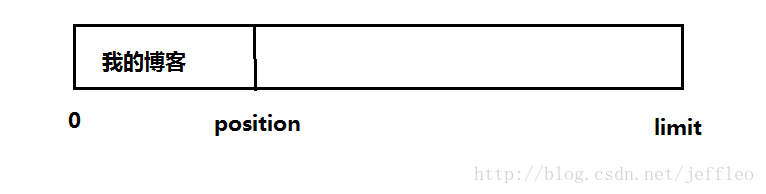
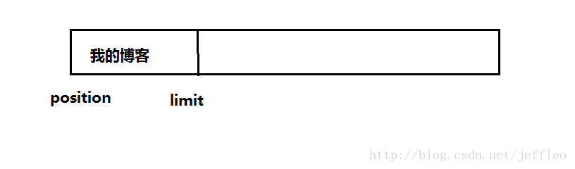
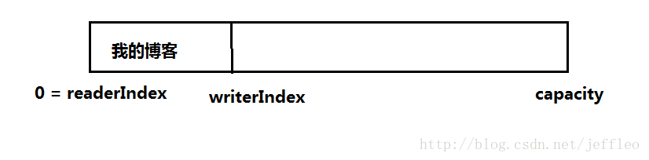
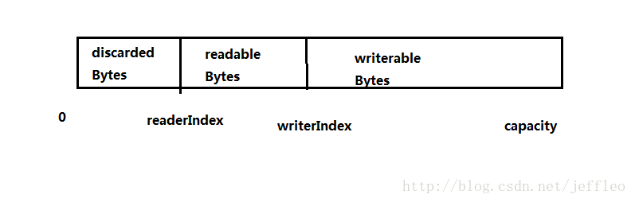
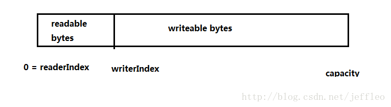
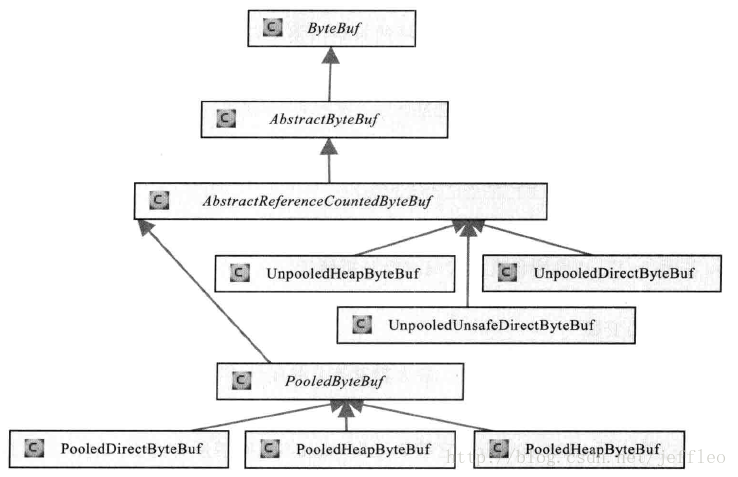

[TOC]


# Netty ByteBuf和Nio ByteBuffer

# **一、简介**

Netty中引入了ByteBuf，它相对于ByteBuffer来说，带来了很多便捷性和创新的地方，使得程序员更简单得进行网络编程

# **二、ByteBuffer的缺点和ByteBuf的改进**

下面我们从几个点来分别讲解：

## **1. 扩容**

### **ByteBuffer：**

ByteBuffer缓冲区的长度固定，分多了会浪费内存，分少了存放大的数据时会索引越界，所以使用ByteBuffer时，**为了解决这个问题，我们一般每次put操作时，都会对可用空间进行校检，如果剩余空间不足，需要重新创建一个新的ByteBuffer，然后将旧的ByteBuffer复制到新的ByteBuffer中去。**

### **ByteBuf：**

而ByteBuf则对其进行了改进，它会自动扩展，具体的做法是，写入数据时，会调用ensureWritable方法，传入我们需要写的字节长度，判断是否需要扩容：

```java
public ByteBuf ensureWritable(int minWritableBytes) {
    if(minWritableBytes < 0) {
        throw Exception
    } else if(minWritableBytes <= this.writableBytes()) {
        return this;
    } else if(minWritableBytes > this.maxCapacity - this.writerIndex) {
        throw Exception
    } else {
        //扩容
        int newCapacity = this.calculateNewCapacity(this.writerIndex + minWritableBytes);
        this.capacity(newCapacity);
        return this;
    }
}
```

可以看到，具体新容量的计算在calculateNewCapacity方法中：

```java
private int calculateNewCapacity(int minNewCapacity) {
    int maxCapacity = this.maxCapacity;
    int threshold = 4194304; //4mb阀值
    if(minNewCapacity == 4194304) {//如果新容量为阀值，直接返回
        return 4194304;
    } else {
        int newCapacity;
        if(minNewCapacity > 4194304) {//如果传入的新容量大于阀值，进行计算
            newCapacity = minNewCapacity / 4194304 * 4194304;
            if(newCapacity > maxCapacity - 4194304) {//如果大于最大容量，新容量为最大容量
                newCapacity = maxCapacity;
            } else {//否则新容量 + 阀值 4mb，按照阀值扩容
                newCapacity += 4194304;
            }

            return newCapacity;
        } else {//如果小于阀值，则以64为计数倍增，知道倍增的结果>=需要的容量值
            for(newCapacity = 64; newCapacity < minNewCapacity; newCapacity <<= 1) {
                ;
            }

            return Math.min(newCapacity, maxCapacity);
        }
    }
} 
```

这里要解释的地方： 
\1. 当申请的新空间大于阀值时，采用每次步进4MB的方式进行扩张内存，而不是倍增，因为这会造成内存膨胀和浪费 
\2. 而但申请的新空间小于阀值时，则以64为基数进行倍增而不是步进，因为当内存比较小的时候，倍增是可以接受的（64 -> 128 和 10Mb -> 20Mb相比）

## 2. 位置指针

### **ByteBuffer：**

ByteBuffer中只有一个位置指针position（ByteBuf有两个），所以需要我们手动得调用flip等方法，例如：

```java
ByteBuffer buffer = ByteBuffer.allocate(88);
String value = "我的博客";
buffer.put(value.getBytes());
buffer.flip();
byte[] array = new byte[buffer.remaining()];
buffer.get(array);
String decodeValue = new String(array); 
```

ByteBuffer中会有三个下标，初始位置0，当前位置positon，limit位置，初始时，position为0，limit为Buffer数组末尾 
调用buffer.put(value.getBytes())后： 

不调用flip： 
从缓冲区读取的是position — limit位置的数据，明显不是我们要的 
调用flip： 
会将limit设置为position，position设置为0,，此时读取的数据 


### **ByteBuf：**

ByteBuf中使用两个指针，readerIndex，writerIndex来指示位置，初始时readrIndex = writerIndex = 0，当写入数据后： 

writerIndex — capacity：可写容量 
readerIndex — writerIndex：可读部分

当读取了M个字节后： 


调用discardReadBytes，会释放掉discardReadBytes的空间，并把readableBytes复制到从0开始的位置，因此这里会发生内存复制，频繁调用会影响性能 


# **三、ByteBuf分析**

ByteBuf最重要的两个基类，AbstractByteBuf提供了骨干实现，AbstractReferenceCountedByteBuf是AbstractByteBuf的子类，它的子类很常使用 


## **1. 分类**

### **1.1 从内存分配角度分类：**

**（1）堆内存字节缓冲区（HeapByteBuf）**：UnPoolHeapByteBuf、PooledHeapByteBuf 
它的特点是内存的分配和回收都在堆，所以速度很快；缺点就是进行Socket的IO读写，需要把堆内存对应的缓冲区复制到内核Channel中，这内存复制会影响性能 
**（2）直接内存缓冲区（DirectByteBuf）**：UnPoolDirectByteBuf、UnPoolUnsafeDirectByteBuf、PoolDirectByteBuf、PoolUnsafeDirectByteBuf 
它的特点是由于内存的分配在非堆（方法区），不需要内存复制，所以IO读取的速度较快，但是内存的分配较慢

**总结：** 
根据两种内存的特点，我们可以知道，IO读写时最好使用DirectByteBuf，而在后端业务消息的解编码最好使用HeapByteBuf

### **1.2 从内存回收的角度分类**

**（1）基于对象池的ByteBuf（PoolByteBuf）**：PooledByteBuf和它的子类PoolDirectByteBuf、PoolUnsafeDirectByteBuf、PooledHeapByteBuf 
它的特点是可以循环利用创建的ByteBuf，提高了内存的使用效率，PoolByteBuf的实现牵涉的数据结构很多，PoolByteBuf首先会申请一大块内存区域PoolArena，PoolArena由多个Chunk组成，而每个Chunk由一个或多个page组成 
具体看《Netty权威指南》； 
也可以看： 
[深入浅出Netty内存管理 PoolChunk](http://www.jianshu.com/p/c4bd37a3555b) 
[深入浅出Netty内存管理 PoolSubpage](http://www.jianshu.com/p/d91060311437) 
[深入浅出Netty内存管理 PoolChunkList](http://www.jianshu.com/p/a1debfe4ff02) 
[深入浅出Netty内存管理 PoolArena](http://www.jianshu.com/p/4856bd30dd56)

**（2）普通的ByteBuf（UnPoolByteBuf）**：UnPoolDirectByteBuf、UnPoolUnsafeDirectByteBuf、UnPoolHeapByteBuf

**总结：** 
在高负载，大并发的情况下对象池的ByteBuf更好，而在一般情况下，可以使用UnPoolByteBuf

## **2. Netty的零拷贝**

Netty的零拷贝主要体现在三个方面：

### **第一种实现：DirectByteBuf**

就如上所说，ByteBuf可以分为HeapByteBuf和DirectByteBuf，当使用DirectByteBuf可以实现零拷贝

### **第二种实现：CompositeByteBuf**

CompositeByteBuf将多个ByteBuf封装成一个ByteBuf，对外提供封装后的ByteBuf接口

### **第三种实现：DefaultFileRegion**

DefaultFileRegion是Netty的文件传输类，它通过transferTo方法将文件直接发送到目标Channel，而不需要循环拷贝的方式，提升了传输性能

## **3. Netty的内存回收管理**

Netty会通过 **引用计数法** 及时申请释放不再被引用的对象 ，实现上是通过 
AbstractReferenceCountedByteBuf来实现的，我们看上面的结构图，可以看到AbstractReferenceCountedByteBuf是AbstractByteBuf的直接子类，所有具体的实现ByteBuf（堆，非堆等）都是继承自AbstractReferenceCountedByteBuf，也就是说，Netty的具体的实现ByteBuf，都是具有内存回收管理的功能的

AbstractReferenceCountedByteBuf有两个重要的成员变量： 
1、AtomicIntegerFieldUpdater< AbstractReferenceCountedByteBuf> refCntUpdater 
用来更新引用数，使用原子类，达到线程安全

2、volatile int refCnt = 1 
用来记录引用数，保证可见性

### 引用+1

```java
    public ByteBuf retain() {
        int refCnt;
        do {
            refCnt = this.refCnt;
            if(refCnt == 0) {
                throw new IllegalReferenceCountException(0, 1);
            }

            if(refCnt == 2147483647) {
                throw new IllegalReferenceCountException(2147483647, 1);
            }
        } while(!refCntUpdater.compareAndSet(this, refCnt, refCnt + 1));

        return this;
    }
```

### 引用-1

```java
    public final boolean release() {
        int refCnt;
        do {
            refCnt = this.refCnt;
            if(refCnt == 0) {
                throw new IllegalReferenceCountException(0, -1);
            }
        } while(!refCntUpdater.compareAndSet(this, refCnt, refCnt - 1));

        if(refCnt == 1) {
            this.deallocate();
            return true;
        } else {
            return false;
        }
    }
```

可以看出，无论是增加引用还是释放引用，都是使用了CAS

```
refCntUpdater.compareAndSet(this, refCnt, refCnt - 1)1
```

对象时this，自身，也就是说，统计的是自身的引用数，例如对于UnPoolHeapByteBuf来说，它具有统计有多少对象引用着它，当引用数refCnt == 1时，表示此事已经没有对象引用它了，此时便调用deallocate来释放内存


https://blog.csdn.net/jeffleo/article/details/69230112