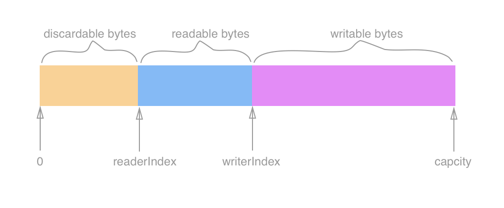
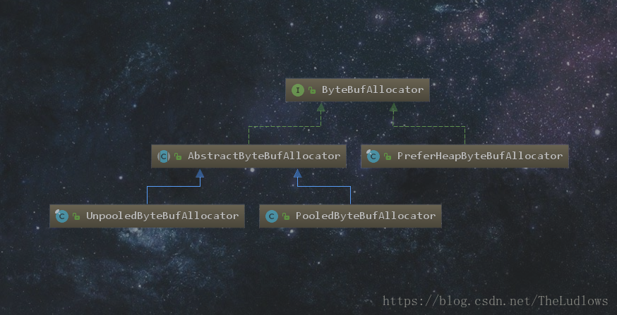

# Netty基础：ByteBuf详解


## 1.ByteBuf概述

与NIO中的`ByteBuffer`类似，Netty中以`ByteBuf`作为它的字节容器。`ByteBuf`相当于`ByteBuffer`的升级。有兴趣可以看一看[>>之前NIO中的`ByteBuffer`的文章](http://blog.csdn.net/theludlows/article/details/77987946)
ByteBuffer存在一定的缺陷：

1. ByteBuffer长度固定，一旦分配，则容量不能动态扩展和收缩
2. ByteBuffer只有一个标识位置的指针，读写的时候需要手动的调用flip()方法来进行从写到读模式的切换，否则读出来的内容就是错误的。

`ByteBuf`维护了两个不同的索引：一个用于读取，一个用于写入。读取时，读索引递增读取的字节数。写入时，写索引会递增写入的字节数。初始时两个索引都为0。当两个索引相同时，也就是说数组中没有数据可读了。在试图读取会触发边界溢出异常。

整个ByteBuf被这两个指针**最多**分成三个部分，分别是可丢弃部分，可读部分和可写部分，可以用一张图直观的描述ByteBuf的结构，如下图所示：


从内存分配的角度看，ByteBuf可以分为两类：

1. 堆内存字节缓存区

- 优点：内存的分配和回收速度快，可以被JVM自动回收。
- 缺点：如果是进行Socket的I／O读写，则需要额外做一次内存复制，即将堆内存对应的缓冲区复制到内核Channel中，因此性能会有一定程度的下降。

1. 直接内存字节缓存区
   其优点和缺点刚好与“堆内存字节缓存区”相反，即优点：如果进行Socket的I／O读写，则不需要进行复制，而由于其是在堆外内存分配，因此相比堆内存其分配和回收就慢一些。

从内存回收的角度看，ByteBuf可以分为两类：

1. 基于对象池的ByteBuf

- 优点：可以重用ByteBuf对象。即可以提升内存的使用效率。
- 缺点：内存池的管理和维护添加了复杂性。

1. 普通ByteBuf
   其优缺点与ByteBuf相反,需要重复的创建对象，增加GC负担。

以上两种类型进行两两组合就构成了多种多样的ByteBuf，供用户选择使用。

## 2. ByteBuf的操作

##### 2.1 ByteBuf的创建

首先肯定是要创建一个ByteBuf，更确切的说法就是要申请一块内存，后续可以在这块内存中执行写入数据读取数据等等一系列的操作。

那么如何创建一个ByteBuf呢？Netty中设计了一个专门负责分配ByteBuf的接口：ByteBufAllocator。该接口有一个抽象子类和两个实现类，分别对应了用来分配池化的ByteBuf和非池化的ByteBuf。
具体的层级关系如下图所示：


Netty又为我们提供了两个工具类：Pooled、Unpooled，分类用来分配池化的和未池化的ByteBuf
Unpooled类为例,提供了如下创建方法：

```java
// 在堆上分配一个ByteBuf，并指定初始容量和最大容量
public static ByteBuf buffer(int initialCapacity, int maxCapacity) {
    return ALLOC.heapBuffer(initialCapacity, maxCapacity);
}
// 在堆外分配一个ByteBuf，并指定初始容量和最大容量
public static ByteBuf directBuffer(int initialCapacity, int maxCapacity) {
    return ALLOC.directBuffer(initialCapacity, maxCapacity);
}
// 使用包装的方式，将一个byte[]包装成一个ByteBuf后返回
public static ByteBuf wrappedBuffer(byte[] array) {
    if (array.length == 0) {
        return EMPTY_BUFFER;
    }
    return new UnpooledHeapByteBuf(ALLOC, array, array.length);
}
// 返回一个组合ByteBuf，并指定组合的个数
public static CompositeByteBuf compositeBuffer(int maxNumComponents){
    return new CompositeByteBuf(ALLOC, false, maxNumComponents);
}
```

ALLOC实际是一个ByteBufAllocator

```java
private static final ByteBufAllocator ALLOC = UnpooledByteBufAllocator.DEFAULT;
```

ByteBufAllocator是一个专门负责ByteBuf分配的接口，对应的Unpooled实现类就是UnpooledByteBufAllocator。在UnpooledByteBufAllocator类中可以看到UnpooledByteBufAllocator.DEFAULT变量是一个final类型的静态变量

```java
public static final UnpooledByteBufAllocator DEFAULT =
            new UnpooledByteBufAllocator(PlatformDependent.directBufferPreferred());
```

##### 2.2 写操作

ByteBuf中定义了两类方法可以往ByteBuf中写入内容：writeXX() 和 setXX()。setXX是替换指定位置的值，而writeXX是想当前写指针写入数据后递增指针。
比如：`setByte(int index, int value)`表示将指定位置上的内容修改为指定的byte的值高24位上的内容将被丢弃。
why?Java中一个int占4个byte字节，即32bit（位），所以就会存在当写入一个byte时，参数用int来传值时，高24位的内容会被丢弃。这是因为一个int被拆成了4个byte，而写入一个byte到指定的位置时，那么其余的3个byte就被丢弃了,也就是丢弃的24位。

##### 2.2 读操作

跟写操作一样，ByteBuf的读操作也有两种方法，分别是getXX()和readXX()。

## 3. 示例

```java
public void test1() {
	CompositeByteBuf message = Unpooled.compositeBuffer();
	ByteBuf header = Unpooled.buffer();
	ByteBuf body = Unpooled.directBuffer();
	message.addComponents(header, body);
	for(ByteBuf buf:message) {
	    System.out.println(buf.toString());
	}
	int length = message.readableBytes();
	byte[] array = new byte[length];
	//将字节读到array数组中
	message.getBytes(message.readerIndex(), array);
}
```

### 随机访问索引

**随机访问索引**和数据一样，ByteBuf的索引是从0开始，因此遍历非常容易

```java
for(int i=0; i<buffer.capacity(); i++){
	byte b = buffer.getByte(i);
	System.out.println((char)b)
}
```

注意：get、set之类方法不会改变读写索引的位置。

### 顺序访问索

**顺序访问索**JDK的ByteBuffer只有一个索引，这也是为什么必须调用flip()方法在读模式和写模式切换。

```java
ByteBuf buf = Unpooled.buffer();
String str = "four you";
buf.writeBytes(str.getBytes());
System.out.println((char)buf.readByte());
int n = (char)buf.readerIndex();
System.out.println(n );
```

`ByteBuf`的可读字节分段存储了实际的数据,新分配的、包装的或者复制的缓冲区默认的读写索引都为0，任何一read、skip开头的操作都会使readerIndex变化，当然write相关的方法一回事writerIndex会被增加。

```java
ByteBuf buf = Unpooled.buffer();
String str = "four you";
buf.writeBytes(str.getBytes());
System.out.println(buf.writerIndex());
buf.skipBytes(3);
buf.writeByte('a');
int n = buf.readerIndex();
int m = buf.writerIndex();
System.out.println("readerIndex:"+n+"\nwriterIndex:"+m);

```

### 查找的例子

```java
ByteBuf buf = Unpooled.buffer();
String str = "four you";
buf.writeBytes(str.getBytes());
int n = buf.indexOf(0,buf.capacity()-1,(byte)'r');
System.out.println("readerIndex:"+n);
```

### **派生缓冲区**

在ByteBuf中有一些方法slice、order等方法会返回一个新的ByteBuf实例，它具有自己的读写索引和标记索引，但是内部存储的数组是共享的。

```java
ByteBuf buffer = Unpooled.copiedBuffer("four you", CharsetUtil.UTF_8);
ByteBuf bufCopy = buffer.slice(0,3);
System.out.println(bufCopy.toString(CharsetUtil.UTF_8));
//更新索引0处的字节
buffer.setByte(0,(byte)'j');
System.out.println(bufCopy.toString(CharsetUtil.UTF_8));
```

结果是打印出来的不一样，说明数据是共享的。

### **ByteBuff复制**

如果真的需要一个真实的复制品，可以使用copy方法。

```java
ByteBuf buffer = Unpooled.copiedBuffer("four you", CharsetUtil.UTF_8);
ByteBuf bufCopy = buffer.copy(0,3);
System.out.println(bufCopy.toString(CharsetUtil.UTF_8));
buffer.setByte(0,(byte)'j');
System.out.println(bufCopy.toString(CharsetUtil.UTF_8));
```

打印出的结果一样。说明数据是独立的。


https://blog.csdn.net/TheLudlows/article/details/79501241