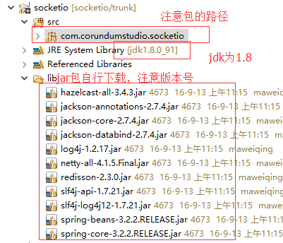
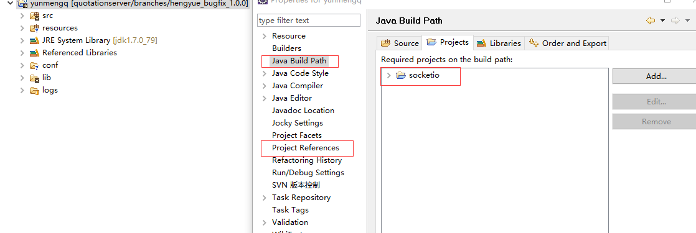
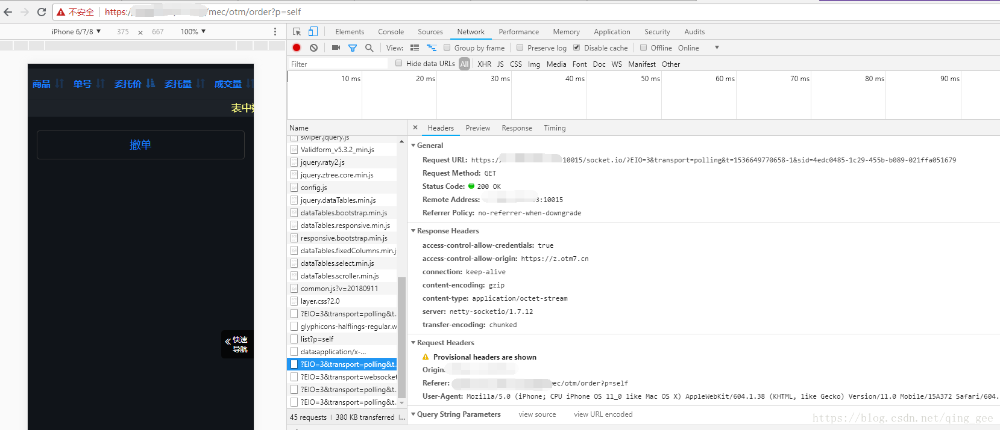

[TOC]


# Netty-SocketIO：最好用的Java版即时消息推送

2016年09月13日 14:32:21

## 简介

Netty-SocketIO是一个开源的、基于Netty的、Java版的即时消息推送项目。通过Netty-SocketIO，我们可以轻松的实现服务端主动向客户端推送消息的场景，比如说股票价格变化、K线图、消息提醒等。它和websocket有相同的作用，只不过Netty-SocketIO可支持所有的浏览器。

GitHub项目地址为： [https://github.com/mrniko/netty-socketio。](https://github.com/mrniko/netty-socketio%E3%80%82)

Socket.IO除了支持WebSocket通讯协议外，还支持许多种轮询（Polling）机制以及其它实时通信方式，并封装成了通用的接口，并且在服务端实现了这些实时机制的相应代码。Socket.IO实现的Polling通信机制包括Adobe Flash Socket、AJAX长轮询、AJAX multipart streaming、持久Iframe、JSONP轮询等。Socket.IO能够根据浏览器对通讯机制的支持情况自动地选择最佳的方式来实现网络实时应用。

## 一、下载Netty-SocketIO

1. socket.io-client :<https://github.com/socketio/socket.io-client>
2. netty-socketio: <https://github.com/mrniko/netty-socketio>
3. netty-socketio-demo:  <https://github.com/mrniko/netty-socketio-demo>

从netty-socketio的git上可下载到以上三个压缩包，分别对应的是web 客户端的所需文件、netty socketio的java服务端实现、以及对应的可以应用web推送的demo。

## 二、部署server

部署server的资源项目
从git上下载的socketio server压缩包中没有项目所需的jar包，我是自己新建了一个项目，本来上传到了CSDN的代码库里了，但写博客的时候怎么也打不开了，那么只能提供对应项目导航图，同时提供jar包的下载地址，需要的可动手去获得。



从http://mvnrepository.com/网站上课下载到需要的所有jar包。

然后将jar包添加到项目中。
**切记jdk的版本一定要在1.7以上，我在本地环境中用的1.7，但是服务器上一直用的是1.6，部署项目的时候没有注意，导致服务端可以接收到客户端的socketio 的connect，但是客户端的response相应中却连接不通，开始的时候以为是跨域问题导致的，搜了好多帖子，但问题根本就是不是跨域引起的，jdk的版本换成1.7就ok了，因为netty的nio是基于java的1.7的。**

## 三、应用server

在需要应用socketio的项目上右键，为项目添加socketio项目支持（注意红色标出的）。


新建main类。

```java
public static void main(String[] args) throws InterruptedException {

	Configuration config = new Configuration();
	config.setHostname("localhost");
	config.setPort(10015);
	SocketIOServer server = new SocketIOServer(config);
	server.addConnectListener(new ConnectListener() {// 添加客户端连接监听器
		@Override
		public void onConnect(SocketIOClient client) {
			logger.info(client.getRemoteAddress() + " web客户端接入");
			client.sendEvent("helloPush", "hello");
		}
	});
					// 握手请求
	server.addEventListener("helloevent", HelloUid.class, new DataListener<HelloUid>() {
		@Override
		public void onData(final SocketIOClient client, HelloUid data, AckRequest ackRequest) {
			// 握手
			if (data.getMessage().equals("hello")) {
				int userid = data.getUid();
				logger.info(Thread.currentThread().getName() + "web读取到的userid：" + userid);

				
				// send message back to client with ack callback
				// WITH data
				client.sendEvent("hellopush", new AckCallback<String>(String.class) {
					@Override
					public void onSuccess(String result) {
						logger.info("ack from client: " + client.getSessionId() + " data: " + result);
					}
				}, sessionTime);

			} else {
				logger.info("行情接收到了不应该有的web客户端请求1111...");
			}
		}
	});

        server.start();

        Thread.sleep(Integer.MAX_VALUE);

        server.stop();
    }

```

当client通过ip和端口连接到server后，会构造一个SocketIOClient client的对象，在实际的应用中，可以将该client保存起来，通过`client.sendEvent("helloPush", "hello");`就可以向client端发送相应的数据了。

## 四、应用client

### ①、引入socket.io.js

```jsp
<script type="text/javascript" src="${ctx}/components/socketio/socket.io.js"></script>
1
```

### ②、创建connection的公共方法

```js
function connectQuotation(uid, callback) {
	// 链接行情server
	socket = io.connect('http://localhost:10015');
	
	// 如果用户在web端登陆，那么发送握手请求
	if (uid) {
		// 连接上server后
		socket.on('connect', function() {
			// 发送握手请求
			var jsonObject = {
				uid : parseInt(uid),
				message : "hello"
			};
			this.emit('helloevent', jsonObject);

			this.on('hellopush', function(data, ackServerCallback, arg1) {
				// base64转码的数据，可忽视
				YUNM.session = {
					sessionId : $.base64.atob(data.sessionId),
					time : $.base64.atob(data.time)
				};
				if (ackServerCallback) {
					ackServerCallback('server message was delivered to client!');
				}
			});
		});
	}

	// 如果web端session超时，socket断开，10分钟扫描一次
	int = window.setInterval(function() {
		// 我是通过ajax判断session超时的，你也可以通过其他方式
		$.ajax({
			type : 'POST',
			url : common.ctx + "/getSessionTimeout",
			dataType : "json",
			cache : false,
			success : function(json) {
				var timeout = parseInt(json.message);
				// session超时后，socket断开，服务端就可以监听到释放资源
				if (timeout == 0) {
					socket.disconnect();
				}
			},
			error : function() {
				socket.disconnect();
				// 清除
				window.clearInterval(int);
			}

		});
	}, YUNM._set.interval);

	callback();
}
123456789101112131415161718192021222324252627282930313233343536373839404142434445464748495051525354
```

### ③、需要web推送的页面进行socketio的连接

```js
$(function() {
connectQuotation($("#global_uid").val(), function() {
	socket.on("pushQuotation", function(message) {

		if (message.type == "dealOrder") {
			var msg = message.response.result;
			// 输出服务端消息
			YUNM.debug(msg);
		}
	});
});
});
123456789101112
```

## 五、注意事项

1. 关于socketio的ssl应用，一直没有弄出来，主要是java的toolkey生成的jks总是不被浏览器识别，socketio提供的例子也不能运行，在各大网站上暂时没有解决问题。可通过浏览器添加https的例外做法来规避错误，但不可取，后面还需要研究。
2. socketio在浏览器刷新后，旧的连接断开，需要重新建立连接，这个请注意。
3. 客户端session超时后，切记关闭socket，我是通过10分钟一次的扫描进行的session超时验证，该方法不够理想。
4. server端，在实际应用中，需要将客户端断开的socket进行垃圾清理，注意判断方法如下：

```java
NamespaceClient client = (NamespaceClient) socket;

if (client.getBaseClient().isConnected()) {
	SessionManager.getSession(getSession().getSessionId());
} else {
	logger.warn("web发送心跳包失败，客户端连接线程[" + this.getName() + "]已断开");
	running = false;
	break;
}
```

------

整体Netty-SocketIO的Web推送还是非常易于掌握的，但是缺少api，做起来需要不停实践，另外解决问题的方法不多，希望本篇可以给你提供些许帮助。

------

2017年12月26日补充：

项目迁移到了另外一台阿里云服务器，于是Netty-SocketIO的server在启动的时候出现了以下错误：

```java
java.net.BindException: Cannot assign requested address: bind
	at sun.nio.ch.Net.bind0(Native Method)
	at sun.nio.ch.Net.bind(Unknown Source)
	at sun.nio.ch.Net.bind(Unknown Source)
	at sun.nio.ch.ServerSocketChannelImpl.bind(Unknown Source)
	at io.netty.channel.socket.nio.NioServerSocketChannel.doBind(NioServerSocketChannel.java:127)
 
```

问题发生在server.start()处，进行`javaChannel().bind(localAddress, config.getBacklog());`域名和端口绑定时出现了错误：

```java
private SocketIOServer server = null;
server = new SocketIOServer(NetConfigManager.getWebQuotationConfig());// 此处的Configuration对象的Hostname设置的是域名，Port设置为10015

server.start(); 
```

最开始从日志里面找出了这样一条消息：

> socketio.SocketIOServer$1: SocketIO server start failed at port: 10015!

直觉告诉我，阿里云的安全组在作怪，把10015端口禁掉了。于是我就去改安全组，把10015的入方向和出方向都放开了，但问题依然没有解决。

接下来，我只能丈二和尚摸不着头脑的去百度，他娘的结果没什么可靠的信息，都是一些乱七八糟的东西——**什么端口被占用，使用netstat -ano查询端口，还有什么hosts文件要修改**，等等，一系列坑爹又不负责任的答案。

折腾了接近四个半小时的时间，我™几乎要疯了，脑子一股热血升腾，恨不得把鼠标给砸了。

在气晕的状态下，我努力的控制着自己，问：“明明上一台阿里服务器的时候，这样配置，socketio就是正常的，现在怎么™就error了？”

试着让自己恢复冷静，就能想到办法。“不是端口的问题，那肯定是域名的问题！”

我试了试“localhost”，发现SocketIOServer竟然start成功了！？？？？这说明什么问题，说明域名没有localhost的权限！但改成localhost有毛用，客户端不可能访问到服务器的localhost啊？

接着，我想到了IP地址！！！！！把域名换成公网的IP地址，竟然™的SocketIOServer start成功了！！！！

此时有两种解决方案，一是使用IP来替代域名，另外一个就是继续找域名的解决方案——一个不懂网络的程序员注定在网络安全方面吃点亏！，我™就是受害者之一。

好了，问题记录就先到这里——解决问题的最好办法就是让自己冷静下来！！！！

------

2018年9月11日补充：

由于项目在tomcat服务器的访问前缀由原来的http改为https，导致客户端的socketio无法正常访问到Netty-SocketIO服务器端。从昨天到今天，整整两天，一直在寻找解决方案，现在事情终于有所转机，为了更多小伙伴的需要，就把问题整理备案。

由于https下不允许使用http访问，所以Netty-SocketIO服务器端需要从http升级到https，具体的实例该怎么做呢？
demo可参照https://github.com/mrniko/netty-socketio-demo/blob/master/server/src/main/java/com/corundumstudio/socketio/demo/SslChatLauncher.java，但据我的实战情况来看，该官方实例无法在本地正常运行，也就是说，官方提供的https解决方案在本地是行不通的，但官方实例提供了一个keystore.jks，如果小伙伴们对keystore.jks不熟悉的话，可以先借用该jks。

有了jks，我们可以先将Server端升级到https，也就是ssl（非常抱歉，对https和ssl我还不是很清楚，但并不妨碍我将实例运行起来）。

```java
Configuration config = new Configuration();
config.setPort(10015);
// 注意不要指定config.setHostname
// 具体原因不清楚，不得不再说一声抱歉，我在网络方面就是一个白痴，比如说我不懂hosts文件是干嘛的，也不懂内网和外网之间的区别，总之这一块使我非常焦虑，只好一步步组合方案进行试验，换句话说理论知识不够，只能靠不断试错来总结经验

// keystore.jks的密钥
config.setKeyStorePassword("test1234");
InputStream stream = new FileInputStream(new File("/home/soft/keystore.jks"));
config.setKeyStore(stream);
// 升级为https

server = new SocketIOServer(config); 
```

然后我们来看客户端

```
var socket =  io.connect('https://147.101.128.223:10015');
// 使用https而不再是http，然后紧接着是服务器的外网地址，不知道为什么，然后是对应的端口 
```

现在，已经可以通过https来访问到socketio的服务器端了。



但遗憾的是：地址栏中的https竟然变成了不安全的状态！！！！！

------

2018年9月14日补充：

之前的补充当中说https的地址栏变成了不安全的状态，其实是jdk的域名不匹配，如果jks把项目实际的域名匹配上的话，就不再提示不安全了！
另外，socketio的client在链接的时候可以使用域名链接，而不只是ip地址，如下：

```
var socket = io.connect("cmower.com");
1
```

需要特别注意的是，Netty-SocketIO的服务器端在配置config的时候，不要指定hostname，切记！！！！

如果在启动Server的时候发现：

> java.net.BindException: Address already in use
> at sun.nio.ch.Net.bind0(Native Method)
> at sun.nio.ch.Net.bind(Net.java:433)
> at sun.nio.ch.Net.bind(Net.java:425)
> at sun.nio.ch.ServerSocketChannelImpl.bind(ServerSocketChannelImpl.java:223)
> at io.netty.channel.socket.nio.NioServerSocketChannel.doBind(NioServerSocketChannel.java:127)
> at io.netty.channel.AbstractChannelAbstractUnsafe.bind(AbstractChannel.java:554)atio.netty.channel.DefaultChannelPipelineAbstractUnsafe.bind(AbstractChannel.java:554)at io.netty.channel.DefaultChannelPipelineAbstractUnsafe.bind(AbstractChannel.java:554)atio.netty.channel.DefaultChannelPipelineHeadContext.bind(DefaultChannelPipeline.java:1258)
> at io.netty.channel.AbstractChannelHandlerContext.invokeBind(AbstractChannelHandlerContext.java:511)
> at io.netty.channel.AbstractChannelHandlerContext.bind(AbstractChannelHandlerContext.java:496)
> at io.netty.channel.DefaultChannelPipeline.bind(DefaultChannelPipeline.java:980)
> at io.netty.channel.AbstractChannel.bind(AbstractChannel.java:250)

可以查看是否有其他的进程占用了地址？

举个例子，在我的项目当中，如果我先启动了Tomcat，那么Netty-SocketIO的Server就会提示以上错误；假如我先启动Netty-SocketIO的Server，再启动Tomcat，两者就都正常！

所以，以上建议，请特别注意！！！！


版权声明：本文为博主原创文章，遵循[ CC 4.0 BY-SA ](http://creativecommons.org/licenses/by-sa/4.0/)版权协议，转载请附上原文出处链接和本声明。

本文链接：<https://blog.csdn.net/qing_gee/article/details/52525677>