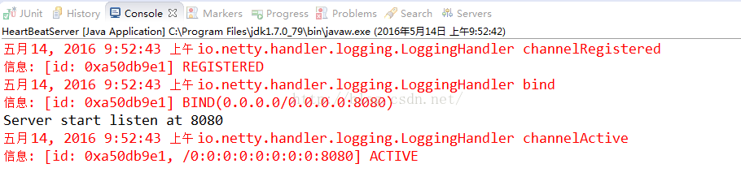

[TOC]


# Netty心跳简单Demo

## 简介

前面简单地了解了一下IdleStateHandler，我们现在写一个简单的心跳demo：

1）服务器端每隔5秒检测服务器端的读超时，如果5秒没有接受到客户端的写请求，也就说服务器端5秒没有收到读事件，则视为一次超时

2）如果超时三次则说明连接处于不活跃的状态，关闭ServerChannel

3）客户端每隔4秒发送一些写请求，这个请求相当于一次心跳包，告之服务器端：客户端仍旧活着

我们开始先开始写服务器端的handler,继承ChannelInboundHandlerAdapter，我们先重写userEventTriggered方法，这个方法我们前面讲过，如果超时则会触发相应的超时事件


## 实例

### HeartBeatServerHandler.java

```java
package com.lyncc.netty.heartbeats;
 
import io.netty.channel.ChannelHandlerContext;
import io.netty.channel.ChannelInboundHandlerAdapter;
import io.netty.handler.timeout.IdleState;
import io.netty.handler.timeout.IdleStateEvent;
 
public class HeartBeatServerHandler extends ChannelInboundHandlerAdapter {
 
    private int loss_connect_time = 0;
 
    @Override
    public void userEventTriggered(ChannelHandlerContext ctx, Object evt) throws Exception {
        if (evt instanceof IdleStateEvent) {
            IdleStateEvent event = (IdleStateEvent) evt;
            if (event.state() == IdleState.READER_IDLE) {
                loss_connect_time++;
                System.out.println("5 秒没有接收到客户端的信息了");
                if (loss_connect_time > 2) {
                    System.out.println("关闭这个不活跃的channel");
                    ctx.channel().close();
                }
            }
        } else {
            super.userEventTriggered(ctx, evt);
        }
    }
 
    @Override
    public void channelRead(ChannelHandlerContext ctx, Object msg) throws Exception {
        System.out.println("server channelRead..");
        System.out.println(ctx.channel().remoteAddress() + "->Server :" + msg.toString());
    }
 
    @Override
    public void exceptionCaught(ChannelHandlerContext ctx, Throwable cause) throws Exception {
        cause.printStackTrace();
        ctx.close();
    }
 
}

```

再写一下服务器端，我们要注意的是，我们要在channelPipeline中加入IdleStateHandler，我们在handler中提示的是5秒读，所以我们配置的是：


这样就可以每隔5秒检测一下服务端的读超时。完整代码清单如下:

### HeartBeatServer.java

```java
package com.lyncc.netty.heartbeats;
 
import io.netty.bootstrap.ServerBootstrap;
import io.netty.channel.ChannelFuture;
import io.netty.channel.ChannelInitializer;
import io.netty.channel.ChannelOption;
import io.netty.channel.EventLoopGroup;
import io.netty.channel.nio.NioEventLoopGroup;
import io.netty.channel.socket.SocketChannel;
import io.netty.channel.socket.nio.NioServerSocketChannel;
import io.netty.handler.codec.string.StringDecoder;
import io.netty.handler.codec.string.StringEncoder;
import io.netty.handler.logging.LogLevel;
import io.netty.handler.logging.LoggingHandler;
import io.netty.handler.timeout.IdleStateHandler;
 
import java.net.InetSocketAddress;
import java.util.concurrent.TimeUnit;
 
public class HeartBeatServer {
    
private int port;
    
    public HeartBeatServer(int port) {
        this.port = port;
    }
    
    public void start(){
        EventLoopGroup bossGroup = new NioEventLoopGroup(1);
        EventLoopGroup workerGroup = new NioEventLoopGroup();
        try {
            ServerBootstrap sbs = new ServerBootstrap().group(bossGroup,workerGroup).channel(NioServerSocketChannel.class).handler(new LoggingHandler(LogLevel.INFO)).localAddress(new InetSocketAddress(port))
                    .childHandler(new ChannelInitializer<SocketChannel>() {
                        protected void initChannel(SocketChannel ch) throws Exception {
                            ch.pipeline().addLast(new IdleStateHandler(5, 0, 0, TimeUnit.SECONDS));
                            ch.pipeline().addLast("decoder", new StringDecoder());
                            ch.pipeline().addLast("encoder", new StringEncoder());
                            ch.pipeline().addLast(new HeartBeatServerHandler());
                        };
                        
                    }).option(ChannelOption.SO_BACKLOG, 128)   
                    .childOption(ChannelOption.SO_KEEPALIVE, true);
             // 绑定端口，开始接收进来的连接
             ChannelFuture future = sbs.bind(port).sync();  
             
             System.out.println("Server start listen at " + port );
             future.channel().closeFuture().sync();
        } catch (Exception e) {
            bossGroup.shutdownGracefully();
            workerGroup.shutdownGracefully();
        }
    }
    
    public static void main(String[] args) throws Exception {
        int port;
        if (args.length > 0) {
            port = Integer.parseInt(args[0]);
        } else {
            port = 8080;
        }
        new HeartBeatServer(port).start();
    }
 
}

```

也就说这个方法每隔4秒都能触发：


红色边框代码在客户端没有写事件的时候，一超时就会触发写请求：

完整代码如下：

### HeartBeatClientHandler.java

```java
package com.lyncc.netty.heartbeats;
 
import java.util.Date;
 
import io.netty.buffer.ByteBuf;
import io.netty.buffer.Unpooled;
import io.netty.channel.ChannelHandlerContext;
import io.netty.channel.ChannelInboundHandlerAdapter;
import io.netty.handler.timeout.IdleState;
import io.netty.handler.timeout.IdleStateEvent;
import io.netty.util.CharsetUtil;
import io.netty.util.ReferenceCountUtil;
 
public class HeartBeatClientHandler extends ChannelInboundHandlerAdapter {
 
    
    private static final ByteBuf HEARTBEAT_SEQUENCE = Unpooled.unreleasableBuffer(Unpooled.copiedBuffer("Heartbeat",
            CharsetUtil.UTF_8));
    
    private static final int TRY_TIMES = 3;
    
    private int currentTime = 0;
    
    @Override
    public void channelActive(ChannelHandlerContext ctx) throws Exception {
        System.out.println("激活时间是："+new Date());
        System.out.println("HeartBeatClientHandler channelActive");
        ctx.fireChannelActive();
    }
 
    @Override
    public void channelInactive(ChannelHandlerContext ctx) throws Exception {
        System.out.println("停止时间是："+new Date());
        System.out.println("HeartBeatClientHandler channelInactive");
    }
 
    @Override
    public void userEventTriggered(ChannelHandlerContext ctx, Object evt) throws Exception {
        System.out.println("循环触发时间："+new Date());
        if (evt instanceof IdleStateEvent) {
            IdleStateEvent event = (IdleStateEvent) evt;
            if (event.state() == IdleState.WRITER_IDLE) {
                if(currentTime <= TRY_TIMES){
                    System.out.println("currentTime:"+currentTime);
                    currentTime++;
                    ctx.channel().writeAndFlush(HEARTBEAT_SEQUENCE.duplicate());
                }
            }
        }
    }
 
    @Override
    public void channelRead(ChannelHandlerContext ctx, Object msg) throws Exception {
        String message = (String) msg;
        System.out.println(message);
        if (message.equals("Heartbeat")) {
            ctx.write("has read message from server");
            ctx.flush();
        }
        ReferenceCountUtil.release(msg);
    }
}

```

客户端代码也要加入IdleStateHandler这个handler，注意的是，我们要注意的是写超时，所以要设置写超时的时间，因为服务器端是5秒检测读超时，所以客户端必须在5秒内发送一次心跳，告之服务端，所以我们设置4秒：


完整代码如下：

### HeartBeatsClient.java

```java
package com.lyncc.netty.heartbeats;
 
import java.util.concurrent.TimeUnit;
 
import io.netty.bootstrap.Bootstrap;
import io.netty.channel.ChannelFuture;
import io.netty.channel.ChannelInitializer;
import io.netty.channel.ChannelOption;
import io.netty.channel.ChannelPipeline;
import io.netty.channel.EventLoopGroup;
import io.netty.channel.nio.NioEventLoopGroup;
import io.netty.channel.socket.SocketChannel;
import io.netty.channel.socket.nio.NioSocketChannel;
import io.netty.handler.codec.string.StringDecoder;
import io.netty.handler.codec.string.StringEncoder;
import io.netty.handler.logging.LogLevel;
import io.netty.handler.logging.LoggingHandler;
import io.netty.handler.timeout.IdleStateHandler;
 
public class HeartBeatsClient {
 
    public void connect(int port, String host) throws Exception {
     // Configure the client.
        EventLoopGroup group = new NioEventLoopGroup();
        try {
            Bootstrap b = new Bootstrap();
            b.group(group)
             .channel(NioSocketChannel.class)
             .option(ChannelOption.TCP_NODELAY, true)
             .handler(new LoggingHandler(LogLevel.INFO))
             .handler(new ChannelInitializer<SocketChannel>() {
                 @Override
                 public void initChannel(SocketChannel ch) throws Exception {
                     ChannelPipeline p = ch.pipeline();
                     p.addLast("ping", new IdleStateHandler(0, 4, 0, TimeUnit.SECONDS));
                     p.addLast("decoder", new StringDecoder());
                     p.addLast("encoder", new StringEncoder());
                     p.addLast(new HeartBeatClientHandler());
                 }
             });
 
            ChannelFuture future = b.connect(host, port).sync();
            future.channel().closeFuture().sync();
        } finally {
            group.shutdownGracefully();
        }
    }
 
    /**
     * @param args
     * @throws Exception
     */
    public static void main(String[] args) throws Exception {
        int port = 8080;
        if (args != null && args.length > 0) {
            try {
                port = Integer.valueOf(args[0]);
            } catch (NumberFormatException e) {
                // 采用默认值
            }
        }
        new HeartBeatsClient().connect(port, "127.0.0.1");
    }
 
}

```

我们先启动服务器端：



再启动客户端：


此时客户端还存活着，我们看看服务器端的输出：


我们再看看客户端的输出：


inactive的事件触发了，且客户端自动停止了~

简单的心跳Demo就是这样，如有不对，还希望大家多多拍砖~


https://blog.csdn.net/linuu/article/details/51404264