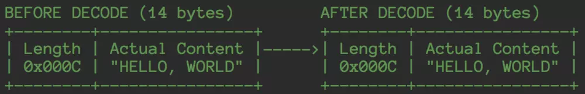
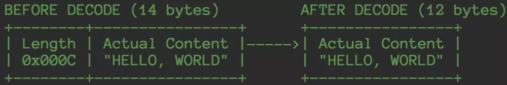
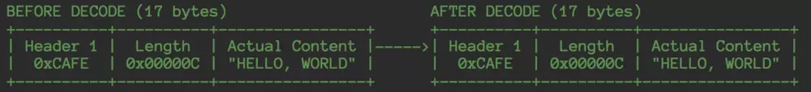
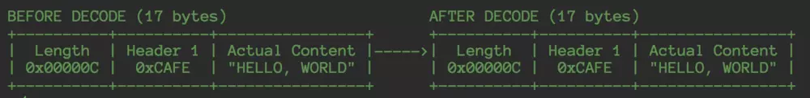
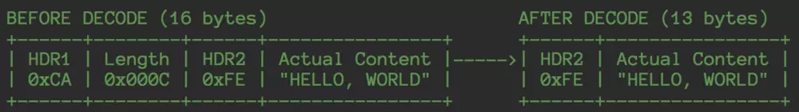
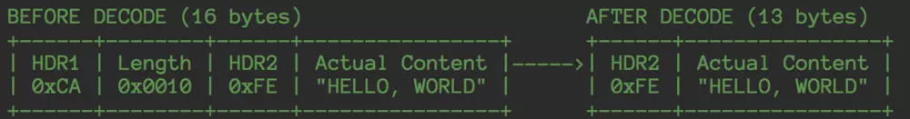

[TOC]


# netty源码分析之LengthFieldBasedFrameDecoder

## 拆包的原理

关于拆包原理的上一篇博文 [netty源码分析之拆包器的奥秘](https://www.jianshu.com/p/dc26e944da95) 中已详细阐述，这里简单总结下：netty的拆包过程和自己写手工拆包并没有什么不同，都是将字节累加到一个容器里面，判断当前累加的字节数据是否达到了一个包的大小，达到一个包大小就拆开，进而传递到上层业务解码handler

之所以netty的拆包能做到如此强大，就是因为netty将具体如何拆包抽象出一个`decode`方法，不同的拆包器实现不同的`decode`方法，就能实现不同协议的拆包

这篇文章中要讲的就是通用拆包器`LengthFieldBasedFrameDecoder`，如果你还在自己实现人肉拆包，不妨了解一下这个强大的拆包器，因为几乎所有和长度相关的二进制协议都可以通过TA来实现，下面我们先看看他有哪些用法

## LengthFieldBasedFrameDecoder 的用法

### 1.基于长度的拆包



Paste_Image.png

上面这类数据包协议比较常见的，前面几个字节表示数据包的长度（不包括长度域），后面是具体的数据。拆完之后数据包是一个完整的带有长度域的数据包（之后即可传递到应用层解码器进行解码），创建一个如下方式的`LengthFieldBasedFrameDecoder`即可实现这类协议

```
new LengthFieldBasedFrameDecoder(Integer.MAX, 0, 4);
```

其中
1.第一个参数是 `maxFrameLength` 表示的是包的最大长度，超出包的最大长度netty将会做一些特殊处理，后面会讲到
2.第二个参数指的是长度域的偏移量`lengthFieldOffset`，在这里是0，表示无偏移
3.第三个参数指的是长度域长度`lengthFieldLength`，这里是4，表示长度域的长度为4

### 2.基于长度的截断拆包

如果我们的应用层解码器不需要使用到长度字段，那么我们希望netty拆完包之后，是这个样子



Paste_Image.png

长度域被截掉，我们只需要指定另外一个参数就可以实现，这个参数叫做 `initialBytesToStrip`，表示netty拿到一个完整的数据包之后向业务解码器传递之前，应该跳过多少字节

```
new LengthFieldBasedFrameDecoder(Integer.MAX, 0, 4, 0, 4);
```

前面三个参数的含义和上文相同，第四个参数我们后面再讲，而这里的第五个参数就是`initialBytesToStrip`，这里为4，表示获取完一个完整的数据包之后，忽略前面的四个字节，应用解码器拿到的就是不带长度域的数据包

### 3.基于偏移长度的拆包

下面这种方式二进制协议是更为普遍的，前面几个固定字节表示协议头，通常包含一些magicNumber，protocol version 之类的meta信息，紧跟着后面的是一个长度域，表示包体有多少字节的数据



Paste_Image.png

只需要基于第一种情况，调整第二个参数既可以实现

```
new LengthFieldBasedFrameDecoder(Integer.MAX, 4, 4);
```

`lengthFieldOffset` 是4，表示跳过4个字节之后的才是长度域

### 4.基于可调整长度的拆包

有些时候，二进制协议可能会设计成如下方式



Paste_Image.png

即长度域在前，header在后，这种情况又是如何来调整参数达到我们想要的拆包效果呢？

1.长度域在数据包最前面表示无偏移，`lengthFieldOffset` 为 0
2.长度域的长度为3，即`lengthFieldLength`为3
2.长度域表示的包体的长度略过了header，这里有另外一个参数，叫做 `lengthAdjustment`，包体长度调整的大小，长度域的数值表示的长度加上这个修正值表示的就是带header的包，这里是 12+2，header和包体一共占14个字节

最后，代码实现为

```
new LengthFieldBasedFrameDecoder(Integer.MAX, 0, 3, 2, 0);
```

### 5.基于偏移可调整长度的截断拆包

更变态一点的二进制协议带有两个header，比如下面这种



Paste_Image.png

拆完之后，`HDR1` 丢弃，长度域丢弃，只剩下第二个header和有效包体，这种协议中，一般`HDR1`可以表示magicNumber，表示应用只接受以该magicNumber开头的二进制数据，rpc里面用的比较多

我们仍然可以通过设置netty的参数实现

1.长度域偏移为1，那么 `lengthFieldOffset`为1
2.长度域长度为2，那么`lengthFieldLength`为2
3.长度域表示的包体的长度略过了HDR2，但是拆包的时候HDR2也被netty当作是包体的的一部分来拆，HDR2的长度为1，那么 `lengthAdjustment` 为1
4.拆完之后，截掉了前面三个字节，那么 `initialBytesToStrip` 为 3

最后，代码实现为

```
   new LengthFieldBasedFrameDecoder(Integer.MAX, 1, 2, 1, 3);
```

### 6.基于偏移可调整变异长度的截断拆包

前面的所有的长度域表示的都是不带header的包体的长度，如果让长度域表示的含义包含整个数据包的长度，比如如下这种情况



Paste_Image.png

其中长度域字段的值为16， 其字段长度为2，HDR1的长度为1，HDR2的长度为1，包体的长度为12，1+1+2+12=16，又该如何设置参数呢？

这里除了长度域表示的含义和上一种情况不一样之外，其他都相同，因为netty并不了解业务情况，你需要告诉netty的是，长度域后面，再跟多少字节就可以形成一个完整的数据包，这里显然是13个字节，而长度域的值为16，因此减掉3才是真是的拆包所需要的长度，`lengthAdjustment`为-3

这里的六种情况是netty源码里自带的六中典型的二进制协议，相信已经囊括了90%以上的场景，如果你的协议是基于长度的，那么可以考虑不用字节来实现，而是直接拿来用，或者继承他，做些简单的修改即可

如此强大的拆包器其实现也是非常优雅，下面我们来一起看下netty是如何来实现

## LengthFieldBasedFrameDecoder 源码剖析

### 构造函数

关于`LengthFieldBasedFrameDecoder` 的构造函数，我们只需要看一个就够了

```
public LengthFieldBasedFrameDecoder(
        ByteOrder byteOrder, int maxFrameLength, int lengthFieldOffset, int lengthFieldLength,
        int lengthAdjustment, int initialBytesToStrip, boolean failFast) {
    // 省略参数校验部分
    this.byteOrder = byteOrder;
    this.maxFrameLength = maxFrameLength;
    this.lengthFieldOffset = lengthFieldOffset;
    this.lengthFieldLength = lengthFieldLength;
    this.lengthAdjustment = lengthAdjustment;
    lengthFieldEndOffset = lengthFieldOffset + lengthFieldLength;
    this.initialBytesToStrip = initialBytesToStrip;
    this.failFast = failFast;
}
```

构造函数做的事很简单，只是把传入的参数简单地保存在field，这里的大多数field在前面已经阐述过，剩下的几个补充说明下
1.`byteOrder` 表示字节流表示的数据是大端还是小端，用于长度域的读取
2.`lengthFieldEndOffset`表示紧跟长度域字段后面的第一个字节的在整个数据包中的偏移量
3.`failFast`，如果为true，则表示读取到长度域，TA的值的超过`maxFrameLength`，就抛出一个 `TooLongFrameException`，而为false表示只有当真正读取完长度域的值表示的字节之后，才会抛出 `TooLongFrameException`，默认情况下设置为true，建议不要修改，否则可能会造成内存溢出

### 实现拆包抽象

在[netty源码分析之拆包器的奥秘](https://www.jianshu.com/p/dc26e944da95)，我们已经知道，具体的拆包协议只需要实现

```
void decode(ChannelHandlerContext ctx, ByteBuf in, List<Object> out) 
```

其中 `in` 表示目前为止还未拆的数据，拆完之后的包添加到 `out`这个list中即可实现包向下传递

第一层实现比较简单

```
@Override
protected final void decode(ChannelHandlerContext ctx, ByteBuf in, List<Object> out) throws Exception {
    Object decoded = decode(ctx, in);
    if (decoded != null) {
        out.add(decoded);
    }
}
```

重载的protected函数`decode`做真正的拆包动作，下面分三个部分来分析一下这个重量级函数

### 获取frame长度

#### 1.获取需要待拆包的包大小

```
// 如果当前可读字节还未达到长度长度域的偏移，那说明肯定是读不到长度域的，直接不读
if (in.readableBytes() < lengthFieldEndOffset) {
    return null;
}

// 拿到长度域的实际字节偏移 
int actualLengthFieldOffset = in.readerIndex() + lengthFieldOffset;
// 拿到实际的未调整过的包长度
long frameLength = getUnadjustedFrameLength(in, actualLengthFieldOffset, lengthFieldLength, byteOrder);


// 如果拿到的长度为负数，直接跳过长度域并抛出异常
if (frameLength < 0) {
    in.skipBytes(lengthFieldEndOffset);
    throw new CorruptedFrameException(
            "negative pre-adjustment length field: " + frameLength);
}

// 调整包的长度，后面统一做拆分
frameLength += lengthAdjustment + lengthFieldEndOffset;
```

上面这一段内容有个扩展点 `getUnadjustedFrameLength`，如果你的长度域代表的值表达的含义不是正常的int,short等基本类型，你可以重写这个函数

```
protected long getUnadjustedFrameLength(ByteBuf buf, int offset, int length, ByteOrder order) {
        buf = buf.order(order);
        long frameLength;
        switch (length) {
        case 1:
            frameLength = buf.getUnsignedByte(offset);
            break;
        case 2:
            frameLength = buf.getUnsignedShort(offset);
            break;
        case 3:
            frameLength = buf.getUnsignedMedium(offset);
            break;
        case 4:
            frameLength = buf.getUnsignedInt(offset);
            break;
        case 8:
            frameLength = buf.getLong(offset);
            break;
        default:
            throw new DecoderException(
                    "unsupported lengthFieldLength: " + lengthFieldLength + " (expected: 1, 2, 3, 4, or 8)");
        }
        return frameLength;
    }
```

比如，有的奇葩的长度域里面虽然是4个字节，比如 0x1234，但是TA的含义是10进制，即长度就是十进制的1234，那么覆盖这个函数即可实现奇葩长度域拆包

#### 2. 长度校验

```
// 整个数据包的长度还没有长度域长，直接抛出异常
if (frameLength < lengthFieldEndOffset) {
    in.skipBytes(lengthFieldEndOffset);
    throw new CorruptedFrameException(
            "Adjusted frame length (" + frameLength + ") is less " +
            "than lengthFieldEndOffset: " + lengthFieldEndOffset);
}

// 数据包长度超出最大包长度，进入丢弃模式
if (frameLength > maxFrameLength) {
    long discard = frameLength - in.readableBytes();
    tooLongFrameLength = frameLength;

    if (discard < 0) {
        // 当前可读字节已达到frameLength，直接跳过frameLength个字节，丢弃之后，后面有可能就是一个合法的数据包
        in.skipBytes((int) frameLength);
    } else {
        // 当前可读字节未达到frameLength，说明后面未读到的字节也需要丢弃，进入丢弃模式，先把当前累积的字节全部丢弃
        discardingTooLongFrame = true;
        // bytesToDiscard表示还需要丢弃多少字节
        bytesToDiscard = discard;
        in.skipBytes(in.readableBytes());
    }
    failIfNecessary(true);
    return null;
}
```

最后，调用`failIfNecessary`判断是否需要抛出异常

```
private void failIfNecessary(boolean firstDetectionOfTooLongFrame) {
    // 不需要再丢弃后面的未读字节，就开始重置丢弃状态
    if (bytesToDiscard == 0) {
        long tooLongFrameLength = this.tooLongFrameLength;
        this.tooLongFrameLength = 0;
        discardingTooLongFrame = false;
        // 如果没有设置快速失败，或者设置了快速失败并且是第一次检测到大包错误，抛出异常，让handler去处理
        if (!failFast ||
            failFast && firstDetectionOfTooLongFrame) {
            fail(tooLongFrameLength);
        }
    } else {
        // 如果设置了快速失败，并且是第一次检测到打包错误，抛出异常，让handler去处理
        if (failFast && firstDetectionOfTooLongFrame) {
            fail(tooLongFrameLength);
        }
    }
}
```

前面我们可以知道`failFast`默认为true，而这里`firstDetectionOfTooLongFrame`为true，所以，第一次检测到大包肯定会抛出异常

下面是抛出异常的代码

```
private void fail(long frameLength) {
    if (frameLength > 0) {
        throw new TooLongFrameException(
                        "Adjusted frame length exceeds " + maxFrameLength +
                        ": " + frameLength + " - discarded");
    } else {
        throw new TooLongFrameException(
                        "Adjusted frame length exceeds " + maxFrameLength +
                        " - discarding");
    }
}
```

### 丢弃模式的处理

如果读者是一边对着源码，一边阅读本篇文章，就会发现 `LengthFieldBasedFrameDecoder.decoder` 函数的入口处还有一段代码在我们的前面的分析中被我省略掉了，放到这一小节中的目的是为了承接上一小节，更加容易读懂丢弃模式的处理

```
if (discardingTooLongFrame) {
    long bytesToDiscard = this.bytesToDiscard;
    int localBytesToDiscard = (int) Math.min(bytesToDiscard, in.readableBytes());
    in.skipBytes(localBytesToDiscard);
    bytesToDiscard -= localBytesToDiscard;
    this.bytesToDiscard = bytesToDiscard;

    failIfNecessary(false);
}
```

如上，如果当前处在丢弃模式，先计算需要丢弃多少字节，取当前还需可丢弃字节和可读字节的最小值，丢弃掉之后，进入 `failIfNecessary`，对照着这个函数看，默认情况下是不会继续抛出异常，而如果设置了 `failFast`为false，那么等丢弃完之后，才会抛出异常，读者可自行分析

### 跳过指定字节长度

丢弃模式的处理以及长度的校验都通过之后，进入到跳过指定字节长度这个环节

```
int frameLengthInt = (int) frameLength;
if (in.readableBytes() < frameLengthInt) {
    return null;
}

if (initialBytesToStrip > frameLengthInt) {
    in.skipBytes(frameLengthInt);
    throw new CorruptedFrameException(
            "Adjusted frame length (" + frameLength + ") is less " +
            "than initialBytesToStrip: " + initialBytesToStrip);
}
in.skipBytes(initialBytesToStrip);
```

先验证当前是否已经读到足够的字节，如果读到了，在下一步抽取一个完整的数据包之前，需要根据`initialBytesToStrip`的设置来跳过某些字节(见文章开篇)，当然，跳过的字节不能大于数据包的长度，否则就抛出 `CorruptedFrameException` 的异常

### 抽取frame

```
int readerIndex = in.readerIndex();
int actualFrameLength = frameLengthInt - initialBytesToStrip;
ByteBuf frame = extractFrame(ctx, in, readerIndex, actualFrameLength);
in.readerIndex(readerIndex + actualFrameLength);

return frame;
```

到了最后抽取数据包其实就很简单了，拿到当前累积数据的读指针，然后拿到待抽取数据包的实际长度进行抽取，抽取之后，移动读指针

```
protected ByteBuf extractFrame(ChannelHandlerContext ctx, ByteBuf buffer, int index, int length) {
    return buffer.retainedSlice(index, length);
}
```

抽取的过程是简单的调用了一下 `ByteBuf` 的`retainedSlice`api，该api无内存copy开销

从真正抽取数据包来看看，传入的参数为 `int` 类型，所以，可以判断，自定义协议中，如果你的长度域是8个字节的，那么前面四个字节基本是没有用的。

## 总结

1.如果你使用了netty，并且二进制协议是基于长度，考虑使用`LengthFieldBasedFrameDecoder`吧，通过调整各种参数，一定会满足你的需求
2.`LengthFieldBasedFrameDecoder`的拆包包括合法参数校验，异常包处理，以及最后调用 `ByteBuf` 的`retainedSlice`来实现无内存copy的拆包

> 如果你觉得看的不过瘾，想系统学习Netty原理，那么你一定不要错过我的Netty源码分析系列视频：<https://coding.imooc.com/class/230.html> 


https://www.jianshu.com/p/a0a51fd79f62