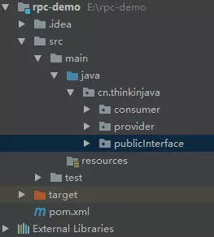

# 自己用 Netty 实现一个简单的 RPC

源码地址：[github 源码地址](https://link.juejin.im/?target=https%3A%2F%2Fgithub.com%2FstateIs0%2Frpc-netty-demo)

## 前言

众所周知，dubbo 底层使用了 Netty 作为网络通讯框架，而 Netty 的高性能我们之前也分析过源码，对他也算还是比较了解了。今天我们就自己用 Netty 实现一个简单的 RPC 框架。

## 1. 需求

模仿 dubbo，消费者和提供者约定接口和协议，消费者远程调用提供者，提供者返回一个字符串，消费者打印提供者返回的数据。底层网络通信使用 Netty 4.1.16。

## 2. 设计

1. 创建一个接口，定义抽象方法。用于消费者和提供者之间的约定。
2. 创建一个提供者，该类需要监听消费者的请求，并按照约定返回数据。
3. 创建一个消费者，该类需要透明的调用自己不存在的方法，内部需要使用 Netty 请求提供者返回数据。

## 3. 实现

#### 1. 创建 maven 项目，导入 Netty 4.1.16。

```xml
  <groupId>cn.thinkinjava</groupId>
  <artifactId>rpc-demo</artifactId>
  <version>1.0-SNAPSHOT</version>

  <dependencies>
    <dependency>
      <groupId>io.netty</groupId>
      <artifactId>netty-all</artifactId>
      <version>4.1.16.Final</version>
    </dependency>
  </dependencies>
```

#### 2. 项目目录结构如下：



#### 3. 设计接口

一个简单的 hello world：

```
public interface HelloService {
  String hello(String msg);
} 
```

#### 4. 提供者相关实现

4.1. 首先实现约定接口，用于返回客户端数据：

```java
/**
 * 实现类
 */
public class HelloServiceImpl implements HelloService {
  public String hello(String msg) {
    return msg != null ? msg + " -----> I am fine." : "I am fine.";
  }
}
```

4.2. 实现 Netty 服务端和自定义 handler

启动 Netty Server 代码：

```java
  private static void startServer0(String hostName, int port) {
    try {
      ServerBootstrap bootstrap = new ServerBootstrap();
      NioEventLoopGroup eventLoopGroup = new NioEventLoopGroup();
      bootstrap.group(eventLoopGroup)
          .channel(NioServerSocketChannel.class)
          .childHandler(new ChannelInitializer<SocketChannel>() {
            @Override
            protected void initChannel(SocketChannel ch) throws Exception {
              ChannelPipeline p = ch.pipeline();
              p.addLast(new StringDecoder());
              p.addLast(new StringEncoder());
              p.addLast(new HelloServerHandler());
            }
          });
      bootstrap.bind(hostName, port).sync();
    } catch (InterruptedException e) {
      e.printStackTrace();
    }
  }

```

上面的代码中添加了 String类型的编解码 handler，添加了一个自定义 handler。

自定义 handler 逻辑如下：

```
/**
 * 用于处理请求数据
 */
public class HelloServerHandler extends ChannelInboundHandlerAdapter {
  @Override
  public void channelRead(ChannelHandlerContext ctx, Object msg) {

    // 如何符合约定，则调用本地方法，返回数据
    if (msg.toString().startsWith(ClientBootstrap.providerName)) {
      String result = new HelloServiceImpl()
          .hello(msg.toString().substring(msg.toString().lastIndexOf("#") + 1));
      ctx.writeAndFlush(result);
    }
  }
}

```

这里显示判断了是否符合约定（并没有使用复杂的协议，只是一个字符串判断），然后创建一个具体实现类，并调用方法写回客户端。

还需要一个启动类：

```
public class ServerBootstrap {
  public static void main(String[] args) {
    NettyServer.startServer("localhost", 8088);
  }
}

```

好，关于提供者的代码就写完了，主要就是创建一个 netty 服务端，实现一个自定义的 handler，自定义 handler 判断是否符合之间的约定（算是协议吧），如果符合，就创建一个接口的实现类，并调用他的方法返回字符串。

#### 5. 消费者相关实现

消费者有一个需要注意的地方，就是调用需要透明，也就是说，框架使用者不用关心底层的网络实现。这里我们可以使用 JDK 的动态代理来实现这个目的。

思路：客户端调用代理方法，返回一个实现了 HelloService 接口的代理对象，调用代理对象的方法，返回结果。

我们需要在代理中做手脚，当调用代理方法的时候，我们需要初始化 Netty 客户端，还需要向服务端请求数据，并返回数据。

5.1. 首先创建代理相关的类

```
public class RpcConsumer {

  private static ExecutorService executor = Executors
      .newFixedThreadPool(Runtime.getRuntime().availableProcessors());

  private static HelloClientHandler client;

  /**
   * 创建一个代理对象
   */
  public Object createProxy(final Class<?> serviceClass,
      final String providerName) {
    return Proxy.newProxyInstance(Thread.currentThread().getContextClassLoader(),
        new Class<?>[]{serviceClass}, (proxy, method, args) -> {
          if (client == null) {
            initClient();
          }
          // 设置参数
          client.setPara(providerName + args[0]);
          return executor.submit(client).get();
        });
  }

  /**
   * 初始化客户端
   */
  private static void initClient() {
    client = new HelloClientHandler();
    EventLoopGroup group = new NioEventLoopGroup();
    Bootstrap b = new Bootstrap();
    b.group(group)
        .channel(NioSocketChannel.class)
        .option(ChannelOption.TCP_NODELAY, true)
        .handler(new ChannelInitializer<SocketChannel>() {
          @Override
          public void initChannel(SocketChannel ch) throws Exception {
            ChannelPipeline p = ch.pipeline();
            p.addLast(new StringDecoder());
            p.addLast(new StringEncoder());
            p.addLast(client);
          }
        });
    try {
      b.connect("localhost", 8088).sync();
    } catch (InterruptedException e) {
      e.printStackTrace();
    }
  }
}


```

该类有 2 个方法，创建代理和初始化客户端。

初始化客户端逻辑： 创建一个 Netty 的客户端，并连接提供者，并设置一个自定义 handler，和一些 String 类型的编解码器。

创建代理逻辑：使用 JDK 的动态代理技术，代理对象中的 invoke 方法实现如下： 如果 client 没有初始化，则初始化 client，这个 client 既是 handler ，也是一个 Callback。将参数设置进 client ，使用线程池调用 client 的 call 方法并阻塞等待数据返回。

看看 HelloClientHandler 的实现：

```
public class HelloClientHandler extends ChannelInboundHandlerAdapter implements Callable {

  private ChannelHandlerContext context;
  private String result;
  private String para;

  @Override
  public void channelActive(ChannelHandlerContext ctx) {
    context = ctx;
  }

  /**
   * 收到服务端数据，唤醒等待线程
   */
  @Override
  public synchronized void channelRead(ChannelHandlerContext ctx, Object msg) {
    result = msg.toString();
    notify();
  }

  /**
   * 写出数据，开始等待唤醒
   */
  @Override
  public synchronized Object call() throws InterruptedException {
    context.writeAndFlush(para);
    wait();
    return result;
  }

  void setPara(String para) {
    this.para = para;
  }
}


```

该类缓存了 ChannelHandlerContext，用于下次使用，有两个属性：返回结果和请求参数。

当成功连接后，缓存 ChannelHandlerContext，当调用 call 方法的时候，将请求参数发送到服务端，等待。当服务端收到并返回数据后，调用 channelRead 方法，将返回值赋值个 result，并唤醒等待在 call 方法上的线程。此时，代理对象返回数据。

再看看设计的测试类：

```
public class ClientBootstrap {

  public static final String providerName = "HelloService#hello#";

  public static void main(String[] args) throws InterruptedException {

    RpcConsumer consumer = new RpcConsumer();
    // 创建一个代理对象
    HelloService service = (HelloService) consumer
        .createProxy(HelloService.class, providerName);
    for (; ; ) {
      Thread.sleep(1000);
      System.out.println(service.hello("are you ok ?"));
    }
  }
}


```

测试类首先创建了一个代理对象，然后每隔一秒钟调用代理的 hello 方法，并打印服务端返回的结果。

## 测试结果

```
are you ok ? -----> I am fine.
are you ok ? -----> I am fine.
are you ok ? -----> I am fine.
are you ok ? -----> I am fine.
are you ok ? -----> I am fine.
are you ok ? -----> I am fine.
are you ok ? -----> I am fine.
are you ok ? -----> I am fine.
```

成功打印。

## 总结

看了这么久的 Netty 源码，我们终于实现了一个自己的 Netty 应用，虽然这个应用很简单，甚至代码写的有些粗糙，但功能还是实现了，RPC 的目的就是允许像调用本地服务一样调用远程服务，需要对使用者透明，于是我们使用了动态代理。并使用 Netty 的 handler 发送数据和响应数据，完成了一次简单的 RPC 调用。

当然，还是那句话，代码比较简单，主要是思路，以及了解 RPC 底层的实现。

好吧。good luck！！！！


https://juejin.im/post/5ab86713f265da2398673ff2