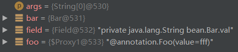
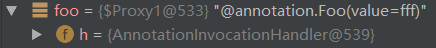

# java 通过反射，动态修改注解的某个属性值

昨晚看到一条[问题](https://segmentfault.com/a/1190000011213222#https://segmentfault.com/q/1010000010773372)，大意是楼主希望可以动态得建立多个Spring 的定时任务。

这个题目我并不是很熟悉，不过根据题目描述和查阅相关 *Spring 创建定时任务* 的资料，发现这也许涉及到通过Java代码动态修改注解的属性值。

今天对此尝试了一番，发现通过反射来动态修改注解的属性值是可以做到的：

众所周知，`java/lang/reflect` 这个包下面都是Java的反射类和工具。

`Annotation` 注解，也是位于这个包里的。注解自从Java 5.0版本引入后，就成为了Java平台中非常重要的一部分，常见的如 `@Override`、 `@Deprecated`。

关于注解更详细的信息和使用方法，网上已经有很多资料，这里就不再赘述了。

一个注解通过 `@Retention` 指定其生命周期，本文所讨论的动态修改注解属性值，建立在 `@Retention(RetentionPolicy.RUNTIM)` 这种情况。毕竟这种注解才能在运行时(runtime)通过反射机制进行操作。

那么现在我们定义一个 `@Foo` 注解，它有一个类型为 `String` 的 `value` 属性，该注解应用再`Field`上:

```
/**
 * Created by krun on 2017/9/18.
 */
@Target(ElementType.FIELD)
@Retention(RetentionPolicy.RUNTIME)
public @interface Foo {
    String value();
}
```

再定义一个普通的Java对象 `Bar`，它有一个私有的`String`属性 `val`，并为它设置属性值为`"fff"` 的 `@Foo` 注解:

```
public class Bar {

    @Foo ("fff")
    private String val;
}
```

接下来在 `main` 方法中我们来尝试修改 `Bar.val` 上的 `@Foo`注解的属性值为 `"ddd"`。

先是正常的获取注解属性值:

```
/**
 * Created by krun on 2017/9/18.
 */
public class Main {
    public static void main(String ...args) throws NoSuchFieldException {
        //获取Bar实例
        Bar bar = new Bar();
        //获取Bar的val字段
        Field field = Bar.class.getDeclaredField("val");
        //获取val字段上的Foo注解实例
        Foo foo = field.getAnnotation(Foo.class);
        //获取Foo注解实例的 value 属性值
        String value = foo.value();
        //打印该值
        System.out.println(value); // fff
    }
}
```

首先，我们要知道注解的值是存在哪里的。

在 `String value = foo.value();` 处下断点，我们跑一下可以发现：



当前栈中有这么几个变量，不过其中有一点很特别：`foo`，其实是个`Proxy`实例。

`Proxy`也是 `java/lang/reflect`下的东西，它的作用是为一个Java类生成一个代理，就像这样：

```java
public interface A {
    String func1();
}

public class B implements A {
    
    @Override
    public String func1() { //do something ... }
    
    public String func2() { //do something ... };
}

public static void main(String ...args) {
    B bInstance = new B();
    
    B bProxy = Proxy.newProxyInstance(
        B.class.getClassLoader(),    // B 类的类加载器
        B.class.getInterfaces(), // B 类所实现的接口，如果你想拦截B类的某个方法，必须让这个方法在某个接口中声明并让B类实现该接口
        new InvocationHandler() { // 调用处理器，任何对 B类所实现的接口方法的调用都会触发此处理器
            @Override
            public Object invoke (Object proxy, // 这个是代理的实例，method.invoke时不能使用这个，否则会死循环
                                  Method method, // 触发的接口方法
                                  Object[] args // 此次调用该方法的参数
                                  ) throws Throwable {
                System.out.println(String.format("调用 %s 之前", method.getName()));
                /**
                 * 这里必须使用B类的某个具体实现类的实例，因为触发时这里的method只是一个接口方法的引用，
                 * 也就是说它是空的，你需要为它指定具有逻辑的上下文(bInstance)。
                 */
                Object obj = method.invoke(bInstance, args); 
                System.out.println(String.format("调用 %s 之后", method.getName()));
                return obj; //返回调用结果
            }
        }
    );
}
```

这样你就可以拦截这个Java类的某个方法调用，但是你只能拦截到 `func1`的调用，想想为什么？

那么注意了：

`ClassLoader` 这是个`class`就会有，注解也不例外。那么注解和`interfaces`有什么关系?

注解本质上就是一个接口，它的实质定义为: `interface SomeAnnotation extends Annotation`。
这个 `Annotation` 接口位于 `java/lang/annotation` 包，它的注释中第一句话就是 `The common interface extended by all annotation types.`

如此说来，`Foo` 注解本身只是个接口，这就意味着它没有任何代码逻辑，那么它的 `value` 属性究竟是存在哪里的呢？

展开 `foo` 可以发现：



这个 `Proxy` 实例持有一个 `AnnotationInvocationHandler`，还记得之前提到过如何创建一个 `Proxy` 实例么? 第三个参数就是一个 `InvocationHandler`。
看名字这个`handler`即是`Annotation`所特有的，我们看一下它的代码：

```java
class AnnotationInvocationHandler implements InvocationHandler, Serializable {

    private final Class<? extends Annotation> type;
    private final Map<String, Object> memberValues;
    private transient volatile Method[] memberMethods = null;
    
    /* 后续无关代码就省略了，想看的话可以查看 sun/reflect/annotation/AnnotationInvocationHandler */
   
}
```

我们一眼就可以看到一个有意思的名字: `memberValues`，这是一个Map，而断点中可以看到这是一个 `LinknedHashMap`，`key`为注解的属性名称，`value`即为注解的属性值。

现在我们找到了注解的属性值存在哪里了，那么接下来的事就好办了：

```java
/**
 * Created by krun on 2017/9/18.
 */
public class Main {
    public static void main(String ...args) throws NoSuchFieldException, IllegalAccessException {
        //获取Bar实例
        Bar bar = new Bar();
        //获取Bar的val字段
        Field field = Bar.class.getDeclaredField("val");
        //获取val字段上的Foo注解实例
        Foo foo = field.getAnnotation(Foo.class);
        //获取 foo 这个代理实例所持有的 InvocationHandler
        InvocationHandler h = Proxy.getInvocationHandler(foo);
        // 获取 AnnotationInvocationHandler 的 memberValues 字段
        Field hField = h.getClass().getDeclaredField("memberValues");
        // 因为这个字段事 private final 修饰，所以要打开权限
        hField.setAccessible(true);
        // 获取 memberValues
        Map memberValues = (Map) hField.get(h);
        // 修改 value 属性值
        memberValues.put("value", "ddd");
        // 获取 foo 的 value 属性值
        String value = foo.value();
        System.out.println(value); // ddd
    }
}
```


<https://segmentfault.com/a/1190000011213222>