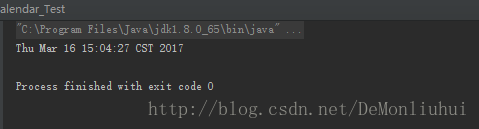
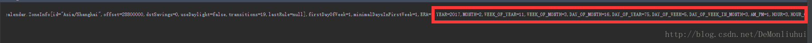

# Java Calendar日历与Date日期的相互转换

 

### Calendar转化为Data

返回标准化的Date

```
 public static Date calendarToData(int year, int month, int day) {
        Calendar calendar = Calendar.getInstance();//日历类的实例化
        calendar.set(year, month - 1, day);//设置日历时间，月份必须减一
        Date date = calendar.getTime(); // 从一个 Calendar 对象中获取 Date 对象
        return date;
    }
  System.out.println(calendarToData(2017,3,16));//打印测试1234567
```



### Data转化为Calendar

返回的的是日历类里面有关时间的全部信息。

```
  public static Calendar dataToCalendar(Date date) {
        Calendar calendar = Calendar.getInstance();
        calendar.setTime(date);
        return calendar;
    }

    Date date = new Date();//直接new对象，获取的是当前时间
    System.out.println(dataToCalendar(date));//打印测试12345678
```




https://blog.csdn.net/DeMonliuhui/article/details/62423646