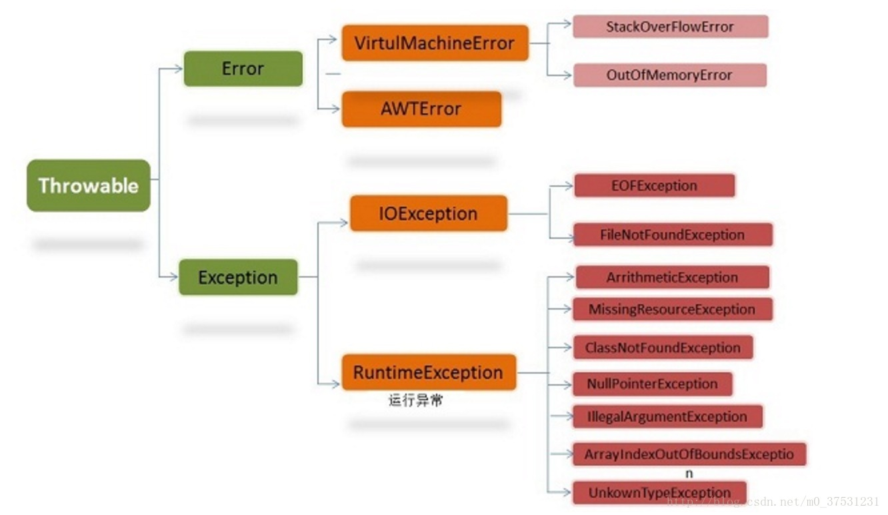
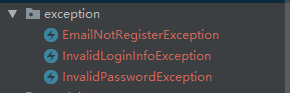

[TOC]


# java异常处理 Exception、error、运行时异常和一般异常有何异同

2018年03月09日 22:59:55 [程序cow](https://me.csdn.net/m0_37531231) 阅读数：7441


## 一、开场白

对于程序运行过程中的可能出现异常情况，[java语言](https://www.baidu.com/s?wd=java%E8%AF%AD%E8%A8%80&tn=24004469_oem_dg&rsv_dl=gh_pl_sl_csd)使用一种称为异常处理的错误捕捉机制进行处理。相信大家对 try { }catch( ){} finally{} 这种结构非常熟悉，使用频率极高。既然经常使用它，而且也是面试常问知识点，我们就有必要去深入地了解一下。也谈不上深入，只是java语言的基本功。下面，开始吧！

## 二、异常分类

在java中，异常对象都是派生于**Throwable**类的一个实例。如果java内置的异常类不能够满足需求，用户还可以创建自己的异常类。

**下图是java异常类层次结构图** 

可以看出，所有的异常都是由**Throwable**类，下一层分解为两个分支：**Error**和**Exceprion**。 
**Error**层次结构描述了java运行时系统的内部错误和资源耗尽错误。大多数错误与代码编写者执行的操作无关，而表示代码运行时 JVM（Java 虚拟机）出现的问题。应用程序不应该抛出这种类型的对象。 
**Exceprion**这个层次结构又分解为连个分支：一个分支派生于**RuntimeException**；另一个分支包含其他异常。划分两个分支的规则是：由程序错误导致的异常属于RuntimeException；而程序本身没有没有问题，但由于像I/O错误这类异常导致的异常属于其他异常。 
**常见的RuntimeException（运行时异常）：** 
IndexOutOfBoundsException(下标越界异常) 
NullPointerException(空指针异常) 
NumberFormatException （String转换为指定的数字类型异常） 
ArithmeticException -（算术运算异常 如除数为0） 
ArrayStoreException - （向数组中存放与声明类型不兼容对象异常） 
SecurityException -（安全异常） 
**IOException（其他异常）** 
FileNotFoundException（文件未找到异常。） 
IOException（操作输入流和输出流时可能出现的异常。） 
EOFException （文件已结束异常）

## 三、概念理解

首先明白下面的两个概念 
**unchecked exception（非检查异常）**：包括运行时异常（RuntimeException）和派生于Error类的异常。对于运行时异常，java编译器不要求必须进行异常捕获处理或者抛出声明，由程序员自行决定。 
**checked exception（检查异常，编译异常，必须要处理的异常）** 
也：称非运行时异常（运行时异常以外的异常就是非运行时异常），java编译器强制程序员必须进行捕获处理，比如常见的IOExeption和SQLException。对于非运行时异常如果不进行捕获或者抛出声明处理，编译都不会通过。

## 四、异常的处理

**（1）、抛出异常**

1、调用一个抛出受查异常的方法必须用throws 子句声明 调用method2()方法。 
2、程序运行过程中发现错误，并且利用throw抛出一个受查异常 下面method2()方法。

```
    @Test
    public void test() throws FileNotFoundException {

        method();
    }
    public void method() throws FileNotFoundException {
        //一个会抛出异常的方法
        method2();
    }

    //这里 方法后是throws 
    public void method2() throws FileNotFoundException {
        //这里是throw 
        throw new FileNotFoundException();
    }
```

**（2）、捕获异常** 
try { }catch( ){} finally{} 语句块这就比较常见了。不在赘述。 
不过下面有一道有意思的题，实际使用中不太会遇见，面试题常见。 
来，看题！

```
       @Test
    public void test()  {

       System.out.println(test11());
    }


    public  String test11() {
        try {
            System.out.println("try block");

            return test12();
        } finally {
            System.out.println("finally block");
        }
    }

    public static String test12() {
        System.out.println("return statement");

        return "after return";
    }
```

答案： 
try block 
return statement 
finally block 
after return

```
    @Test
    public void test()  {

       System.out.println(test2());
    }


    public  int test() {
        int b = 20;

        try {
            System.out.println("try block");

            return b += 80;
        } catch (Exception e) {

            System.out.println("catch block");
        } finally {

            System.out.println("finally block");

            if (b > 25) {
                System.out.println("b>25, b = " + b);
            }

            return 200;
        }
    }
```

答案： 
try block 
finally block 
b>25, b = 100 
200

总结：finally块的语句在try或catch中的return语句执行之后返回之前执行且finally里的修改语句可能影响也可能不影响try或catch中 return已经确定的返回值，若finally里也有return语句则覆盖try或catch中的return语句直接返回。

## 五、实际开发中常用的一个模式

### （1）、定义业务中出现的异常

**分别是邮箱未注册异常，验证用户信息异常和验证密码异常** 


### （2）、模拟业务点会抛出这些异常，写一个UserService

```
@Service
public class UserService {
    @Autowired
    private UserRepository userRepository;
    public User getUserByUserId(int userId) throws EmailNotRegisterException, InvalidPasswordException, InvalidLoginInfoException {
        if(userId==0) throw new EmailNotRegisterException("邮箱没有注册");
        if(userId==-1) throw new InvalidLoginInfoException("账号不存在");
        if(userId==-2) throw new InvalidPasswordException("密码错误");
        return userRepository.findUserByUserId(userId);
    }
}
```

### (3)在Controller层捕获处理这些异常

```
@RestController
@RequestMapping("/users")
public class UserController {
    @Autowired
    private UserService userService;
    @RequestMapping(method = RequestMethod.GET)
    public ResponseEntity getUser() {
        User user= null;
        try {
            user = userService.getUserByUserId(1);
        } catch (EmailNotRegisterException e) {
            //TODO 做邮箱未注册的处理
            ResponseEntity.status(HttpStatus.FORBIDDEN).body(e.getMessage());
        } catch (InvalidPasswordException e) {
            //TODO 做验证密码失败的处理
            ResponseEntity.status(HttpStatus.FORBIDDEN).body(e.getMessage());
        } catch (InvalidLoginInfoException e) {
            //TODO 做验证账号失败的处理
            ResponseEntity.status(HttpStatus.FORBIDDEN).body(e.getMessage());
        }
        return  ResponseEntity.ok().body(user);
    }
}
```


https://blog.csdn.net/m0_37531231/article/details/79502778