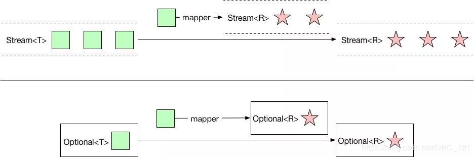
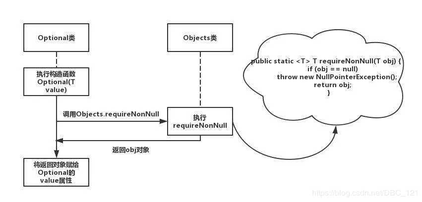

# Optional是个好东西，你会用么？（全面深度解析）

原创[BoCong-Deng](https://me.csdn.net/DBC_121) 最后发布于2020-03-20 11:29:45 阅读数 9957 收藏 原力计划

## 写在前面

从 Java 8 引入的一个很有趣的特性是 Optional 类。Optional 类主要解决的问题是臭名昭著的空指针异常（NullPointerException）这个异常就不多说了，肯定是每个 Java 程序员都非常了解的异常。Optional 的完整路径是 java.util.Optional，使用它是为了避免代码中的 if (obj != null) { } 这样范式的代码，可以采用链式编程的风格。而且通过 Optional 中提供的 filter 方法可以判断对象是否符合条件，在符合条件的情况下才会返回，map 方法可以在返回对象前修改对象中的属性。

## Optional用处

本质上，Optional是一个包含有可选值的包装类，这意味着 Optional 类既可以含有对象也可以为空。我们要知道，Optional 是 Java 实现函数式编程的强劲一步，并且帮助在范式中实现。但是 Optional 的意义显然不止于此。我们知道，任何访问对象方法或属性的调用都可能导致 NullPointerException，在这里，我举个简单的例子来说明一下

```java
String result = test.getName().getTime().getNum().getAnswer();
```

在上面的这个代码中，如果我们需要确保不触发异常，就得在访问每一个值之前对其进行明确地检查，就是使用`if else`对test等值进行判断是否为null，这很容易就变得冗长，难以维护。为了简化这个过程，Google公司著名的Guava项目引入了Optional类，Guava通过使用检查空值的方式来防止代码污染，并鼓励程序员写更干净的代码。Optional实际上是个容器：它可以保存类型T的值，或者仅仅保存null。Optional提供很多有用的方法，这样我们就不用显式进行空值检测。


## Optional的构造函数

Optional 的三种构造方式：`Optional.of(obj)`， `Optional.ofNullable(obj)` 和明确的 `Optional.empty()`

- Optional.of(obj)：它要求传入的 obj 不能是 null 值的, 否则直接报NullPointerException 异常。
- Optional.ofNullable(obj)：它以一种智能的，宽容的方式来构造一个 Optional 实例。来者不拒，传 null 进到就得到 Optional.empty()，非 null 就调用 Optional.of(obj).
- Optional.empty()：返回一个空的 Optional 对象

## Optional的常用函数

- of：为非null的值创建一个Optional。of方法通过工厂方法创建Optional类。需要注意的是，创建对象时传入的参数不能为null。如果传入参数为null，则抛出NullPointerException。因此不经常用。
- ofNullable：为指定的值创建一个Optional，如果指定的值为null，则返回一个空的Optional。
- isPresent：如果值存在返回true，否则返回false。
- ifPresent：如果Optional实例有值则为其调用consumer，否则不做处理
- get：如果Optional有值则将其返回，否则抛出NoSuchElementException。因此也不经常用。
- orElse：如果有值则将其返回，否则返回指定的其它值。
- orElseGet：orElseGet与orElse方法类似，区别在于得到的默认值。orElse方法将传入的字符串作为默认值，orElseGet方法可以接受Supplier接口的实现用来生成默认值
- orElseThrow：如果有值则将其返回，否则抛出supplier接口创建的异常。
- filter：如果有值并且满足断言条件返回包含该值的Optional，否则返回空Optional。
- map：如果有值，则对其执行调用mapping函数得到返回值。如果返回值不为null，则创建包含mapping返回值的Optional作为map方法返回值，否则返回空Optional。
- flatMap：如果有值，为其执行mapping函数返回Optional类型返回值，否则返回空Optional。

## Optional 应该怎样用

在使用 Optional 的时候需要考虑一些事情，以决定什么时候怎样使用它。重要的一点是 Optional 不是 Serializable。因此，它不应该用作类的字段。如果你需要序列化的对象包含 Optional 值，Jackson 库支持把 Optional 当作普通对象。也就是说，Jackson 会把空对象看作 null，而有值的对象则把其值看作对应域的值。这个功能在 jackson-modules-java8 项目中。Optional 主要用作返回类型，在获取到这个类型的实例后，如果它有值，你可以取得这个值，否则可以进行一些替代行为。Optional 类可以将其与流或其它返回 Optional 的方法结合，以构建流畅的API。我们来看一个示例，我们不使用Optional写代码是这样的

```java
public String getName(User user){
	if(user == null){
		return "Unknown";
	}else return user.name();
} 
```

接着我们来改造一下上面的代码，使用Optional来改造，我们先来举一个Optional滥用，没有达到流畅的链式API，反而复杂的例子，如下

```java
public String getName(User user){
	Optional<User> u = Optional.ofNullable(user);
	if(!u.isPresent()){
		return "Unknown";
	}else return u.get().name();
} 
```

这样改写非但不简洁，而且其操作还是和第一段代码一样。无非就是用isPresent方法来替代原先`user==null`。这样的改写并不是Optional正确的用法，我们再来改写一次。

```java
public String getName(User user){
	return Optional.ofNullable(user)
							.map(u -> u.name)
							.orElse("Unknown");
} 
```

这样才是正确使用Optional的姿势。那么按照这种思路，我们可以安心的进行链式调用，而不是一层层判断了。当然，我们还可以通过getter方式，对代码进行进一步缩减（前提是User要有getter方法哦），如下

```java
String result = Optional.ofNullable(user)
	.flatMap(User::getAddress)
	.flatMap(Address::getCountry)
	.map(Country::getIsocode)
	.orElse("default");
```

## Optional最佳实践

首先我们先上一张图，来简述一下Optional的使用时机


- 避免使用`Optional.isPresent()`来检查实例是否存在（上面的举例中提到过），因为这种方式和`null != obj`没有区别，这样用就没什么意义了。
- 避免使用`Optional.get()`方式来获取实例对象，因为使用前需要使用`Optional.isPresent()`来检查实例是否存在，否则会出现NoSuchElementException异常问题。所以使用`orElse()，orElseGet()，orElseThrow()`获得你的结果

这里要说明一下的是orElse(…)是急切计算，意味着类似下面代码：

```java
Optional<Dog> optionalDog = fetchOptionalDog();
optionalDog
 .map(this::printUserAndReturnUser)
 .orElse(this::printVoidAndReturnUser)
```

如果值存在则将执行两个方法，如果值不存在，则仅执行最后一个方法。为了处理这些情况，我们可以使用方法orElseGet（），它将supplier 作为参数，并且是惰性计算的。

- 避免使用Optional作为类或者实例的属性，而应该在返回值中用来包装返回实例对象。
- 避免使用Optional作为方法的参数，原因同3。
- 不要将null赋给Optional
- 只有每当结果不确定时，使用Optional作为返回类型，从某种意义上讲，这是使用Optional的唯一好地方，用java官方的话讲就是：**我们的目的是为库方法的返回类型提供一种有限的机制，其中需要一种明确的方式来表示“无结果”，并且对于这样的方法使用null 绝对可能导致错误。**
- 不要害怕使用map和filter，有一些值得遵循的一般开发实践称为SLA-p：Single Layer of Abstraction字母的第一个大写。下面是需要被重构代码到重构的代码

### **示例一**

```java
Dog dog = fetchSomeVaraible();
String dogString = dogToString(dog);
public String dogToString(Dog dog){
 if(dog == null){
   return "DOG'd name is : " + dog.getName();
 } else { 
   return "CAT";
 }
}
//上面代码重构到下面代码
Optional<Dog> dog = fetchDogIfExists();
String dogsName = dog
 .map(this::convertToDog)
 .orElseGet(this::convertToCat)

public void convertToDog(Dog dog){
   return "DOG'd name is : " + dog.getName();
}

public void convertToCat(){
   return "CAT";
}
```

### **示例二**

```java
Dog dog = fetchDog();
if(optionalDog != null && optionalDog.isBigDog()){
  doBlaBlaBla(optionalDog);
}
//上面代码重构到下面代码
Optional<Dog> optionalDog = fetchOptionalDog();
optionalDog
 .filter(Dog::isBigDog)
 .ifPresent(this::doBlaBlaBla)
```

- 不要为了链方法而使用optional。使用optional 时要注意的一件事是链式方法的诱惑。当我们像构建器模式一样链接方法时，事情可能看起来很漂亮。但并不总是等于更具可读性。所以不要这样做，它对性能不利，对可读性也不好。我们应尽可能避免使用null引用。

```java
Optional
 .ofNullable(someVariable)
 .ifPresent(this::blablabla)
```

- 使所有表达式成为单行lambda。这是更普遍的规则，我认为也应该应用于流。但这篇文章是关于optional 。使用Optional 重要点是记住等式左边和右边一样重要，这里举个例子

```java
Optional
 .ofNullable(someVariable)
 .map(variable -> {
   try{xw
      return someREpozitory.findById(variable.getIdOfOtherObject());
   } catch (IOException e){
     LOGGER.error(e); 
     throw new RuntimeException(e); 
   }})
 .filter(variable -> { 
   if(variable.getSomeField1() != null){
     return true;
   } else if(variable.getSomeField2() != null){
     return false;   
   } else { 
     return true;
   }
  })
 .map((variable -> {
   try{
      return jsonMapper.toJson(variable);
   } catch (IOException e){
     LOGGER.error(e); 
     throw new RuntimeException(e); 
   }}))
 .map(String::trim)
 .orElseThrow(() -> new RuntimeException("something went horribly wrong."))
```

上面那么冗长代码块可以使用方法替代：

```java
Optional
 .ofNullable(someVariable)
 .map(this::findOtherObject)
 .filter(this::isThisOtherObjectStale)
 .map(this::convertToJson)
 .map(String::trim)
 .orElseThrow(() -> new RuntimeException("something went horribly wrong."));
```


原文链接：

https://blog.csdn.net/DBC_121/article/details/104984093