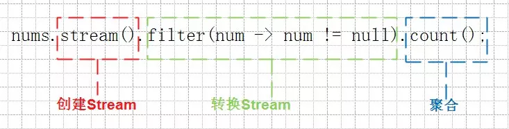

# Java8   Stream API 聚合 collect、reduce

阅读 1001

收藏 55

2016-10-10

原文链接：[blog.720ui.com](https://link.juejin.im/?target=http%3A%2F%2Fblog.720ui.com%2F2016%2Fjava_se8_02_stream%2F)

【腾讯云】 视频云 80% 直播领军企业的选择cloud.tencent.com

函数式编程是Java8最值得学习的新特性。

## 为什么需要 Stream

Stream作为Java 8的一大亮点，它与java.io包里的InputStream和OutputStream完全不同的概念。Java 8中Stream是对集合对象功能的增强，它专注于对集合对象进行各种非常便利、高效的聚合操作，或者大批量数据操作。Stream API借助于同样新出现的Lambda表达式，极大的提高编程效率和程序可读性。同时它提供串行和并行两种模式进行汇聚操作，并发模式能够充分利用多核处理器的优势，使用fork/join并行方式来拆分任务和加速处理过程。

## Stream的流程



## 创建Stream

### 使用Collection子类获取Stream

例如，从List对象获取其对应的Stream对象。

```
List nameList = Arrays.asList("Liang", "Gzone", "LiangGzone");
```

### 使用Stream静态方法of来创建Stream

可以用静态的Stream.of方法转换成一个Stream。of方法：有两个重载方法，一个接受变长参数，一个接受单一值。

```
Stream integerStream = Stream.of(1, 2, 3, 5);
Stream stringStream = Stream.of("LiangGzone");
```

### 使用Stream静态方法generate来创建Stream

```
Stream.generate(new Supplier() {
    @Override
    public Double get() {
        return Math.random();
    }
});
```

lambda表达式改写，如下

```
Stream.generate(Math::random);
```

### 使用Stream静态方法iterate来创建Stream

这段代码就是先获取一个无限长度的正整数集合的Stream，然后取出前10个打印。

```
Stream.iterate(1, i -> i + 1).limit(10).forEach(System.out::println);
```

## 流转换

流转换是指从一个流中读取数据，并将转换后的数据写入到另外一个流中。流转换操作都是懒加载，多个转换操作只会在汇聚操作的时候融合起来，一次循环完成。

### distinct

对于Stream中包含的元素进行去重操作（去重逻辑依赖元素的equals方法），新生成的Stream中没有重复的元素。

```
list.stream().distinct();
```

### filter

对于Stream中包含的元素使用给定的过滤函数进行过滤操作，新生成的Stream只包含符合条件的元素。

```
list.stream().filter(w -> w.length()>=10);
```

### map

对于Stream中包含的元素使用给定的转换函数进行转换操作，新生成的Stream只包含转换生成的元素。

```
list.stream().map(String::toUpperCase);
```

### limit

对一个Stream进行截断操作，获取其前N个元素，如果原Stream中包含的元素个数小于N，那就获取其所有的元素。

```
Stream.iterate(1, i->i+1).skip(5).limit(5);
```

### skip

返回一个丢弃原Stream的前N个元素后剩下元素组成的新Stream，如果原Stream中包含的元素个数小于N，那么返回空Stream。

```
Stream.iterate(1, i->i+1).skip(5).limit(5);
```

### peek

生成一个包含原Stream的所有元素的新Stream，同时会提供一个消费函数（Consumer实例），新Stream每个元素被消费的时候都会执行给定的消费函数。

```
Stream.iterate(1, i->i+1).skip(5).limit(5);
```

### sorted

对一个Stream进行排序操作。

```
list.stream().sorted(Comparator.comparing(String::length).reversed());
```

## 聚合操作

### reduce

我们，通过reduce方法实现求和操作。

```
public static int reduceBySum(){
    List list = Arrays.asList(1, 2, 3, 4, 5);
    return list.stream().reduce((sum, i) -> sum + i).get();
}
```

当流为空时会返回标识值，这样我们就不再需要处理Optional类了。

```
public static int reduceBySum2(){
    List list = Arrays.asList(1, 2, 3, 4, 5);
    return list.stream().reduce(0, (sum, i) -> sum + i);
}
```

我们，还可以通过reduce实现累加器函数。

```
public static int reduceBySum3(){
    List list = Arrays.asList("1", "2", "3", "4", "5");
    return list.stream().reduce(0, 
            (sum, word) -> sum + word.length(),
            (sum1, sum2) -> sum1 + sum2);
}
```

### colllect

collect可以把Stream中的要有元素收集到一个结果容器中（比如Collection）

```
public static List collect1(){
    List numList = Arrays.asList(1, 1, null, 2, 3, 4, null, 5, 6, 7, 8, 9, 10);
    List numsWithoutNullList = numList.stream()
            .filter(num -> num != null)
            .collect(() -> new ArrayList(),
                    (list, item) -> list.add(item),
                    (list1, list2) -> list1.addAll(list2));
    return numsWithoutNullList;
}
```

改造成方法引用，比较简洁，如下

```
public static List collect2(){
    List numList = Arrays.asList(1, 1, null, 2, 3, 4, null, 5, 6, 7, 8, 9, 10);
    List numsWithoutNullList = numList.stream()
            .filter(num -> num != null)
            .collect(ArrayList::new, ArrayList::add, ArrayList::addAll);
    return numsWithoutNullList;
}
```

我们可以通过Collectors提供的工具类。

```
public static List collect3(){
    List numList = Arrays.asList(1, 1, null, 2, 3, 4, null, 5, 6, 7, 8, 9, 10);
    List numsWithoutNullList = numList.stream()
            .filter(num -> num != null)
            .collect(Collectors.toList());
    return numsWithoutNullList;
}
```


https://juejin.im/entry/57fb07f9bf22ec0064979cfe