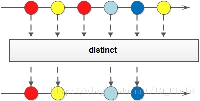
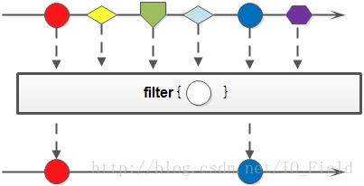
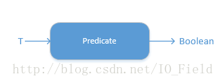
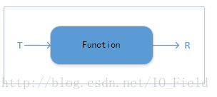
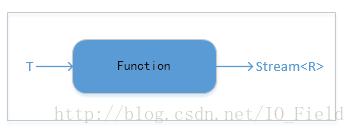
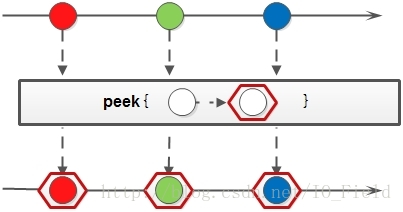
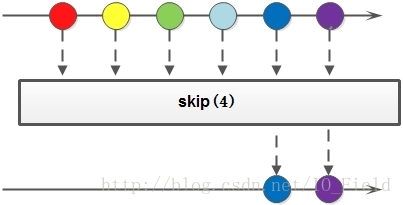
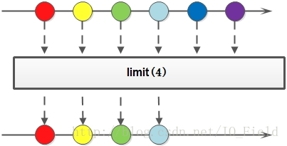

# java 8系列之Stream的基本语法详解

 

Stream系列：

- [Java 8系列之Stream的基本语法详解](http://blog.csdn.net/IO_Field/article/details/54971761)
- [Java 8系列之Stream的强大工具Collector](http://blog.csdn.net/IO_Field/article/details/54971608)
- [Java 8系列之重构和定制收集器](http://blog.csdn.net/io_field/article/details/54971555)
- [Java 8系列之Stream中万能的reduce](http://blog.csdn.net/IO_Field/article/details/54971679) 

# 概述

继[Java 8系列之Lambda表达式](http://blog.csdn.net/io_field/article/details/54380200)之后，我们来了解Stream。Stream 是用函数式编程方式在集合类上进行复杂操作的工具，其集成了Java 8中的众多新特性之一的聚合操作，开发者可以更容易地使用Lambda表达式，并且更方便地实现对集合的查找、遍历、过滤以及常见计算等。

# 聚合操作

为了学习聚合的使用，在这里，先定义一个数据类：

```
public class Student {
    int no;
    String name;
    String sex;
    float height;

    public Student(int no, String name, String sex, float height) {
        this.no = no;
        this.name = name;
        this.sex = sex;
        this.height = height;
    }

    ****
}

Student stuA = new Student(1, "A", "M", 184);
Student stuB = new Student(2, "B", "G", 163);
Student stuC = new Student(3, "C", "M", 175);
Student stuD = new Student(4, "D", "G", 158);
Student stuE = new Student(5, "E", "M", 170);
List<Student> list = new ArrayList<>();
list.add(stuA);
list.add(stuB);
list.add(stuC);
list.add(stuD);
list.add(stuE);
 
```

现有一个List list里面有5个Studeng对象，假如我们想获取Sex=“G”的Student，并打印出来。如果按照我们原来的处理模式，必然会想到一个for循环就搞定了，而在for循环其实是一个封装了迭代的语法块。在这里，我们采用Iterator进行迭代：

```
Iterator<Student> iterator = list.iterator();
while(iterator.hasNext()) {
    Student stu = iterator.next();
    if (stu.getSex().equals("G")) {

        System.out.println(stu.toString());
    }
}
 
```

整个迭代过程是这样的：首先调用iterator方法，产生一个新的Iterator对象，进而控制整 
个迭代过程，这就是外部迭代 迭代过程通过显式调用Iterator对象的hasNext和next方法完成迭代

而在Java 8中，我们可以采用聚合操作：

```
list.stream()
    .filter(student -> student.getSex().equals("G"))
    .forEach(student -> System.out.println(student.toString()));
 
```

首先，通过stream方法创建Stream，然后再通过filter方法对源数据进行过滤，最后通过foeEach方法进行迭代。在聚合操作中，与Labda表达式一起使用，显得代码更加的简洁。这里值得注意的是，我们首先是stream方法的调用，其与iterator作用一样的作用一样，该方法不是返回一个控制迭代的 Iterator 对象，而是返回内部迭代中的相应接口： Stream，其一系列的操作都是在操作Stream,直到feach时才会操作结果，这种迭代方式称为内部迭代。

外部迭代和内部迭代(聚合操作)都是对集合的迭代，但是在机制上还是有一定的差异：

1. 迭代器提供next()、hasNext()等方法，开发者可以自行控制对元素的处理，以及处理方式，但是只能顺序处理；
2. stream()方法返回的数据集无next()等方法，开发者无法控制对元素的迭代，迭代方式是系统内部实现的，同时系统内的迭代也不一定是顺序的，还可以并行，如parallelStream()方法。并行的方式在一些情况下，可以大幅提升处理的效率。

# Stream

## 如何使用Stream?

聚合操作是Java 8针对集合类，使编程更为便利的方式，可以与Lambda表达式一起使用，达到更加简洁的目的。

前面例子中，对聚合操作的使用可以归结为3个部分：

1. 创建Stream:通过stream()方法，取得集合对象的数据集。
2. Intermediate:通过一系列中间（Intermediate）方法，对数据集进行过滤、检索等数据集的再次处理。如上例中，使用filter()方法来对数据集进行过滤。
3. Terminal通过最终（terminal）方法完成对数据集中元素的处理。如上例中，使用forEach()完成对过滤后元素的打印。

在一次聚合操作中，可以有多个Intermediate，但是有且只有一个Terminal。也就是说，在对一个Stream可以进行多次转换操作，并不是每次都对Stream的每个元素执行转换。并不像for循环中，循环N次，其时间复杂度就是N。转换操作是lazy(惰性求值)的，只有在Terminal操作执行时，才会一次性执行。可以这么认为，Stream 里有个操作函数的集合，每次转换操作就是把转换函数放入这个集合中，在 Terminal 操作的时候循环 Stream 对应的集合，然后对每个元素执行所有的函数。

## Stream的操作分类

刚才提到的Stream的操作有Intermediate、Terminal和Short-circuiting：

- Intermediate：map (mapToInt, flatMap 等)、 filter、 distinct、 sorted、 peek、 skip、 parallel、 sequential、 unordered
- Terminal：forEach、 forEachOrdered、 toArray、 reduce、 collect、 min、 max、 count、iterator
- Short-circuiting： 
  anyMatch、 allMatch、 noneMatch、 findFirst、 findAny、 limit

## 惰性求值和及早求值方法

像filter这样只描述Stream，最终不产生新集合的方法叫作惰性求值方法；而像count这样最终会从Stream产生值的方法叫作及早求值方法。

```
long count = allArtists.stream()
    .filter(artist -> {
        System.out.println(artist.getName());
            return artist.isFrom("London");
        })
    .count();
 
```

如何判断一个操作是惰性求值还是及早求值，其实很简单，只需要看其返回值即可：如果返回值是Stream，那么就是惰性求值；如果返回值不是Stream或者是void，那么就是及早求值。上面的示例中，只是包含两步：一个惰性求值-filter和一个及早求值-count。

前面，已经说过，在一个Stream操作中，可以有多次惰性求值，但有且仅有一次及早求值。

# 创建Stream

我们有多种方式生成Stream:

1. Stream接口的静态工厂方法（注意：Java8里接口可以带静态方法）；
2. Collection接口和数组的默认方法（默认方法,也使Java的新特性之一，后续介绍），把一个Collection对象转换成Stream
3. 其他
   - Random.ints()
   - BitSet.stream()
   - Pattern.splitAsStream(java.lang.CharSequence)
   - JarFile.stream()

## 静态工厂方法

### of

of方法，其生成的Stream是有限长度的，Stream的长度为其内的元素个数。

```
- of(T... values)：返回含有多个T元素的Stream
- of(T t)：返回含有一个T元素的Stream
123
```

示例：

```
Stream<Integer> integerStream = Stream.of(1, 2, 3);
Stream<String> stringStream = Stream.of("A");
123
```

### generator

generator方法，返回一个无限长度的Stream,其元素由Supplier接口的提供。在Supplier是一个函数接口，只封装了一个get()方法，其用来返回任何泛型的值，该结果在不同的时间内，返回的可能相同也可能不相同，没有特殊的要求。

```
- generate(Supplier<T> s)：返回一个无限长度的Stream
12
```

> 1. 这种情形通常用于随机数、常量的 Stream，或者需要前后元素间维持着某种状态信息的 Stream。
> 2. 把 Supplier 实例传递给 Stream.generate() 生成的 Stream，默认是串行（相对 parallel 而言）但无序的（相对 ordered 而言）。

示例：

```
Stream<Double> generateA = Stream.generate(new Supplier<Double>() {
    @Override
    public Double get() {
        return java.lang.Math.random();
    }
});

Stream<Double> generateB = Stream.generate(()-> java.lang.Math.random());
Stream<Double> generateC = Stream.generate(java.lang.Math::random);
12345678910
```

以上三种形式达到的效果是一样的，只不过是下面的两个采用了Lambda表达式，简化了代码，其实际效果就是返回一个随机值。一般无限长度的Stream会与filter、limit等配合使用，否则Stream会无限制的执行下去，后果可想而知，如果你有兴趣，不妨试一下。

### iterate

iterate方法，其返回的也是一个无限长度的Stream，与generate方法不同的是，其是通过函数f迭代对给指定的元素种子而产生无限连续有序Stream，其中包含的元素可以认为是：seed，f(seed),f(f(seed))无限循环。

```
- iterate(T seed, UnaryOperator<T> f)
12
```

示例：

```
Stream.iterate(1, item -> item + 1)
        .limit(10)
        .forEach(System.out::println); 
        // 打印结果：1，2，3，4，5，6，7，8，9，10
12345
```

上面示例，种子为1，也可认为该Stream的第一个元素，通过f函数来产生第二个元素。接着，第二个元素，作为产生第三个元素的种子，从而产生了第三个元素，以此类推下去。需要主要的是，该Stream也是无限长度的，应该使用filter、limit等来截取Stream，否则会一直循环下去。

### empty

empty方法返回一个空的顺序Stream，该Stream里面不包含元素项。

## Collection接口和数组的默认方法

在Collection接口中，定义了一个默认方法stream()，用来生成一个Stream。

```
    public interface Collection<E> extends Iterable<E> {


        ***

        default Stream<E> stream() {
            return StreamSupport.stream(spliterator(), false);
        }

        ***
    }
123456789101112
```

在Arrays类，封装了一些列的Stream方法，不仅针对于任何类型的元素采用了泛型，更对于基本类型作了相应的封装，以便提升Stream的处理效率。

```
public class Arrays {
    ***
    public static <T> Stream<T> stream(T[] array) {
        return stream(array, 0, array.length);
    }

   public static LongStream stream(long[] array) {
        return stream(array, 0, array.length);
    }
    ***
｝
123456789101112
```

示例：

```
int ids[] = new int[]{1, 2, 3, 4};
Arrays.stream(ids)
        .forEach(System.out::println);
1234
```

# 其他

- Random.ints()
- BitSet.stream()
- Pattern.splitAsStream(java.lang.CharSequence)
- JarFile.stream()

# Intermediate 中间 

Intermediate:通过一系列中间（Intermediate）方法，对数据集进行过滤、检索等数据集的再次处理


Intermediate主要是用来对Stream做出相应转换及限制流，实际上是将源Stream转换为一个新的Stream，以达到需求效果。

## concat

concat方法将两个Stream连接在一起，合成一个Stream。若两个输入的Stream都时排序的，则新Stream也是排序的；若输入的Stream中任何一个是并行的，则新的Stream也是并行的；若关闭新的Stream时，原两个输入的Stream都将执行关闭处理。

示例：

```
Stream.concat(Stream.of(1, 2, 3), Stream.of(4, 5))
       .forEach(integer -> System.out.print(integer + "  "));
// 打印结果
// 1  2  3  4  5  
 
```

## distinct

distinct方法以达到去除掉原Stream中重复的元素，生成的新Stream中没有没有重复的元素。



```
Stream.of(1,2,3,1,2,3)
        .distinct()
        .forEach(System.out::println); // 打印结果：1，2，3
 
```

创建了一个Stream（命名为A），其含有重复的1，2，3等六个元素，而实际上打印结果只有“1，2，3”等3个元素。因为A经过distinct去掉了重复的元素，生成了新的Stream（命名为B），而B 
中只有“1，2，3”这三个元素，所以也就呈现了刚才所说的打印结果。

## filter

filter方法对原Stream按照指定条件过滤，在新建的Stream中，只包含满足条件的元素，将不满足条件的元素过滤掉。



示例：

```
Stream.of(1, 2, 3, 4, 5)
        .filter(item -> item > 3)
        .forEach(System.out::println);// 打印结果：4，5
 
```

创建了一个含有1，2，3，4，5等5个整型元素的Stream,filter中设定的过滤条件为元素值大于3，否则将其过滤。而实际的结果为4，5。

filter传入的Lambda表达式必须是Predicate实例，参数可以为任意类型，而其返回值必须是boolean类型。 



## map

map方法将对于Stream中包含的元素使用给定的转换函数进行转换操作，新生成的Stream只包含转换生成的元素。为了提高处理效率，官方已封装好了，三种变形：mapToDouble，mapToInt，mapToLong。其实很好理解，如果想将原Stream中的数据类型，转换为double,int或者是long是可以调用相对应的方法。

示例：

```
Stream.of("a", "b", "hello")
        .map(item-> item.toUpperCase())
        .forEach(System.out::println);
        // 打印结果
        // A, B, HELLO
 
```

传给map中Lambda表达式，接受了String类型的参数，返回值也是String类型，在转换行数中，将字母全部改为大写 
map传入的Lambda表达式必须是Function实例，参数可以为任意类型，而其返回值也是任性类型，javac会根据实际情景自行推断。 



## flatMap

flatMap方法与map方法类似，都是将原Stream中的每一个元素通过转换函数转换，不同的是，该换转函数的对象是一个Stream，也不会再创建一个新的Stream，而是将原Stream的元素取代为转换的Stream。如果转换函数生产的Stream为null，应由空Stream取代。flatMap有三个对于原始类型的变种方法，分别是：flatMapToInt，flatMapToLong和flatMapToDouble。

示例：

```
Stream.of(1, 2, 3)
    .flatMap(integer -> Stream.of(integer * 10))
    .forEach(System.out::println);
    // 打印结果
    // 10，20，30
 
```

传给flatMap中的表达式接受了一个Integer类型的参数，通过转换函数，将原元素乘以10后，生成一个只有该元素的流，该流取代原流中的元素。

flatMap传入的Lambda表达式必须是Function实例，参数可以为任意类型，而其返回值类型必须是一个Stream。 



## peek

peek方法生成一个包含原Stream的所有元素的新Stream，同时会提供一个消费函数（Consumer实例），新Stream每个元素被消费的时候都会执行给定的消费函数，并且消费函数优先执行



示例：

```
Stream.of(1, 2, 3, 4, 5)
        .peek(integer -> System.out.println("accept:" + integer))
        .forEach(System.out::println);
// 打印结果
// accept:1
//  1
//  accept:2
//  2
//  accept:3
//  3
//  accept:4
//  4
//  accept:5
//  5
 
```

## skip

skip方法将过滤掉原Stream中的前N个元素，返回剩下的元素所组成的新Stream。如果原Stream的元素个数大于N，将返回原Stream的后（原Stream长度-N）个元素所组成的新Stream；如果原Stream的元素个数小于或等于N，将返回一个空Stream。



示例： 

```
Stream.of(1, 2, 3,4,5) 
.skip(2) 
.forEach(System.out::println); 
// 打印结果 
// 3,4,5
```


## sorted

sorted方法将对原Stream进行排序，返回一个有序列的新Stream。sorterd有两种变体sorted()，sorted(Comparator)，前者将默认使用Object.equals(Object)进行排序，而后者接受一个自定义排序规则函数(Comparator)，可按照意愿排序。

示例：

```
Stream.of(5, 4, 3, 2, 1)
        .sorted()
        .forEach(System.out::println);
        // 打印结果
        // 1，2，3,4,5

Stream.of(1, 2, 3, 4, 5)
        .sorted()
        .forEach(System.out::println);
        // 打印结果
        // 5, 4, 3, 2, 1
 
```

# Terminal 最终 

Terminal通过最终（terminal）方法完成对数据集中元素的处理

## collect

[Java 8系列之Stream的强大工具Collector](http://blog.csdn.net/IO_Field/article/details/54971608) 
[Java 8系列之重构和定制收集器](http://blog.csdn.net/io_field/article/details/54971555)

## count

count方法将返回Stream中元素的个数。

示例：

```
long count = Stream.of(1, 2, 3, 4, 5)
        .count();
System.out.println("count:" + count);// 打印结果：count:5
1234
```

## forEach

forEach方法前面已经用了好多次，其用于遍历Stream中的所元素，避免了使用for循环，让代码更简洁，逻辑更清晰。

示例：

```
Stream.of(5, 4, 3, 2, 1)
    .sorted()
    .forEach(System.out::println);
    // 打印结果
    // 1，2，3,4,5
 
```

## forEachOrdered

forEachOrdered方法与forEach类似，都是遍历Stream中的所有元素，不同的是，如果该Stream预先设定了顺序，会按照预先设定的顺序执行（Stream是无序的），默认为元素插入的顺序。

示例：

```
Stream.of(5,2,1,4,3)
        .forEachOrdered(integer -> {
            System.out.println("integer:"+integer);
        }); 
        // 打印结果
        // integer:5
        // integer:2
        // integer:1
        // integer:4
        // integer:3
 
```

## max

max方法根据指定的Comparator，返回一个Optional，该Optional中的value值就是Stream中最大的元素。至于Optional是啥，后续再做介绍吧。

> 原Stream根据比较器Comparator，进行排序(升序或者是降序)，所谓的最大值就是从新进行排序的，max就是取重新排序后的最后一个值，而min取排序后的第一个值。

示例：

```
Optional<Integer> max = Stream.of(1, 2, 3, 4, 5)
        .max((o1, o2) -> o2 - o1);
System.out.println("max:" + max.get());// 打印结果：max:1
1234
```

对于原Stream指定了Comparator，实际上是找出该Stream中的最小值，不过，在max方法中找最小值，更能体现出来Comparator的作用吧。max的值不言而喻，就是1了。

## min

min方法根据指定的Comparator，返回一个Optional，该Optional中的value值就是Stream中最小的元素。至于Optional是啥，后续再做介绍吧。

示例：

```
Optional<Integer> max = Stream.of(1, 2, 3, 4, 5)
        .max((o1, o2) -> o1 - o2);
System.out.println("max:" + max.get());// 打印结果：min:5
1234
```

刚才在max方法中，我们找的是Stream中的最小值，在min中我们找的是Stream中的最大值，不管是最大值还是最小值起决定作用的是Comparator，它决定了元素比较大小的原则。

## reduce

[Java 8系列之Stream中万能的reduce](http://blog.csdn.net/IO_Field/article/details/54971679)

# Short-circuiting  短循环  

条件满足

## allMatch

allMatch操作用于判断Stream中的元素是否全部满足指定条件。如果全部满足条件返回true，否则返回false。

示例：

```
boolean allMatch = Stream.of(1, 2, 3, 4)
    .allMatch(integer -> integer > 0);
System.out.println("allMatch: " + allMatch); // 打印结果：allMatch: true 
 
```

## anyMatch

anyMatch操作用于判断Stream中的是否有满足指定条件的元素。如果最少有一个满足条件返回true，否则返回false。

示例：

```
boolean anyMatch = Stream.of(1, 2, 3, 4)
    .anyMatch(integer -> integer > 3);
System.out.println("anyMatch: " + anyMatch); // 打印结果：anyMatch: true 
1234
```

## findAny

findAny操作用于获取含有Stream中的某个元素的Optional，如果Stream为空，则返回一个空的Optional。由于此操作的行动是不确定的，其会自由的选择Stream中的任何元素。在并行操作中，在同一个Stram中多次调用，可能会不同的结果。在串行调用时，Debug了几次，发现每次都是获取的第一个元素，个人感觉在串行调用时，应该默认的是获取第一个元素。

示例：

```
Optional<Integer> any = Stream.of(1, 2, 3, 4).findAny();
12
```

## findFirst

findFirst操作用于获取含有Stream中的第一个元素的Optional，如果Stream为空，则返回一个空的Optional。若Stream并未排序，可能返回含有Stream中任意元素的Optional。

示例：

```
Optional<Integer> any = Stream.of(1, 2, 3, 4).findFirst();
12
```

## limit

limit方法将截取原Stream，截取后Stream的最大长度不能超过指定值N。如果原Stream的元素个数大于N，将截取原Stream的前N个元素；如果原Stream的元素个数小于或等于N，将截取原Stream中的所有元素。



示例：

```
Stream.of(1, 2, 3,4,5)
        .limit(2)
        .forEach(System.out::println);
        // 打印结果
        // 1,2
 
```

传入limit的值为2，也就是说被截取后的Stream的最大长度为2，又由于原Stream中有5个元素，所以将截取原Stream中的前2个元素，生成一个新的Stream。

## noneMatch

noneMatch方法将判断Stream中的所有元素是否满足指定的条件，如果所有元素都不满足条件，返回true；否则，返回false.

示例：

```
    boolean noneMatch = Stream.of(1, 2, 3, 4, 5)
        .noneMatch(integer -> integer > 10);
    System.out.println("noneMatch:" + noneMatch); // 打印结果 noneMatch:true

    boolean noneMatch_ = Stream.of(1, 2, 3, 4, 5)
            .noneMatch(integer -> integer < 3);
    System.out.println("noneMatch_:" + noneMatch_); // 打印结果 noneMatch_:false
 
```

# 参考资料

1. [Java 8 中的 Streams API 详解](http://www.ibm.com/developerworks/cn/java/j-lo-java8streamapi/)
2. [Java8初体验（二）Stream语法详解](http://ifeve.com/stream/)
3. [Java 8 聚合操作详解](http://www.codeceo.com/article/java-8-group.html)
4. [java8 reduce方法中的第三个参数combiner有什么作用？](https://www.zhihu.com/question/35451347?q=Stream%20%E7%9A%84%20reduce)


https://blog.csdn.net/IO_Field/article/details/54971761