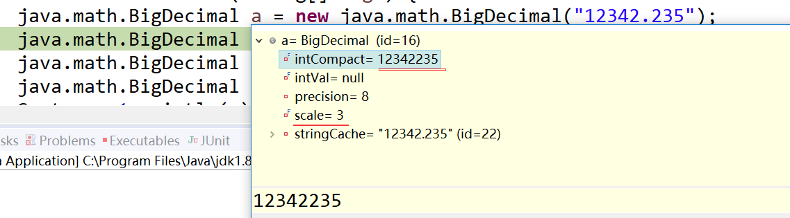
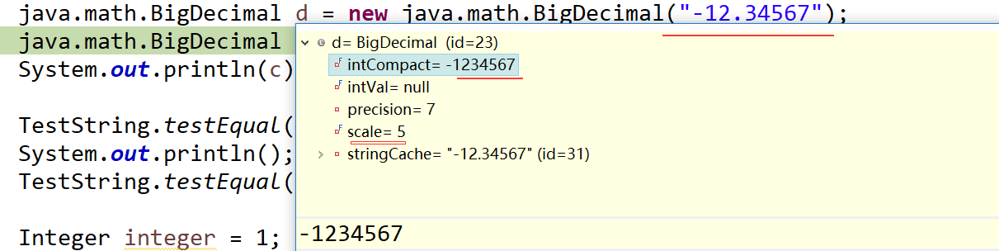
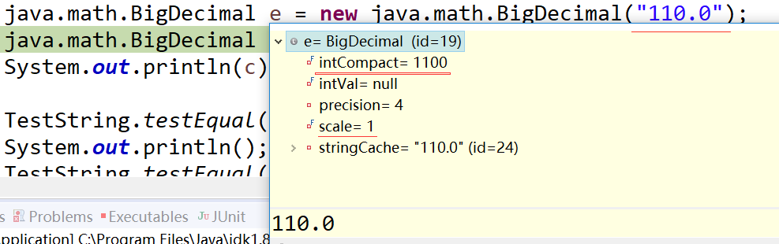

[TOC]


# [java基础原理] BigDecimal 解决浮点精度原理

## 1.类 简化示例

 属于java.math包，因此包含各种数学运算,abs,pow等等。

```java
package java.math;
 
public class BigDecimal {
    //值的绝对long型表示
    private final transient long intCompact;
    //值的小数点后的位数
    private final int scale;
 
    private final BigInteger intVal;
    //值的有效位数，不包含正负符号
    private transient int precision;
    private transient String stringCache;
     
    //加、减、乘、除、绝对值
    public BigDecimal add(BigDecimal augend) {}
    public BigDecimal subtract(BigDecimal subtrahend) {}
    public BigDecimal multiply(BigDecimal multiplicand) {}
    public BigDecimal divide(BigDecimal divisor) {}
    public BigDecimal abs() {}
}
```

　　

##  2.对象简化示例

2.1 以long型的intCompact和scale来存储精确的值。

2.2 包含stringCache，因此创建BigDecimal对象时，优先转换成String类型，比如double转BigDecimal也是先double转成String,再String转成BigDecimal.



 



 

 

## 3.加减乘除的实现

加法：long类型 +

减法：转成加法，加负数

乘法: long类型 *, 多些进位超界判断

除法: long类型 /, 多些小数位数保留判断

```
private static long add(long xs, long ys){
　　long sum = xs + ys;
　　if ( (((sum ^ xs) & (sum ^ ys))) >= 0L) { // not overflowed
　　　　return sum;
　　}
　　return INFLATED;
}
```


## 4.BigDecimal能更精确表示带小数点的数值，因为采用了long intCompact和int scale来表示数值，而不是浮点型的科学计数法。


https://www.cnblogs.com/ihzeng/p/10747803.html 