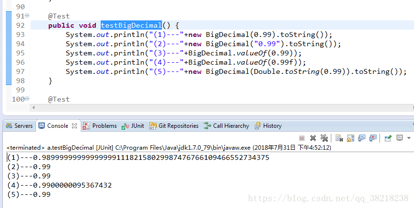

[TOC]

# 简单理解BigDecimal.valueof(Double t)与BigDecimal.valueof(String t)的区别

转载[qq_38218238](https://me.csdn.net/qq_38218238) 发布于2018-07-31 17:13:32 阅读数 8527 收藏

## 说明

我也是简单的了解一下

先用简单的代码展示一下

Java代码：

上面的代码主要的区别在于

初始化BigDecimal时形参是double、String和float的区别

从上面可以看到，当double 和 float 时，实际保存的值并不是是准确的0.99，这是为什么呢

大致的原因是：

​     BigDecimal(double val)将会把double型二进制浮点型值精确的转换成十进制的BigDecimal。

​    你可能认为java中用new BigDecimal(0.1)创建的BigDecimal应该等于0.1（一个是1的无精度的值，一个是有精度的值），但实际上精确的是等于0.1000000000000000055511151231257827021181583404541015625。这是因为0.1不能被double精确的表示（下面大概描述一下原理）。因此，传入构造函数的值不是精确的等于0.1。

​    对与float也是同样的道理。首先此函数会自动进行精度扩展，将float类型的0.99转成double类型的，因为0.99本身就是无法用二进制表示的，也就说无论你的精度是多少位，都无法用二进制来精确表示0.99，或者你用二乘来判断（0.99*2=1.98 0.98*2=1.960.96*2=1.92 。。。永远无法得到一个整数）。这就是二进制计算机的缺点，就如同十进制也也无法表示1/3，1/6一样。
​    所以在0.99f转成double时，进行了精度扩展，变成了0.9900000095367432，而接着转成字符串，最后转成BigDecimal.

## **总结：**

​    所以在当遇到需要涉及到精确计算的时候，如上面代码所示，要注意该构造函数是一个精确的转换，它无法得到与先调用Double.toString(double)方法将double转换成String，再使用BigDecimal(String)构造函数一样的结果。如果要达到这种结果，应该使用new BigDecimal(Stringvalue) 或 BigDecimal.valueof( double value)

https://blog.csdn.net/qq_38218238/article/details/81316587