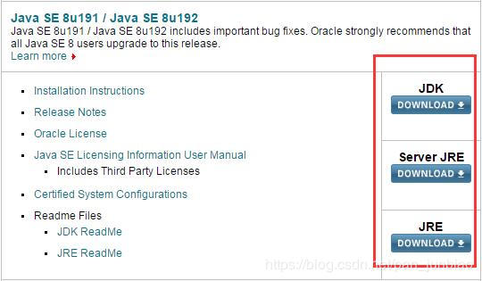

[TOC]

# JDK、JRE、Server JRE的简介

2018-12-04 17:48:29

   

从Oracle官网下载JDK文件时，可以看到有JDK、JRE、Server JRE文件的下载。

## **1、JDK简介**

JDK(Java Development Kit)又称J2SDK(Java2 Software Development Kit)，是Java开发工具包，它提供了Java的开发环境(提供了编译器javac等工具，用于将java文件编译为class文件)和运行环境(提供了JVM和Runtime辅助包，用于解析class文件使其得到运行)。如果你下载并安装了JDK，那么你不仅可以开发Java程序，也同时拥有了运 行Java程序的平台。JDK是整个Java的核心，包括一堆Java工具tools.jar和Java标准类库。

## **2、JRE简介**

JRE(Java Runtime Enviroment)是Java的运行环境。面向Java程序的使用者，而不是开发者。JRE是运行Java程序所必须环境的集合，包含JVM标准实现及 Java核心类库。它包括Java虚拟机、Java平台核心类和支持文件。它不包含开发工具(编译器、调试器等)。

## **3、Server JRE简介**

Server JRE是专为服务器端程序量身打造的, 只包含JRE/JDK中最常用的那部分功能.。为了做到简单，Server JRE不使用安装包, 而是一个绿色版的压缩文件。

## **相关说明：**

老版本的JDK包括了JRE，但JDK8之后的版本不在包括JRE。

<https://blog.csdn.net/pan_junbiao/article/details/84792328>