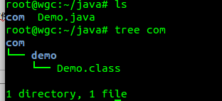
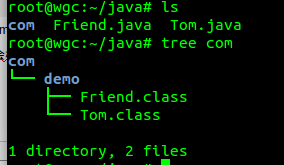
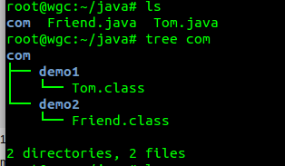
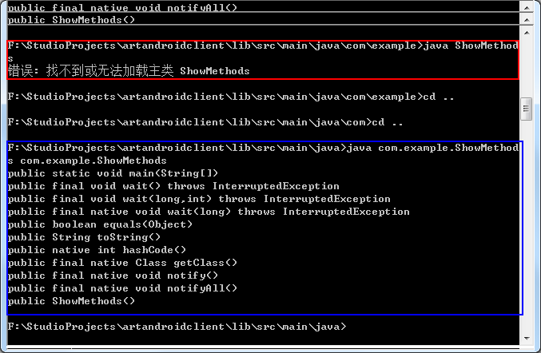

[TOC]


# 使用java、javac命令行编译工程以及遇到的问题

# 一、java和javac命令行

## 1、javac命令行

**javac.exe用于编译java源文件，生成.class文件**

语法：javac [option] source

常用的[option]选项： 
A、-classpath <路径>（-cp缩写）：指定要使用的类路径或要使用的jar包的路径(jar文件、zip文件（里面都是搜索文件）)，使用后会覆盖CLASSPATH的设定 
B、-d <路径> ：指定源文件编译后生成.class文件的存放位置

## 2、java命令行

**java.exe用于运行javac编译后生成的.class文件**

语法：java [option] classname [arguments]

常用的[option]选项： 
A、-classpath <路径>（-cp缩写）：指定要使用的类路径或要使用的jar包的路径(jar文件、zip文件（里面都是错啦搜索文件）)，使用后会覆盖CLASSPATH的设定 
B、[arguments]：传递给main函数的参数


转载：http://hck.iteye.com/blog/1566801

java -cp .;c:\dir1\lib.jar Test  
-cp 和 -classpath 一样，是指定类运行所依赖其他类的路径，通常是类库，jar包之类，需要全路径到jar包，window上分号“;”  
分隔，linux上是分号“:”分隔。不支持通配符，需要列出所有jar包，用一点“.”代表当前路径。  
虽然现在都有eclipse之类的IDE了，但有时候后会手工编译和运行一些程序，很多人包括多年开发经验的人都不知道怎么在命令行参  
数运行类。有点杯具……  
使用范例：  
java -cp ..\lib\hsqldb.jar org.hsqldb.Server -database mydb   
或   
java -cp ../lib/hsqldb.jar org.hsqldb.Server -database.0 mydb -dbname.0 mydb   

```
1 Java代码 
2 java -jar   minusyhd.jar  
3 Manifest-Version: 1.0  
4 Main-Class: minusyhd.MinusYHD  
5 Class-Path: jconn4.jar  
```

-cp 参数后面是类路径，是指定给解释器到哪里找到你的.class文件， 

写法： 
java -cp .;myClass.jar packname.mainclassname   
classpath中的jar文件能使用通配符，如果是多个jar文件，要一个一个地罗列出来，从某种意义上说jar文件也就是路径。 
要指定各个JAR文件具体的存放路径，相同路径有多个可使用通配符 
java -cp .;c:\classes\myClass.jar;d:\classes\*.jar packname.mainclassname 
bat文件写法： 

Java代码 

1. java -cp MinusYHD.jar minusyhd.MinusYHD > minusyhed.log  
2. exit  

”> minusyhed.log“ 指定System.out输出文件名

# 二、例子

## 1、单独一个java程序

```
public class Demo{
    public static void main(String args[]){
               System.out.println("This is a test");
 }
}12345
```

**命令如下：**

```
javac  Demo.java  //在当前目录下生成Demo.class文件
java Demo  //执行Demo.class12
```

也可以通过-d选项指定生成.class文件的位置，如：

```
javac -d  ..  Demo.java  //在当前目录的上一级目录中生成Demo.class文件，那么执行的时候，就要指定class的路径
java  -cp  ..  Demo //表示让java在上一级目录搜索类文件
```

## 2、一个带包的java程序

```java
package com.demo;
public class Demo{
    public static void main(String args[]){
               System.out.println("This is a test");
    }
 } 
```

**命令如下：**

```
javac  Demo.java //在当前目录下生成Demo.class文件
java Demo  //执行Demo.class 
```

也可以通过-d选项指定生成.class文件的位置，如：

```
javac -d .  Demo.java //按照com.demo的包路径保存.class文件 
```

则会在当前目录下生成一个com/demo/Demo.class文件，如下图：



## 3、同一个包下，一个类调用另一个类

Tom.java

```
package com.demo;
public class Tom{
    public String getMyname(){
          return "This is Tom!";
    }
} 
```

Friend.java

```
package com.demo;
import com.demo.Tom;
public class Friend{
    public static void main(String args[]){
        Tom tom = new Tom();
        System.out.println("hello "+tom.getMyname());
     }
}
```

由于Friend类调用了Tom类， 
**1、编译Tom.java**

```
javac -d  .   Tom.java1
```

然后会按照包结构生成com/demo/Tom.class文件。

**2、编译Friend.java文件**

```
javac  -cp .  -d .  Friend.java1
```

1. javac会在 -cp 指示的 “.”(当前)目录寻找**import com.demo.Tom**所表示的路径com/demo/Tom ，
2. 然后按照包结构生成com/demo/Friend.class，见下图：



**3、运行：java com.demo.Friend**

## 4、一个包下的类条用另一个包下的类

Tom.java

```java
package com.demo1;
public class Tom{
     public String getMyname(){
     return "This is Tom!";
    }
 }
```

Friend.java

```java
package com.demo2;  
import com.demo1.Tom;  
public class Friend{  
    public static void main(String args[]){  
        Tom tom = new Tom();  
        System.out.println("hello "+tom.getMyname());  
    }  
 }  
```

**1、编译Tom.java**

```
javac -d .  Tom.java
```

生成com/demo1/Tom.class；

**2、编译Friend.java**，

```
javac   -cp .  -d  .   Friend.java
```

生成com/demo2/Friend.class；



**3、运行：java com.demo2.Friend**

# 三、常见错误

## 1.命令行下执行java程序，找不到或无法加载主类

1. ShowMethods.java，编译后得到的文件为：ShowMethods.java.class
2. 在命令行执行：java ShowMethods.java （无需加后缀“.class”）



**错误原因：**

1、ShowMethods.java是有包的（如下），在使用java命令运行生成的class时，必须指定全限定名称`java com.example.ShowMethods`

```
package com.example;1
```

2、包名会被转化为路径，所以必须在适当路径，执行java命令（如上图蓝色框）

3、如果xxx.java文件没有包名，在使用java命令运行生成的class时，只需在.class所在目录指定xxx（名称）即可。

转载： 
[ubuntu下使用java、javac命令行编译工程](http://blog.csdn.net/wen294299195/article/details/39964971)

[命令行使用javac及java编译、运行java程序出现的问题](http://carrie1314.blog.51cto.com/6634326/1258216)

[自己动手编译、运行Java程序](http://www.cnblogs.com/haolujun/archive/2013/03/02/2939698.html)


转载请标明出处：<http://blog.csdn.net/xx326664162/article/details/51672813> 文章出自：[薛瑄的博客](http://blog.csdn.net/xx326664162)

