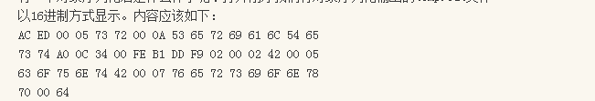
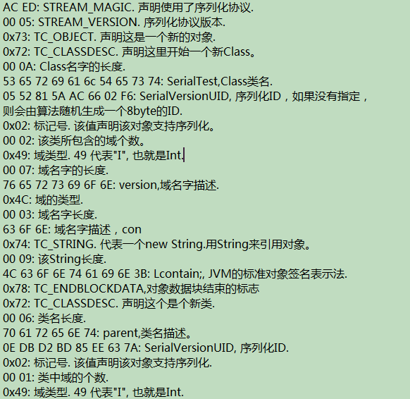
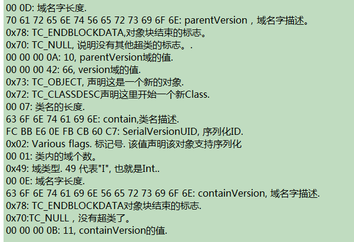
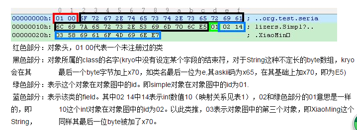
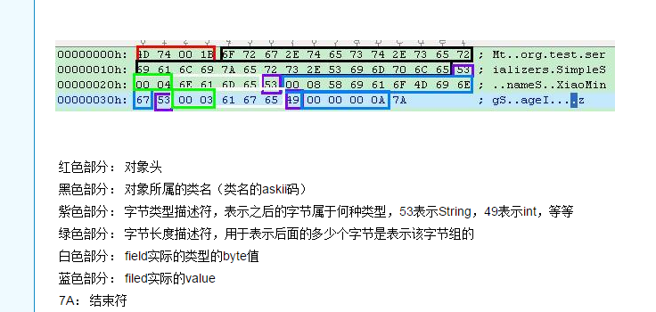
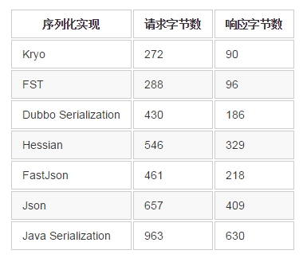

# 对象序列化——java原生序列化、Kryo序列化性能比较和Hessian序列化

## 什么是序列化

以特定的方式对类实例的瞬时状态进行编码保存的一种操作，叫做对象序列化。就是将对象的这个时刻的各种属性各种值按照一定的规则变成二进制流，然后如果传输到别的jvm中，jvm可以按照规则在将二进制流反序列化成对应的对象，并且对象里面还有当时的数据和各种属性。

 

## 序列化的作用

主要作用就是将序列化后的对象进行网络传输，由此可以实现对象调用，分布式对象，等各种功能。

 

## 序列化的指标

1、对象序列化后的大小

一个对象会被序列化工具序列化为一串byte数组，这其中包含了对象的field值以及元数据信息，使其可以被反序列化回一个对象

2、序列化与反序列化的速度

一个对象被序列化成byte数组的时间取决于它生成/解析byte数组的方法

3、序列化工具本身的速度

序列化工具本身创建会有一定的消耗。

 

## 各种序列化的对比

### java序列化

原理：类需要实现 Serializable接口，才能被jdk自己的序列化机制序列化，jdk序列化的时候，会将这个类和他的所有超类都元数据，类描述，属性，属性值等等信息都序列化出来，这样就导致序列化后的大小比较大，速度也会比较慢，但是包含的内容最全面。可以完全反序列化。

 

### Kryo序列化

原理：序列化的时候，会将对象的信息，对象属性值的信息等进行序列化，而且没有将类field的描述信息进行序列化，这样就比jdk自己的序列化出来的小多了，而且速度肯定更快，但是包含的信息没有jdk的全面。类似下图

 

### Hessian序列化

原理：序列化的时候，也是将对象的信息，属性值信息等进行序列化，也会比jdk自己的序列化后的小很多，但是没有kryo的小，速度也挺快，类似下图。

 

 

### 这两种的对比

1、Kryo序列化后比Hessian小很多。（kryo优于hessian）

2、由于Kryo没有将类field的描述信息序列化，所以Kryo需要以自己加载该类的filed。这意味着如果该类没有在kryo中注册，或者该类是第一次被kryo序列化时，kryo需要时间去加载该类（hessian优于kryo）

3、由于2的原因，如果该类已经被kryo加载过，那么kryo保存了其类的信息，就可以很快的将byte数组填入到类的field中,而hessian则需要解析序列化后的byte数组中的field信息，对于序列化过的类，kryo优于hessian。

4、hessian使用了固定长度存储int和long，而kryo则使用的变长，实际中，很大的数据不会经常出现。(kryo优于hessian)

5、hessian将序列化的字段长度写入来确定一段field的结束，而kryo对于String将其最后一位byte+x70用于标识结束（kryo优于hessian）

  

## 总结：

对象的序列化，其实就是将一个对象，按照一定的规则转换成字节数组，并且可以按照规则在转换回来，序列化后的大小越小，速度一般越快，当然也要看算法和处理速度等，但是不一定适合各种场景，jdk的序列化虽然效率可能低，但是几乎完全保证了反序列化后的结果的准确性。序列化框架有很多，遇到了可以查一下大概的原理和序列话的内容，比较看是否适合自己。网上也有各种评测序列话框架之间的性能比较。

 

### 另记：

在学习dubbo的时候看到，dubbo默认的序列化方式是 hessian2序列化（ hessian是一种跨语言的高效二进制序列化方式。但这里实际不是原生的hessian2序列化，而是阿里修改过的hessian lite，它是dubbo RPC默认启用的序列化方式），而再看dubbox的时候看到dubbox 引入Kryo和FST这两种高效Java序列化实现，来逐步取代hessian2。（ 其中，Kryo是一种非常成熟的序列化实现，已经在Twitter、Groupon、Yahoo以及多个著名开源项目（如Hive、Storm）中广泛的使用。而FST是一种较新的序列化实现，目前还缺乏足够多的成熟使用案例，但它还是非常有前途的。 在面向生产环境的应用中，我建议目前更优先选择Kryo。）下图简单说明了各种序列化框架序列化同一个对象后的字节大小比较

 

转自：https://www.cnblogs.com/liouwei4083/p/6123383.html