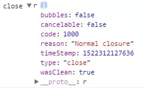
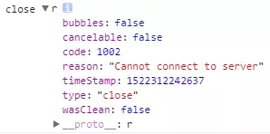
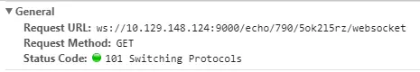

[TOC]


# SockJS实践：即时通信关键点

如果说之前的 [Socket.IO打造基础聊天室](https://www.jianshu.com/p/51b0d1f80392) 让我明白了聊天室的原理，知道了如何实现群聊（广播）和私聊（单播）等，那么对于 SockJS 的实践让我更加了解了websocket，因为 Sock.IO 是自己封装的接口，而 SockJS 则使用了跟 websocket 几乎相同的 API。

### 01 SockJS简介

- 与 Socket.io 不同，在传输方式的选择方面，SockJS 会优先采用 websocket，然后再自动降级；
- 其 API 几乎与 websocket API 的使用方式相同；
- 兼容跨浏览器，支持跨域。

### 02 即时通信关键点

##### （1）心跳检测（业务层面）

（ws自身有心跳，但是如果有一些业务层面的需求，就需要自己实现心跳）

ws建立成功时便进行 **心跳请求**（每隔一段时间发送一个 PING），同时初始化 **超时重连**。如果在达到心跳规定次数后仍没有返回 PONG，则判定心跳超时，前端主动关闭ws，触发 **ws重连**。

如果期间收到了 PONG，则重新初始化超时重连。

> 【注意】：ws重连的时候，要清空之前的心跳定时器。

##### （2）关闭连接的3种情况：

- 心跳超时（连接层不断）的情况，则前端可主动关闭 ws；
- 连接未建立成功（如TCP连接断掉），ws 自动关闭；
- 服务端关闭（如多端剔除），这是要防止前端进行重连。



正常关闭（如心跳超时）




连接失败（如TCP层没有连接成功）

> 【注意】：锁屏情况下，js 会停止工作，这时，ws 会自动关闭，当屏幕唤醒时，通过触发 `onclose` 事件，ws 又会进行重连。在某些特殊业务场景下，需要注意下这种情况。

##### （3）websocket 自动重连

无论是前端主动关闭 ws，还是ws自动关闭，都会触发 `onclose` 事件，可在其中进行重连。如果达到了重连次数或者后端返回了不可进行重连的标志码，则不进行重连。

【实现思路】：

```
var CONNECT_COUNT = 3;
var sockjs;
var sockjs_url = '/chat/sjs/';
var isClose = false;
var connectCount = 1;

new_conn = function() {    
    sockjs = new SockJS(sockjs_url);

    sockjs.onopen = function() {
        connectCount = 1;   // 重置重连次数
        this.checkHeartBeat();  // 心跳检测
    }

    sockjs.onmessage = function(e) {
        var data = JSON.parse(e.data);
        // handleMessage(data);
    };
    
    sockjs.onclose = function(e) {
        // 已经关闭的情况，不重连
        if (isClose) { 
            return;
        }
        
        // 小于重连次数
        if (connectCount < CONNECT_COUNT) {
            setTimeout(function() {
                new_conn();
            }, (Math.random() * 3 + 1 )* 1000);   
        } else {
            isClose = true;
        }
    };
}
```

##### （4）sockJS session_id：可用于多端剔除

url格式类似于：`/resource/<server_number>/<session_id>/transport`；



请求URL

每个 sockJS 都有 `session_id`，可通过它来判断是否同一个用户建立了2个ws，如多端登录的情况下，可用于进行多端剔除。

### 03 sockJS readyState（暂时没用到。。）

【sockjs-client 部分源码】：

```
SockJS.CONNECTING = 0;
SockJS.OPEN = 1;
SockJS.CLOSING = 2;
SockJS.CLOSED = 3;
SockJS.prototype.close = function(code, reason) {
  // Step 1
  if (code && !userSetCode(code)) {
    throw new Error('InvalidAccessError: Invalid code');
  }
  // Step 2.4 states the max is 123 bytes, but we are just checking length
  if (reason && reason.length > 123) {
    throw new SyntaxError('reason argument has an invalid length');
  }

  // Step 3.1
  if (this.readyState === SockJS.CLOSING || this.readyState === SockJS.CLOSED) {
    return;
  }

  // TODO look at docs to determine how to set this
  var wasClean = true;
  this._close(code || 1000, reason || 'Normal closure', wasClean);
};
```

### 参考

- [学习WebSocket协议—从顶层到底层的实现原理（修订版）](https://link.jianshu.com/?t=https%3A%2F%2Fgithub.com%2Fabbshr%2Fabbshr.github.io%2Fissues%2F22)
- [websocket RFC - EN](https://link.jianshu.com/?t=https%3A%2F%2Ftools.ietf.org%2Fhtml%2Frfc6455%23page-45)
- [websocket RFC（翻译）](https://link.jianshu.com/?t=https%3A%2F%2Fwww.gitbook.com%2Fbook%2Fchenjianlong%2Frfc-6455-websocket-protocol-in-chinese%2Fdetails)
- [sockjs chat room](https://link.jianshu.com/?t=https%3A%2F%2Fgithub.com%2Fcubiq%2Fsockjs-chat%2Fblob%2Fmaster%2Fsocket.js)
- [What happens if sockJS gets disconnected?](https://link.jianshu.com/?t=https%3A%2F%2Fgithub.com%2Fsockjs%2Fsockjs-client%2Fissues%2F38)


https://www.jianshu.com/p/fee325279b5b