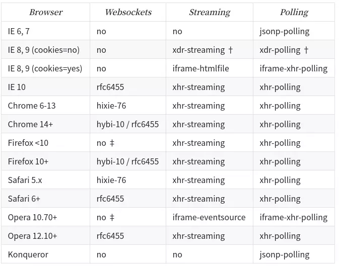
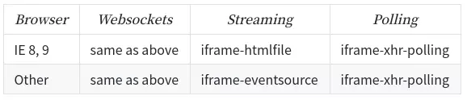

# 客户端接收服务端消息推送sockjs-client的使用

## 前言

在项目开发中我们经常遇到后端向前端进行消息推送，我们前端需要接收这些推送消息，并显示出来。这里接收推送消息我们需要使用[sockjs](https://github.com/sockjs)的固定存储库:[sockjs-client](https://github.com/sockjs/sockjs-client)。

这里讲解客户端如何使用sockjs-client接收消息推送。

## 什么是SockJS

SockJS是一个JavaScript库，提供跨浏览器JavaScript的API，创建了一个低延迟、全双工的浏览器和web服务器之间通信通道。
服务端：[sockjs-node](https://github.com/sockjs/sockjs-node)
客户端：[sockjs-clien](https://github.com/sockjs/sockjs-client)
[node-static](https://www.npmjs.com/package/node-static)是Node.js兼容HTTP静态文件服务器处理模块，提供内置的缓存支持。

## sockjs-client

SockJS模仿WebSockets API，但它不是WebSocket，而是一个SockJS Javascript对象。首先，您需要加载SockJS JavaScript库。例如，你可以把它放在你的HTML head里:

```
<script src="https://cdn.jsdelivr.net/npm/sockjs-client@1/dist/sockjs.min.js"></script>
```

## sockjs-client建立连接

加载脚本后，你可以建立与SockJS服务器的连接。这是一个简单的例子:

```javascript
var sock = new SockJS('https://mydomain.com/my_prefix');
sock.onopen = function () {
  console.log('open')
  sock.send('test')
}
sock.onmessage = function (e) {
  console.log('message', e.data)
  sock.close()
}
sock.onclose = function () {
  console.log('close')
}
```

## sockjs-client构造函数的参数

与WebSocket的API类似，SockJS的构造函数需要一个或多个参数:

```
var sockjs = new SockJS(url, _reserved, options);
```

url:后端提供的消息推送的接口
options是一个散列，它可以包含:

> 1. server: 类型String，默认值-随机4位数字，其会被添加到url上作为实际数据连接。
> 2. transports: 类型字符串或者字符串数组。此选项允许您提供可由SockJS使用的列表传输。默认情况下，所有可用的传输都将被使用，但有时需要禁用一些回退传输是有用的。
> 3. sessionId: 类型number或者function。客户端和服务器都使用会话标识符来区分连接。如果将这个选项指定为一个数字，那么SockJS将使用它的随机字符串生成器函数来生成一个N字符长的会话id(其中N对应于sessionId指定的数字)。当您将此选项指定为函数时，函数必须返回一个随机生成的字符串。每次SockJS需要生成一个会话id时，它将调用该函数并直接使用返回的字符串。如果没有指定此选项，默认情况是使用默认的随机字符串生成器生成8个字符的长会话id。

## sockjs-client支持传输的浏览器（http:// or https://）




支持传输的浏览器-http:// or https://

## sockjs-client支持传输的浏览器（file://）




支持传输的浏览器-file://

## 代码

```js
function sessionId () {
    return r.data
}
window.sockJsConn = new SockJS('http://arcs.dev.nicai.com', null, {sessionId: sessionId}) // sessionId使用类型function
window.sockJsConn.onmessage = function (e) {
    console.log(e)
}
```

## sockjs-client说明

尽管SockJS对象试图模仿WebSocket的行为，但不可能支持所有的功能。事实上一个重要的SockJS限制是这样:不允许一次打开多个SockJS连接到一个域。这个限制是因为浏览器的限制即通常浏览器发出的连接不允许开两个多输出连接到一个域。

一个单一的SockJS会话需要两个连接: 一个用于下载数据，另一个用于发送消息。在同一时间打开第二个SockJS会话可能会阻塞，并且会导致两个会话超时。
每次打开多个SockJS连接通常是很糟糕的，如果你必须这样做，可以使用多个子域，为每个SockJS连接使用一个不同的子域。

# 结语

到此我们可以使用sockjs-client在前端进行消息推送的获取了。

提示：后面还有精彩敬请期待，请大家关注我的专题：[web前端](https://www.jianshu.com/c/3cd9ede78e18)。如有意见可以进行评论，每一条评论我都会认真对待。


https://www.jianshu.com/p/9e37d343267e