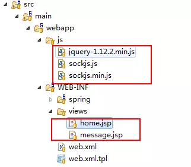
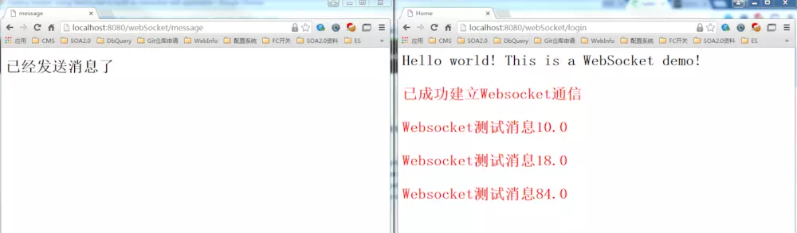

# Java Spring WebSocket消息交互

> Spring 4.0的一个最大更新是增加了对Websocket的支持。Websocket提供了一个在web应用中实现高效、双向通讯，需考虑客户端(浏览器)和服务端之间高频和低延时消息交换的机制。一般的应用场景有：在线交易、网页聊天、游戏、协作、数据可视化等。

## 1. Websocket原理

- Websocket协议本质上是一个基于TCP的独立协议，能够在浏览器和服务器之间建立双向连接，以基于消息的机制，赋予浏览器和服务器间实时通信能力。
- WebSocket资源URI采用了自定义模式：ws表示纯文本通信，其连接地址写法为“ws://**”，占用与http相同的80端口；wss表示使用加密信道通信(TCP+TLS)，基于SSL的安全传输，占用与TLS相同的443端口。

## 2. Websocket与HTTP比较

> Websocket和HTTP都是基于TCP协议
> TCP是传输层协议，Websocket和HTTP是应用层协议

HTTP是用于文档传输、简单同步请求的响应式协议，本质上是无状态的应用层协议，半双工的连接特性。Websocket与 HTTP 之间的唯一关系就是它的握手请求可以作为一个升级请求(Upgrade request)经由 HTTP 服务器解释(也就是可以使用Nginx反向代理一个WebSocket)。

### *联系：*

> 客户端建立WebSocket连接时发送一个header，标记了Upgrade的HTTP请求，表示请求协议升级。
> 服务器直接在现有的HTTP服务器软件和端口上实现Websocket，重用现有代码(比如解析和认证这个HTTP请求)，然后再回一个状态码为101(协议转换)的HTTP响应完成握手，之后发送数据就跟HTTP没关系了。

### *区别：*

- #### 持久性：

> **HTTP协议：**
> HTTP是**非持久**的协议(长连接、循环连接除外)
> **Websocket协议：**
> Websocket是**持久化**的协议

- #### 生命周期：

> HTTP的生命周期通过Request来界定，也就是一个Request 一个Response
> 在**HTTP1.0**中，这次HTTP请求就结束了；
> 在**HTTP1.1**中进行了改进，使得有一个keep-alive，也就是说，在一个HTTP连接中，可以发送多个Request，并接收多个Respouse。<br />
> 在HTTP中永远都是一个Request只有一个Respouse，而且这个Respouse是被动的，不能主动发起。

## 3. Spring Websocket项目搭建

### 3.1 Websocket服务端

> Spring4.0新增一个对Websocket提供广泛支持的Spring-Websocket模块，其兼容于JAVA Websocket API标准(JSR-356)。

#### 3.1.1 pom.xml配置

在此基于maven搭建项目，引入Spring Websocket所需的jar包，以及对传输的消息体进行JSON序列化所需的jar包。

```xml
<properties>
    <!-- Spring -->
    <spring-framework.version>4.1.6.RELEASE</spring-framework.version>
    <!-- Jackson -->
    <jackson.version>2.6.0</jackson.version>
</properties>

<dependencies>
    <!-- Spring WebSocket -->
    <dependency>  
       <groupId>org.springframework</groupId>  
       <artifactId>spring-websocket</artifactId>  
       <version>${spring-framework.version}</version>  
    </dependency>  
    <dependency>  
       <groupId>org.springframework</groupId>  
       <artifactId>spring-messaging</artifactId>  
       <version>${spring-framework.version}</version>  
    </dependency>       
    <!-- jackson -->
    <dependency>
        <groupId>com.fasterxml.jackson.core</groupId>
        <artifactId>jackson-core</artifactId>
        <version>${jackson.version}</version>
    </dependency>
    <dependency>
        <groupId>com.fasterxml.jackson.core</groupId>
        <artifactId>jackson-databind</artifactId>
        <version>${jackson.version}</version>
    </dependency>
    <dependency>
        <groupId>com.fasterxml.jackson.core</groupId>
        <artifactId>jackson-annotations</artifactId>
        <version>${jackson.version}</version>
    </dependency>       
</dependencies>    
```

#### 3.1.2 web.xml配置

配置Spring过滤器，并设置UTF-8编码

```xml
<!-- 文件编码过滤器 -->
<filter>  
    <filter-name>characterEncodingFilter</filter-name>  
    <filter-class>org.springframework.web.filter.CharacterEncodingFilter</filter-class>  
    <init-param>  
        <param-name>encoding</param-name>  
        <param-value>UTF-8</param-value>  
    </init-param>  
    <init-param>  
        <param-name>forceEncoding</param-name>  
        <param-value>true</param-value>  
    </init-param>
    <async-supported>true</async-supported>
</filter>  
<filter-mapping>  
    <filter-name>characterEncodingFilter</filter-name>  
    <url-pattern>/*</url-pattern>  
</filter-mapping>    
```

其中的关键为org.springframework.web.filter.CharacterEncodingFilter，此过滤器对请求按指定的字符编码方式进行编码。因为，即使在HTML页面中指定了字符编码方式，通常浏览器也并未指定请求的字符编码方式。CharacterEncodingFilter重写了doFilterInternal方法，不仅可以指定请求的编码方式，同时也可使得响应的编码方式与请求一致。

```java
@Override
protected void doFilterInternal(
        HttpServletRequest request, HttpServletResponse response, FilterChain filterChain)
        throws ServletException, IOException {

    if (this.encoding != null && (this.forceEncoding || request.getCharacterEncoding() == null)) {
        request.setCharacterEncoding(this.encoding);
        if (this.forceEncoding) {
            response.setCharacterEncoding(this.encoding);
        }
    }
    filterChain.doFilter(request, response);
}
```

#### 3.1.3 WebSocketHandler接口实现

实现WebSocketHandler接口并重写接口中的方法，为消息的处理实现定制化。Spring Websocket通过WebSocketSession建立会话，发送消息或关闭会话。Websocket可发送两类消息体，分别为文本消息TextMessage和二进制消息BinaryMessage，两类消息都实现了WebSocketMessage接口(A message that can be handled or sent on a WebSocket connection.)

```java
/**
 * @desp Socket处理类
 * @author hejun
 * @date 2016-07-25
 *
 */
@Service
public class SocketHandler implements WebSocketHandler{

    private static final Logger logger;
    private static final ArrayList<WebSocketSession> users;

    static{
        users = new ArrayList<WebSocketSession>();
        logger = LoggerFactory.getLogger(SocketHandler.class);
    }

    // Websocket连接建立
    @Override
    public void afterConnectionEstablished(WebSocketSession session)
        throws Exception {
        logger.info("成功建立Websocket连接");
        users.add(session);
        String username = session.getAttributes().get("user").toString();
        // 判断session中用户信息 
        if(username!=null){
            session.sendMessage(new TextMessage("已成功建立Websocket通信"));
        }       
    }

    @Override
    public void handleMessage(WebSocketSession arg0, WebSocketMessage<?> arg1)
        throws Exception {
        // TODO Auto-generated method stub  
    }

    // 当连接出错时，主动关闭当前连接，并从会话列表中删除该会话
    @Override
    public void handleTransportError(WebSocketSession session, Throwable error)
        throws Exception {
        if(session.isOpen()){
            session.close();
        }
        logger.error("连接出现错误:"+error.toString());
        users.remove(session);
    }

    @Override
    public void afterConnectionClosed(WebSocketSession session, CloseStatus arg1)
        throws Exception {
        logger.debug("Websocket连接已关闭");
        users.remove(session);
    }

    @Override
    public boolean supportsPartialMessages() {
        return false;
    }

    /**
     * 给所有在线用户发送消息
     *
     * @param message
     */
    public void sendMessageToUsers(TextMessage message) {
        for (WebSocketSession user : users) {
            try {
                if (user.isOpen()) {
                    user.sendMessage(message);
                }
            } catch (IOException e) {
                e.printStackTrace();
            }
        }
    }

    /**
     * 给某个用户发送消息
     *
     * @param userName
     * @param message
     */
    public void sendMessageToUser(String userName, TextMessage message) {
        for (WebSocketSession user : users) {
            if (user.getAttributes().get("user").equals(userName)) {
                try {
                    if (user.isOpen()) {
                        user.sendMessage(message);
                    }
                  } catch (IOException e) {
                     e.printStackTrace();
                  }
              break;
          }
        }
    }
}
```

#### 3.1.4 WebSocket激活

现在**最重要**的是，在Spring中激活Websocket。

##### *Websocket配置类：*

```java
/**
 * @desp websocket激活配置
 * @author hejun
 * @date 2016-07-25
 *
 */
@Configuration
@EnableWebMvc
@EnableWebSocket
public class WebSocketConfig extends WebMvcConfigurerAdapter implements WebSocketConfigurer{

    @Autowired
    private SocketHandler socketHandler;

    @Override
    public void registerWebSocketHandlers(WebSocketHandlerRegistry registry) {
        //注册处理拦截器,拦截url为socketServer的请求
        registry.addHandler(socketHandler, "/socketServer").addInterceptors(new WebSocketInterceptor());

        //注册SockJs的处理拦截器,拦截url为/sockjs/socketServer的请求
        registry.addHandler(socketHandler, "/sockjs/socketServer").addInterceptors(new WebSocketInterceptor()).withSockJS();
    }
}
```

如代码所见
① 配置类添加注解@EnableWebSocket，因为EnableWebSocket引入了DelegatingWebSocketConfiguration配置(@Import(DelegatingWebSocketConfiguration.class))，且DelegatingWebSocketConfiguration继承了WebSocketConfigurationSupport的配置特性，所以@EnableWebSocket实现对Websocket请求的高效处理。

##### *DelegatingWebSocketConfiguration：*

```java
@Configuration
public class DelegatingWebSocketConfiguration extends WebSocketConfigurationSupport {

    private final List<WebSocketConfigurer> configurers = new ArrayList<WebSocketConfigurer>();

    @Autowired(required = false)
    public void setConfigurers(List<WebSocketConfigurer> configurers) {
        if (!CollectionUtils.isEmpty(configurers)) {
            this.configurers.addAll(configurers);
        }
    }


    @Override
    protected void registerWebSocketHandlers(WebSocketHandlerRegistry registry) {
        for (WebSocketConfigurer configurer : this.configurers) {
            configurer.registerWebSocketHandlers(registry);
        }
    }
}
```

此类主要是添加Websocket的默认配置，那Websocket的默认配置具体是什么样呢？那就得看WebSocketConfigurationSupport了。

##### *WebSocketConfigurationSupport：*

```java
/**
 * Configuration support for WebSocket request handling.
 *
 * @author Rossen Stoyanchev
 * @since 4.0
 */
public class WebSocketConfigurationSupport {

    @Bean
    public HandlerMapping webSocketHandlerMapping() {
        ServletWebSocketHandlerRegistry registry = new ServletWebSocketHandlerRegistry(defaultSockJsTaskScheduler());
        registerWebSocketHandlers(registry);
        return registry.getHandlerMapping();
    }

    protected void registerWebSocketHandlers(WebSocketHandlerRegistry registry) {
    }

    @Bean
    public ThreadPoolTaskScheduler defaultSockJsTaskScheduler() {
            ThreadPoolTaskScheduler scheduler = new ThreadPoolTaskScheduler();
        scheduler.setThreadNamePrefix("SockJS-");
        scheduler.setPoolSize(Runtime.getRuntime().availableProcessors());
        scheduler.setRemoveOnCancelPolicy(true);
        return scheduler;
    }
}
```

注意查看Websocket的默认配置中，SockJS默认的线程管理**defaultSockJsTaskScheduler()**便可知道**scheduler.setPoolSize(Runtime.getRuntime().availableProcessors());**Websocket的线程池容量可根据当前运行环境可用的CPU核数动态配置，充分利用CPU资源；**scheduler.setRemoveOnCancelPolicy(true);**Websocket的本地线程池可将cancelled tasks自动踢出work queue at time of cancellation，释放线程资源。**注意：removeOnCancel属性默认为false，且setRemoveOnCancelPolicy(true);属性设置仅在JDK1.7之上支持。**
② extends WebMvcConfigurerAdapter重写addInterceptors()方法，在**Spring MVC**中实现对请求握手的拦截处理，具体的处理方法见Websocket拦截器类代码(**此方案可借鉴于其他应用项目中！**)。
③ 可用两种方法注册处理拦截器，一种为通过Websocket的通信方式，一种为降级的通过SockJS的通信方式(SockJS是一个JavaScript库，提供跨浏览器JavaScript的API，创建了一个低延迟、全双工的浏览器和web服务器之间通信通道)。

##### Websocket拦截器类：

```java
/**
 * @desp websocket拦截器
 * @author hejun
 * @date 2016-07-25
 *
 */
public class WebSocketInterceptor implements HandshakeInterceptor{

    @Override
    public void afterHandshake(ServerHttpRequest request, ServerHttpResponse response,
        WebSocketHandler handler, Exception exception) {
    
    }

    /**
     * @desp 将HttpSession中对象放入WebSocketSession中
     */
    @Override
    public boolean beforeHandshake(ServerHttpRequest request, ServerHttpResponse response, 
        WebSocketHandler handler, Map<String, Object> map) throws Exception {
        if(request instanceof ServerHttpRequest){
            ServletServerHttpRequest servletRequest = (ServletServerHttpRequest) request;
            HttpSession session = servletRequest.getServletRequest().getSession();
            if(session!=null){
                //区分socket连接以定向发送消息
                map.put("user", session.getAttribute("user"));
            }
        }
        return true;
    }
}
```

该拦截器实现了HandshakeInterceptor接口，HandshakeInterceptor可拦截Websocket的握手请求(通过HTTP协议)并可设置与Websocket session建立连接的HTTP握手连接的属性值。实例中配置重写了beforeHandshake方法，将HttpSession中对象放入WebSocketSession中，实现后续通信。

### 3.2 Websocket客户端

当Websocket的服务端配置完成后， 使用sockjs-client创建一个JSP页面与服务端消息系统交互，创建connect方法建立连接，sendMessage方法发送消息，disconnect方法关闭连接。



Wesocket_Project.png

#### 3.2.1 页面代码编写

因为当Websocket建立通信后，客户端和服务端即可实现了双向通信。此Demo中home页面模拟客户端接收服务端发送的消息，message页面模拟服务端发送消息，当然也可以作为客户端接收服务端消息。

##### home.jsp： 

```html
<%@ page language="java" contentType="text/html; charset=UTF-8" pageEncoding="UTF-8"%>
<%
    String path = request.getContextPath();
    String basePath = request.getScheme()+"://"+request.getServerName()+":"+request.getServerPort()+path+"/";
    String wsPath = "ws://"+request.getServerName()+":"+request.getServerPort()+path+"/";
%>
<html>
    <head>
        <title>Home</title>
    </head>
    <body>
        <h1>
            Hello world!  This is a WebSocket demo!
        </h1>
        <div id="message">
        </div>
        <script type="text/javascript" src="js/jquery-1.12.2.min.js"></script>
        <script type="text/javascript" src="js/sockjs.min.js"></script>
        
        <script type="text/javascript">
            $(function(){
                //通过HTTP协议自动建立socket连接，服务端对"/socketServer"和"/sockjs/socketServer"进行拦截
                var sock;
                if ('WebSocket' in window) {
                    sock = new WebSocket("<%=wsPath%>socketServer");    
                } else if ('MozWebSocket' in window) {
                    sock = new MozWebSocket("<%=wsPath%>socketServer");
                } else {
                    sock = new SockJS("<%=basePath%>sockjs/socketServer");
                }
    
                sock.onopen = function (e) {
                    console.log(e);
                };
                sock.onmessage = function (e) {
                    console.log(e)
                    $("#message").append("<p><font color='red'>"+e.data+"</font>")
                };
                sock.onerror = function (e) {
                    console.log(e);
                };
                sock.onclose = function (e) {
                    console.log(e);
                }
            });
        </script>
    </body>
</html> 
```

##### *message.jsp：*

```html
<%@ page language="java" contentType="text/html; charset=UTF-8" pageEncoding="UTF-8"%>
<html>
    <head>
        <meta http-equiv="Content-Type" content="text/html; charset=UTF-8">
        <title>message</title>
    </head>
    <body>
        <h1>已经发送消息了</h1>
    </body>
</html>   
```

#### 3.2.2 Spring MVC Controller编写

Controller用于通过"/login"发送Spring MVC的HTTP请求，建立Websocket连接(之后就没有该HTTP的什么事了)；使用Spring DI方式获取所需SocketHandler对象，**模拟**服务端发送消息(此段应该为服务端代码)。

```java
/**
 * @desp Socket控制器
 * @author hejun
 * @date 2016-07-25
 *
 */
@Controller
public class SocketController{

    private static final Logger logger = LoggerFactory.getLogger(SocketController.class);

    @Autowired
    private SocketHandler socketHandler;

    // 服务端Spring MVC拦截该HTTP请求，将HTTP Session载入Websocket Session中，建立会话 
    @RequestMapping(value="/login")
    public String login(HttpSession session){
        logger.info("用户登录建立Websocket连接");       
        session.setAttribute("user", "hejun");
        return "home";
    }
      
    // 模拟服务端发送消息，其中可实现消息的广发或指定对象发送
    @RequestMapping(value = "/message", method = RequestMethod.GET)
    public String sendMessage(){        
        double rand = Math.ceil(Math.random()*100);
        socketHandler.sendMessageToUser("hejun", new TextMessage("Websocket测试消息" + rand));      
        return "message";
    }
}
```

#### 3.2.3 Websocket应用

下面到验证实验成果的时候，运行应用程序，分别
打开[登录页](https://link.jianshu.com/?t=http://localhost:8080/webSocket/login)和[消息发送页](https://link.jianshu.com/?t=http://localhost:8080/webSocket/message)，[登录页](https://link.jianshu.com/?t=http://localhost:8080/webSocket/login)可创建Websocket连接，然后每次刷新[消息发送页](https://link.jianshu.com/?t=http://localhost:8080/webSocket/message)时即发送一条新的消息，[登录页](https://link.jianshu.com/?t=http://localhost:8080/webSocket/login)**自动**收到该消息并在页面显示，如下截图所示。



Websocket_Demo.png


## 4. Websocket总结

当然，上述展示的只是一个小小的Demo，但按照上述思路即可将Websocket运用于其它项目中，为项目锦上添花。可，不知大家有没有注意到一个**坑**，上述Websocket协议我们使用的都是**ws协议**，那什么时候会用到**wss协议**呢？当我们的通信协议为**HTTPS协议**的时候，此时需要在服务端应用服务器中安装**SSL证书**，不然服务端是没法解析**wss协议**的。


https://www.jianshu.com/p/f0cbfc1f0a50