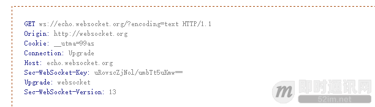
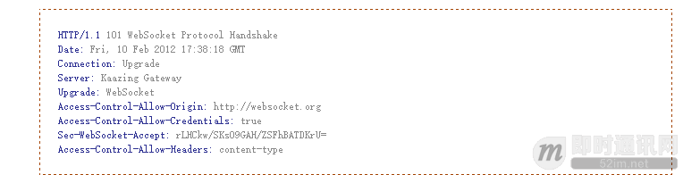
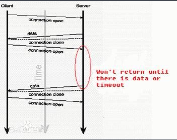
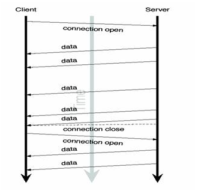
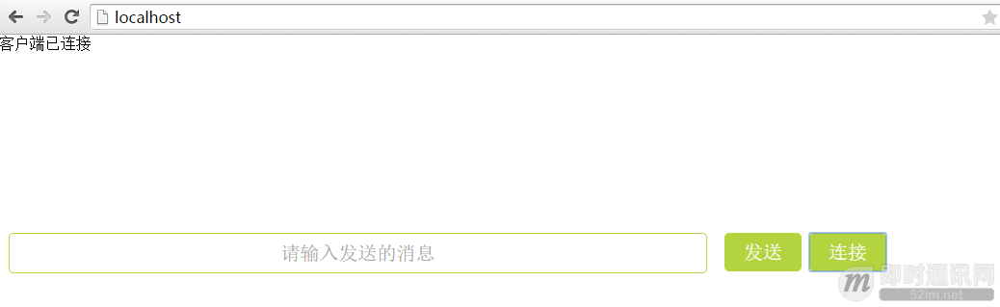
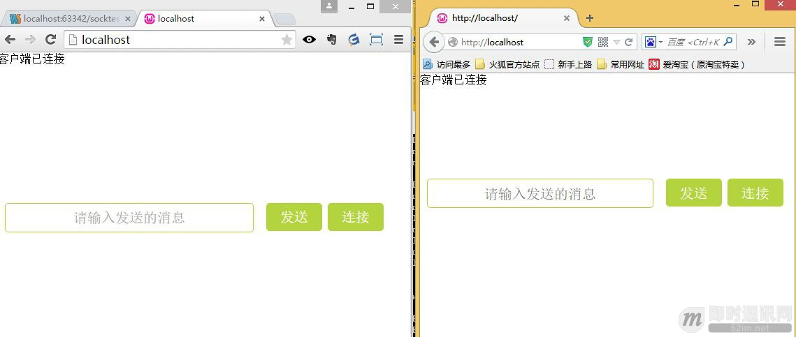
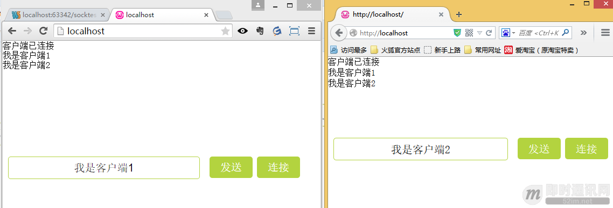

[TOC]


# WebSocket详解（一）：初步认识WebSocket技术

## 前言 

HTML5规范在传统的web交互基础上为我们带来了众多的新特性，随着web技术被广泛用于web APP的开发，这些新特性得以推广和使用，而websocket作为一种新的web通信技术具有巨大意义。 本文将带您认识WebSocket。 

## 什么是Socket？什么是WebSocket？

对于第1次听说WebSocket技术的人来说，两者有什么区别？websocket是仅仅将socket的概念移植到浏览器中的实现吗？

我们知道，在网络中的两个应用程序（进程）需要全双工相互通信（全双工即双方可同时向对方发送消息），需要用到的就是socket，它能够提供端对端通信，对于程序员来讲，他只需要在某个应用程序的一端（暂且称之为客户端）创建一个socket实例并且提供它所要连接一端（暂且称之为服务端）的IP地址和端口，而另外一端（服务端）创建另一个socket并绑定本地端口进行监听，然后客户端进行连接服务端，服务端接受连接之后双方建立了一个端对端的TCP连接，在该连接上就可以双向通讯了，而且一旦建立这个连接之后，通信双方就没有客户端服务端之分了，提供的就是端对端通信了。我们可以采取这种方式构建一个桌面版的im程序，让不同主机上的用户发送消息。从本质上来说，socket并不是一个新的协议，它只是为了便于程序员进行网络编程而对tcp/ip协议族通信机制的一种封装。

websocket是html5规范中的一个部分，它借鉴了socket这种思想，为web应用程序客户端和服务端之间（注意是客户端服务端）提供了一种全双工通信机制。同时，它又是一种新的应用层协议，websocket协议是为了提供web应用程序和服务端全双工通信而专门制定的一种应用层协议，通常它表示为：ws://echo.websocket.org/?encoding=text HTTP/1.1，可以看到除了前面的协议名和http不同之外，它的表示地址就是传统的url地址。

可以看到，websocket并不是简单地将socket这一概念在浏览器环境中的移植，本文最后也会通过一个小的demo来进一步讲述socket和websocket在使用上的区别。

## WebSocket的通信原理和机制

既然是基于浏览器端的web技术，那么它的通信肯定少不了http,websocket本身虽然也是一种新的应用层协议，但是它也不能够脱离http而单独存在。具体来讲，我们在客户端构建一个websocket实例，并且为它绑定一个需要连接到的服务器地址，当客户端连接服务端的时候，会向服务端发送一个类似下面的http报文：

 


可以看到，这是一个http get请求报文，注意该报文中有一个upgrade首部，它的作用是告诉服务端需要将通信协议切换到websocket,如果服务端支持websocket协议，那么它就会将自己的通信协议切换到websocket,同时发给客户端类似于以下的一个响应报文头：

 


返回的状态码为101，表示同意客户端协议转换请求，并将它转换为websocket协议。以上过程都是利用http通信完成的，称之为websocket协议握手(websocket Protocol handshake)，进过这握手之后，客户端和服务端就建立了websocket连接，以后的通信走的都是websocket协议了。所以总结为websocket握手需要借助于http协议，建立连接后通信过程使用websocket协议。同时需要了解的是，该websocket连接还是基于我们刚才发起http连接的那个TCP连接。一旦建立连接之后，我们就可以进行数据传输了，websocket提供两种数据传输：文本数据和二进制数据。

基于以上分析，我们可以看到，websocket能够提供低延迟，高性能的客户端与服务端的双向数据通信。它颠覆了之前web开发的请求处理响应模式，并且提供了一种真正意义上的客户端请求，服务器推送数据的模式，特别适合实时数据交互应用开发。

## WebSocket技术出现之前，Web端实现即时通讯的方法有哪些？

### 6.1定期轮询的方式

客户端按照某个时间间隔不断地向服务端发送请求，请求服务端的最新数据然后更新客户端显示。这种方式实际上浪费了大量流量并且对服务端造成了很大压力。

### 6.2SSE（Server-Sent Event，服务端推送事件）

SSE（Server-Sent Event，服务端推送事件）是一种允许服务端向客户端推送新数据的HTML5技术。与由客户端每隔几秒从服务端轮询拉取新数据相比，这是一种更优的解决方案。

相较于WebSocket，它也能从服务端向客户端推送数据。WebSocket能做的，SSE也能做，反之亦然，但在完成某些任务方面，它们各有千秋。关于SSE的介绍，即时通讯网将在稍后的文章中详细介绍。

### 6.3Comet技术

Comet并不是一种新的通信技术，它是在客户端请求服务端这个模式上的一种hack技术，通常来讲，它主要分为以下两种做法：

（1）基于长轮询的服务端推送技术

具体来讲，就是客户端首先给服务端发送一个请求，服务端收到该请求之后如果数据没有更新则并不立即返回，服务端阻塞请求的返回，直到数据发生了更新或者发生了连接超时，服务端返回数据之后客户端再次发送同样的请求，如下所示：

 


（2）基于流式数据传输的长连接

通常的做法是在页面中嵌入一个隐藏的iframe,然后让这个iframe的src属性指向我们请求的一个服务端地址，并且为了数据更新，我们将页面上数据更新操作封装为一个js函数，将函数名当做参数传递到这个地址当中。

服务端收到请求后解析地址取出参数（客户端js函数调用名），每当有数据更新的时候，返回对客户端函数的调用，并且将要跟新的数据以js函数的参数填入到返回内容当中，例如返回“<script type="text/javascript">update("data")</script>”这样一个字符串，意味着以data为参数调用客户端update函数进行客户端view更新。基本模型如下所示：

 


可以看到comet技术是针对客户端请求服务器响应模型而模拟出的一个服务端推送数据实时更新技术。而且由于浏览器兼容性不能够广泛应用。

### 6.4小结

当然并不是说这些技术没有用，就算websocket已经作为规范被提出并实现，但是对于老式浏览器，我们依然需要将它降级为以上方式来实现实时交互和服务端数据推送。


## 一个简单的WebSocket聊天小例子

到此为止，我们明白了websocket的原理，下面通过一个简单的聊天应用来再次加深下对websocket的理解。该应用需求很简单，就是在web选项卡中打开两个网页，模拟两个web客户端实现聊天功能。

### 7.1客户端代码

client.html：

```html
`<!DOCTYPE html>``<``html``>``<``head` `lang``=``"en"``>``    ``<``meta` `charset``=``"UTF-8"``>``    ``<``title``></``title``>``    ``<``style``>``        ``*{``            ``margin: 0;``            ``padding: 0;``        ``}``        ``.message{``            ``width: 60%;``            ``margin: 0 10px;``            ``display: inline-block;``            ``text-align: center;``            ``height: 40px;``            ``line-height: 40px;``            ``font-size: 20px;``            ``border-radius: 5px;``            ``border: 1px solid #B3D33F;``        ``}``        ``.form{``            ``width:100%;``            ``position: fixed;``            ``bottom: 300px;``            ``left: 0;``        ``}``        ``.connect{``            ``height: 40px;``            ``vertical-align: top;``            ``/* padding: 0; */``            ``width: 80px;``            ``font-size: 20px;``            ``border-radius: 5px;``            ``border: none;``            ``background: #B3D33F;``            ``color: #fff;``        ``}``    ``</``style``>``</``head``>``<``body``>``<``ul` `id``=``"content"``></``ul``>``<``form` `class``=``"form"``>``<``input` `type``=``"text"` `placeholder``=``"请输入发送的消息"` `class``=``"message"` `id``=``"message"``/>``<``input` `type``=``"button"` `value``=``"发送"` `id``=``"send"` `class``=``"connect"``/>``<``input` `type``=``"button"` `value``=``"连接"` `id``=``"connect"` `class``=``"connect"``/>``</``form``>``<``script``></``script``>``</``body``>``</``html``>`
```

客户端js代码：

```js
`var` `oUl=document.getElementById(``'content'``);``    ``var` `oConnect=document.getElementById(``'connect'``);``    ``var` `oSend=document.getElementById(``'send'``);``    ``var` `oInput=document.getElementById(``'message'``);``    ``var` `ws=``null``;``    ``oConnect.onclick=``function``(){``        ``ws=``new` `WebSocket(``'ws://localhost:5000'``);``         ``ws.onopen=``function``(){``             ``oUl.innerHTML+=``"<li>客户端已连接</li>"``;``         ``}``        ``ws.onmessage=``function``(evt){``            ``oUl.innerHTML+=``"<li>"``+evt.data+``"</li>"``;``        ``}``        ``ws.onclose=``function``(){``            ``oUl.innerHTML+=``"<li>客户端已断开连接</li>"``;``        ``};``        ``ws.onerror=``function``(evt){``            ``oUl.innerHTML+=``"<li>"``+evt.data+``"</li>"``;` `        ``};``    ``};``    ``oSend.onclick=``function``(){``        ``if``(ws){``            ``ws.send(oInput.value);``        ``}``    ``}`
```

这里使用的是w3c规范中关于HTML5 websocket API的原生API，这些api很简单，就是利用new WebSocket创建一个指定连接服务端地址的ws实例，然后为该实例注册onopen(连接服务端),onmessage(接受服务端数据)，onclose(关闭连接)以及ws.send(建立连接后)发送请求。上面说了那么多，事实上可以看到html5 websocket API本身是很简单的一个对象和它的几个方法而已。

### 7.2服务端代码

服务端采用Node.js，这里需要基于一个nodejs-websocket的Node.js服务端的库，它是一个轻量级的Node.js websocket server端的实现，实际上也是使用Node.js提供的net模块写成的。

server.js：

```
`var` `app=require(``'http'``).createServer(handler);``var` `ws=require(``'nodejs-websocket'``);``var` `fs=require(``'fs'``);``app.listen(80);``function` `handler(req,res){``    ``fs.readFile(__dirname+``'/client.html'``,``function``(err,data){``        ``if``(err){``            ``res.writeHead(500);``            ``return` `res.end(``'error '``);``        ``}``        ``res.writeHead(200);``        ``res.end(data);``    ``});``}``var` `server=ws.createServer(``function``(conn){``    ``console.log(``'new conneciton'``);``    ``conn.on(``"text"``,``function``(str){``        ``broadcast(server,str);``    ``});``    ``conn.on(``"close"``,``function``(code,reason){``        ``console.log(``'connection closed'``);``    ``})``}).listen(5000);` `function` `broadcast(server, msg) {``    ``server.connections.forEach(``function` `(conn) {``        ``conn.sendText(msg);``    ``})``}`
```

首先利用http模块监听用户的http请求并显示client.html界面，然后创建一个websocket服务端等待用户连接，在接收到用户发送来的数据之后将它广播到所有连接到的客户端。

### 7.3运行

下面我们打开两个浏览器选项卡模拟两个客户端进行连接。

客户端一发起连接：




客户端一请求响应报文如下：

 


可以看到这次握手和我们之前讲的如出一辙。

客户端二的连接过程和1是一样的，这里为了查看我们使用ff浏览器，两个客户端的连接情况如下：




发送消息情况如下：




可以看到，双方发送的消息被服务端广播给了每个和自己连接的客户端。


## 结语

从上面的即时通讯聊天例子我们可以看到，要想做一个点对点的im应用，websocket采取的方式是让所有客户端连接服务端，服务器将不同客户端发送给自己的消息进行转发或者广播，而对于原始的socket，只要两端建立连接之后，就可以发送端对端的数据，不需要经过第三方的转发

（即时通讯网注：原文作者指的是原生的Socket可以通过P2P直接进行消息交互，实际现今主流的IM应用几乎都是使用服务端中转的方式进行文本类消息的发送，使用中转无关技术，主要是基于运营考虑）

，这也是websocket不同于socket的一个重要特点。

最后，本文为了说明html5规范中的websocket在客户端采用了websocket原生的API，实际开发中，有比较著名的两个库socket.io和sockjs，它们都对原始的websocket API做了进一步封装，提供了更多功能，都分为客户端和服务端的实现，实际应用中，可以选择使用。

如果您觉得本文还是显得有点专业，可以看看知乎上的这篇《[WebSocket 是什么原理？为什么可以实现持久连接？](https://www.zhihu.com/question/20215561)》，比较通俗，适合快餐式地了解WebSocket。


http://www.52im.net/thread-331-1-1.html