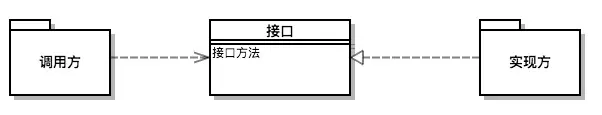

[TOC]


# Java SPI机制详解 接口查找实现类

## 什么是SPI？

SPI 全称为 (Service Provider Interface) ，是JDK内置的一种服务提供发现机制。SPI是一种动态替换发现的机制， 比如有个接口，想运行时动态的给它添加实现，你只需要添加一个实现。我们经常遇到的就是java.sql.Driver接口，其他不同厂商可以针对同一接口做出不同的实现，mysql和postgresql都有不同的实现提供给用户，而Java的SPI机制可以为某个接口寻找服务实现。





类图中，接口对应定义的抽象SPI接口；实现方实现SPI接口；调用方依赖SPI接口。

SPI接口的定义在调用方，在概念上更依赖调用方；组织上位于调用方所在的包中；实现位于独立的包中。

当接口属于实现方的情况，实现方提供了接口和实现，这个用法很常见，属于API调用。我们可以引用接口来达到调用某实现类的功能。

## Java SPI 应用实例

当服务的提供者提供了一种接口的实现之后，需要在classpath下的META-INF/services/目录里创建一个以服务接口命名的文件，这个文件里的内容就是这个接口的具体的实现类。当其他的程序需要这个服务的时候，就可以通过查找这个jar包（一般都是以jar包做依赖）的META-INF/services/中的配置文件，配置文件中有接口的具体实现类名，可以根据这个类名进行加载实例化，就可以使用该服务了。JDK中查找服务实现的工具类是：java.util.ServiceLoader。

### SPI接口

```java
public interface ObjectSerializer {

    byte[] serialize(Object obj) throws ObjectSerializerException;

    <T> T deSerialize(byte[] param, Class<T> clazz) throws ObjectSerializerException;

    String getSchemeName();
} 
```

定义了一个对象序列化接口，内有三个方法：序列化方法、反序列化方法和序列化名称。

### SPI具体实现

```java
public class KryoSerializer implements ObjectSerializer {

    @Override
    public byte[] serialize(Object obj) throws ObjectSerializerException {
        byte[] bytes;
        ByteArrayOutputStream outputStream = new ByteArrayOutputStream();
        try {
            //获取kryo对象
            Kryo kryo = new Kryo();
            Output output = new Output(outputStream);
            kryo.writeObject(output, obj);
            bytes = output.toBytes();
            output.flush();
        } catch (Exception ex) {
            throw new ObjectSerializerException("kryo serialize error" + ex.getMessage());
        } finally {
            try {
                outputStream.flush();
                outputStream.close();
            } catch (IOException e) {

            }
        }
        return bytes;
    }

    @Override
    public <T> T deSerialize(byte[] param, Class<T> clazz) throws ObjectSerializerException {
        T object;
        try (ByteArrayInputStream inputStream = new ByteArrayInputStream(param)) {
            Kryo kryo = new Kryo();
            Input input = new Input(inputStream);
            object = kryo.readObject(input, clazz);
            input.close();
        } catch (Exception e) {
            throw new ObjectSerializerException("kryo deSerialize error" + e.getMessage());
        }
        return object;
    }

    @Override
    public String getSchemeName() {
        return "kryoSerializer";
    }

} 
```

使用Kryo的序列化方式。Kryo 是一个快速高效的Java对象图形序列化框架，它原生支持java，且在java的序列化上甚至优于google著名的序列化框架protobuf。

```java
public class JavaSerializer implements ObjectSerializer {
    @Override
    public byte[] serialize(Object obj) throws ObjectSerializerException {
        ByteArrayOutputStream arrayOutputStream;
        try {
            arrayOutputStream = new ByteArrayOutputStream();
            ObjectOutput objectOutput = new ObjectOutputStream(arrayOutputStream);
            objectOutput.writeObject(obj);
            objectOutput.flush();
            objectOutput.close();
        } catch (IOException e) {
            throw new ObjectSerializerException("JAVA serialize error " + e.getMessage());
        }
        return arrayOutputStream.toByteArray();
    }

    @Override
    public <T> T deSerialize(byte[] param, Class<T> clazz) throws ObjectSerializerException {
        ByteArrayInputStream arrayInputStream = new ByteArrayInputStream(param);
        try {
            ObjectInput input = new ObjectInputStream(arrayInputStream);
            return (T) input.readObject();
        } catch (IOException | ClassNotFoundException e) {
            throw new ObjectSerializerException("JAVA deSerialize error " + e.getMessage());
        }
    }

    @Override
    public String getSchemeName() {
        return "javaSerializer";
    }

} 
```

Java原生的序列化方式。

### 增加META-INF目录文件

Resource下面创建META-INF/services 目录里创建一个以服务接口命名的文件


```
com.blueskykong.javaspi.serializer.KryoSerializer
com.blueskykong.javaspi.serializer.JavaSerializer 
```

### Service类

```java
@Service
public class SerializerService {


    public ObjectSerializer getObjectSerializer() {
        ServiceLoader<ObjectSerializer> serializers = ServiceLoader.load(ObjectSerializer.class);

        final Optional<ObjectSerializer> serializer = StreamSupport.stream(serializers.spliterator(), false)
                .findFirst();

        return serializer.orElse(new JavaSerializer());
    }
} 
```

获取定义的序列化方式，且只取第一个（我们在配置中写了两个），如果找不到则返回Java原生序列化方式。

### 测试类

```java
    @Autowired
    private SerializerService serializerService;

    @Test
    public void serializerTest() throws ObjectSerializerException {
        ObjectSerializer objectSerializer = serializerService.getObjectSerializer();
        System.out.println(objectSerializer.getSchemeName());
        byte[] arrays = objectSerializer.serialize(Arrays.asList("1", "2", "3"));
        ArrayList list = objectSerializer.deSerialize(arrays, ArrayList.class);
        Assert.assertArrayEquals(Arrays.asList("1", "2", "3").toArray(), list.toArray());
    } 
```

测试用例通过，且输出`kryoSerializer`。

## SPI的用途

数据库DriverManager、Spring、ConfigurableBeanFactory等都用到了SPI机制，这里以数据库DriverManager为例，看一下其实现的内幕。

DriverManager是jdbc里管理和注册不同数据库driver的工具类。针对一个数据库，可能会存在着不同的数据库驱动实现。我们在使用特定的驱动实现时，不希望修改现有的代码，而希望通过一个简单的配置就可以达到效果。 在使用mysql驱动的时候，会有一个疑问，DriverManager是怎么获得某确定驱动类的？我们在运用Class.forName("com.mysql.jdbc.Driver")加载mysql驱动后，就会执行其中的静态代码把driver注册到DriverManager中，以便后续的使用。

在JDBC4.0之前，连接数据库的时候，通常会用`Class.forName("com.mysql.jdbc.Driver")`这句先加载数据库相关的驱动，然后再进行获取连接等的操作。而JDBC4.0之后不需要`Class.forName`来加载驱动，直接获取连接即可，这里使用了Java的SPI扩展机制来实现。

在java中定义了接口java.sql.Driver，并没有具体的实现，具体的实现都是由不同厂商来提供的。

### mysql

在mysql-connector-java-5.1.45.jar中，META-INF/services目录下会有一个名字为java.sql.Driver的文件：

```
com.mysql.jdbc.Driver
com.mysql.fabric.jdbc.FabricMySQLDriver 
```

### pg

而在postgresql-42.2.2.jar中，META-INF/services目录下会有一个名字为java.sql.Driver的文件：

```
org.postgresql.Driver
```

### 用法

```
String url = "jdbc:mysql://localhost:3306/test";
Connection conn = DriverManager.getConnection(url,username,password); 
```

上面展示的是mysql的用法，pg用法也是类似。不需要使用`Class.forName("com.mysql.jdbc.Driver")`来加载驱动。

### Mysql DriverManager实现

上面代码没有了加载驱动的代码，我们怎么去确定使用哪个数据库连接的驱动呢？这里就涉及到使用Java的SPI扩展机制来查找相关驱动的东西了，关于驱动的查找其实都在DriverManager中，DriverManager是Java中的实现，用来获取数据库连接，在DriverManager中有一个静态代码块如下：

```
static {
	loadInitialDrivers();
	println("JDBC DriverManager initialized");
}
```

可以看到其内部的静态代码块中有一个`loadInitialDrivers`方法，`loadInitialDrivers`用法用到了上文提到的spi工具类`ServiceLoader`:

```java
    public Void run() {

        ServiceLoader<Driver> loadedDrivers = ServiceLoader.load(Driver.class);
        Iterator<Driver> driversIterator = loadedDrivers.iterator();

        /* Load these drivers, so that they can be instantiated.
         * It may be the case that the driver class may not be there
         * i.e. there may be a packaged driver with the service class
         * as implementation of java.sql.Driver but the actual class
         * may be missing. In that case a java.util.ServiceConfigurationError
         * will be thrown at runtime by the VM trying to locate
         * and load the service.
         *
         * Adding a try catch block to catch those runtime errors
         * if driver not available in classpath but it's
         * packaged as service and that service is there in classpath.
         */
        try{
            while(driversIterator.hasNext()) {
                driversIterator.next();
            }
        } catch(Throwable t) {
        // Do nothing
        }
        return null;
    } 
```

遍历使用SPI获取到的具体实现，实例化各个实现类。在遍历的时候，首先调用`driversIterator.hasNext()`方法，这里会搜索classpath下以及jar包中所有的META-INF/services目录下的java.sql.Driver文件，并找到文件中的实现类的名字，此时并没有实例化具体的实现类。

## 总结

SPI机制在实际开发中使用得场景也有很多。特别是统一标准的不同厂商实现，当有关组织或者公司定义标准之后，具体厂商或者框架开发者实现，之后提供给开发者使用。

**本文代码：** https://github.com/keets2012/Spring-Boot-Samples/tree/master/java-spi

 

### 参考

1. [Java中SPI机制深入及源码解析](https://link.juejin.im/?target=https%3A%2F%2Fcxis.me%2F2017%2F04%2F17%2FJava%25E4%25B8%25ADSPI%25E6%259C%25BA%25E5%2588%25B6%25E6%25B7%25B1%25E5%2585%25A5%25E5%258F%258A%25E6%25BA%2590%25E7%25A0%2581%25E8%25A7%25A3%25E6%259E%2590%2F)
2. [Java SPI思想梳理](https://link.juejin.im/?target=https%3A%2F%2Fzhuanlan.zhihu.com%2Fp%2F28909673)


https://juejin.im/post/5af952fdf265da0b9e652de3