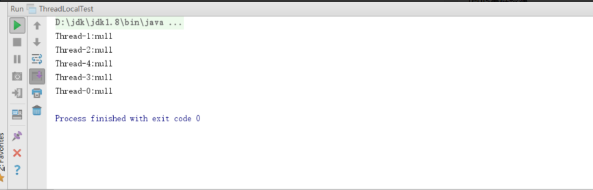
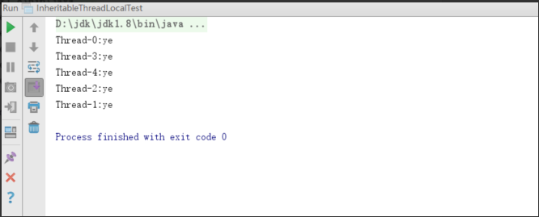

[TOC]


# InheritableThreadLocal 用法

## 前言

前面介绍过[ThreadLocal](https://juejin.im/post/5d15c62cf265da1b8f1ad53e)用法，可以通过threadLocal在同一个线程中进行值传递，但是在父子线程中就不能进行值传递了，因为不是同一个线程，所以对应的ThreadLocalMap是不一样的

## 示例

### ThreadLocal示例

```java
public class ThreadLocalTest {
    public static ThreadLocal<String> threadLocal = new ThreadLocal<>();

    public static String get() {
        return threadLocal.get();
    }

    public static void set(String value) {
        threadLocal.set(value);
    }

    public static void main(String[] args) {
        for (int i = 0; i < 5; i++) {
            final int j = i;
            ThreadLocalTest.set("ye");
            Thread t = new Thread(new Runnable() {
                @Override
                public void run() {
                    System.out.println(Thread.currentThread().getName() + ":" + ThreadLocalTest.get());
                }
            });

            t.start();
        }
    }
} 
```

结果：



### InheritableThreadLocal 示例

```java
public class InheritableThreadLocalTest {
    public static ThreadLocal<String> threadLocal = new InheritableThreadLocal<>();

    public static String get() {
        return threadLocal.get();
    }

    public static void set(String value) {
        threadLocal.set(value);
    }

    public static void main(String[] args) {
        for (int i = 0; i < 5; i++) {
            InheritableThreadLocalTest.set("ye");
            Thread t = new Thread(new Runnable() {
                @Override
                public void run() {
                    System.out.println(Thread.currentThread().getName() + ":" + InheritableThreadLocalTest.get());
                }
            });

            t.start();
        }
    }
}
```

结果：



## 解析

```java
InheritableThreadLocal是继承ThreadLocal
先看他set方法,set 方法是调用 ThreadLocal的set方法
public void set(T value) {
        Thread t = Thread.currentThread();
        ThreadLocalMap map = getMap(t);
        if (map != null)
            map.set(this, value);
        else
            createMap(t, value);
    }

```

createMap调用自己重写的

```java
void createMap(Thread t, T firstValue) {
        t.inheritableThreadLocals = new ThreadLocalMap(this, firstValue);
}
```

看上面发现和ThreadLocal的createMap差不多，初始化一个ThreadLocalMap，只是赋值给了inheritableThreadLocals，而ThreadLocal赋值给了threadLocals

继续看get方法，get方法也是调用ThreadLocal的get方法

```java
public T get() {
        Thread t = Thread.currentThread();
        ThreadLocalMap map = getMap(t);
        if (map != null) {
            ThreadLocalMap.Entry e = map.getEntry(this);
            if (e != null) {
                @SuppressWarnings("unchecked")
                T result = (T)e.value;
                return result;
            }
        }
        return setInitialValue();
    }

```

区别在于getMap调用的是InheritableThreadLocal重写的方法

```java
ThreadLocalMap getMap(Thread t) {
       return t.inheritableThreadLocals;
    }

```

因为在set的时候赋值给的是t.inheritableThreadLocals，所以取map的时候也是从t.inheritableThreadLocals取的

看完了set和get方法，唯一的区别就是map存取的地方不一样，可却没有看出来其他不同，只是换了一个变量而已，那他是怎么和ThreadLocal 不一样，是怎么完成父子线程的值传递呢 这就要看Thread的初始化了，看Thread类的构造方法你就会看到都会调用一个init方法

Thread的init方法

```java
private void init(ThreadGroup g, Runnable target, String name,
                      long stackSize, AccessControlContext acc,
                      boolean inheritThreadLocals) {
        if (name == null) {
            throw new NullPointerException("name cannot be null");
        }

        this.name = name;

        Thread parent = currentThread();
        SecurityManager security = System.getSecurityManager();
        if (g == null) {
            /* Determine if it's an applet or not */

            /* If there is a security manager, ask the security manager
               what to do. */
            if (security != null) {
                g = security.getThreadGroup();
            }

            /* If the security doesn't have a strong opinion of the matter
               use the parent thread group. */
            if (g == null) {
                g = parent.getThreadGroup();
            }
        }

        /* checkAccess regardless of whether or not threadgroup is
           explicitly passed in. */
        g.checkAccess();

        /*
         * Do we have the required permissions?
         */
        if (security != null) {
            if (isCCLOverridden(getClass())) {
                security.checkPermission(SUBCLASS_IMPLEMENTATION_PERMISSION);
            }
        }

        g.addUnstarted();

        this.group = g;
        this.daemon = parent.isDaemon();
        this.priority = parent.getPriority();
        if (security == null || isCCLOverridden(parent.getClass()))
            this.contextClassLoader = parent.getContextClassLoader();
        else
            this.contextClassLoader = parent.contextClassLoader;
        this.inheritedAccessControlContext =
                acc != null ? acc : AccessController.getContext();
        this.target = target;
        setPriority(priority);
        if (inheritThreadLocals && parent.inheritableThreadLocals != null)
            this.inheritableThreadLocals =
                ThreadLocal.createInheritedMap(parent.inheritableThreadLocals);
        /* Stash the specified stack size in case the VM cares */
        this.stackSize = stackSize;

        /* Set thread ID */
        tid = nextThreadID();
    }

```

上面的方法主要看

```java
if (inheritThreadLocals && parent.inheritableThreadLocals != null)
            this.inheritableThreadLocals =
                ThreadLocal.createInheritedMap(parent.inheritableThreadLocals);

```

inheritThreadLocals 是方法的入参，看构造函数只有Thread(Runnable target, AccessControlContext acc)是false，其余的构造方法都是true，所以我们这里传的是true

```java
Thread(Runnable target, AccessControlContext acc) {
        init(null, target, "Thread-" + nextThreadNum(), 0, acc, false);
    }

Thread parent = currentThread();
//这里指的是我们的main线程，因为我们在main里面用的是InheritableThreadLocalTest.set("ye");
//所以我们把ThreadLocalMap赋值给了inheritableThreadLocals
//综上所述会走this.inheritableThreadLocals =
//                ThreadLocal.createInheritedMap(parent.inheritableThreadLocals);
//this 为当前new的子线程                 
```

接下来就要看子线程的inheritableThreadLocals是怎么赋值了

```java
 static ThreadLocalMap createInheritedMap(ThreadLocalMap parentMap) {
        return new ThreadLocalMap(parentMap);
    }
    
private ThreadLocalMap(ThreadLocalMap parentMap) {
            Entry[] parentTable = parentMap.table;
            int len = parentTable.length;
            setThreshold(len);
            table = new Entry[len];

            for (int j = 0; j < len; j++) {
                Entry e = parentTable[j];
                if (e != null) {
                    @SuppressWarnings("unchecked")
                    ThreadLocal<Object> key = (ThreadLocal<Object>) e.get();
                    if (key != null) {
                        Object value = key.childValue(e.value);
                        Entry c = new Entry(key, value);
                        int h = key.threadLocalHashCode & (len - 1);
                        while (table[h] != null)
                            h = nextIndex(h, len);
                        table[h] = c;
                        size++;
                    }
                }
            }
        }    

```

上述代码很简单，就是拿到父线程的ThreadLocalMap，然后进行复制（浅拷贝，引用复制），这样子线程的inheritableThreadLocals就有了对应的ThreadLocalMap，这样通过ThreadLocalMap就可以取到和父线程同样的值了

## 小结

InheritableThreadLocal 继承ThreadLocal ，所以用法和ThreadLocal 一样，
唯一不同的是ThreadLocal用的是ThreadLocal 用的是ThreadLocal.ThreadLocalMap threadLocals变量
InheritableThreadLocal用的是ThreadLocal.ThreadLocalMap inheritableThreadLocals变量
但都是ThreadLocalMap，所以get和set本质上是没有区别的
InheritableThreadLocal之所以可以支持父子线程直接的传递
是在new Thread的时候init中  复制父线程的ThreadLocalMap 到子线程的inheritableThreadLocals中

  


https://juejin.im/post/5d15d36df265da1bc37f229a