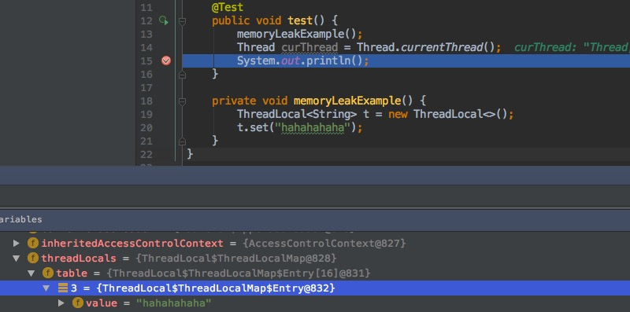

[toc]

# threadLocal WeakReference和内存泄漏的思考

发表于 2017-03-27 | 分类于 [后台 ](https://majiaji.coding.me/categories/%E5%90%8E%E5%8F%B0/)| [3 Comments](https://majiaji.coding.me/2017/03/27/threadLocal-WeakReference%E5%92%8C%E5%86%85%E5%AD%98%E6%B3%84%E6%BC%8F%E7%9A%84%E6%80%9D%E8%80%83/#comments)

### ThreadLocal的结构

ThreadLocal是一个有点“特殊”的类，它的实例的生命周期要和当前运行的线程强绑定。当new了一个ThreadLocal实例，并且调用set方法设置值的时候，会创建一个内部类实例ThreadLocalMap，这个Map的entry如下：

```
ThreadLocalMap的entry java
static class Entry extends WeakReference<ThreadLocal<?>> {
           /** The value associated with this ThreadLocal. */
           Object value;

           Entry(ThreadLocal<?> k, Object v) {
               super(k);
               value = v;
           }
       }
```

key是ThreadLocal实例本身,value是具体的值。这里entry的key使用了弱引用，即当gc时不管空间是否足够，只要key只剩下当前的弱引用，则一定会被回收掉。
外层是以当前线程实例作为key，ThreadLocalMap作为value的一层映射，所以加起来一共有两层映射：thread->ThreadLocalMap实例->key:threadLocal本身(弱引用)；value:具体的值。

### java引用

1. 强引用（StrongReference）：存在就不会被gc回收，空间不足时报error
2. 软引用（SoftReference）：当空间不足时才会被gc回收。
3. 弱引用（WeakReference）：gc过程扫描到就会被回收。

### 内存泄漏场景和原因

举个简单的🌰：
[](https://majiaji.coding.me/images/threadLocalMemoryLeak.jpg)

```java
    @Test
    public void test() {
        memoryLeakExample();
        Thread currentThread1 = Thread.currentThread();
        System.out.println();
        System.gc();
        Thread currentThread2 = Thread.currentThread();
        System.out.println();
    }
    private void memoryLeakExample(){
        ThreadLocal<String> t = new ThreadLocal<>();
        t.set("hahahahaha");
    }
```

在函数memoryLeakExample()中声明了一个ThreadLocal实例t，t是强引用，当函数结束后强引用就没了。ThreadLocalMap实例中的key为弱引用，在下次gc时候会被回收掉。这时候value “hahahahaha”就没有访问路径了，无法被gc回收，产生了内存泄漏。只要当前线程不结束，并且不调用set/get/remove方法（这些方法会对key为null的entry进行释放），这片内存会被一直占用。

### 为什么用weakReference?

1. 为什么ThreadLocalMap的key用弱引用，为什么不用强引用呢?
   这里的弱引用可以首先由gc来判断ThreadLocal实例是否真的可以回收，由gc回收的结果，间接告诉我们，key为null了，这时候value也可以被清理了，并且最终通过高频操作get/set/remove封装好的方法进行清理。如果用强引用那么我们一直不知道这个entry是否可以被回收，除非强制每个coder在逻辑执行完的最后进行一次全局清理。
2. 为什么value不用弱引用呢？
   value不像key那样，还有一个外部的强引用，可能在业务执行过程中发生了gc，value被清理了，业务后边取值会出错的。

### 工程中的实践

在一个上下文类中声明一个静态的ThreadLocal对象，延长其生命周期，方便其他方法访问，以这个对象为载体存储请求的上下文信息，在各个处理函数中进行传递。最后一步记得主动调用remove方法，避免内存泄漏。


<https://majiaji.coding.me/2017/03/27/threadLocal-WeakReference%E5%92%8C%E5%86%85%E5%AD%98%E6%B3%84%E6%BC%8F%E7%9A%84%E6%80%9D%E8%80%83/>