[TOC]


# 秒杀系统架构分析与实战

# 1 秒杀业务分析

1. **正常电子商务流程**

   （1）查询商品；（2）创建订单；（3）扣减库存；（4）更新订单；（5）付款；（6）卖家发货

2. **秒杀业务的特性**

   （1）低廉价格；（2）大幅推广；（3）瞬时售空；（4）一般是定时上架；（5）时间短、瞬时并发量高；

# 2 秒杀技术挑战

假设某网站秒杀活动只推出一件商品，预计会吸引1万人参加活动，也就说最大并发请求数是10000，秒杀系统需要面对的技术挑战有：

1. **对现有网站业务造成冲击**

   秒杀活动只是网站营销的一个附加活动，这个活动具有时间短，并发访问量大的特点，如果和网站原有应用部署在一起，必然会对现有业务造成冲击，稍有不慎可能导致整个网站瘫痪。

   **解决方案**：将秒杀系统独立部署，甚至`使用独立域名，使其与网站完全隔离`。

2. **高并发下的应用、数据库负载**

   用户在秒杀开始前，通过不停刷新浏览器页面以保证不会错过秒杀，这些请求如果按照一般的网站应用架构，访问应用服务器、连接数据库，会对应用服务器和数据库服务器造成负载压力。

   **解决方案**：重新设计秒杀商品页面，不使用网站原来的商品详细页面，`页面内容静态化，用户请求不需要经过应用服务`。

3. **突然增加的网络及服务器带宽**

   假设商品页面大小200K（主要是商品图片大小），那么需要的网络和服务器带宽是2G（200K×10000），这些网络带宽是因为秒杀活动新增的，超过网站平时使用的带宽。

   **解决方案**：因为秒杀新增的网络带宽，必须和运营商重新购买或者租借。为了减轻网站服务器的压力，`需要将秒杀商品页面缓存在CDN，同样需要和CDN服务商临时租借新增的出口带宽`。

4. **直接下单**

   秒杀的游戏规则是到了秒杀才能开始对商品下单购买，在此时间点之前，只能浏览商品信息，不能下单。而下单页面也是一个普通的URL，如果得到这个URL，不用等到秒杀开始就可以下单了。

   **解决方案**：为了避免用户直接访问下单页面URL，需要将改URL动态化，即使秒杀系统的开发者也无法在秒杀开始前访问下单页面的URL。办法是在`下单页面URL加入由服务器端生成的随机数作为参数，在秒杀开始的时候才能得到`。

5. **如何控制秒杀商品页面购买按钮的点亮**

   购买按钮只有在秒杀开始的时候才能点亮，在此之前是灰色的。如果该页面是动态生成的，当然可以在服务器端构造响应页面输出，控制该按钮是灰色还 是点亮，但是为了减轻服务器端负载压力，更好地利用CDN、反向代理等性能优化手段，该页面被设计为静态页面，缓存在CDN、反向代理服务器上，甚至用户浏览器上。秒杀开始时，用户刷新页面，请求根本不会到达应用服务器。

   **解决方案**：使用JavaScript脚本控制，`在秒杀商品静态页面中加入一个JavaScript文件引用`，该JavaScript文件中包含 秒杀开始标志为否；当秒杀开始的时候生成一个新的JavaScript文件（文件名保持不变，只是内容不一样），更新秒杀开始标志为是，`加入下单页面的URL及随机数参数（这个随机数只会产生一个，即所有人看到的URL都是同一个，服务器端可以用redis这种分布式缓存服务器来保存随机数）`，并被用户浏览器加载，控制秒杀商品页面的展示。`这个JavaScript文件的加载可以加上随机版本号（例如xx.js?v=32353823），这样就不会被浏览器、CDN和反向代理服务器缓存`。

   这个JavaScript文件非常小，即使每次浏览器刷新都访问JavaScript文件服务器也不会对服务器集群和网络带宽造成太大压力。

6. **如何只允许第一个提交的订单被发送到订单子系统**

   由于最终能够成功秒杀到商品的用户只有一个，因此需要在用户提交订单时，检查是否已经有订单提交。如果已经有订单提交成功，则需要更新 JavaScript文件，更新秒杀开始标志为否，购买按钮变灰。事实上，由于最终能够成功提交订单的用户只有一个，为了减轻下单页面服务器的负载压力， 可以控制进入下单页面的入口，只有少数用户能进入下单页面，其他用户直接进入秒杀结束页面。

   **解决方案**：假设下单服务器集群有10台服务器，每台服务器只接受最多10个下单请求。在还没有人提交订单成功之前，如果一台服务器已经有十单了，而有的一单都没处理，可能出现的用户体验不佳的场景是用户第一次点击购买按钮进入已结束页面，再刷新一下页面，有可能被一单都没有处理的服务器处理，进入了填写订单的页面，`可以考虑通过cookie的方式来应对，符合一致性原则`。当然可以`采用最少连接的负载均衡算法`，出现上述情况的概率大大降低。

7. **如何进行下单前置检查**

   - **下单服务器检查本机已处理的下单请求数目：**

   如果超过10条，直接返回已结束页面给用户；

   如果未超过10条，则用户可进入填写订单及确认页面；

   - **检查全局已提交订单数目：**

   已超过秒杀商品总数，返回已结束页面给用户；

   未超过秒杀商品总数，提交到子订单系统；

8. **秒杀一般是定时上架**

   该功能实现方式很多。不过目前比较好的方式是：提前设定好商品的上架时间，用户可以在前台看到该商品，但是无法点击“立即购买”的按钮。但是需要考虑的是，`有人可以绕过前端的限制，直接通过URL的方式发起购买`，这就需要在前台商品页面，以及bug页面到后端的数据库，都要进行时钟同步。越在后端控制，安全性越高。

   定时秒杀的话，就要避免卖家在秒杀前对商品做编辑带来的不可预期的影响。这种特殊的变更需要多方面评估。一般禁止编辑，如需变更，可以走数据订正多的流程。

9. **减库存的操作**

   有两种选择，一种是`拍下减库存` 另外一种是`付款减库存`；目前采用的`“拍下减库存”`的方式，拍下就是一瞬间的事，对用户体验会好些。

10. **库存会带来“超卖”的问题：售出数量多于库存数量**

   由于库存并发更新的问题，导致在实际库存已经不足的情况下，库存依然在减，导致卖家的商品卖得件数超过秒杀的预期。方案：`采用乐观锁`

   ```sql
   update auction_auctions set
   quantity = #inQuantity# where auction_id = #itemId# and quantity = #dbQuantity#
   ```

11. **秒杀器的应对**

    秒杀器一般下单个购买及其迅速，根据购买记录可以甄别出一部分。可以通过校验码达到一定的方法，这就要求校验码足够安全，不被破解，采用的方式有：`秒杀专用验证码，电视公布验证码，秒杀答题`。

# 3 秒杀架构原则

1. **尽量将请求拦截在系统上游**

   传统秒杀系统之所以挂，请求都压倒了后端数据层，数据读写锁冲突严重，并发高响应慢，几乎所有请求都超时，流量虽大，下单成功的有效流量甚小【一趟火车其实只有2000张票，200w个人来买，基本没有人能买成功，请求有效率为0】。

2. **读多写少的常用多使用缓存**

   这是一个典型的`读多写少`的应用场景【一趟火车其实只有2000张票，200w个人来买，最多2000个人下单成功，其他人都是查询库存，写比例只有0.1%，读比例占99.9%】，`非常适合使用缓存`。

# 4 秒杀架构设计

秒杀系统为秒杀而设计，不同于一般的网购行为，参与秒杀活动的用户更关心的是如何能快速刷新商品页面，在秒杀开始的时候抢先进入下单页面，而不是商品详情等用户体验细节，因此秒杀系统的页面设计应尽可能简单。

商品页面中的购买按钮只有在秒杀活动开始的时候才变亮，在此之前及秒杀商品卖出后，该按钮都是灰色的，不可以点击。

下单表单也尽可能简单，购买数量只能是一个且不可以修改，送货地址和付款方式都使用用户默认设置，没有默认也可以不填，允许等订单提交后修改；只有第一个提交的订单发送给网站的订单子系统，其余用户提交订单后只能看到秒杀结束页面。

要做一个这样的秒杀系统，业务会分为两个阶段，`第一个阶段是秒杀开始前某个时间到秒杀开始`， 这个阶段可以称之为`准备阶段`，用户在准备阶段等待秒杀； `第二个阶段就是秒杀开始到所有参与秒杀的用户获得秒杀结果`， 这个就称为`秒杀阶段`吧。

## 4.1 前端层设计

首先要有一个展示秒杀商品的页面， 在这个页面上做一个秒杀活动开始的倒计时， `在准备阶段内用户会陆续打开这个秒杀的页面， 并且可能不停的刷新页面`。这里需要考虑两个问题：

1. **第一个是秒杀页面的展示**

   我们知道一个html页面还是比较大的，`即使做了压缩，http头和内容的大小也可能高达数十K，加上其他的css， js，图片等资源`，如果同时有几千万人参与一个商品的抢购，一般机房带宽也就只有1G~10G，`网络带宽就极有可能成为瓶颈`，所以这个页面上`各类静态资源首先应分开存放，然后放到cdn节点上分散压力`，由于CDN节点遍布全国各地，能缓冲掉绝大部分的压力，而且还比机房带宽便宜~

2. **第二个是倒计时**

   出于性能原因这个一般由js调用客户端本地时间，就有可能出现客户端时钟与服务器时钟不一致，另外服务器之间也是有可能出现时钟不一致。`客户端与服务器时钟不一致可以采用客户端定时和服务器同步时间`，这里考虑一下性能问题，`用于同步时间的接口由于不涉及到后端逻辑，只需要将当前web服务器的时间发送给客户端就可以了，因此速度很快`，就我以前测试的结果来看，一台标准的web服务器2W+QPS不会有问题，如果100W人同时刷，100W QPS也只需要50台web，一台硬件LB就可以了~，并且web服务器群是可以很容易的横向扩展的(LB+DNS轮询)，这个接口可以只返回一小段json格式的数据，而且可以优化一下减少不必要cookie和其他http头的信息，所以数据量不会很大，`一般来说网络不会成为瓶颈，即使成为瓶颈也可以考虑多机房专线连通，加智能DNS的解决方案`；web服务器之间时间不同步可以采用统一时间服务器的方式，`比如每隔1分钟所有参与秒杀活动的web服务器就与时间服务器做一次时间同步`。

3. **浏览器层请求拦截**

   （1）**产品层面**，用户点击“查询”或者“购票”后，按钮置灰，禁止用户重复提交请求;

   （2）**JS层面**，限制用户在x秒之内只能提交一次请求;

## 4.2 站点层设计

前端层的请求拦截，只能拦住小白用户（不过这是99%的用户哟），高端的程序员根本不吃这一套，写个for循环，直接调用你后端的http请求，怎么整？

（1）**同一个uid，限制访问频度**，做页面缓存，x秒内到达站点层的请求，均返回同一页面

（2）**同一个item的查询，例如手机车次**，做页面缓存，x秒内到达站点层的请求，均返回同一页面

如此限流，又有99%的流量会被拦截在站点层。

## 4.3 服务层设计

站点层的请求拦截，只能拦住普通程序员，高级黑客，假设他控制了10w台肉鸡（并且假设买票不需要实名认证），这下uid的限制不行了吧？怎么整？

（1）大哥，我是服务层，我清楚的知道小米只有1万部手机，我清楚的知道一列火车只有2000张车票，我透10w个请求去数据库有什么意义呢？**对于写请求，做请求队列，每次只透过有限的写请求去数据层，如果均成功再放下一批，如果库存不够则队列里的写请求全部返回“已售完”**；

（2）**对于读请求，还用说么？cache来抗**，不管是memcached还是redis，单机抗个每秒10w应该都是没什么问题的；

如此限流，只有非常少的写请求，和非常少的读缓存mis的请求会透到数据层去，又有99.9%的请求被拦住了。

1. **用户请求分发模块**：使用Nginx或Apache将用户的请求分发到不同的机器上。
2. **用户请求预处理模块**：判断商品是不是还有剩余来决定是不是要处理该请求。
3. **用户请求处理模块**：把通过预处理的请求封装成事务提交给数据库，并返回是否成功。
4. **数据库接口模块**：该模块是数据库的唯一接口，负责与数据库交互，提供RPC接口供查询是否秒杀结束、剩余数量等信息。

- **用户请求预处理模块**

  经过HTTP服务器的分发后，单个服务器的负载相对低了一些，但总量依然可能很大，如果后台商品已经被秒杀完毕，那么直接给后来的请求返回秒杀失败即可，不必再进一步发送事务了，示例代码可以如下所示：

  ```
  package seckill;
  import org.apache.http.HttpRequest;
  /**
  * 预处理阶段，把不必要的请求直接驳回，必要的请求添加到队列中进入下一阶段.
  */public class PreProcessor {
    // 商品是否还有剩余private static boolean reminds = true;
    private static void forbidden() {
        // Do something.
    }
    public static boolean checkReminds() {
        if (reminds) {
            // 远程检测是否还有剩余，该RPC接口应由数据库服务器提供，不必完全严格检查.if (!RPC.checkReminds()) {
                reminds = false;
            }
        }
        return reminds;
    }
    /**
     * 每一个HTTP请求都要经过该预处理.
     */public static void preProcess(HttpRequest request) {
        if (checkReminds()) {
            // 一个并发的队列
            RequestQueue.queue.add(request);
        } else {
            // 如果已经没有商品了，则直接驳回请求即可.
            forbidden();
        }
    }
  }

  ```

  - **并发队列的选择**

  Java的并发包提供了三个常用的并发队列实现，分别是：ConcurrentLinkedQueue 、 LinkedBlockingQueue 和 ArrayBlockingQueue。

  ArrayBlockingQueue是`初始容量固定的阻塞队列`，我们可以用来作为数据库模块成功竞拍的队列，比如有10个商品，那么我们就设定一个10大小的数组队列。

  ConcurrentLinkedQueue使用的是`CAS原语无锁队列实现，是一个异步队列`，入队的速度很快，出队进行了加锁，性能稍慢。

  LinkedBlockingQueue也是`阻塞的队列，入队和出队都用了加锁`，当队空的时候线程会暂时阻塞。

  由于我们的系统`入队需求要远大于出队需求`，一般不会出现队空的情况，所以我们可以选择ConcurrentLinkedQueue来作为我们的请求队列实现：

  ```java
  package seckill;
  import java.util.concurrent.ArrayBlockingQueue;
  import java.util.concurrent.ConcurrentLinkedQueue;
  import org.apache.http.HttpRequest;

  public class RequestQueue {
      public static ConcurrentLinkedQueue<HttpRequest> queue = new ConcurrentLinkedQueue<HttpRequest>();
  }

  ```

- **用户请求模块**

  ```java
  package seckill;
  import org.apache.http.HttpRequest;
  public class Processor {
    /**
     * 发送秒杀事务到数据库队列.
     */public static void kill(BidInfo info) {
        DB.bids.add(info);
    }
    public static void process() {
        BidInfo info = new BidInfo(RequestQueue.queue.poll());
        if (info != null) {
            kill(info);
        }
    }
  }
  class BidInfo {
    BidInfo(HttpRequest request) {
        // Do something.
    }
  }

  ```

- **数据库模块**

  数据库主要是使用一个ArrayBlockingQueue来暂存有可能成功的用户请求。

  ```
  package seckill;
  import java.util.concurrent.ArrayBlockingQueue;
  /**
  * DB应该是数据库的唯一接口.
  */public class DB {
    public static int count = 10;
    public static ArrayBlockingQueue<BidInfo> bids = new ArrayBlockingQueue<BidInfo>(10);
    public static boolean checkReminds() {
        // TODOreturn true;
    }
    // 单线程操作public static void bid() {
        BidInfo info = bids.poll();
        while (count-- > 0) {
            // insert into table Bids values(item_id, user_id, bid_date, other)// select count(id) from Bids where item_id = ?// 如果数据库商品数量大约总数，则标志秒杀已完成，设置标志位reminds = false.
            info = bids.poll();
        }
    }
  }

  ```

## 4.4 数据库设计

### 4.4.1 基本概念

**概念一“单库”**

[](https://static.oschina.net/uploads/img/201511/09135728_XJnK.png)

**概念二“分片”**

[](https://static.oschina.net/uploads/img/201511/09135802_HjoJ.png)

`分片解决的是“数据量太大”的问题，也就是通常说的“水平切分”`。一旦引入分片，势必有“数据路由”的概念，哪个数据访问哪个库。路由规则通常有3种方法：

1. **范围：range**

   优点：简单，容易扩展

   缺点：各库压力不均（新号段更活跃）

2. **哈希：hash 【大部分互联网公司采用的方案二：哈希分库，哈希路由】**

   优点：简单，数据均衡，负载均匀

   缺点：迁移麻烦（2库扩3库数据要迁移）

3. **路由服务：router-config-server**

   优点：灵活性强，业务与路由算法解耦

   缺点：每次访问数据库前多一次查询

**概念三“分组”**

[](https://static.oschina.net/uploads/img/201511/09140127_2LrY.png)

分组解决“可用性”问题，分组通常通过主从复制的方式实现。

**互联网公司数据库实际软件架构是：又分片，又分组（如下图）**

[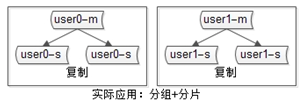](https://static.oschina.net/uploads/img/201511/09140611_S4pj.png)

### 4.4.2 设计思路

数据库软件架构师平时设计些什么东西呢？至少要考虑以下四点：

1. 如何保证数据可用性；
2. 如何提高数据库读性能（大部分应用读多写少，读会先成为瓶颈）；
3. 如何保证一致性；
4. 如何提高扩展性；

- **1. 如何保证数据的可用性？**

  `解决可用性问题的思路是=>冗余`

  如何保证站点的可用性？复制站点，冗余站点

  如何保证服务的可用性？复制服务，冗余服务

  如何保证数据的可用性？复制数据，冗余数据

  `数据的冗余，会带来一个副作用=>引发一致性问题（先不说一致性问题，先说可用性）`。

- **2. 如何保证数据库“读”高可用？**

  `冗余读库`

  [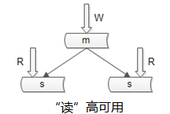](https://static.oschina.net/uploads/img/201511/09141431_bgP7.png)

  `冗余读库带来的副作用？读写有延时，可能不一致`

  上面这个图是很多互联网公司mysql的架构，写仍然是单点，不能保证写高可用。

- **3. 如何保证数据库“写”高可用？**

  `冗余写库`

  [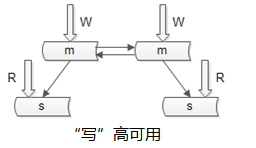](https://static.oschina.net/uploads/img/201511/09141615_cB9r.png)

  `采用双主互备的方式，可以冗余写库带来的副作用？双写同步，数据可能冲突（例如“自增id”同步冲突）`,如何解决同步冲突，有两种常见解决方案：

  1. 两个写库使用不同的初始值，相同的步长来增加id：1写库的id为0,2,4,6...；2写库的id为1,3,5,7...；
  2. 不使用数据的id，业务层自己生成唯一的id，保证数据不冲突；

实际中没有使用上述两种架构来做读写的“高可用”，`采用的是“双主当主从用”的方式`：

[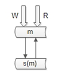](https://static.oschina.net/uploads/img/201511/09154147_lzm8.png)

仍是双主，但`只有一个主提供服务（读+写），另一个主是“shadow-master”，只用来保证高可用，平时不提供服务`。 master挂了，shadow-master顶上（vip漂移，对业务层透明，不需要人工介入）。这种方式的好处：

1. 读写没有延时；
2. 读写高可用；

不足：

1. 不能通过加从库的方式扩展读性能；
2. 资源利用率为50%，一台冗余主没有提供服务；

那如何提高读性能呢？进入第二个话题，如何提供读性能。

- **4. 如何扩展读性能**

  提高读性能的方式大致有三种，`第一种是建立索引`。这种方式不展开，要提到的一点是，`不同的库可以建立不同的索引`。

  [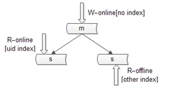](https://static.oschina.net/uploads/img/201511/09154557_lJbA.png)

  `写库`不建立索引；

  `线上读库`建立线上访问索引，例如uid；

  `线下读库`建立线下访问索引，例如time；

  `第二种扩充读性能的方式是，增加从库`，这种方法大家用的比较多，但是，存在两个缺点：

  1. 从库越多，同步越慢；
  2. 同步越慢，数据不一致窗口越大（不一致后面说，还是先说读性能的提高）；

  实际中没有采用这种方法提高数据库读性能（没有从库），`采用的是增加缓存`。常见的缓存架构如下：

  [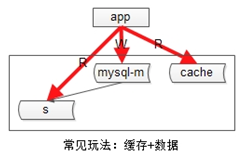](https://static.oschina.net/uploads/img/201511/09154814_tiQW.png)

  `上游是业务应用，下游是主库，从库（读写分离），缓存`。

  实际的玩法：`服务+数据库+缓存一套`

  [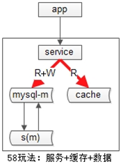](https://static.oschina.net/uploads/img/201511/09154938_HgfU.png)

  业务层不直接面向db和cache，`服务层屏蔽了底层db、cache的复杂性`。为什么要引入服务层，今天不展开，采用了“服务+数据库+缓存一套”的方式提供数据访问，`用cache提高读性能`。

  不管采用主从的方式扩展读性能，还是缓存的方式扩展读性能，数据都要复制多份（主+从，db+cache），`一定会引发一致性问题`。

- **5. 如何保证一致性？**

  主从数据库的一致性，通常有两种解决方案：

  **1. 中间件**

  [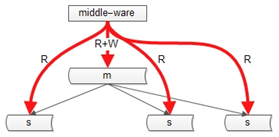](https://static.oschina.net/uploads/img/201511/09155223_CVyW.png)

  如果某一个key有写操作，在不一致时间窗口内，中间件会将这个key的读操作也路由到主库上。这个方案的缺点是，`数据库中间件的门槛较高`（百度，腾讯，阿里，360等一些公司有）。

  **2. 强制读主**

  [](https://static.oschina.net/uploads/img/201511/09155352_pkKX.png)

  `上面实际用的“双主当主从用”的架构，不存在主从不一致的问题`。

  第二类不一致，`是db与缓存间的不一致`：

  [](https://static.oschina.net/uploads/img/201511/09155459_7FUv.png)

  常见的缓存架构如上，此时**写操作**的顺序是：

  （1）淘汰cache；

  （2）写数据库；

  **读操作**的顺序是：

  （1）读cache，如果cache hit则返回；

  （2）如果cache miss，则读从库；

  （3）读从库后，将数据放回cache；

  在一些异常时序情况下，有可能从【从库读到旧数据（同步还没有完成），旧数据入cache后】，数据会长期不一致。`解决办法是“缓存双淘汰”`，写操作时序升级为：

  （1）淘汰cache；

  （2）写数据库；

  （3）在经验“主从同步延时窗口时间”后，再次发起一个异步淘汰cache的请求；

  这样，即使有脏数据如cache，一个小的时间窗口之后，脏数据还是会被淘汰。带来的代价是，多引入一次读miss（成本可以忽略）。

  除此之外，最佳实践之一是：`建议为所有cache中的item设置一个超时时间`。

- **6. 如何提高数据库的扩展性？**

  原来用hash的方式路由，分为2个库，数据量还是太大，要分为3个库，势必需要进行数据迁移，有一个很帅气的“数据库秒级扩容”方案。

  **如何秒级扩容？**

  首先，`我们不做2库变3库的扩容，我们做2库变4库（库加倍）的扩容（未来4->8->16）`

  [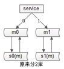](https://static.oschina.net/uploads/img/201511/09160132_wZmz.png)

  服务+数据库是一套（省去了缓存），`数据库采用“双主”的模式`。

  **扩容步骤：**

  `第一步`，将一个主库提升;

  `第二步`，修改配置，2库变4库（原来MOD2，现在配置修改后MOD4），扩容完成；

  `原MOD2为偶的部分，现在会MOD4余0或者2；原MOD2为奇的部分，现在会MOD4余1或者3`；数据不需要迁移，同时，双主互相同步，一遍是余0，一边余2，两边数据同步也不会冲突，秒级完成扩容！

  最后，要做一些收尾工作：

  1. 将旧的双主同步解除；
  2. 增加新的双主（双主是保证可用性的，shadow-master平时不提供服务）；
  3. 删除多余的数据（余0的主，可以将余2的数据删除掉）；

  [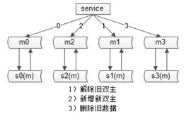](https://static.oschina.net/uploads/img/201511/09160641_BiSH.png)

  这样，秒级别内，我们就完成了2库变4库的扩展。

# 5 大并发带来的挑战

## 5.1 请求接口的合理设计

一个秒杀或者抢购页面，通常分为2个部分，一个是`静态的HTML等内容`，另一个就是`参与秒杀的Web后台请求接口`。

`通常静态HTML等内容，是通过CDN的部署，一般压力不大，核心瓶颈实际上在后台请求接口上`。这个后端接口，必须能够支持高并发请求，同时，非常重要的一点，必须尽可能“快”，在最短的时间里返回用户的请求结果。`为了实现尽可能快这一点，接口的后端存储使用内存级别的操作会更好一点`。仍然直接面向MySQL之类的存储是不合适的，`如果有这种复杂业务的需求，都建议采用异步写入`。

[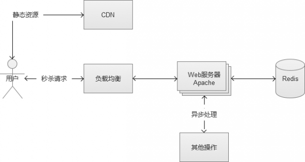](https://static.oschina.net/uploads/img/201511/04105048_rpiR.jpg)

当然，也有一些秒杀和抢购`采用“滞后反馈”`，就是说秒杀当下不知道结果，一段时间后才可以从页面中看到用户是否秒杀成功。但是，这种属于“偷懒”行为，同时给用户的体验也不好，容易被用户认为是“暗箱操作”。

## 5.2 高并发的挑战：一定要“快”

我们通常衡量一个`Web系统的吞吐率的指标是QPS（Query Per Second，每秒处理请求数），解决每秒数万次的高并发场景，这个指标非常关键`。举个例子，我们假设处理一个业务请求平均响应时间为100ms，同时，系统内有20台Apache的Web服务器，配置MaxClients为500个（表示Apache的最大连接数目）。

那么，我们的Web系统的理论峰值QPS为（理想化的计算方式）：

```
20*500/0.1 = 100000 （10万QPS）
```

咦？我们的系统似乎很强大，1秒钟可以处理完10万的请求，5w/s的秒杀似乎是“纸老虎”哈。实际情况，当然没有这么理想。`在高并发的实际场景下，机器都处于高负载的状态，在这个时候平均响应时间会被大大增加`。

`就Web服务器而言，Apache打开了越多的连接进程，CPU需要处理的上下文切换也越多，额外增加了CPU的消耗，然后就直接导致平均响应时间增加`。因此上述的`MaxClient数目，要根据CPU、内存等硬件因素综合考虑，绝对不是越多越好`。可以`通过Apache自带的abench来测试一下`，取一个合适的值。然后，我们`选择内存操作级别的存储的Redis，在高并发的状态下，存储的响应时间至关重要`。网络带宽虽然也是一个因素，不过，这种请求数据包一般比较小，一般很少成为请求的瓶颈。负载均衡成为系统瓶颈的情况比较少，在这里不做讨论哈。

那么问题来了，假设我们的系统，在5w/s的高并发状态下，平均响应时间从100ms变为250ms（实际情况，甚至更多）：

```
20*500/0.25 = 40000 （4万QPS）
```

于是，我们的系统剩下了4w的QPS，面对5w每秒的请求，中间相差了1w。

然后，这才是真正的恶梦开始。举个例子，高速路口，1秒钟来5部车，每秒通过5部车，高速路口运作正常。突然，这个路口1秒钟只能通过4部车，车流量仍然依旧，结果必定出现大塞车。（5条车道忽然变成4条车道的感觉）。

同理，某一个秒内，20*500个可用连接进程都在满负荷工作中，却仍然有1万个新来请求，没有连接进程可用，系统陷入到异常状态也是预期之内。

[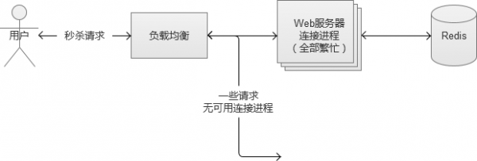](https://static.oschina.net/uploads/img/201511/04110141_wz4s.jpg)

其实在正常的非高并发的业务场景中，也有类似的情况出现，某个业务请求接口出现问题，响应时间极慢，将整个Web请求响应时间拉得很长，逐渐将Web服务器的可用连接数占满，其他正常的业务请求，无连接进程可用。

更可怕的问题是，是用户的行为特点，系统越是不可用，用户的点击越频繁，`恶性循环最终导致“雪崩”（其中一台Web机器挂了，导致流量分散到其他正常工作的机器上，再导致正常的机器也挂，然后恶性循环）`，将整个Web系统拖垮。

## 5.3 重启与过载保护

如果系统发生“雪崩”，贸然重启服务，是无法解决问题的。最常见的现象是，启动起来后，立刻挂掉。这个时候，`最好在入口层将流量拒绝，然后再将重启`。`如果是redis/memcache这种服务也挂了，重启的时候需要注意“预热”，并且很可能需要比较长的时间`。

秒杀和抢购的场景，流量往往是超乎我们系统的准备和想象的。这个时候，过载保护是必要的。`如果检测到系统满负载状态，拒绝请求也是一种保护措施`。在前端设置过滤是最简单的方式，但是，这种做法是被用户“千夫所指”的行为。更合适一点的是，`将过载保护设置在CGI入口层，快速将客户的直接请求返回`。

# 6 作弊的手段：进攻与防守

秒杀和抢购收到了“海量”的请求，实际上里面的水分是很大的。不少用户，为了“抢“到商品，会使用“刷票工具”等类型的辅助工具，帮助他们发送尽可能多的请求到服务器。还有一部分高级用户，制作强大的自动请求脚本。`这种做法的理由也很简单，就是在参与秒杀和抢购的请求中，自己的请求数目占比越多，成功的概率越高`。

这些都是属于“作弊的手段”，不过，有“进攻”就有“防守”，这是一场没有硝烟的战斗哈。

## 6.1 同一个账号，一次性发出多个请求

部分用户通过浏览器的插件或者其他工具，在秒杀开始的时间里，`以自己的账号，一次发送上百甚至更多的请求`。实际上，这样的用户破坏了秒杀和抢购的公平性。

这种请求在某些没有做数据安全处理的系统里，也可能造成另外一种破坏，导致某些判断条件被绕过。例如一个简单的领取逻辑，先判断用户是否有参与记录，如果没有则领取成功，最后写入到参与记录中。这是个非常简单的逻辑，但是，在高并发的场景下，存在深深的漏洞。`多个并发请求通过负载均衡服务器，分配到内网的多台Web服务器，它们首先向存储发送查询请求，然后，在某个请求成功写入参与记录的时间差内，其他的请求获查询到的结果都是“没有参与记录”`。这里，就存在逻辑判断被绕过的风险。

[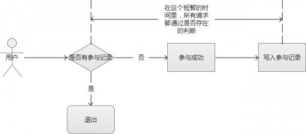](https://static.oschina.net/uploads/img/201511/04134317_iBHI.jpg)

**应对方案：**

在程序入口处，一个账号只允许接受1个请求，其他请求过滤。不仅解决了同一个账号，发送N个请求的问题，还保证了后续的逻辑流程的安全。`实现方案，可以通过Redis这种内存缓存服务，写入一个标志位（只允许1个请求写成功，结合watch的乐观锁的特性），成功写入的则可以继续参加`。

[](https://static.oschina.net/uploads/img/201511/04134436_dy4t.jpg)

或者，自己实现一个服务，将同一个账号的请求放入一个队列中，处理完一个，再处理下一个。

## 6.2 多个账号，一次性发送多个请求

很多公司的账号注册功能，在发展早期几乎是没有限制的，很容易就可以注册很多个账号。因此，`也导致了出现了一些特殊的工作室，通过编写自动注册脚本，积累了一大批“僵尸账号”，数量庞大，几万甚至几十万的账号不等，专门做各种刷的行为（这就是微博中的“僵尸粉“的来源）`。举个例子，例如微博中有转发抽奖的活动，如果我们使用几万个“僵尸号”去混进去转发，这样就可以大大提升我们中奖的概率。

这种账号，使用在秒杀和抢购里，也是同一个道理。例如，iPhone官网的抢购，火车票黄牛党。

[](https://static.oschina.net/uploads/img/201511/04134815_9uF8.jpg)

**应对方案：**

这种场景，可以`通过检测指定机器IP请求频率就可以解决，如果发现某个IP请求频率很高，可以给它弹出一个验证码或者直接禁止它的请求`：

1. `弹出验证码，最核心的追求，就是分辨出真实用户`。因此，大家可能经常发现，网站弹出的验证码，有些是“鬼神乱舞”的样子，有时让我们根本无法看清。他们这样做的原因，其实也是为了让验证码的图片不被轻易识别，因为强大的“自动脚本”可以通过图片识别里面的字符，然后让脚本自动填写验证码。实际上，有一些非常创新的验证码，效果会比较好，例如给你一个简单问题让你回答，或者让你完成某些简单操作（例如百度贴吧的验证码）。
2. `直接禁止IP，实际上是有些粗暴的，因为有些真实用户的网络场景恰好是同一出口IP的，可能会有“误伤“`。但是这一个做法简单高效，根据实际场景使用可以获得很好的效果。

## 6.3 多个账号，不同IP发送不同请求

所谓道高一尺，魔高一丈。有进攻，就会有防守，永不休止。`这些“工作室”，发现你对单机IP请求频率有控制之后，他们也针对这种场景，想出了他们的“新进攻方案”，就是不断改变IP`。

[](https://static.oschina.net/uploads/img/201511/04135414_6WNC.jpg)

有同学会好奇，这些随机IP服务怎么来的。`有一些是某些机构自己占据一批独立IP，然后做成一个随机代理IP的服务，有偿提供给这些“工作室”使用`。还有一些更为黑暗一点的，就是`通过木马黑掉普通用户的电脑，这个木马也不破坏用户电脑的正常运作，只做一件事情，就是转发IP包，普通用户的电脑被变成了IP代理出口`。通过这种做法，黑客就拿到了大量的独立IP，然后搭建为随机IP服务，就是为了挣钱。

**应对方案：**

说实话，这种场景下的请求，和真实用户的行为，已经基本相同了，想做分辨很困难。再做进一步的限制很容易“误伤“真实用户，这个时候，`通常只能通过设置业务门槛高来限制这种请求了，或者通过账号行为的”数据挖掘“来提前清理掉它们`。

僵尸账号也还是有一些共同特征的，例如`账号很可能属于同一个号码段甚至是连号的，活跃度不高，等级低，资料不全等等`。根据这些特点，适当设置参与门槛，例如限制参与秒杀的账号等级。`通过这些业务手段，也是可以过滤掉一些僵尸号`。

# 7 高并发下的数据安全

我们知道在`多线程写入同一个文件的时候，会存现“线程安全”的问题`（多个线程同时运行同一段代码，如果每次运行结果和单线程运行的结果是一样的，结果和预期相同，就是线程安全的）。`如果是MySQL数据库，可以使用它自带的锁机制很好的解决问题，但是，在大规模并发的场景中，是不推荐使用MySQL的`。秒杀和抢购的场景中，还有另外一个问题，就是“超发”，如果在这方面控制不慎，会产生发送过多的情况。我们也曾经听说过，某些电商搞抢购活动，买家成功拍下后，商家却不承认订单有效，拒绝发货。这里的问题，也许并不一定是商家奸诈，而是系统技术层面存在超发风险导致的。

## 7.1 超发的原因

假设某个抢购场景中，我们一共只有100个商品，在最后一刻，我们已经消耗了99个商品，仅剩最后一个。这个时候，系统发来多个并发请求，这批请求读取到的商品余量都是99个，然后都通过了这一个余量判断，最终导致超发。

[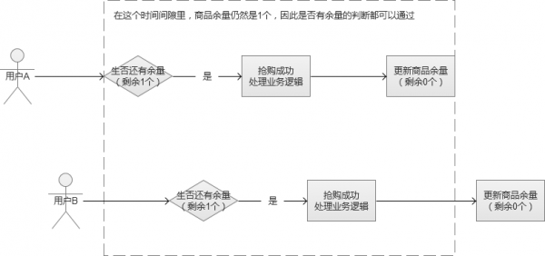](https://static.oschina.net/uploads/img/201511/04140013_NzXS.jpg)

在上面的这个图中，就导致了并发用户B也“抢购成功”，多让一个人获得了商品。这种场景，在高并发的情况下非常容易出现。

## 7.2 悲观锁思路

解决线程安全的思路很多，可以从“悲观锁”的方向开始讨论。

`悲观锁，也就是在修改数据的时候，采用锁定状态，排斥外部请求的修改。遇到加锁的状态，就必须等待。`

[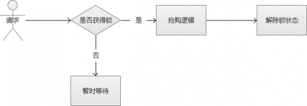](https://static.oschina.net/uploads/img/201511/04140143_hL5k.jpg)

虽然上述的方案的确解决了线程安全的问题，但是，别忘记，`我们的场景是“高并发”。也就是说，会很多这样的修改请求，每个请求都需要等待“锁”，某些线程可能永远都没有机会抢到这个“锁”，这种请求就会死在那里`。同时，这种请求会很多，`瞬间增大系统的平均响应时间，结果是可用连接数被耗尽，系统陷入异常`。

## 7.3 FIFO队列思路

那好，那么我们稍微修改一下上面的场景，`我们直接将请求放入队列中的，采用FIFO（First Input First Output，先进先出），这样的话，我们就不会导致某些请求永远获取不到锁`。看到这里，是不是有点强行将多线程变成单线程的感觉哈。

[](https://static.oschina.net/uploads/img/201511/04140324_dX5o.jpg)

然后，我们现在解决了锁的问题，全部请求采用“先进先出”的队列方式来处理。那么新的问题来了，`高并发的场景下，因为请求很多，很可能一瞬间将队列内存“撑爆”，然后系统又陷入到了异常状态`。或者设计一个极大的内存队列，也是一种方案，但是，系统处理完一个队列内请求的速度根本无法和疯狂涌入队列中的数目相比。也就是说，队列内的请求会越积累越多，最终Web系统平均响应时候还是会大幅下降，系统还是陷入异常。

## 7.4 乐观锁思路

这个时候，我们就可以讨论一下“乐观锁”的思路了。`乐观锁，是相对于“悲观锁”采用更为宽松的加锁机制，大都是采用带版本号（Version）更新。实现就是，这个数据所有请求都有资格去修改，但会获得一个该数据的版本号，只有版本号符合的才能更新成功，其他的返回抢购失败`。这样的话，我们就不需要考虑队列的问题，不过，`它会增大CPU的计算开销`。但是，综合来说，这是一个比较好的解决方案。

[](https://static.oschina.net/uploads/img/201511/04140526_zagx.jpg)

有很多软件和服务都“乐观锁”功能的支持，例如`Redis中的watch就是其中之一`。通过这个实现，我们保证了数据的安全。

# 8 总结

互联网正在高速发展，使用互联网服务的用户越多，高并发的场景也变得越来越多。电商秒杀和抢购，是两个比较典型的互联网高并发场景。虽然我们解决问题的具体技术方案可能千差万别，但是遇到的挑战却是相似的，`因此解决问题的思路也异曲同工`。

来源： <http://my.oschina.net/xianggao/blog/524943?fromerr=5zbm7KH0#OSC_h3_10>