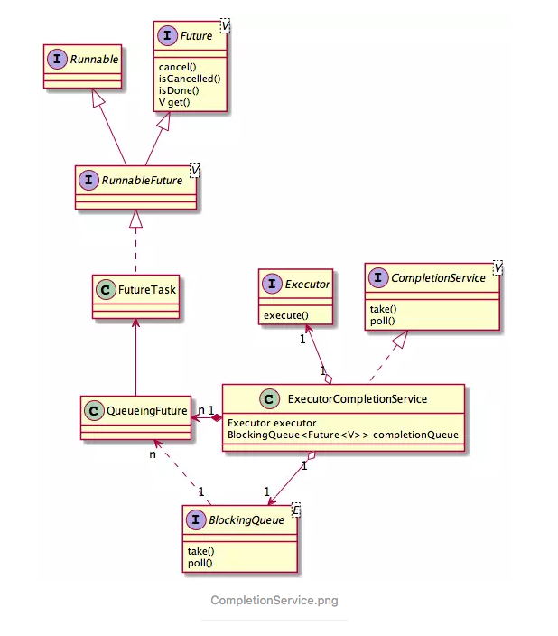

# CompletionService和ExecutorCompletionService详解

0.2352016.05.26 23:32:35字数 843阅读 11,367

------

## 1. CompletionService接口定义了一组任务管理接口:

- submit() - 提交任务
- take() - 获取任务结果
- poll() - 获取任务结果

## 2. ExecutorCompletionService类是CompletionService接口的实现

- ExecutorCompletionService内部管理者一个已完成任务的阻塞队列
- ExecutorCompletionService引用了一个Executor, 用来执行任务
- submit()方法最终会委托给内部的executor去执行任务
- take/poll方法的工作都委托给内部的已`完成任务阻塞队列`
- 如果阻塞队列中有已完成的任务, take方法就返回任务的结果, 否则阻塞等待任务完成
- poll与take方法不同, poll有两个版本:
  - 无参的poll方法 --- 如果完成队列中有数据就返回, 否则返回null
  - 有参数的poll方法 --- 如果完成队列中有数据就直接返回, 否则等待指定的时间, 到时间后如果还是没有数据就返回null
- ExecutorCompletionService主要用与管理异步任务 (有结果的任务, 任务完成后要处理结果)

## 3. ExecutorCompletionService示例和源码解析

关于CompletionService和ExecutorCompletionService的类图如下:



下面是简单的用法:

```dart
package com.example.concurrent;

import java.util.ArrayList;
import java.util.List;
import java.util.Random;
import java.util.concurrent.Callable;
import java.util.concurrent.ExecutionException;
import java.util.concurrent.ExecutorCompletionService;
import java.util.concurrent.ExecutorService;
import java.util.concurrent.Executors;
import java.util.concurrent.Future;

public class Main {

    public static void main(String[] args) throws ExecutionException, InterruptedException {
//        case1();
//        case2();
        case3();
    }


    /**
     * <一>
     * 1. 用List收集任务结果 (List记录每个submit返回的Future)
     * 2. 循环查看结果, Future不一定完成, 如果没有完成, 那么调用get会租塞
     * 3. 如果排在前面的任务没有完成, 那么就会阻塞, 这样后面已经完成的任务就没法获得结果了, 导致了不必要的等待时间.
     *    更为严重的是: 第一个任务如果几个小时或永远完成不了, 而后面的任务几秒钟就完成了, 那么后面的任务的结果都将得不到处理
     *
     * 导致: 已完成的任务可能得不到及时处理
     */
    private static void case1() throws ExecutionException, InterruptedException {
        final Random random = new Random();
        ExecutorService service = Executors.newFixedThreadPool(10);
        List<Future<String>> taskResultHolder = new ArrayList<>();
        for(int i=0; i<50; i++) {
            //搜集任务结果
            taskResultHolder.add(service.submit(new Callable<String>() {
                public String call() throws Exception {
                    Thread.sleep(random.nextInt(5000));
                    return Thread.currentThread().getName();
                }
            }));
        }
        // 处理任务结果
        int count = 0;
        System.out.println("handle result begin");
        for(Future<String> future : taskResultHolder) {
            System.out.println(future.get());
            count++;
        }
        System.out.println("handle result end");
        System.out.println(count + " task done !");

        //关闭线程池
        service.shutdown();
    }

    /**
     * <二> 只对第一种情况进行的改进
     *      1. 查看任务是否完成, 如果完成, 就获取任务的结果, 让后重任务列表中删除任务.
     *      2. 如果任务未完成, 就跳过此任务, 继续查看下一个任务结果.
     *      3. 如果到了任务列表末端, 那么就从新回到任务列表开始, 然后继续从第一步开始执行
     *
     *      这样就可以及时处理已完成任务的结果了
     */
    private static void case2() throws ExecutionException, InterruptedException {
        final Random random = new Random();
        ExecutorService service = Executors.newFixedThreadPool(10);
        List<Future<String>> results = new ArrayList<>();

        for(int i=0; i<50; i++) {
            Callable<String> task = new Callable<String>() {
                public String call() throws Exception {
                    Thread.sleep(random.nextInt(5000)); //模拟耗时操作
                    return Thread.currentThread().getName();
                }
            };
            Future<String> future = service.submit(task);
            results.add(future); // 搜集任务结果
        }

        int count = 0;
        //自旋, 获取结果
        System.out.println("handle result begin");
        for(int i=0; i<results.size(); i++) {
            Future<String> taskHolder = results.get(i);

            if(taskHolder.isDone()) { //任务完成
                String result = taskHolder.get(); //获取结果, 进行某些操作
                System.out.println("result: " + result);
                results.remove(taskHolder);
                i--;

                count++; //完成的任务的计数器
            }

            //回到列表开头, 从新获取结果
            if(i == results.size() - 1) i = -1;
        }
        System.out.println("handle result end");
        System.out.println(count + " task done !");

        //线程池使用完必须关闭
        service.shutdown();
    }


    /**
     * <三> 使用ExecutorCompletionService管理异步任务
     * 1. Java中的ExecutorCompletionService<V>本身有管理任务队列的功能
     *    i. ExecutorCompletionService内部维护列一个队列, 用于管理已完成的任务
     *    ii. 内部还维护列一个Executor, 可以执行任务
     *
     * 2. ExecutorCompletionService内部维护了一个BlockingQueue, 只有完成的任务才被加入到队列中
     *
     * 3. 任务一完成就加入到内置管理队列中, 如果队列中的数据为空时, 调用take()就会阻塞 (等待任务完成)
     *    i. 关于完成任务是如何加入到完成队列中的, 请参考ExecutorCompletionService的内部类QueueingFuture的done()方法
     *
     * 4. ExecutorCompletionService的take/poll方法是对BlockingQueue对应的方法的封装, 关于BlockingQueue的take/poll方法:
     *    i. take()方法, 如果队列中有数据, 就返回数据, 否则就一直阻塞;
     *    ii. poll()方法: 如果有值就返回, 否则返回null
     *    iii. poll(long timeout, TimeUnit unit)方法: 如果有值就返回, 否则等待指定的时间; 如果时间到了如果有值, 就返回值, 否则返回null
     *
     * 解决了已完成任务得不到及时处理的问题
     */
    static void case3() throws InterruptedException, ExecutionException {
        Random random = new Random();

        ExecutorService service = Executors.newFixedThreadPool(10);
        ExecutorCompletionService<String> completionService = new ExecutorCompletionService<String>(service);

        for(int i=0; i<50; i++) {
            completionService.submit(new Callable<String>() {
                @Override
                public String call() throws Exception {
                    Thread.sleep(random.nextInt(5000));
                    return Thread.currentThread().getName();
                }
            });
        }

        int completionTask = 0;
        while(completionTask < 50) {
            //如果完成队列中没有数据, 则阻塞; 否则返回队列中的数据
            Future<String> resultHolder = completionService.take();
            System.out.println("result: " + resultHolder.get());
            completionTask++;
        }

        System.out.println(completionTask + " task done !");

        //ExecutorService使用完一定要关闭 (回收资源, 否则系统资源耗尽! .... 呵呵...)
        service.shutdown();
    }
}
```

那咩, ExecutorCompletionService是如何执行任务, 又是如何将任务的结果存储到完成队列中的呢?

1. ExecutorCompletionService在submit任务时, 会创建一个QueueingFuture, 然后将创建的QueueingFuture丢给executor, 让executor完成任务的执行工作
2. QueueingFuture继承与FutureTask类, 而FutureTask实现了两个接口Runnable和Future.

- Runnable一般表示要执行的任务的过程, 而Future则表述执行任务的 结果 (或者说是任务的一个句柄, 可获取结果, 取消任务等).
- 因此FutureTask就是一个有结果可期待的任务. FutureTask实现了run方法, 我们指定此方法一般是在在工作线程(不是submit线程) 执行的, 可以看看源码:


```csharp
public void run() {
      if (state != NEW ||
          !UNSAFE.compareAndSwapObject(this, runnerOffset,
                                       null, Thread.currentThread()))
          return;
      try {
          Callable<V> c = callable;
          if (c != null && state == NEW) {
              V result;
              boolean ran;
              try {
                  result = c.call();
                  ran = true;
              } catch (Throwable ex) {
                  result = null;
                  ran = false;
                  setException(ex);
              }
              if (ran)
                  set(result);
          }
      } finally {
          // runner must be non-null until state is settled to
          // prevent concurrent calls to run()
          runner = null;
          // state must be re-read after nulling runner to prevent
          // leaked interrupts
          int s = state;
          if (s >= INTERRUPTING)
              handlePossibleCancellationInterrupt(s);
      }
  }
```

- FutureTask构造的时候需要一个Callable<V>参数, Callable表示一个任务的执行过程, 在run方法中恰好调用了Callable.call(), 也就是任务工作在工作线程中执行.
- 那么任务执行完了会返回结果, 这个结果是要在submit线程(就是提交任务的线程)中使用的, 那么如何让submit线程可以反问到呢? 答案也是在FutureTask类中, 我们可以看到run方法中执行任务(Callable.call())获取结果后, 会掉用一个set()方法, set方法源码如下:

```kotlin
protected void set(V v) {
      if (UNSAFE.compareAndSwapInt(this, stateOffset, NEW, COMPLETING)) {
          outcome = v;
          UNSAFE.putOrderedInt(this, stateOffset, NORMAL); // final state
          finishCompletion();
      }
  }
```

- set() 将获取的结果存储到FuturnTask的一个outcome字段中, 这个过程是同步的, 所以其他线程稍后访问是可以读取到值的
- ExecutorCompletionService中的完成队列中正好存储的是FuturnTask的子类, 当然可以调用FutureTask的get方法, FutureTask的get方法就是获取outcome值 (get()方法中调用了report()方法, report中返回了outcome字段).
- FuturnTask中委托的任务执行完成后, 会掉一个done()方法, 这个方法是个空方法, 而其子类QueueingFuture重写了此方法, 如下:

```csharp
protected void done() { 
    completionQueue.add(task); 
}
```

**正式在此方法中把执行完的任务放置到完成队列中的!!**

然后我们就可以在submit线程中从完成队列中取出任务句柄, 获取任务结果了!!!

至此, ExecutorCompletionService原理已经解析完毕 !!

欲知后事如何, 切听下回分解 !!
==> [Future/FutureTask源码分析](https://www.jianshu.com/p/50c03b1226fe)