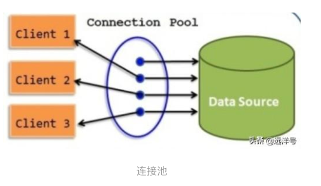
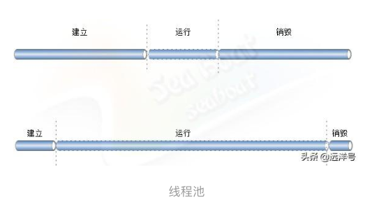
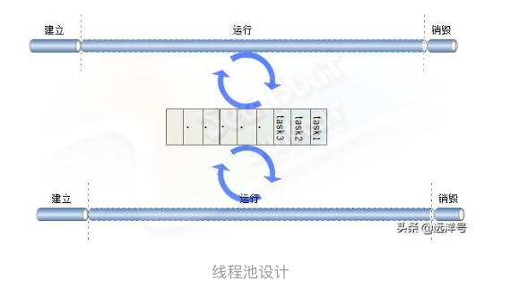

[TOC]


# 线程池实现原理

原创超人汪小建(seaboat) 最后发布于2016-05-15 09:01:40 阅读数 6235  收藏
展开

## 关于池

“池”技术对我们来说是非常熟悉的一个概念,它的引入是为了在某些场景下提高系统某些关键节点性能。最典型的例子就是数据库连接池,JDBC是一种服务供应接口(SP),具体的数据库连接实现类由不同厂商实现。数据库连接的建立和销毁都是很耗时耗资源的操作。为了查询数据库中某条记录,最原始的过程是建立连接、发送查询语句、返回査询结果、销毀连接。假如仅仅只是一个很简单的查询语句,那么建立连接与销毀连接两个步骤可能就已经占用了大部分耗时,这样显然效率是十分低下的。     

那么我们能否通过某些手段来提高效率呢?可行的方案是尽可能减少创建和销毀连接操作。因为连接相对于查询是无状态的,不必每次查询都重新生成销毁。我们可以把这些通道维护起来供下一次查询使用,维护这些管道的工作就交给了“池”。



##  线程池

线程池也是类似于数据库连接池的一种池,而仅仅是把池里的对象换成了线程。线程是为多任务而引入的概念,每个线程在任意时刻执行一个任务。假如多个任务要并发执行则要用到多线程技术。每个线程都有自己的生命周期,以创建为始销毀为末。如下图,两个线程运行阶段占整个生命周期的比重不同,运行阶段所占比重小的线程可以认为其运行效率低,反观下面一条线程则认为运行效率高。在大多数场景下都七较符合图上面的线程运行模式,例如我们常见的web服务、数据库服务等等。为了提高运行效率引入线程池,它的核心思想就是把运行阶段尽量拉长,对于每个任务的到来不是重复建立销毀线程,而是重复利用之前建立好的线程执行任务。



## 线程池设计

其中一种方案是在系统启动时建立好一定数量的线程并做好线程维护工作,一旦有任务到来即从线程池中取出一条空闲的线程执行任务。原理听起来比较清晰,但现实中对于一条线程,一旦调用 start方法后就将运行任务直到任务完成,随后JVM将对线程对象进行GC回收。如此一来线程不就销毁了吗?是的,所以需要换种思维角度,让这些线程启动后通过一个无限循环来执行指定的任务,下面将重点讲解如何实现线程池。

个线程池的属性起码包含初始化线程数量、线程数组、任务队列。初始化线程数量指线程池初始化的线程数,线程数组保存了线程池中所有线程,任务队列指添加到线程池等待处理的所有任务。如下图,线程池里有两条线程,池里线程的工作就是不断循环检测任务队列中是否有需要执行的任务,如果有则处理并移出任务队列。于是可以说线程池中的所有线程的任务就是不断检测任务队列并不断执行队列中的任务。



## 实现例子

下面我们实现一个最简单粗糙的线程池,使用线程池是只需实例化一个对象。构造函数会创建相应数量的线程并启动线程,启动的线程无限循环检测任务队列。而执行方法execute()仅仅把任务添加到任务队列中。有一点需要注意的是所有任务都必须实现Runnable接口,这是线程池的任务队列与工作线程的约定。JDK并发中如此规定,工作线程检测任务队列并调用队列的run()方法。假如我们重新写一个线程池是完全可以自己定义ー个不一样的任务接口的。

当然,一个完善的线程池需要提供启动、销毁、增加工作线程的策略、最大工作线程数、各种状态的获取等等操作,而且工作线程也不可能老是做无用循环,需要对任务队列使用wait、 notify优化或任务队列改用阻塞队列。

```java
import java.util.LinkedList;
import java.util.List;

public final class ThreadPool {
    private final int worker_num;
    private WorkerThread[] workerThrads;
    private List<Runnable> taskQueue = new LinkedList<Runnable>();
    private static ThreadPool threadPool;


    public ThreadPool(int worker_num) {
        this.worker_num = worker_num;
        workerThrads = new WorkerThread[worker_num];
        for (int i = 0; i < worker_num; i++) {
            workerThrads[i] = new WorkerThread();
            workerThrads[i].start();
        }
    }

    public void execute(Runnable task) {
        synchronized (taskQueue) {
            taskQueue.add(task);
        }
    }


    private class WorkerThread extends Thread {
        public void run() {
            Runnable r = null;
            while (true) {
                synchronized (taskQueue) {
                    if (!taskQueue.isEmpty()) {
                        r = taskQueue.remove(0);
                        r.run();
                    }
                }
            }
        }
    }
}
```


## 总结

本节清楚讲解了线程池原理,但并不提倡重造轮子行为。因为线程池处理不好很容易产生死锁问题,同时线程池内状态同步操作不当也可能导致意想不到的问题。除此之外还有很多其他的并发问题,除非是很有经验的并发程序员,否则很可能产生各种问题。我们实际做应用开发时,优先直接使用JDK提供的线程池,它为我们提供了多种不同的线程池,实际开发中根据需求选择合适的线程池

  


https://learning.snssdk.com/feoffline/toutiao_wallet_bundles/toutiao_learning_wap/online/article.html?item_id=6770456984874385931&app_name=news_article