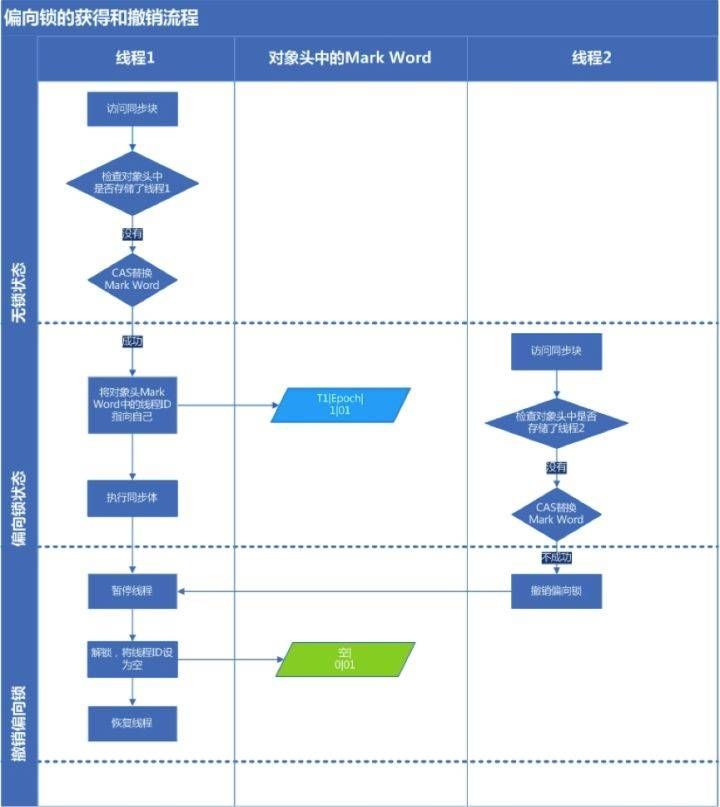

[TOC]


# java 8 并发篇 - 冷静分析 Synchronized（上）

## 1.Java的锁

### 1.1 锁的内存语义

- 锁可以让临界区互斥执行，还可以让释放锁的线程向同一个锁的线程发送消息
- 锁的释放要遵循Happens-before原则（`锁规则：解锁必然发生在随后的加锁之前`）
- 锁在Java中的具体表现是 `Synchronized` 和 `Lock`

### 1.2 锁的释放

> **线程A释放锁后，会将共享变更操作刷新到主内存中**


### 1.3 锁的获取

> **线程B获取锁时，JMM会将该线程的本地内存置为无效，被监视器保护的临界区代码必须从主内存中读取共享变量**


### 1.4 锁的释放与获取

- 锁获取与volatile读有相同的内存语义，读者可参见笔者的 [并发番@Java内存模型&Volatile一文通（1.7版）](https://link.juejin.im/?target=https%3A%2F%2Flink.zhihu.com%2F%3Ftarget%3Dhttps%253A%2F%2Fwww.zybuluo.com%2FkiraSally%2Fnote%2F850631)
- 线程A释放一个锁，实质是线程A告知下一个获取到该锁的某个线程其已变更该共享变量
- 线程B获取一个锁，实质是线程B得到了线程A告知其(在释放锁之前)变更共享变量的消息
- 线程A释放锁，随后线程B竞争到该锁，实质是线程A通过主内存向线程B发消息告知其变更了共享变量

## 2.Synchronized的综述

- **同步机制：** synchronized是Java同步机制的一种实现，即互斥锁机制，它所获得的锁叫做互斥锁
- **互斥锁：** 指的是每个对象的锁一次只能分配给一个线程，同一时间只能由一个线程占用
- **作用：** synchronized用于保证同一时刻只能由一个线程进入到临界区，同时保证共享变量的可见性、原子性和有序性
- **使用：** 当一个线程试图访问同步代码方法(块)时，它首先必须得到锁，退出或抛出异常时必须释放锁

## 3.Synchronized的使用

### 3.1 Synchronized的三种应用方式


> **补充：** 使用同步代码块的好处在于其他线程仍可以访问非synchronized(this)的同步代码块

### 3.2 Synchronized的使用规则

```java
/**
  * 先定义一个测试模板类
  *     这里补充一个知识点：Thread.sleep(long)不会释放锁
  *     读者可参见笔者的`并发番@Thread一文通`
  */ 
public class SynchronizedDemo {
    public static synchronized void staticMethod(){
        System.out.println(Thread.currentThread().getName() + "访问了静态同步方法staticMethod");
        try {
            Thread.sleep(1000);
        } catch (InterruptedException e) {
            e.printStackTrace();
        }
        System.out.println(Thread.currentThread().getName() + "结束访问静态同步方法staticMethod");
    }
    public static void staticMethod2(){
        System.out.println(Thread.currentThread().getName() + "访问了静态同步方法staticMethod2");
        synchronized (SynchronizedDemo.class){
            System.out.println(Thread.currentThread().getName() + "在staticMethod2方法中获取了SynchronizedDemo.class");
            try {
                Thread.sleep(1000);
            } catch (InterruptedException e) {
                e.printStackTrace();
            }
        }
    }
    public synchronized void synMethod(){
        System.out.println(Thread.currentThread().getName() + "访问了同步方法synMethod");
        try {
            Thread.sleep(1000);
        } catch (InterruptedException e) {
            e.printStackTrace();
        }
        System.out.println(Thread.currentThread().getName() + "结束访问同步方法synMethod");
    }
    public synchronized void synMethod2(){
        System.out.println(Thread.currentThread().getName() + "访问了同步方法synMethod2");
        try {
            Thread.sleep(1000);
        } catch (InterruptedException e) {
            e.printStackTrace();
        }
        System.out.println(Thread.currentThread().getName() + "结束访问同步方法synMethod2");
    }
    public void method(){
        System.out.println(Thread.currentThread().getName() + "访问了普通方法method");
        try {
            Thread.sleep(1000);
        } catch (InterruptedException e) {
            e.printStackTrace();
        }
        System.out.println(Thread.currentThread().getName() + "结束访问普通方法method");
    }
    private Object lock = new Object();
    public void chunkMethod(){
        System.out.println(Thread.currentThread().getName() + "访问了chunkMethod方法");
        synchronized (lock){
            System.out.println(Thread.currentThread().getName() + "在chunkMethod方法中获取了lock");
            try {
                Thread.sleep(1000);
            } catch (InterruptedException e) {
                e.printStackTrace();
            }
        }
    }
    public void chunkMethod2(){
        System.out.println(Thread.currentThread().getName() + "访问了chunkMethod2方法");
        synchronized (lock){
            System.out.println(Thread.currentThread().getName() + "在chunkMethod2方法中获取了lock");
            try {
                Thread.sleep(1000);
            } catch (InterruptedException e) {
                e.printStackTrace();
            }
        }
    }
    public void chunkMethod3(){
        System.out.println(Thread.currentThread().getName() + "访问了chunkMethod3方法");
        //同步代码块
        synchronized (this){
            System.out.println(Thread.currentThread().getName() + "在chunkMethod3方法中获取了this");
            try {
                Thread.sleep(1000);
            } catch (InterruptedException e) {
                e.printStackTrace();
            }
        }
    }
    public void stringMethod(String lock){
        synchronized (lock){
            while (true){
                System.out.println(Thread.currentThread().getName());
                try {
                    Thread.sleep(1000);
                } catch (InterruptedException e) {
                    e.printStackTrace();
                }
            }
        }
    }
} 
```

#### 3.2.1 普通方法与同步方法调用互不关联

> **当一个线程进入同步方法时，其他线程可以正常访问其他非同步方法**

```
public static void main(String[] args) {
    SynchronizedDemo synDemo = new SynchronizedDemo();
    Thread thread1 = new Thread(() -> {
        //调用普通方法
        synDemo.method();
    });
    Thread thread2 = new Thread(() -> {
        //调用同步方法
        synDemo.synMethod();
    });
    thread1.start();
    thread2.start();
}
---------------------
//输出：
Thread-1访问了同步方法synMethod
Thread-0访问了普通方法method
Thread-0结束访问普通方法method
Thread-1结束访问同步方法synMethod
//分析：通过结果可知，普通方法和同步方法是非阻塞执行的 
```

#### 3.2.2 所有同步方法只能被一个线程访问

> **当一个线程执行同步方法时，其他线程不能访问任何同步方法**

```
public static void main(String[] args) {
    SynchronizedDemo synDemo = new SynchronizedDemo();
    Thread thread1 = new Thread(() -> {
        synDemo.synMethod();
        synDemo.synMethod2();
    });
    Thread thread2 = new Thread(() -> {
        synDemo.synMethod2();
        synDemo.synMethod();
    });
    thread1.start();
    thread2.start();
}
---------------------
//输出：
Thread-0访问了同步方法synMethod
Thread-0结束访问同步方法synMethod
Thread-0访问了同步方法synMethod2
Thread-0结束访问同步方法synMethod2
Thread-1访问了同步方法synMethod2
Thread-1结束访问同步方法synMethod2
Thread-1访问了同步方法synMethod
Thread-1结束访问同步方法synMethod
//分析：通过结果可知，任务的执行是阻塞的，显然Thread-1必须等待Thread-0执行完毕之后才能继续执行

```

#### 3.2.3 同一个锁的同步代码块同一时刻只能被一个线程访问

> **当同步代码块都是同一个锁时，方法可以被所有线程访问，但同一个锁的同步代码块同一时刻只能被一个线程访问**

```
public static void main(String[] args) {
    SynchronizedDemo synDemo = new SynchronizedDemo();
    Thread thread1 = new Thread(() -> {
        //调用同步块方法
        synDemo.chunkMethod();
        synDemo.chunkMethod2();
    });
    Thread thread2 = new Thread(() -> {
        //调用同步块方法
        synDemo.chunkMethod();
        synDemo.synMethod2();
    });
    thread1.start();
    thread2.start();
}
---------------------
//输出：
Thread-0访问了chunkMethod方法
Thread-1访问了chunkMethod方法
Thread-0在chunkMethod方法中获取了lock  
...停顿等待...
Thread-1在chunkMethod方法中获取了lock
...停顿等待...
Thread-0访问了chunkMethod2方法
Thread-0在chunkMethod2方法中获取了lock
...停顿等待...
Thread-1访问了chunkMethod2方法
Thread-1在chunkMethod2方法中获取了lock
//分析可知：
//1.对比18行和19行可知，即使普通方法有同步代码块，但方法的访问是非阻塞的，任何线程都可以自由进入
//2.对比20行、22行以及25行和27行可知，对于同一个锁的同步代码块的访问一定是阻塞的

```


#### 3.2.4 线程间同时访问同一个锁的多个同步代码的执行顺序不定

- 线程间同时访问同一个锁多个同步代码的执行顺序不定，即使是使用同一个对象锁，这点跟同步方法有很大差异
- ？？读者可以先思考为什么会出现这样的问题？？

```
public static void main(String[] args) {
    SynchronizedDemo synDemo = new SynchronizedDemo();
    Thread thread1 = new Thread(() -> {
        //调用同步块方法
        synDemo.chunkMethod();
        synDemo.chunkMethod2();
    });
    Thread thread2 = new Thread(() -> {
        //调用同步块方法
        synDemo.chunkMethod2();
        synDemo.chunkMethod();
    });
    thread1.start();
    thread2.start();
}
---------------------
//输出：
Thread-0访问了chunkMethod方法
Thread-1访问了chunkMethod2方法
Thread-0在chunkMethod方法中获取了lock
...停顿等待...
Thread-0访问了chunkMethod2方法
Thread-1在chunkMethod2方法中获取了lock
...停顿等待...
Thread-1访问了chunkMethod方法
Thread-0在chunkMethod2方法中获取了lock
...停顿等待...
Thread-1在chunkMethod方法中获取了lock

//分析可知：
//现象：对比20行、22行和24行、25行可知，虽然是同一个lock对象，但其不同代码块的访问是非阻塞的
//原因：根源在于锁的释放和重新竞争，当Thread-0访问完chunkMethod方法后会先释放锁，这时Thread-1就有机会能获取到锁从而优先执行，依次类推到24行、25行时，Thread-0又重新获取到锁优先执行了
//注意：但有一点是必须的，对于同一个锁的同步代码块的访问一定是阻塞的
//补充：同步方法之所有会被全部阻塞，是因为synDemo对象一直被线程在内部把持住就没释放过，论把持住的重要性！

```

#### 3.2.5 不同锁之间访问非阻塞

- 由于三种使用方式的锁对象都不一样，因此相互之间不会有任何影响

- 但有两种情况除外：

- - 1.当同步代码块使用的Class对象和类对象一致时属于同一个锁，遵循上面的`3.2.3`原则
  - 2.当同步代码块使用的是this，即与同步方法使用锁属于同一个锁，遵循上面的`3.2.2`和`3.2.3`原则

```
public static void main(String[] args) {
    SynchronizedDemo synDemo = new SynchronizedDemo();
    Thread thread1 = new Thread(() -> synDemo.chunkMethod() );
    Thread thread2 = new Thread(() -> synDemo.chunkMethod3());
    Thread thread3 = new Thread(() -> staticMethod());
    Thread thread4 = new Thread(() -> staticMethod2());
    thread1.start();
    thread2.start();
    thread3.start();
    thread4.start();
}
---------------------
//输出：
Thread-1访问了chunkMethod3方法
Thread-1在chunkMethod3方法中获取了this
Thread-2访问了静态同步方法staticMethod
Thread-0访问了chunkMethod方法
Thread-0在chunkMethod方法中获取了lock
Thread-3访问了静态同步方法staticMethod2
...停顿等待...
Thread-2结束访问静态同步方法staticMethod
Thread-3在staticMethod2方法中获取了SynchronizedDemo.class
//分析可知：
//现象：对比16行、18行和24行、25行可知，虽然是同一个lock对象，但其不同代码块的访问是非阻塞的
//原因：根源在于锁的释放和重新竞争，当Thread-0访问完chunkMethod方法后会先释放锁，这时Thread-1就有机会能获取到锁从而优先执行，依次类推到24行、25行时，Thread-0又重新获取到锁优先执行了

```

### 3.3 Synchronized的可重入性

- **重入锁：**当一个线程再次请求自己持有对象锁的临界资源时，这种情况属于重入锁，请求将会成功
- **实现：**一个线程得到一个对象锁后再次请求该对象锁，是允许的，每重入一次，monitor进入次数+1

```
public static void main(String[] args) {
    SynchronizedDemo synDemo = new SynchronizedDemo();
    Thread thread1 = new Thread(() -> {
        synDemo.synMethod();
        synDemo.synMethod2();
    });
    Thread thread2 = new Thread(() -> {
        synDemo.synMethod2();
        synDemo.synMethod();
    });
    thread1.start();
    thread2.start();
}
---------------------
//输出：
Thread-0访问了同步方法synMethod
Thread-0结束访问同步方法synMethod
Thread-0访问了同步方法synMethod2
Thread-0结束访问同步方法synMethod2
Thread-1访问了同步方法synMethod2
Thread-1结束访问同步方法synMethod2
Thread-1访问了同步方法synMethod
Thread-1结束访问同步方法synMethod
//分析：对比16行和18行可知，在代码块中继续调用了当前实例对象的另外一个同步方法，再次请求当前实例锁时，将被允许，进而执行方法体代码，这就是重入锁最直接的体现

```

### 3.4 Synchronized与String锁

- **隐患：**由于在JVM中具有String常量池缓存的功能，因此**相同字面量是同一个锁！！！**
- **注意：**严重不推荐将String作为锁对象，而应该改用其他非缓存对象
- **提示：**对字面量有疑问的话请先回顾一下String的基础，这里不加以解释

```
public static void main(String[] args) {
    SynchronizedDemo synDemo = new SynchronizedDemo();
    Thread thread1 = new Thread(() -> synDemo.stringMethod("sally"));
    Thread thread2 = new Thread(() -> synDemo.stringMethod("sally"));
    thread1.start();
    thread2.start();
}
---------------------
//输出：
Thread-0
Thread-0
Thread-0
Thread-0
...死循环...
//分析：输出结果永远都是Thread-0的死循环，也就是说另一个线程，即Thread-1线程根本不会运行
//原因：同步块中的锁是同一个字面量

```

### 3.5 Synchronized与不可变锁

- **隐患：**当使用不可变类对象(final Class)作为对象锁时，使用synchronized同样会有并发问题
- **原因：**由于不可变特性，当作为锁但同步块内部仍然有计算操作，会生成一个新的锁对象
- **注意：**严重不推荐将final Class作为锁对象时仍对其有计算操作
- **补充：**虽然String也是final Class，但它的原因却是字面量常量池

```
public class SynchronizedDemo {
    static Integer i = 0;   //Integer是final Class
    public static void main(String[] args) throws InterruptedException {
        Runnable runnable = new Runnable() {
            @Override
            public void run() {
                for (int j = 0;j<10000;j++){
                    synchronized (i){
                        i++;
                    }
                }
            }
        };
        Thread thread1 = new Thread(runnable);
        Thread thread2 = new Thread(runnable);
        thread1.start();
        thread2.start();
        thread1.join();
        thread2.join();
        System.out.println(i);
    }
}
---------------------
//输出：
14134
//分析：跟预想中的20000不一致，当使用Integer作为对象锁时但还有计算操作就会出现并发问题

```

我们通过反编译发现执行i++操作相当于执行了i = Integer.valueOf(i.intValue()+1)


通过查看Integer的valueOf方法实现可知，其每次都new了一个新的Integer对象，锁变了有木有！！！

```
public static Integer valueOf(int i) {
    if (i >= IntegerCache.low && i <= IntegerCache.high)
        return IntegerCache.cache[i + (-IntegerCache.low)];
    return new Integer(i);  //每次都new一个新的锁有木有！！！
}

```

### 3.6 Synchronized与死锁

- **死锁：**当线程间需要**相互等待对方已持有的锁**时，就形成死锁，进而产生死循环
- **注意：** **代码中严禁出现死锁！！！**

```
public static void main(String[] args) {
    Object lock = new Object();
    Object lock2 = new Object();
    Thread thread1 = new Thread(() -> {
        synchronized (lock){
            System.out.println(Thread.currentThread().getName() + "获取到lock锁");
            try {
                Thread.sleep(2000);
            } catch (InterruptedException e) {
                e.printStackTrace();
            }
            synchronized (lock2){
                System.out.println(Thread.currentThread().getName() + "获取到lock2锁");
            }
        }
    });
    Thread thread2 = new Thread(() -> {
        synchronized (lock2){
            System.out.println(Thread.currentThread().getName() + "获取到lock2锁");
            try {
                Thread.sleep(2000);
            } catch (InterruptedException e) {
                e.printStackTrace();
            }
            synchronized (lock){
                System.out.println(Thread.currentThread().getName() + "获取到lock锁");
            }
        }
    });
    thread1.start();
    thread2.start();
}
---------------------
//输出：
Thread-1获取到lock2锁
Thread-0获取到lock锁
.....
//分析：线程0获得lock锁，线程1获得lock2锁，但之后由于两个线程还要获取对方已持有的锁，但已持有的锁都不会被双方释放，线程"假死"，无法往下执行，从而形成死循环，即死锁，之后一直在做无用的死循环，严重浪费系统资源

```

我们用 **jstack** 查看一下这个任务的各个线程运行情况，可以发现两个线程都被阻塞 BLOCKED


我们很明显的发现，Java-level=deadlock，即死锁，两个线程相互等待对方的锁


> **Synchronized一文通(1.8版)** **由** **黄志鹏kira** **创作，采用** **知识共享 署名-非商业性使用 4.0 国际 许可协议进行许可。**

 


## 4.Synchronized实现原理

### 4.1 Synchronization

> Synchronization in the Java Virtual Machine is implemented by monitor entry and exit, either explicitly (by use of the monitorenter and monitorexit instructions) or implicitly (by the method invocation and return instructions). 
> For code written in the Java programming language, perhaps the most common form of synchronization is the synchronized method. A synchronized method is not normally implemented using monitorenter and monitorexit. Rather, it is simply distinguished in the run-time constant pool by the ACC_SYNCHRONIZED flag, which is checked by the method invocation instructions (§2.11.10).

- 本段摘自 [The Java® Virtual Machine Specification 3.14. Synchronization](https://link.juejin.im?target=https%3A%2F%2Flink.zhihu.com%2F%3Ftarget%3Dhttps%253A%2F%2Fjuejin.im%2Fentry%2F59424ba68d6d810058c50fc9)
- 在JVM中，同步的实现是通过监视器锁的进入和退出实现的，要么显示得通过monitorenter 和 monitorexit指令实现，要么隐示地通过方法调用和返回指令实现
- 对于Java代码来说，或许最常用的同步实现就是同步方法。其中同步代码块是通过使用 monitorenter 和 monitorexit 实现的，而同步方法却是使用 ACC_SYNCHRONIZED 标记符隐示的实现，原理是通过方法调用指令检查该方法在常量池中是否包含 ACC_SYNCHRONIZED 标记符
- 本篇不会针对Synchronized的字节码实现进行分析，只是点到为止，有兴趣的读者可参见 [JVM源码分析之synchronized实现](https://link.juejin.im?target=https%3A%2F%2Flink.zhihu.com%2F%3Ftarget%3Dhttp%253A%2F%2Fwww.jianshu.com%2Fp%2Fc5058b6fe8e5) （当然，若有机会开JVM番的话，笔者会重新分析的）

### 4.2 反编译

#### 4.2.1 预准备

> 为了能直观了解Synchronized的工作原理，我们通过反编译SynchronizedDeme类的class文件的方式看看都发生了什么

```
package concurrent;
public class SynchronizedDemo {
    public static synchronized void staticMethod() throws InterruptedException {
        System.out.println("静态同步方法开始");
        Thread.sleep(1000);
        System.out.println("静态同步方法结束");
    }
    public synchronized void method() throws InterruptedException {
        System.out.println("实例同步方法开始");
        Thread.sleep(1000);
        System.out.println("实例同步方法结束");
    }
    public synchronized void method2() throws InterruptedException {
        System.out.println("实例同步方法2开始");
        Thread.sleep(3000);
        System.out.println("实例同步方法2结束");
    }
    public static void main(String[] args) {
        final SynchronizedDemo synDemo = new SynchronizedDemo();
        Thread thread1 = new Thread(() -> {
            try {
               synDemo.method();
            } catch (InterruptedException e) {
                e.printStackTrace();
            }
        });
        Thread thread2 = new Thread(() -> {
            try {
                synDemo.method2();
            } catch (InterruptedException e) {
                e.printStackTrace();
            }
        });
        thread1.start();
        thread2.start();
    }
}

```

#### 4.2.1 生成.class文件

```
javac SynchronizedDemo.java 
```

> 注意：由于笔者OS的默认编码方式是UTF-8，因此可能出现以下错误


解决方案如下：只要通过 **-encoding** 指定指明编码方式即可

```
javac -encoding UTF-8 SynchronizedDemo.java 

```

最终我们将得到一个 **.class** 文件，即 **SynchronizedDemo.class**

#### 4.2.2 javap反编译

```
javap -v SynchronizedDemo 

```

通过反编译我们会得到常量池、同步方法、同步代码块的不同编译结果，之后我们将基于这三个进行介绍

**常量池图示**


常量池除了会包含基本类型和字符串及数组的常量值外，还包含以文本形式出现的符号引用：  

- 类和接口的全限定名
- 字段的名称和描述符
- 方法和名称和描述符

**同步方法图示**


同步方法会包含一个ACC_SYNCHCRONIZED标记符

**同步代码块图示**


同步代码块会在代码中插入 monitorenter 和 monitorexist 指令

### 4.3 同步代码块同步原理

#### 4.3.1 monitor监视器

- 每个对象都有一个监视器，在同步代码块中，JVM通过monitorenter和monitorexist指令实现同步锁的获取和释放功能
- 当一个线程获取同步锁时，即是通过获取monitor监视器进而等价为获取到锁
- monitor的实现类似于操作系统中的管程

#### 4.3.2 monitorenter指令

> Each object is associated with a monitor. A monitor is locked if and only if it has an owner. The thread that executes monitorenter attempts to gain ownership of the monitor associated with objectref, as follows: 
> • If the entry count of the monitor associated with objectref is zero, the thread enters the monitor and sets its entry count to one. The thread is then the owner of the monitor. 
> • If the thread already owns the monitor associated with objectref, it reenters the monitor, incrementing its entry count. 
> • If another thread already owns the monitor associated with objectref, the thread blocks until the monitor's entry count is zero, then tries again to gain ownership.

- 每个对象都有一个监视器。当该监视器被占用时即是锁定状态(或者说获取监视器即是获得同步锁)。线程执行monitorenter指令时会尝试获取监视器的所有权，过程如下：  
- 若该监视器的进入次数为0，则该线程进入监视器并将进入次数设置为1，此时该线程即为该监视器的所有者
- 若线程已经占有该监视器并重入，则进入次数+1
- 若其他线程已经占有该监视器，则线程会被阻塞直到监视器的进入次数为0，之后线程间会竞争获取该监视器的所有权
- 只有首先获得锁的线程才能允许继续获取多个锁

#### 4.3.3 monitorexit指令

> The thread that executes monitorexit must be the owner of the monitor associated with the instance referenced by objectref. 
> The thread decrements the entry count of the monitor associated with objectref. If as a result the value of the entry count is zero, the thread exits the monitor and is no longer its owner. Other threads that are blocking to enter the monitor are allowed to attempt to do so.

- 执行monitorexit指令将遵循以下步骤：  
- 执行monitorexit指令的线程必须是对象实例所对应的监视器的所有者
- 指令执行时，线程会先将进入次数-1，若-1之后进入次数变成0，则线程退出监视器(即释放锁)
- 其他阻塞在该监视器的线程可以重新竞争该监视器的所有权

#### 4.3.4 实现原理

- 在同步代码块中，JVM通过monitorenter和monitorexist指令实现同步锁的获取和释放功能
- monitorenter指令是在编译后插入到同步代码块的开始位置
- monitorexit指令是插入到方法结束处和异常处
- JVM要保证每个monitorenter必须有对应的monitorexit与之配对
- 任何对象都有一个monitor与之关联，当且一个monitor被持有后，它将处于锁定状态
- 线程执行monitorenter指令时，将会尝试获取对象所对应的monitor的所有权，即尝试获得对象的锁
- 线程执行monitorexit指令时，将会将进入次数-1直到变成0时释放监视器
- 同一时刻只有一个线程能够成功，其它失败的线程会被阻塞，并放入到同步队列中，进入BLOCKED状态

#### 4.3.4 补充

- 关于objectref可参见 锁的使用方式
- 由于 wait/notify 等方法底层实现是基于监视器，因此只有在同步方法(块)中才能调用wait/notify等方法，否则会抛出 **java.lang.IllegalMonitorStateException** 的异常的原因

### 4.4 同步方法同步原理

- 区别于同步代码块的监视器实现，同步方法通过使用 ACC_SYNCHRONIZED 标记符隐示的实现
- 原理是通过方法调用指令检查该方法在常量池中是否包含 ACC_SYNCHRONIZED 标记符，如果有，JVM 要求线程在调用之前请求锁

## 5.进阶原理

### 5.1 Monitor Obejct模式

#### 5.1.1 Monitor Obejct模式综述

- Monitor其实是一种同步工具，也可以说是一种同步机制，它通常被描述为一个对象，主要特点是互斥和信号机制
- **互斥：** 一个Monitor锁在同一时刻只能被一个线程占用，其他线程无法占用
- **信号机制(signal)：** 占用Monitor锁失败的线程会暂时放弃竞争并等待某个谓词成真（条件变量），但该条件成立后，当前线程会通过释放锁通知正在等待这个条件变量的其他线程，让其可以重新竞争锁

**Mesa派的signal机制**

- Mesa派的signal机制又称"Non-Blocking condition variable"
- 占有Monitor锁的线程发出释放通知时，不会立即失去锁，而是让其他线程等待在队列中，重新竞争锁
- 这种机制里，等待者拿到锁后不能确定在这个时间差里是否有别的等待者进入过Monitor，因此不能保证谓词一定为真，所以对条件的判断必须使用while
- Java中采用就是Mesa派的singal机制，即所谓的notify 

#### 5.1.2 Monitor Obejct模式结构

**在 Monitor Object 模式中，主要有四种类型的参与者：**


#### 5.1.3 Monitor Obejct模式协作过程

**1.同步方法的调用和串行化：** 

- 当客户线程调用监视者对象的同步方法时，必须首先获取它的监视锁
- 只要该监视者对象有其他同步方法正在被执行，获取操作便不会成功
- 当监视者对象已被线程占用时(即同步方法正被执行)，客户线程将被阻塞直到它获取监视锁
- 当客户线程成功获取监视锁后，进入临界区，执行方法实现的服务
- 一旦同步方法完成执行，监视锁会被自动释放，目的是使其他客户线程有机会调用执行该监视者对象的同步方法

**2.同步方法线程挂起：**如果调用同步方法的客户线程必须被阻塞或是有其他原因不能立刻进行，它能够在一个监视条件(Monitor Condition)上等待，这将导致该客户线程暂时释放监视锁，并被挂起在监视条件上

**3.监视条件通知：**一个客户线程能够通知一个监视条件，目的是通知阻塞在该监视条件(该监视锁)的线程恢复运行

**4.同步方法线程恢复：** 

- 一旦一个早先被挂起在监视条件上的同步方法线程获取通知，它将继续在最初的等待监视条件的点上执行
- 在被通知线程被允许恢复执行同步方法之前，监视锁将自动被获取(线程间自动相互竞争锁)

对于Monitor笔者将在 ReentractLock 一文中进一步阐述

### 5.2 对象头

#### 5.2.1 JVM内存中的对象

- 在JVM中，对象在内存中的布局分成三块区域：对象头、示例数据和对齐填充
- **对象头：** 对象头主要存储对象的hashCode、锁信息、类型指针、数组长度(若是数组的话)等信息
- **示例数据：**存放类的属性数据信息，包括父类的属性信息，如果是数组的实例部分还包括数组长度，这部分内存按4字节对齐
- **填充数据：**由于JVM要求对象起始地址必须是8字节的整数倍，当不满足8字节时会自动填充（因此填充数据并不是必须的，仅仅是为了字节对齐）

#### 5.2.2 对象头综述


- synchcronized的锁是存放在Java对象头中的
- 如果对象是数组类型，JVM用3个子宽(Word)存储对象头，否则是用2个子宽
- 在32位虚拟机中，1子宽等于4个字节，即32bit；64位的话就是8个字节，即64bit

#### 5.2.3 Mark Word的存储结构

**32位JVM的Mark Word的默认存储结构（无锁状态）** 


**在运行期间，Mark Word里存储的数据会随着锁标志位的变化而变化(32位)** 


**64位JVM的Mark Word的默认存储结构(对于32位无锁状态，有25bit没有使用)** 


### 5.3 Monitor Record

#### 5.3.1 Monitor Record综述

- MonitorRecord(统一简称MR)是Java线程私有的数据结构，**每一个线程都有一个可用MR列表，同时还有一个全局的可用列表**
- 一个被锁住的对象都会和一个MR关联（对象头的MarkWord中的LockWord指向MR的起始地址）
- MR中有一个Owner字段存放拥有该锁的线程的唯一标识，表示该锁被这个线程占用

#### 5.3.2 Monitor Record结构


#### 5.3.3 Monitor Record工作机理


- 线程如果获得监视锁成功，将成为该监视锁对象的拥有者
- 在任一时刻，监视器对象只属于一个活动线程(Owner)
- 拥有者可以调用wait方法自动释放监视锁，进入等待状态

## 6.锁优化

### 6.1 自旋锁

- **痛点：**由于线程的阻塞/唤醒需要CPU在用户态和内核态间切换，频繁的转换对CPU负担很重，进而对并发性能带来很大的影响
- **现象：**通过大量分析发现，对象锁的锁状态通常只会持续很短一段时间，没必要频繁地阻塞和唤醒线程
- **原理：**通过执行一段无意义的空循环让线程等待一段时间，不会被立即挂起，看持有锁的线程是否很快释放锁，如果锁很快被释放，那当前线程就有机会不用阻塞就能拿到锁了，从而减少切换，提高性能
- **隐患：**若锁能很快被释放，那么自旋效率就很好(真正执行的自旋次数越少效率越好，等待时间就少)；但若是锁被一直占用，那自旋其实没有做任何有意义的事但又白白占用和浪费了CPU资源，反而造成资源浪费
- **注意：**自旋次数必须有个限度(或者说自旋时间)，如果超过自旋次数(时间)还没获得锁，就要被阻塞挂起
- **使用：** JDK1.6以上默认开启-XX:+UseSpinning，自旋次数可通过-XX:PreBlockSpin调整，默认10次

### 6.2 自适应自旋锁

- **痛点：**由于自旋锁只能指定固定的自旋次数，但由于任务的差异，导致每次的最佳自旋次数有差异
- **原理：**通过引入"智能学习"的概念，由前一次在同一个锁上的自旋时间和锁的持有者的状态来决定自旋的次数，换句话说就是自旋的次数不是固定的，而是可以通过分析上次得出下次，更加智能
- **实现：**若当前线程针对某锁自旋成功，那下次自旋此时可能增加(因为JVM认为这次成功是下次成功的基础)，增加的话成功几率可能更大；反正，若自旋很少成功，那么自旋次数会减少(减少空转浪费)甚至直接省略自旋过程，直接阻塞(因为自旋完全没有意义，还不如直接阻塞)
- **补充：**有了自适应自旋锁，随着程序运行和性能监控信息的不断完善，JVM对锁的状况预测会越来越准确，JVM会变得越来越智能

### 6.3 阻塞锁

#### 6.3.1 阻塞锁

- **加锁成功：**当出现锁竞争时，只有获得锁的线程能够继续执行
- **加锁失败：**竞争失败的线程会由running状态进入blocking状态，并被放置到与目标锁相关的一个等待队列中
- **解锁：**当持有锁的线程退出临界区，释放锁后，会将等待队列中的一个阻塞线程唤醒，令其重新参与到锁竞争中
- **补充：**本篇不会涉及到具体的JVM型号的分析，有兴趣的读者可以看看针对HotSopt JVM的分析 [深入JVM锁机制1-synchronized](https://link.juejin.im?target=https%3A%2F%2Flink.zhihu.com%2F%3Ftarget%3Dhttp%253A%2F%2Fblog.csdn.net%2Fchen77716%2Farticle%2Fdetails%2F6618779)

#### 6.3.2 公平锁

公平锁就是获得锁的顺序按照先到先得的原则，从实现上说，要求当一个线程竞争某个对象锁时，只要这个锁的等待队列非空，就必须把这个线程阻塞并塞入队尾（插入队尾一般通过一个CAS操作保持插入过程中没有锁释放）

#### 6.3.3 非公平锁

相对的，非公平锁场景下，每个线程都先要竞争锁，在竞争失败或当前已被加锁的前提下才会被塞入等待队列，在这种实现下，后到的线程有可能无需进入等待队列直接竞争到锁（随机性）

### 6.4 锁粗化

- **痛点：**多次连接在一起的加锁、解锁操作会造成
- **原理：**将多次连接在一起的加锁、解锁操作合并为一次，将多个连续的锁扩展成一个范围更大的锁
- **使用：**将多个彼此靠近的同步块合同在一个同步块 或 把多个同步方法合并为一个方法
- **补充：**在JDK内置的API中，例如StringBuffer、Vector、HashTable都会存在隐性加锁操作，可合并

```
/**
  * StringBuffer是线程安全的字符串处理类
  * 每次调用stringBuffer.append方法都需要加锁和解锁，如果虚拟机检测到有一系列连串的对同一个对象加锁和解锁操作，就会将其合并成一次范围更大的加锁和解锁操作，即在第一次append方法时进行加锁，最后一次append方法结束后进行解锁
  */
StringBuffer stringBuffer = new StringBuffer();
public void append(){
    stringBuffer.append("kira");
    stringBuffer.append("sally");
    stringBuffer.append("mengmeng");
}

```

### 6.5 锁消除

- **痛点：**根据代码逃逸技术，如果判断到一段代码中，堆上的数据不会逃逸出当前线程，那么可以认为这段代码是线程安全的，不必要加锁
- **原理：** JVM在编译时通过对运行上下文的描述，去除不可能存在共享资源竞争的锁，通过这种方式消除无用锁，即删除不必要的加锁操作，从而节省开销
- **使用：** 逃逸分析和锁消除分别可以使用参数-XX:+DoEscapeAnalysis和-XX:+EliminateLocks(锁消除必须在-server模式下)开启
- **补充：**在JDK内置的API中，例如StringBuffer、Vector、HashTable都会存在隐性加锁操作，可消除

```
/**
  * 比如执行10000次字符串的拼接
  */
public static void main(String[] args) {
    SynchronizedDemo synchronizedDemo = new SynchronizedDemo();
    for (int i = 0 ; i < 10000 ; i++){
        synchronizedDemo.append("kira","sally");
    }
}
public void append(String str1,String str2){
    //由于StringBuffer对象被封装在方法内部，不可能存在共享资源竞争的情况
    //因此JVM会认为该加锁是无意义的，会在编译期就删除相关的加锁操作
    //还有一点特别要注明：明知道不会有线程安全问题，代码阶段就应该使用StringBuilder
    //否则在没有开启锁消除的情况下，StringBuffer不会被优化，性能可能只有StringBuilder的1/3
    StringBuffer stringBuffer = new StringBuffer();
    stringBuffer.append(str1).append(str2);
}/** 

```

### 6.6 锁的升级

- 从JDK1.6开始，锁一共有四种状态：**无锁状态**、**偏向锁状态**、**轻量锁状态**、**重量锁状态**
- 锁的状态会随着竞争情况逐渐升级，**锁允许升级但不允许降级**
- **不允许降级的目的是提高获得锁和释放锁的效率**
- 后面笔者会通过倒序的方式，即重量级锁->轻量级锁->偏向锁进行讲解，因为通常是前者的优化

**锁的升级过程**


### 6.7 重量级锁

- 重量级锁通过对象内部的monitor实现(见上文的Monitor Object模式)
- monitor的本质是依赖于底层操作系统的MutexLock实现，操作系统实现线程间的切换是通过用户态与内核态的切换完成的，而切换成本很高
- MutexLock最核心的理念就是 尝试获取锁.若可得到就占有.若不能,就进入睡眠等待
- 有兴趣的读者可以阅读 [浅谈Mutex (Lock)](https://link.juejin.im?target=https%3A%2F%2Flink.zhihu.com%2F%3Ftarget%3Dhttp%253A%2F%2Fdreamrunner.org%2Fblog%2F2014%2F06%2F29%2Fqian-tan-mutex-lock%2F) ，该篇对Liunx的MutexLock做了很好的讲解

### 6.8 轻量级锁

#### 6.8.1 轻量级锁综述

- **痛点：**由于线程的阻塞/唤醒需要CPU在用户态和内核态间切换，频繁的转换对CPU负担很重，进而对并发性能带来很大的影响
- **主要目的：** 在没有多线程竞争的前提下，减少传统的重量级锁使用操作系统互斥量产生的性能消耗
- **升级时机：** 当关闭偏向锁功能或多线程竞争偏向锁会导致偏向锁升级为轻量级锁
- **原理：** 在只有一个线程执行同步块时进一步提高性能
- **数据结构：** 包括**指向栈中锁记录的指针**、**锁标志位**
- **补充：**建议读者先阅读<<深入了解JVM虚拟机>>的第8章虚拟机字节码执行引擎的栈帧相关知识


#### 6.8.2 轻量级锁流程图

**线程1和线程2同时争夺锁，并导致锁膨胀成重量级锁**


#### 6.8.3 轻量级锁加锁

- 1.线程在执行同步块之前，JVM会先在当前线程的栈帧中创建用于存储锁记录的空间，并将对象头中的Mark Word复制到锁记录中(Displaced Mark Word-即被取代的Mark Word)做一份拷贝
- 2.拷贝成功后，线程尝试使用CAS将对象头的Mark Word替换为指向锁记录的指针（将对象头的Mark Word更新为指向锁记录的指针，并将锁记录里的Owner指针指向Object Mark Word）  
- 如果更新成功，当前线程获得锁，继续执行同步方法
- 如果更新失败，表示其他线程竞争锁，当前线程便尝试使用自旋来获取锁，若自旋后没有获得锁，此时轻量级锁会升级为重量级锁，当前线程会被阻塞

#### 6.8.4 轻量级锁解锁

- 解锁时会使用CAS操作将Displaced Mark Word替换回到对象头，  
- 如果解锁成功，则表示没有竞争发生
- 如果解锁失败，表示当前锁存在竞争，锁会膨胀成重量级锁，需要在释放锁的同时唤醒被阻塞的线程，之后线程间要根据重量级锁规则重新竞争重量级锁

#### 6.8.5 轻量级锁注意事项

- **隐患：**对于轻量级锁有个使用前提是"没有多线程竞争环境"，一旦越过这个前提，除了互斥开销外，还会增加额外的CAS操作的开销，在多线程竞争环境下，轻量级锁甚至比重量级锁还要慢

### 6.9 偏向锁

#### 6.9.1 偏向锁综述

- **痛点：** Hotspot作者发现在**大多数情况下不存在多线程竞争的情况**，而是**同一个线程多次获取到同一个锁**，为了让线程获得锁代价更低，因此设计了偏向锁 (这个跟业务使用有很大关系)
- **主要目的：** 为了在无多线程竞争的情况下尽量减少不必要的轻量级锁执行路径
- **原理：** 在只有一个线程执行同步块时通过增加标记检查而减少CAS操作进一步提高性能
- **数据结构：** 包括**占有锁的线程id**，**是否是偏向锁**，**epoch(偏向锁的时间戳)**，**对象分代年龄**、**锁标志位**


#### 6.9.2 偏向锁流程图

**线程1演示了偏向锁的初始化过程，线程2演示了偏向锁的撤销锁过程**



#### 6.9.3 偏向锁初始化

- 当一个线程访问同步块并获取到锁时，会**在对象头和栈帧中的锁记录里存储偏向锁的线程ID**，以后该线程在进入和退出同步块时**不需要花费CAS操作来加锁和解锁**，而是先简单**检查对象头的MarkWord中是否存储了线程：** 
- 如果已存储，说明线程已经获取到锁，继续执行任务即可
- 如果未存储，则需要再**判断当前锁否是偏向锁**(即对象头中偏向锁的标识是否设置为1，锁标识位为01)：  
- 如果**没有设置**，则**使用CAS竞争锁**（说明此时并不是偏向锁，一定是等级高于它的锁）
- 如果**设置**了，则**尝试使用CAS将对象头的偏向锁指向当前线程**，也就是结构中的线程ID

#### 6.9.4 偏向锁撤销锁

- 偏向锁使用一种**等到竞争出现才释放锁**的机制，只有当其他线程竞争锁时，持有偏向锁的线程才会释放锁
- 偏向锁的**撤销需要等待全局安全点**(该时间点上没有字节码正在执行)
- 偏向锁的撤销需要遵循以下步骤：  

​               首先会**暂停拥有偏向锁的线程并检查该线程是否存活**：  

1. 如果线程**非活动状态**，则将**对象头设置为无锁状态**（其他线程会重新获取该偏向锁）
2. 如果线程是**活动状态**，拥有偏向锁的栈会被执行，遍历偏向对象的锁记录，并**将对栈中的锁记录和对象头的MarkWord进行重置**：  

- 要么**重新偏向于其他线程**(即将偏向锁交给其他线程，相当于当前线程"被"释放了锁)
- 要么**恢复到无锁**或者**标记锁对象不适合作为偏向锁**(此时锁会被升级为轻量级锁)

**最后唤醒暂停的线程，被阻塞在安全点的线程继续往下执行同步代码块**

#### 6.9.5 偏向锁关闭锁

- 偏向锁在JDK1.6以上默认开启，开启后程序启动几秒后才会被激活
- 有必要可以使用JVM参数来关闭延迟 -XX：BiasedLockingStartupDelay = 0
- 如果确定锁通常处于竞争状态，则可通过JVM参数 -XX:-UseBiasedLocking=false 关闭偏向锁，那么默认会进入轻量级锁

#### 6.9.6 偏向锁注意事项

- **优势：**偏向锁只需要在置换ThreadID的时候依赖一次CAS原子指令，其余时刻不需要CAS指令(相比其他锁)
- **隐患：**由于一旦出现多线程竞争的情况就必须撤销偏向锁，所以偏向锁的撤销操作的性能损耗必须小于节省下来的CAS原子指令的性能消耗（这个通常只能通过大量压测才可知）
- **对比：**轻量级锁是为了在线程交替执行同步块时提高性能，而偏向锁则是在只有一个线程执行同步块时进一步提高性能

#### 6.10 偏向锁 vs 轻量级锁 vs 重量级锁


**欢迎关注知乎专栏《跟上Java8》，分享优秀的Java8中文指南、教程，同时欢迎投稿高质量的文章。**


> **Synchronized一文通(1.8版)** **由** **黄志鹏kira** **创作，采用** **知识共享 署名-非商业性使用 4.0 国际 许可协议进行许可。**


 


<https://juejin.im/post/5abc9e14f265da23953111d6>

https://juejin.im/post/5abc9de851882555770c8c72